# MapReduce详细工作流程


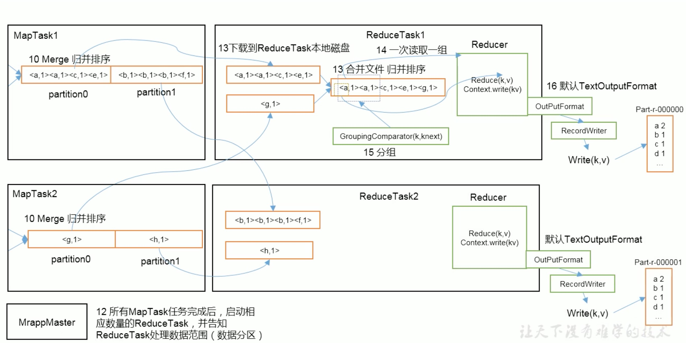

## MapTask工作机制

* 源码参考

```
# main类 MapTask
--- NewOutputCollector#write方法
```


## ReduceTask工作机制


# Shuffle解析

```
MapReduce确保每个reducer的输入都是按键排序的。系统执行排序、将map输出作为输入传给reducer的过程称为shuffle。
```

## Shuffle机制

### MapTask的Shuffle过程


### ReduceTask的Shuffle过程


## 分区

### 默认分区器

```java
public class HashPartitioner<K2, V2> implements Partitioner<K2, V2> {

  public void configure(JobConf job) {}

  /** Use {@link Object#hashCode()} to partition. */
  public int getPartition(K2 key, V2 value,
                          int numReduceTasks) {
    return (key.hashCode() & Integer.MAX_VALUE) % numReduceTasks;
  }
}
```

* 默认分区是根据key的hashCode对numReduceTasks个数取模，可以通过设置numReduceTasks设置reduce个数，使用Hash分区器时reduce个数决定文件数。

### 自定义分区器

```java
public class MyPartitioner extends Partitioner<Text, LongWritable> {

    /**
     * 选择到对应的reducer-task上执行
     *
     * @param text
     * @param longWritable
     * @param numPartitions
     * @return
     */
    @Override
    public int getPartition(Text text, LongWritable longWritable, int numPartitions) {
        //这里规定的文本是iphone、xiaomi、huawei、nokia
        if ("xiaomi".equals(text.toString())) {
            return 0;
        }
        if ("iphone".equals(text.toString())) {
            return 1;
        }
        if ("huawei".equals(text.toString())) {
            return 2;
        }
        return 3;
    }
}
## driver设置分区器
job.setPartitionerClass(MyPartitioner.class);
 //设置4个reducer，每个分区一个
job.setNumReduceTasks(4);
```

* reduce的个数大于分区个数，会出现空的输出文件part-r-000xx;
* 如果reduce个数小于partition个数，会有部分分区数据无处存放，抛出异常
* 如果reduce个数为1，不管map端有多少个分区文件，最终结果都交给一个Reduce处理，最终只会产生一个文件。
* 分区号从0开始逐1累加。

## 排序

* MapTask和ReduceTask均会对数据`按照key`进行排序。该操作是Hadoop的默认行为。任何程序中的数据均会`排序`，会使用快排来对key排序，字典排序。

### map阶段

* 对于MapTask，会将处理的结果`暂时放到环形缓冲区中，当环形缓冲区使用率达到一定阈值时，再对缓冲区中的数据进行一次快速排序`，并将这些有序数据`溢写`到磁盘上，当数据处理完毕后，会对磁盘上的所有文件进行`归并排序`。

#### map阶段原理

```
map函数开始产生输出时并不是简单地将它写到磁盘，它利用缓冲的方式写到内存并出于效率的考虑进行`预排序`。
每个map任务都有一个环形内存缓冲区用于存储任务输出。在默认情况下，缓冲区大小为100MB，通过mapreduce.task.io.sort.mb`属性来调整，一旦缓冲内容达到阈值(mapreduce.map.sort.spill.percent,默认是0.80,百分之80)，一个后台线程便开始把内容溢出(spill)到磁盘。在溢出写磁盘过程中，map输出继续写到缓冲区，但如果在此期间缓冲区被填满，map会阻塞直到写磁盘过程完成。溢出写过程按轮询方式将缓冲区中的内容写到`mapreduce.cluster.local.dir`属性在作业特定子目录下指定的目录中。

在写磁盘之前，线程首先根据数据最终要传入的reducer把数据划分成相应的`分区(partition)`。在每个分区中，后台线程按照`键进行内存中排序，如果有一个combiner函数，它就在排序后的输出上运行`。运行combiner函数使得`map输出结果更紧凑，因此减少写到磁盘的数据和传递给reducer的数据`。
```

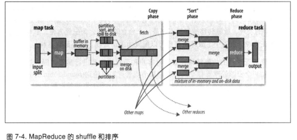

#### 内存缓冲区溢出文件

```
每次内存缓冲区达到溢出阈值，就会新建一个溢出文件(spill file),因此在map任务写完其最后一个输出记录之后，会有几个溢出文件。在任务完成之前，溢出文件被合并成一个已分区且已排序的输出文件。配置属性为mapreduce.task.io.sort.factor控制着一次最多能合并多少流，默认值是10.
`如果至少存在3个溢出文件(mapreduce.map.combine.minspills)时，则combiner就会在输出文件写到磁盘之前再次运行。`
```

#### map输出数据压缩

```
将map输出写到磁盘的过程对其进行压缩，这样会使写磁盘的速度更快，节约磁盘空间，并且减少传给reducer的数据量。默认情况下，输出是不压缩的，设置属性`mapreducer.map.output.compress`为true，指定的压缩库需要根据`mapreduce.map.output.compress.codec`指定。
```

### Reduce阶段

* 对于ReduceTask，它从每个MapTask上远程拷贝相应数据文件，如果文件大小超过阈值，则溢写磁盘上，否则存储到内存中。如果磁盘上文件数目达到一直阈值，则进行一次`归并排序`以生成一个更大的文件；如果内存中文件大小或数目超过一定阈值，则进行一次合并后将数据溢写到磁盘上。当所有数据拷贝完后，ReduceTask统一对内存和磁盘上的所有数据进行一次`归并排序`。
* reduce通过`Http`得到输出文件的分区然后拷贝这些文件，用于文件分区的工作线程数量由任务的`mapreduce.shuffle.max.threads`控制。此配置针对每一个NM而不是针对每个map任务，默认值0代表机器中处理器数量的俩倍。

#### 复制map分区文件阶段

* map输出文件位于运行`map任务的DataNode的本地磁盘`(尽管map输出经常写到map DataNode的本地磁盘，但reduce输出并不是这样)，DN需要为`分区文件运行reduce任务`。并且reduce任务需要集群若干个`map任务的map输出作为其特殊的分区文件`。每个map任务的完成时间不同，因此在每个任务完成时，`reduce就开始复制其输出文件，这是reduce的复制阶段`。reduce任务有少量的复制线程，可以并行取得map输出。`默认值是5个线程，可以通过mapreduce.reduce.shuffle.parallelcopies修改`。

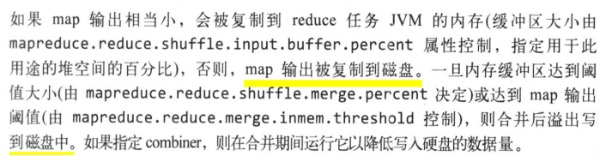

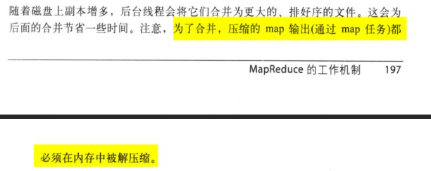

#### 合并Reduce阶段

* 顺序的`合并map输出文件，这是循环进行的`，比如50个map输出，而合并因子是10(默认是10，通过mapreduce.task.io.sort.factor设置，和map合并类似)，合并将进行5次，每次将10个文件合并成一个文件，最后有5个中间文件。

* 直接把`数据输入reduce函数，从而省略了一次磁盘往返行程`，并没有将这5个文件合并成一个已排序的文件作为最后一趟，`最后的合并可以来自内存和磁盘片段`。

#### reducer如何知道从那台机器获取map输出文件？

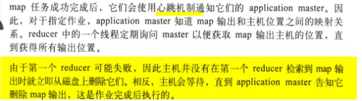

#### reduce合并阶段优化

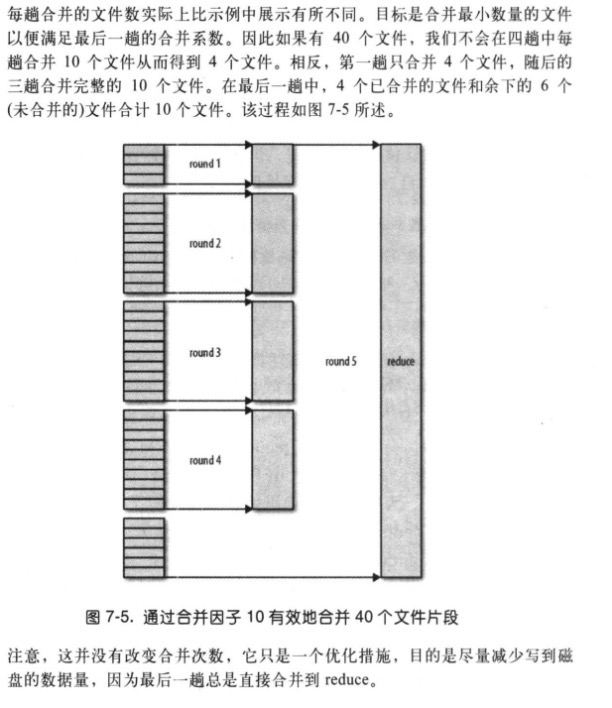

### 排序分类

#### 利用SequenceFileOutputFormat排序

```java
@Override
public int run(String[] args) throws Exception {
    Job job = Job.getInstance(getConf(), "sort-job");
    FileSystem fs = FileSystem.get(URI.create("/user/sort"), getConf());
    if (fs.exists(new Path("/user/sort"))) {
        fs.delete(new Path("/user/sort"), true);
    }

    job.setJarByClass(SortApp.class);
    job.setOutputFormatClass(SequenceFileOutputFormat.class);
    job.setMapperClass(SortMapper.class);
    job.setOutputKeyClass(LongWritable.class);
    job.setOutputValueClass(Text.class);

    FileInputFormat.addInputPath(job, new Path("/user/air.txt"));
    SequenceFileOutputFormat.setOutputPath(job, new Path("/user/sort"));
    return job.waitForCompletion(true) ? 0 : 1;
}
```


#### 部分排序

* 根据默认的Hash分区设置对应的reduce任务数，这样就可以根据键来分区排序。

#### 全排序

*  最终输出结果只有一个文件，且文件内部有序。实现方式是设置`一个ReduceTask`。

#### 辅助排序

* 在Reduce端对key进行`分组排序`。

* 添加排序对象

```java
   @Override
    public int compareTo(OrderDetail o) {
        int result;
        if (o.getId() > id) {
            result = -1;
        } else if (o.getId() < id) {
            result = 1;
        } else {
            if (o.getPrice() > price) {
                result = 1;
            } else {
                result = -1;
            }
        }
        return result;
    }
```

* 添加分区排序类

```java
/**
基于id分组排序
public class OrderGroupingComparator extends WritableComparator {

    public OrderGroupingComparator() {
        // 设置为true 会去创建key对象
        super(OrderDetail.class,true);
    }

    @Override
    public int compare(WritableComparable a, WritableComparable b) {
        OrderDetail aOrder = (OrderDetail) a;
        OrderDetail bOrder = (OrderDetail) b;
        return Integer.compare(aOrder.getId(), bOrder.getId());
    }
}
## driver设置分组排序类
 // 添加分组函数，基于某个id为key
job.setGroupingComparatorClass(OrderGroupingComparator.class);
```


#### 二次排序

* 在自定义排序过程中，如果compareTo中判断条件为两个即为`二次排序`。

### 自定义排序

* bean对象作为key传输，实现WritableComparable接口重写compareTo方法，可以实现排序。

```java
@Data
public class Phone implements WritableComparable<Phone> {
    private Integer id;
    private String phone;
    private String ip;
    private Integer upFlow;
    private Integer downFlow;
    private Integer sumFlow;
    private Integer status;
  
   @Override
    public int compareTo(Phone phone) {
        return phone.id.compareTo(this.id);
    }

    /**
     * 用于后续反序列化过程中反射使用
     */
    public Phone() {
    }

    public Phone(Integer upFlow, Integer downFlow) {
        this.upFlow = upFlow;
        this.downFlow = downFlow;
        sumFlow = upFlow + downFlow;
    }

    /**
     * 序列化方法
     *
     * @param dataOutput
     * @throws IOException
     */
    @Override
    public void write(DataOutput dataOutput) throws IOException {
        dataOutput.writeInt(this.id);
        dataOutput.writeUTF(this.phone);
        dataOutput.writeUTF(this.ip);
        dataOutput.writeInt(this.upFlow);
        dataOutput.writeInt(this.downFlow);
        dataOutput.writeInt(this.sumFlow);
        dataOutput.writeInt(this.status);
    }

    /**
     * 反序列化方法
     *
     * @param dataInput
     * @throws IOException
     */
    @Override
    public void readFields(DataInput dataInput) throws IOException {
        this.id = dataInput.readInt();
        this.phone = dataInput.readUTF();
        this.ip = dataInput.readUTF();
        this.upFlow = dataInput.readInt();
        this.downFlow = dataInput.readInt();
        this.status = dataInput.readInt();
    }
}
```

## Combine

* Combiner组件的父类是Reducer，Combiner是在每个MapTask所在的节点运行，Reducer是接收全局所有Mapper的输出结果。
* Combiner是对每个MapTask的输出进行局部汇总，减少网络传输量。

### 自定义Combine

```java
# 自定义
public class CustomCombiner extends Reducer<Text, LongWritable, Text, LongWritable> {
    /**
     * reduce方法
     *
     * @param key     键
     * @param values  值
     * @param context 上下文
     * @throws IOException
     * @throws InterruptedException
     */
    @Override
    protected void reduce(Text key, Iterable<LongWritable> values, Context context) throws IOException, InterruptedException {
        long sum = 0;
        for (LongWritable value : values) {
            //计算key出现的次数总和
            sum += value.get();
        }
        context.write(key, new LongWritable(sum));
    }
}

# driver类设置
  //通过job设置combiner处理类,其实逻辑上和reduce一摸一样
  job.setCombinerClass(CustomCombiner.class);
```

# Join

* MR能够执行大型数据集间的连接操作，但是原生的MR程序相对复杂，可以利用Spark、Hive来完成。
* 如果存在数据集A、B，如果A数据集不大，可以根据B关联的ID查询A数据集，从而将数据集合输出到一个表中。
  * 连接操作如果从mapper执行，则称为map端连接，从reducer端执行则称为reduce端连接

## Map Join

* 在两个大规模输入数据集之前的map端连接会在数据到达map函数之前就连接连接操作。为达到该目的，各map的输入数据必须先`分区`并且以特定方式排序。各个输入数据集被划分为相同数量的分区，并且均按`相同的键(连接键)排序`。`同一个键的所有记录均会放在同一个分区中`。
* Map端连接操作可以连接多个作业的输出，只要这些作业的`reducer数量相同、键相同并且输出文件是不可切分的`。
* 利用`CompositeInputFormat`类来运行一个map端连接。CompositeInputFormat的输入源和连接类型(内连接或外连接)可以通过一个连接表达式进行配置，连接表达式的语法简单。
* 在Reduce端处理过多的表，容易产生数据倾斜，在Map端缓存小表，提前处理业务逻辑，增加Map端业务，减少Reduce端数据压力，尽可能减少数据倾斜。

### 订单和产品Join

* 使用分布式缓存(DistributedCache)，在Mapper的setup阶段，将文件读取到缓存集合中
* 在Driver函数中加载缓存，job.addCacheFile(new URI(path))
* 将Reduce个数设置为0，无需走Reduce，直接在Map端处理逻辑。

#### Mapper

```java
# mapper处理缓存的文件
public class MapJoinMapper extends Mapper<LongWritable, Text, Text, NullWritable> {
    private Map<String, String> pdMap = Maps.newHashMap();
    private Text k = new Text();

    @Override
    protected void setup(Context context) throws IOException, InterruptedException {
        URI[] cacheFiles = context.getCacheFiles();
        String path = cacheFiles[0].getPath();
        BufferedReader reader = new BufferedReader(new InputStreamReader(new FileInputStream(path), Charsets.UTF_8));
        String line;
        while (StringUtils.isNotEmpty(line = reader.readLine())) {
            String[] pdArr = line.split(",");
            pdMap.put(pdArr[0], pdArr[1]);

        }
        IOUtils.closeStream(reader);
    }

    @Override
    protected void map(LongWritable key, Text value, Context context) throws IOException, InterruptedException {
        String[] orderArr = value.toString().split(",");
        String pdName = pdMap.getOrDefault(orderArr[1], "");
        String id = orderArr[0];
        String amount = orderArr[2];
        String line = id + "\t" + pdName + "\t" + amount;
        k.set(line);
        context.write(k, NullWritable.get());
    }
}
```

#### 添加缓存小表文件

```java
    job.addCacheFile(new URI("/Users/babywang/Desktop/input/pd.txt"));
        // mapper端处理，不经过reducer阶段
    job.setNumReduceTasks(0);
```

## Reduce Join

* reduce端连接并不要求`输入数据集符合特定结构`，reduce端连接比map端连接更为常用。但是俩个数据集都需要`shffle过程`(map端输出数据->copy->mrege->reduce过程)，所以reduce端连接效率会低一些。
* mapper为各个`记录标记源，并且使用连接键作为输出键，使键相同的记录放在同一个reducer中`。
* 数据集的`输入源往往存在多种格式`，因此可以使用`MultipleInputs`来方便地解析和标注各个源。

### 订单和产品Join

#### Mapper

```java
public class TableMapper extends Mapper<LongWritable, Text, Text, TableBean> {
    private String fileName;
    private TableBean tableBean = new TableBean();
    private Text k = new Text();

    @Override

    protected void setup(Context context) throws IOException, InterruptedException {
        // 获取文件信息
        FileSplit inputSplit = (FileSplit) context.getInputSplit();
        fileName = inputSplit.getPath().getName();

    }

    @Override
    protected void map(LongWritable key, Text value, Context context) throws IOException, InterruptedException {

        String line = value.toString();
        if (fileName.startsWith("order")) {
            String[] split = line.split(",");
            tableBean.setId(split[0]);
            tableBean.setPid(split[1]);
            tableBean.setAmount(Integer.parseInt(split[2]));
            tableBean.setPName("");
            tableBean.setFlag("order");
            k.set(split[1]);
        } else {
            String[] split = line.split(",");
            tableBean.setId("");
            tableBean.setAmount(0);
            tableBean.setPid(split[0]);
            tableBean.setPName(split[1]);
            tableBean.setFlag("pd");
            k.set(split[0]);
        }
        context.write(k, tableBean);
    }
}
```

#### Reducer

```java
public class TableReducer extends Reducer<Text, TableBean, TableBean, NullWritable> {
    @SneakyThrows
    @Override
    protected void reduce(Text key, Iterable<TableBean> values, Context context) throws IOException, InterruptedException {
        List<TableBean> orderList = Lists.newArrayList();
        TableBean pbBean = new TableBean();
        for (TableBean order : values) {
            if ("order".equals(order.getFlag())) {
                TableBean orderBean = new TableBean();
                copyProperties(orderBean, order);
                orderList.add(orderBean);
            } else {
                copyProperties(pbBean, order);
            }
        }
        for (TableBean tableBean : orderList) {
            tableBean.setPName(pbBean.getPName());
            context.write(tableBean, NullWritable.get());
        }
    }
}

```

* 缺点:`合并的操作是在Reduce`完成，Reduce端的`处理压力`太大，Map节点的`运算负载很低`，资源利用率低，且在Reduce端容易产生数据倾斜。

# 计数器

* 用于监控已处理的输入数据量和已产生的输出数据量，对处理的数据进行比对。

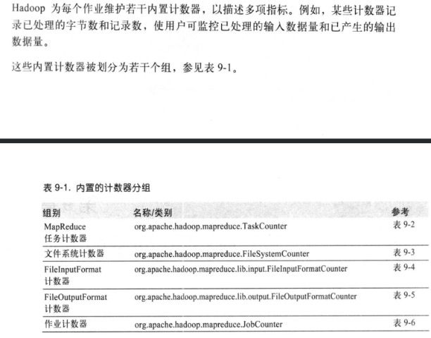

## 任务计数器

```
任务执行过程中，任务计数器采集task相关信息，并且关联任务维护，定期发送给AM，因此任务计数器能够被全局地聚集。任务计数器的值每次都是完整的传输的，而非传输自上次传输后的计数值，从而避免由于消息丢失而引发的错误，如果一个任务在作业执行期间失败，而相关计数器的值会减少。
```

### 内置MapReduce任务计数器

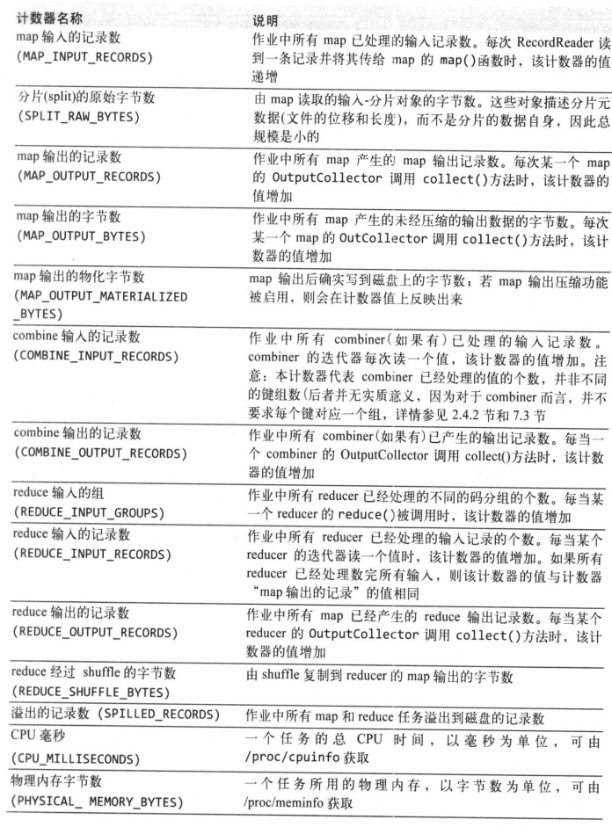

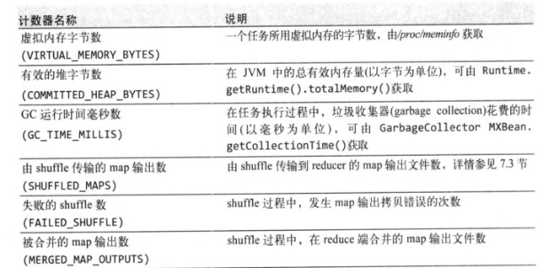

### 内置的文件系统任务计数器

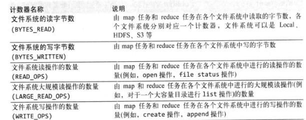

### 内置的FileinputFormat任务计数器

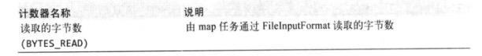

### 内置的FileOutputFormat任务计数器

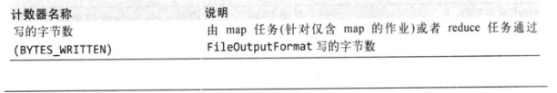

## 作业计数器

```
作业计数器由AM维护，因此无需在网络间传输数据，这一点与包括"用户定义的计数器"在内的其他计数器不同。这些计数器都是作业级别的统计量，其值不会随着任务运行而改变。
```

### 内置作业计数器

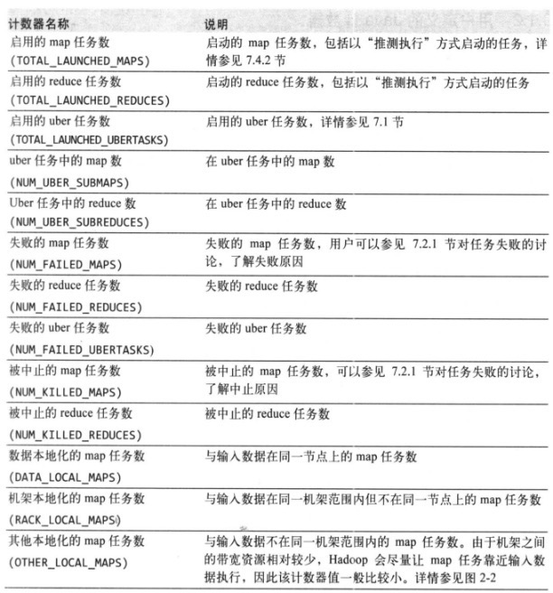

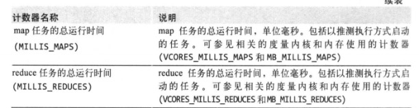

## 用户定义的Java计数器

```java
计数器的值可以在mapper或reducer中增加，计数器由一个Java枚举来定义，以便对有关的计数器分组。一个作业可以定义的枚举类型数量不限，各个枚举所包含的字段数量也不限。枚举类型的名称即为组的名称，枚举类型的字段就是计数器名称。计数器是全聚德。

/**
 * @fileName: CustomCounterMapper.java
 * @description: CustomCounterMapper.java类说明
 * @author: by echo huang
 * @date: 2020-03-26 17:29
 */
public class CustomCounterMapper extends Mapper<LongWritable, Text, Text, Text> {
    enum Counter {
        HELLO,
        WORLD;
    }

    @Override
    protected void map(LongWritable key, Text value, Context context) throws IOException, InterruptedException {
        context.getCounter(Enum.valueOf(Counter.class, Counter.HELLO.name())).increment(1);
        context.write(new Text(key.toString()), value);
    }
}
```

# 边数据分布

* "边数据"(side data)是作业所需的额外的只读数据，以辅助处理主数据集。

## 利用JobConf来配置作业

```
Configuration类(或者旧版MapReduce API的JobConf类)的各种setter方法能够方便地配置作业的任意键值对，如果仅需向任务传递少量元数据则非常有用。
在任务中，用户可以通过Context类的getConfiguration()方法获得配置信息。
复杂对象时，用户需要自定义处理序列化工作，或者使用Hadoop提供的Stringifier类。DefaultStringifier使用Hadoop的序列化框架来序列化对象。
```

### 存在的问题

* 这种方式使用的时MapReduce组件的JVM内存，所以会`增大内存`的开销，因此不适合传输几千字节的数据量。作业配置总是由客户端、AM和任务JVM读取，每次读取配置，所有项都被读取到内存，因此造成NM的内存开销。

## 分布式缓存

* 在任务运行过程中及时地将文件和存档复制到任务节点以供使用。
* 为了节约网络带宽，在每个作业中，各个文件通常只需要复制到一个节点一次。

### 用法

```
对于使用GenericOptionsParser的工具来说，用户可以使用-files选项指定待分发的文件，文件内包含以逗号隔开的URI列表。文件可以存放在本地文件系统、HDFS或其他Hadoop可读文件系统中，如果尚未指定文件系统，则这些文件被默认是本地的。即使默认文件并非本地文件系统。
用户可以使用-archives选项向自己的任务中复制存档文件(JAR文件、ZIP文件、tar文件和gzipped tar文件)，这些文件会被解档到任务节点。-libjars选项会把JAR文件添加到mapper和reducer任务的类路径中。
```

### 使用Reducer的setup方法

```java
public class DistributedCacheDriver extends Configured implements Tool {

    static class StationTemperatureMapper extends Mapper<LongWritable, Text, Text, IntWritable> {
        @Override
        protected void map(LongWritable key, Text value, Context context) throws IOException, InterruptedException {
            String[] tokens = new String(value.getBytes(), Charsets.UTF_8).split(",");
            context.write(new Text(tokens[0]), new IntWritable(Integer.valueOf(tokens[1])));
        }
    }

    static class CacheReducer extends Reducer<Text, IntWritable, Text, IntWritable> {
        private Integer a;

        /**
         * 该方式缓存side data
         *
         * @param context
         * @throws IOException
         * @throws InterruptedException
         */
        @Override
        protected void setup(Context context) throws IOException, InterruptedException {
            a = 10;
        }

        @Override
        protected void reduce(Text key, Iterable<IntWritable> values, Context context) throws IOException, InterruptedException {
            int minTemp = a;
            for (IntWritable value : values) {
                minTemp = Math.max(value.get(), minTemp);
            }
            context.write(key, new IntWritable(minTemp));
        }
    }

    @Override
    public int run(String[] args) throws Exception {
        Job job = Job.getInstance(getConf());
        String outpath = "/user/cache";
        FileSystem fs = FileSystem.get(URI.create(outpath), getConf());
        if (fs.exists(new Path(outpath))) {
            fs.delete(new Path(outpath), true);
        }
        job.setOutputKeyClass(Text.class);
        job.setOutputValueClass(IntWritable.class);

        job.setMapperClass(StationTemperatureMapper.class);
        job.setReducerClass(CacheReducer.class);

        FileInputFormat.addInputPath(job, new Path("/cache/air.txt"));
        FileOutputFormat.setOutputPath(job, new Path(outpath));

        return job.waitForCompletion(true) ? 1 : 0;
    }

    public static void main(String[] args) throws Exception {
        int exit = ToolRunner.run(new DistributedCacheDriver(), args);
        System.exit(exit);
    }
}
```

### 工作机制

* 当用户启动一个作业，`Hadoop会把-files、-archives、libjars等选项所指定的文件复制到分布式文件系统之中`，在任务运行之前，NM`将文件从分布式文件系统拷贝到本地磁盘使任务能够文件`。此时这些文件就被视为“本地化”。
* 高性能原因，任务角度文件夹已经存在，以符号连接的方式指向任务的工作目录，-libjars指定的文件会在任务启动前添加到任务的classpath中
  * NM为`缓存中的文件各维护一个计数器来统计这些文件的被使用情况`。当任务即将运行时，该任务所使用的所有文件的对应计数器值增1；当任务执行完毕之后，这些计数器值减1。仅当文件不在使用时(此计数器达到0)，才有资格删除。当节点缓存的容量超过一定范围(默认10G)时，根据最少使用原则 删除文件以腾出空间来装在新文件。缓存大小阈值配置通过`yarn.nodemanager.localizer.cache.target-size-mb`来配置

### 分布式缓存API

* 通过GenericOptionsParser间接使用分布式缓存
* 通过Job中使用分布式缓存

```
在缓存汇总可以存放两类对象:文件和存档，文件被直接放置在任务的节点上，而存档则会被解档之后再将具体文件放置在任务节点上。每种对象类型都包含三种方法:addCachexxxx()、setCachexxxx()和addxxxxTOClassPath()。
addCacheXXX是将文件或者存档添加到分布式缓存，setCacheXXX将一次性向分布式缓存中添加一组文件或文档(之后调用生成的集合将被替换)，addXXXToClassPath将文件或存储添加到MapReduce任务下的类路径。
```

# 配置调优

## 数据输入

* 合并小文件:在执行MR任务前将小文件进行合并，大量的小文件会产生`大量的Map任务`(因为一个文件对应一个split，可以观看MR源码)，增大Map任务装载次数，而任务的装载比较耗时，导致MR运行较慢。
* 使用`CombineTextInputFormat`作为输入，解决输入端大量小文件。

## Reduce端

### ReduceTask并行度设置

* 通过driver端`job.setNumReduceTasks()`设置reduceTask个数，ReduceTask个数和MapTask一致性能最高
* reduceTask=0，表示没有Reduce阶段，输出文件个数与Map个数一致
* reduceTask默认值为1，输出文件为1
* 如果数据分布不均匀，会导致数据倾斜，此时需要在`分区器中优化`。
* 如果reduceTask为1，分区个数不为1不执行分区过程。

### reduce端调优属性

* 合理设置Map和Reduce数:基于InputSplit设置，基于split的个数
* 设置Map、Reduce共存:调整`slowstart,completedmaps`参数，是Map运行到一定程度后，Reduce也开始运行，减少Reduce等待时间。
* 规避使用Reduce:不需要Reduce可以设置ReduceTaskNum为0，这样就不会只想shuffle
* 合理设置Reduce端的Buffer:默认情况下，数据达到一定阈值的时候，Buffer中的数据会写入磁盘，然后Reduce会从磁盘中获得所有磁盘。`mapred.job.reduce.input.buffer.percent`，默认为0.0.当值大于0时，会保留指定比例的内存读Buffer中的数据直接拿给Reduce使用。

## Map端

### map端调优属性

* 减少溢写次数:估算map输出大小，就可以合理设置`mapreduce.task.io.sort.*`属性来尽可能减少溢出写的次数。如果可以增加`mapreduce.task.io.sort.mb`的值以及`mapreduce.map.sort.spill.percent`的阈值，MapReduce计数器计算在作业运行整个阶段中溢出写磁盘的次数，包含map和reduce俩端的溢出写。
* 减少合并次数:通过调整`mapreduce.task.io.sort.factor`，增大Merge的文件数目，减少Merge的次数，从而缩短MR处理时间。
* 在Map之后，不影响业务逻辑的前提下，先进行Combine处理，减少IO。

## I/O传输

* 采用数据压缩方式:减少网络Io的时间，设置Map端、输入端、reduce输出端的压缩编码器，按照业务使用。
* 使用SequenceFile文件，支持按`Block`压缩

## 数据倾斜问题

### 数据倾斜现象

* 数据频率倾斜---某一区域的数据量远远大于其他区域
* 数据大小倾斜---部分记录的大小远远大于平均值

### 减少数据倾斜的方法

* 抽样和范围分区
  * 可以同原始数据进行抽样得到结果集来预设分区边界值。
* 自定义分区器
  * 自定义分区器，修改默认的key.hashCode&TaskNums
* Combine
  * 使用Combine可以大量减少数据倾斜，在Map端对数据进行整合
* 采用Map Join,避免Reduce Join

## 常用的调优参数

* `mapreduce.map.memory.mb`:一个MapTask可使用的资源上限(单位MB)，默认为1024.如果MapTask实际使用的资源量超过该值，则会被强制杀死。
* `mapreduce.reduce.memory.mb`:一个ReduceTask可使用的资源上限(单位MB)，默认1024.如果ReduceTask超过则会被杀死。
* `mapreduce.map.cpu.vcores`:每个MapTask可使用最多cpu core数目，默认为1
* `mapreduce.reduce.cpu.vcores`:每个ReduceTask可使用最多cpu core数目，默认为1
* `mapreduce.reduce.shuffle.parallelcopies`:每个Reduce去Map中拷贝数据的并行度，默认为5.
* `mapreduce.reduce.shuffle.input.merge.percent`:Buffer中的数据达到多少比例开始写入磁盘。默认为0.66
* `mapreduce.reduce.shuffle.input.buffer.percent`:Buffer大小占用Reduce可用内存的比例。默认为0.7
* `mapreduce.reduce.input.buffer.percent`:指定多少比例的内存用来存放Buffer中的数据，默认值是0.0

### Yarn配置参数

* `yarn.scheduler.minimum-allocation-mb`:给应用程序Contrainer分配的最小内存，默认1024MB
* `yarn.scheduler.maximum-allocation-mb`:给应用程序Contrainer分配的最大内存，默认8192MB
* `yarn.scheduler.minimum-allocation-cores`:给应用程序Contrainer分配的最小core数，默认1
* `yarn.scheduler.maximum-allocation-cores`:给应用程序Contrainer分配的最大core数，默认32
* `yarn.nodemanager.resource.memory.mb`:给Contrainer分配的最大物理内存,默认值:8192MB

### 容错相关参数

* `mapreduce.map.maxattempts`:每个Map Task最大重试次数，一旦超过该值，则任务Map Task运行失败，默认为4
* `mapreduce.reduce.maxattempts`:每个Reduce Task最大重试次数，一旦超过该值，则任务Reduce Task运行失败，默认为4
* `mapreduce.task.timeout`:当超过600000ms时会认为该task超时，会被容器杀死。

## MapReduce跑的慢

* 计算机性能
  * CPU、磁盘、内存、网络
* I/O操作优化
  * 数据倾斜。 
  * Map和Reduce数设置不合理。
  * Map运行时间太长，导致Reduce等待过久。
  * 小文件过多，NM内存压力大，会出现上报风暴
  * 大量的不可分块的超大文件
  * Spill次数过多
  * Merge次数过多

# MapReduce库类

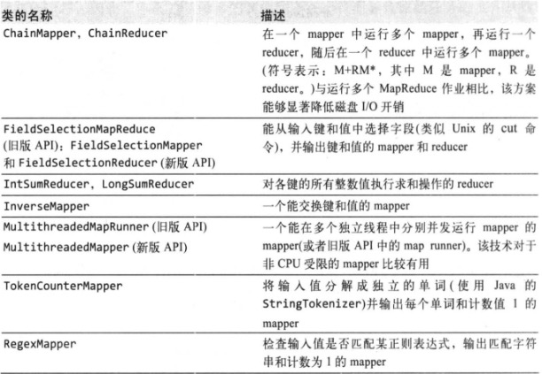

