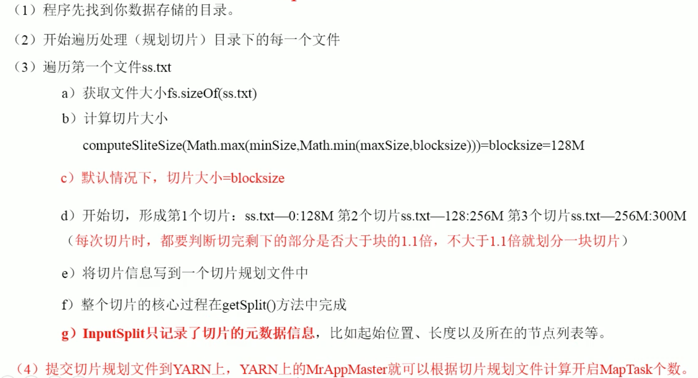
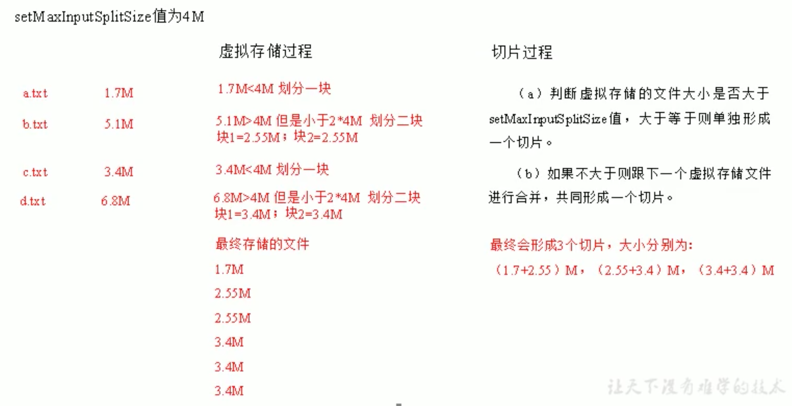

# MapReduce的类型

* Yarn集群block大小为128MB，本地模式为32MB


## 为什么需要设置对应的输出输入key value类型呢

```
因为Mapper和Reducer的泛型在编译时就会被擦除
```
## 类型设置


## 默认的MapReduce作业

```
默认的mapper是将输入的键值对原样输出，默认的Partitioner是hash，根据reduce任务个数做hash
```
## Reduce任务个数的选择

```
目标reducer保持每个运行5分钟作业，且产生至少一个HDFS块的输出比较合适
```
# 输入格式

## FileInputFormat类

### 输入切片

```
一个输入分片(split)就是一个单个map操作来处理的输入块。每一个map操作只处理一个输入分片，每个分片被划分为若干个记录，每条记录是一个键值对，map一个接一个地出来记录。
Java中的输入分片表示InputSplit接口。它包含一个以字节为单位的长度和一组存储位置(主机名)，分片不包含数据本身，而是指向数据的引用。存储位置供MapReduce系统使用以便将map任务尽量放在分片数据附近，而分片大小用来排序分片，以便优先处理最大的分片，从而最小化作业运行时间.
FileInputFormat类是所有使用文件作为其数据源的InputFormat实现的基类。
功能：
1.用于指出作业的输入文件位置
2.为输入文件生成分片的代码实现
```

#### InputFormat的应用过程

* 运行作业的客户端通过调用getSplits计算分片，然后将它们发送到AM上，AM使用其存储位置信息来调度map任务从而在集群上处理这些分片数据。map任务把输入分片传给InputFormat的createRecordReader方法来获得这个分片的RecordReader。RecordReader就像是记录上的迭代器。map任务用一个RecordReader来生成记录的键值对，然后再传递给map函数。
* Hadoop提供MapRunner、MultithreadedMapRunner等运行器，`mapreduce.mapper.multithreadedmapper.threads`设置多线程map的线程数。

#### 输入路径


#### 输入分片

```
FileInputFormat只分割大文件，文件超过HDFS块的大小，分片通常与HDFS块大小一样，值也可以更具不同的Hadoop属性来改变。
```


#### 修改分片大小的问题

```
通过设置一个比HDFS块更大的分片大小，如果数据存储在HDFS上是没有好处的，这样回增加对map任务来说不是本地文件的文件块数。最大的分片大小默认是由Java的long类型表示的最大值。只有把它的值设置称小于块大小才有效果，这将强制分片比块小。
```
#### 分片大小的计算公式

```java
/**
* 计算分片大小
* @param blockSize 块的大小
* @param minSize 最小分配大小
* @param maxSize 最大分配大小
* @return
*/
protected long computeSplitSize(long blockSize, long minSize,

long maxSize) {
return Math.max(minSize, Math.min(maxSize, blockSize));
}
默认情况下
minSize<blockSize<maxSize
因此分片大小就是blocksize


# 源码剖析
public List<InputSplit> getSplits(JobContext job) throws IOException {
    StopWatch sw = new StopWatch().start();
    //得到最小的分片大小，1和mapreduce.input.fileinputformat.split.minsize配置比取最大值为最小分片大小
    long minSize = Math.max(getFormatMinSplitSize(), getMinSplitSize(job));
    //得到最大分片大小mapreduce.input.fileinputformat.split.maxsize或者long的最大值
    long maxSize = getMaxSplitSize(job);

    // generate splits
    List<InputSplit> splits = new ArrayList<InputSplit>();
    //得到文件信息
    List<FileStatus> files = listStatus(job);

    //是否忽略子目录
    boolean ignoreDirs = !getInputDirRecursive(job)
      && job.getConfiguration().getBoolean(INPUT_DIR_NONRECURSIVE_IGNORE_SUBDIRS, false);
    for (FileStatus file: files) {
      //过滤目录
      if (ignoreDirs && file.isDirectory()) {
        continue;
      }
      //文件路径
      Path path = file.getPath();
      //文件长度
      long length = file.getLen();
      if (length != 0) {
        //块路径
        BlockLocation[] blkLocations;
        //文件状态路径
        if (file instanceof LocatedFileStatus) {
          blkLocations = ((LocatedFileStatus) file).getBlockLocations();
        } else {
          FileSystem fs = path.getFileSystem(job.getConfiguration());
          blkLocations = fs.getFileBlockLocations(file, 0, length);
        }
        //是否需要分片，默认需要分片，
        if (isSplitable(job, path)) {
          //块大小
          long blockSize = file.getBlockSize();
          //分片大小,Math.max(minSize, Math.min(maxSize, blockSize))
          long splitSize = computeSplitSize(blockSize, minSize, maxSize);

          long bytesRemaining = length;
          // 客户端开始分片，剩余数量/分片大小大于1.1
          while (((double) bytesRemaining)/splitSize > SPLIT_SLOP) {
            //得到块索引
            int blkIndex = getBlockIndex(blkLocations, length-bytesRemaining);
            splits.add(makeSplit(path, length-bytesRemaining, splitSize,
                        blkLocations[blkIndex].getHosts(),
                        blkLocations[blkIndex].getCachedHosts()));
            bytesRemaining -= splitSize;
          }

          if (bytesRemaining != 0) {
            int blkIndex = getBlockIndex(blkLocations, length-bytesRemaining);
            splits.add(makeSplit(path, length-bytesRemaining, bytesRemaining,
                       blkLocations[blkIndex].getHosts(),
                       blkLocations[blkIndex].getCachedHosts()));
          }
        } else { // not splitable
          if (LOG.isDebugEnabled()) {
            // Log only if the file is big enough to be splitted
            if (length > Math.min(file.getBlockSize(), minSize)) {
              LOG.debug("File is not splittable so no parallelization "
                  + "is possible: " + file.getPath());
            }
          }
          splits.add(makeSplit(path, 0, length, blkLocations[0].getHosts(),
                      blkLocations[0].getCachedHosts()));
        }
      } else { 
        //Create empty hosts array for zero length files
        splits.add(makeSplit(path, 0, length, new String[0]));
      }
    }
    // Save the number of input files for metrics/loadgen
    job.getConfiguration().setLong(NUM_INPUT_FILES, files.size());
    sw.stop();
    if (LOG.isDebugEnabled()) {
      LOG.debug("Total # of splits generated by getSplits: " + splits.size()
          + ", TimeTaken: " + sw.now(TimeUnit.MILLISECONDS));
    }
    return splits;
  }
```
#### 源码流程




#### InputSpit与HDFS Block的关系


#### 控制一行的最大长度

* `mapreduce.input.linerecordreader.line.maxlength` 用字节数表示在内存范围内的值(适当超过输入数据中的行长)，可以确保记录reader跳过(长的)损坏的行，不会导致任务失败

#### 避免切分

```
1.增大最小分片大小，将它设置称大于要处理最大文件大小。
2.使用FileInputFormat具体子类，并且重写isSplitable方法将返回值设置为false
```

## InputFormat类的结构


### TextInputFormat

```
默认的IntputFormat，每条记录都是一行输入，键是LongWritable类型，存储该行在整个文件中的字节偏移量。值是这一行的内容，不包括任何行终止符，它被打包成一个Text对象。
```
#### TextInputFormat切片格式


### KeyValueTextInputFormat

* 每一行均为一条记录，被分隔符分割为key，value。可以通过在驱动类中设置`conf.set(KeyValueLineRecordReader.KEY_VALUE_SEPERATOR,"\t");`来设定分隔符。默认分隔符是tab(\t)。

* 默认方式切片，block和最大切片数，最小切片数中比较

* 通过设置key-value的间隔符来更便捷的获取key，value数据

  ```java
   # Driver设置
   Configuration conf = getConf();
          conf.set(KeyValueLineRecordReader.KEY_VALUE_SEPERATOR, " ");
          Job job = Job.getInstance(conf);
          job.setInputFormatClass(KeyValueTextInputFormat.class);
  
          //设置驱动类
          job.setJarByClass(KVDriver.class);
          //设置Mapper
          job.setMapperClass(KVTextMapper.class);
          job.setMapOutputKeyClass(Text.class);
          job.setMapOutputValueClass(IntWritable.class);
  
          //设置Reduce
          job.setReducerClass(KVReducer.class);
          job.setOutputKeyClass(Text.class);
          job.setOutputValueClass(IntWritable.class);
  
          job.setJobName("kvtext");
          //设置输入输出路径
          FileInputFormat.addInputPath(job, new Path(strings[0]));
          FileOutputFormat.setOutputPath(job, new Path(strings[1]));
          return job.waitForCompletion(true) ? 0 : 1;
  ```

### NLineInputFormat

* Key为LongWritable，Value为Text

* 每个map进程处理的InputSplit不再按照Block块来划分，`按照NlineInputFormat指定的函数N来划分。即输入文件的总函数/N=切片数，不整除，切片数=商+1。键和值和TextInputFormat一致为LongWritable和Text类型。`

#### 配置

* 设置多少行以分片:NLineInputFormat.setNumLinesPerSplit(job,3)
* 设置input格式:job.setInputFormatClass(NLineInputFormat.class)

```java
public int run(String[] strings) throws Exception {
        Configuration conf = getConf();
        Job job = Job.getInstance(conf);
        NLineInputFormat.setNumLinesPerSplit(job, 3);
        job.setInputFormatClass(NLineInputFormat.class);

        //设置驱动类
        job.setJarByClass(NLineDriver.class);
        //设置Mapper
        job.setMapperClass(NLineTextMapper.class);
        job.setMapOutputKeyClass(Text.class);
        job.setMapOutputValueClass(IntWritable.class);

        //设置Reduce
        job.setReducerClass(NLineReducer.class);
        job.setOutputKeyClass(Text.class);
        job.setOutputValueClass(IntWritable.class);

        job.setJobName("kvtext");
        //设置输入输出路径
        FileInputFormat.addInputPath(job, new Path(strings[0]));
        FileOutputFormat.setOutputPath(job, new Path(strings[1]));
        return job.waitForCompletion(true) ? 0 : 1;
    }
```

### SequenceFileInputFormat类

```
Hadoop的允许文件格式存储二进制的键值对序列，由于它们是可分割的(它们有同步点，所以reader可以从文件中的任意一点与记录边界进行同步)，支持压缩，可以适应一些序列化类型存储任意类型。
```
* 当顺序文件*.seq作为MapReduce的输入时，可以使用SequenceFileinputFormat。键和值是由顺序文件决定，只需要保证map输入的类型匹配集合。
### CombineFileInputFormat

```
Hadoop更适合少量的大文件，因为FileInputFormat生成的分块是一个文件或该文件的一部分。如果文件很小，并且文件数量很多，那么每次的map任务只处理很少的输入数据，一个文件就会有很多map任务，每次map操作都会造成额外的开销。
CombineFileInputFormat可以缓解这个问题，它是针对小文件而设计的。FileInputFormat为每个文件产生一个分配，而CombineFileInputFormat把多个文件打包到一个分片中以便每个mapper可以处理更多的数据。关键在把哪些块放到同一个分片时，CombineFileInputFormat会考虑节点和机架的因素，所以在典型的MapReduce作业中处理输入的数据并不会下降
```

* 虚拟存储切片最大值设置

  ```
  CombineFileInputFormat.setMaxInputSplitSize(job,4194304)//4m
  虚拟存储切片最大值设置最好根据实际小文件大小情况设置具体的值
  ```

* CombineFileInputFormat切片机制



```java
# 分片逻辑
public List<InputSplit> getSplits(JobContext job) 
    throws IOException {
    long minSizeNode = 0;
    long minSizeRack = 0;
    long maxSize = 0;
    Configuration conf = job.getConfiguration();

    // the values specified by setxxxSplitSize() takes precedence over the
    // values that might have been specified in the config
    if (minSplitSizeNode != 0) {
      minSizeNode = minSplitSizeNode;
    } else {
      minSizeNode = conf.getLong(SPLIT_MINSIZE_PERNODE, 0);
    }
    if (minSplitSizeRack != 0) {
      minSizeRack = minSplitSizeRack;
    } else {
      minSizeRack = conf.getLong(SPLIT_MINSIZE_PERRACK, 0);
    }
    if (maxSplitSize != 0) {
      maxSize = maxSplitSize;
    } else {
      maxSize = conf.getLong("mapreduce.input.fileinputformat.split.maxsize", 0);
      // If maxSize is not configured, a single split will be generated per
      // node.
    }
    if (minSizeNode != 0 && maxSize != 0 && minSizeNode > maxSize) {
      throw new IOException("Minimum split size pernode " + minSizeNode +
                            " cannot be larger than maximum split size " +
                            maxSize);
    }
    if (minSizeRack != 0 && maxSize != 0 && minSizeRack > maxSize) {
      throw new IOException("Minimum split size per rack " + minSizeRack +
                            " cannot be larger than maximum split size " +
                            maxSize);
    }
    if (minSizeRack != 0 && minSizeNode > minSizeRack) {
      throw new IOException("Minimum split size per node " + minSizeNode +
                            " cannot be larger than minimum split " +
                            "size per rack " + minSizeRack);
    }

    // all the files in input set
    List<FileStatus> stats = listStatus(job);
    List<InputSplit> splits = new ArrayList<InputSplit>();
    if (stats.size() == 0) {
      return splits;    
    }

    // In one single iteration, process all the paths in a single pool.
    // Processing one pool at a time ensures that a split contains paths
    // from a single pool only.
    for (MultiPathFilter onepool : pools) {
      ArrayList<FileStatus> myPaths = new ArrayList<FileStatus>();
      
      // pick one input path. If it matches all the filters in a pool,
      // add it to the output set
      for (Iterator<FileStatus> iter = stats.iterator(); iter.hasNext();) {
        FileStatus p = iter.next();
        if (onepool.accept(p.getPath())) {
          myPaths.add(p); // add it to my output set
          iter.remove();
        }
      }
      // create splits for all files in this pool.
      getMoreSplits(job, myPaths, maxSize, minSizeNode, minSizeRack, splits);
    }

    // create splits for all files that are not in any pool.
    getMoreSplits(job, stats, maxSize, minSizeNode, minSizeRack, splits);

    // free up rackToNodes map
    rackToNodes.clear();
    return splits;    
  }
```


### 自定义InputFormat

#### 实现方式

`将多个小文件合并出一个SequenceFile`

* 自定义类继承FileInputFormat

  ```java
  public class CustomInputFormat extends FileInputFormat<Text, BytesWritable> {
  
      /**
       * 不允许文件切割合并小文件
       *
       * @param context
       * @param filename
       * @return
       */
      @Override
      protected boolean isSplitable(JobContext context, Path filename) {
          return false;
      }
  
      /**
       * 重写RecordReader，一次读取一个完整的文件封装到KV中
       *
       * @param inputSplit
       * @param taskAttemptContext
       * @return
       * @throws IOException
       * @throws InterruptedException
       */
      @Override
      public RecordReader<Text, BytesWritable> createRecordReader(InputSplit inputSplit, TaskAttemptContext taskAttemptContext) throws IOException, InterruptedException {
          CustomReader customReader = new CustomReader();
          customReader.initialize(inputSplit, taskAttemptContext);
          return customReader;
      }
  }
  ```

  

* 重写RecordReader，实现一次读取一个完整的文件封装为KV

  ```java
  public class CustomReader extends RecordReader<Text, BytesWritable> {
  
      // 文件分片，根据输入指定
      private FileSplit split = new FileSplit();
      private Text k = new Text();
      private Configuration configuration;
      private BytesWritable v = new BytesWritable();
      private boolean isProgress = true;
  
      @Override
      public void initialize(InputSplit inputSplit, TaskAttemptContext taskAttemptContext) throws IOException, InterruptedException {
          this.split = (FileSplit) inputSplit;
          this.configuration = taskAttemptContext.getConfiguration();
  
      }
  
      /**
       * 将切片里的信息放入BytesWritable里
       *
       * @return
       * @throws IOException
       * @throws InterruptedException
       */
      @Override
      public boolean nextKeyValue() throws IOException, InterruptedException {
          if (isProgress) {
              // 获取fs对象
              Path path = split.getPath();
              // 根据切片的路径拿到fs
              FileSystem fs = path.getFileSystem(configuration);
              // 拿到输入流
              FSDataInputStream inputStream = fs.open(path);
  
              byte[] buffer = new byte[(byte) split.getLength()];
              // 拷贝数据至缓存文件
              IOUtils.readFully(inputStream, buffer, 0, buffer.length);
  
              // 封装v
              v.set(buffer, 0, buffer.length);
  
              // 封装k
              k.set(path.toString());
  
              // 关闭资源
              IOUtils.closeStream(inputStream);
  
              isProgress = false;
              return true;
          }
          return false;
  
      }
  
      @Override
      public Text getCurrentKey() throws IOException, InterruptedException {
          return k;
      }
  
      @Override
      public BytesWritable getCurrentValue() throws IOException, InterruptedException {
          return v;
      }
  
      @Override
      public float getProgress() throws IOException, InterruptedException {
          return 0;
      }
  
      @Override
      public void close() throws IOException {
  
      }
  }
  ```

  

* 在输出时使用SequenceFileOutPutFormat输出合并文件。

```java
public class SmallFileMergeDriver extends Configured implements Tool {
    @Override
    public int run(String[] args) throws Exception {
        Job job = Job.getInstance(getConf(), "smallFileMerge");

        //设置Driver Class
        job.setJarByClass(getClass());

        //设置Mapper
        job.setMapperClass(SmallFileMergeMapper.class);
        job.setMapOutputKeyClass(Text.class);
        job.setMapOutputValueClass(BytesWritable.class);

        //设置Reduce
        job.setReducerClass(SmallFileMergeReducer.class);
        job.setOutputKeyClass(Text.class);
        job.setOutputValueClass(BytesWritable.class);

        //输出类型
        job.setInputFormatClass(CustomInputFormat.class);

        job.setOutputFormatClass(SequenceFileOutputFormat.class);


        FileInputFormat.addInputPath(job, new Path(args[0]));
        FileOutputFormat.setOutputPath(job, new Path(args[1]));

        return job.waitForCompletion(true) ? 0 : 1;
    }

    public static void main(String[] args) throws Exception {
        int run = ToolRunner.run(new SmallFileMergeDriver(), args);
        System.exit(run);
    }
}
```

* 实时上还是读取3个文件还是3个Split但是FileInputFormat不会在客户端分片。

### 多个输入

```
使用MultipleInputs来进行数据关联
public class MutilInputTest extends Configured implements Tool {
    public static void main(String[] args) throws Exception {
        ToolRunner.run(new MutilInputTest(), args);
    }

    @Override
    public int run(String[] args) throws Exception {
        MultipleInputs.addInputPath(Job.getInstance(), new Path("xxx"), TextInputFormat.class);
        return 1;
    }
}
```
### 数据库输入和输出

* DBInputFormat
  * 不适用于多mapper方式，因为多链接可能打崩数据库
# 输出格式


## 文本输出

* 默认输出格式为TextOutputFormat，它把条记录写成文本行，它的键和值可以是任意类型，因为TextOutputFormat调用toString方法把它们转换为字符串，每个键-值对由制表符进行分割。
* 通过 `mapreduce.output.textoutputformat.separator`属性改变默认分隔符
## 二进制输出


## 多个输出

```
FileOutputFormat及其子类产生的文件放在输出目录下，每个reducer一个文件并且文件由分区号命名：part-r-00000，part-r-00001。多文件输出使用MultipleoutputFormat
```
### MultipleOutput类

```
MultipleOutput可以将数据写到多个文件，这个写文件名称源于输出的键和值或者任意字符串。这允许每个reducer创建多个文件，采用name-m-nnnnn形式命名用于map输出，name-r-nnnnn形式的文件名用于reduce输出。
```
## 延迟输出

```
FileOutputFormat的子类会产生输出文件(part-r-nnnnn),即使文件为空。有些应用不需要创建文件，这是就需要LazyoutputFormat，保证分区第一条记录输出时才真正创建文件。通过JobConf的setOutputFormatClass来使用
```

# MapReduce的特性

# 计数器


## 任务计数器

```
任务执行过程中，任务计数器采集task相关信息，并且关联任务维护，定期发送给AM，因此任务计数器能够被全局地聚集。任务计数器的值每次都是完整的传输的，而非传输自上次传输后的计数值，从而避免由于消息丢失而引发的错误，如果一个任务在作业执行期间失败，而相关计数器的值会减少。
```

### 内置MapReduce任务计数器


### 内置的文件系统任务计数器


### 内置的FileinputFormat任务计数器


### 内置的FileOutputFormat任务计数器


## 作业计数器

```
作业计数器由AM维护，因此无需在网络间传输数据，这一点与包括"用户定义的计数器"在内的其他计数器不同。这些计数器都是作业级别的统计量，其值不会随着任务运行而改变。
```

### 内置作业计数器


## 用户定义的Java计数器

```
计数器的值可以在mapper或reducer中增加，计数器由一个Java枚举来定义，以便对有关的计数器分组。一个作业可以定义的枚举类型数量不限，各个枚举所包含的字段数量也不限。枚举类型的名称即为组的名称，枚举类型的字段就是计数器名称。计数器是全聚德。

/**
 * @fileName: CustomCounterMapper.java
 * @description: CustomCounterMapper.java类说明
 * @author: by echo huang
 * @date: 2020-03-26 17:29
 */
public class CustomCounterMapper extends Mapper<LongWritable, Text, Text, Text> {
    enum Counter {
        HELLO,
        WORLD;
    }

    @Override
    protected void map(LongWritable key, Text value, Context context) throws IOException, InterruptedException {
        context.getCounter(Enum.valueOf(Counter.class, Counter.HELLO.name())).increment(1);
        context.write(new Text(key.toString()), value);
    }
}
```

# 排序

## 利用SequenceFileOutputFormat排序

```
@Override
public int run(String[] args) throws Exception {
    Job job = Job.getInstance(getConf(), "sort-job");
    FileSystem fs = FileSystem.get(URI.create("/user/sort"), getConf());
    if (fs.exists(new Path("/user/sort"))) {
        fs.delete(new Path("/user/sort"), true);
    }

    job.setJarByClass(SortApp.class);
    job.setOutputFormatClass(SequenceFileOutputFormat.class);
    job.setMapperClass(SortMapper.class);
    job.setOutputKeyClass(LongWritable.class);
    job.setOutputValueClass(Text.class);

    FileInputFormat.addInputPath(job, new Path("/user/air.txt"));
    SequenceFileOutputFormat.setOutputPath(job, new Path("/user/sort"));
    return job.waitForCompletion(true) ? 0 : 1;
}
```

## 部分排序

* 根据默认的Hash分区设置对应的reduce任务数，这样就可以根据键来分区排序

## 全排序

* 设置一个分区，也就是设置一个reduce，处理大文件时效率低
* 通过抽样器

## 辅助排序

```
MapReduce在记录到达reducer之前按键对记录进行排序，但键锁对应的值并没有排序。甚至在不同的执行轮次中，这些值的排序也是不固定的。
```

* 创建键值组合实现键值的排序

# 连接

* MR能够执行大型数据集间的连接操作，但是原生的MR程序相对复杂，可以利用Spark、Hive来完成。
* 如果存在数据集A、B，如果A数据集不大，可以根据B关联的ID查询A数据集，从而将数据集合输出到一个表中。
  * 连接操作如果从mapper执行，则称为map端连接，从reducer端执行则称为reduce端连接

## map端连接

```
在两个大规模输入数据集之前的map端连接会在数据到达map函数之前就连接连接操作。为达到该目的，各map的输入数据必须先分区并且以特定方式排序。各个输入数据集被划分为相同数量的分区，并且均按相同的键(连接键)排序。同一个键的所有记录均会放在同一个分区中。
```

* Map端连接操作可以连接多个作业的输出，只要这些作业的reducer数量相同、键相同并且输出文件是不可切分的。
* 利用CompositeInputFormat类来运行一个map端连接。CompositeInputFormat的输入源和连接类型(内连接或外连接)可以通过一个连接表达式进行配置，连接表达式的语法简单。

## reduce端连接

```
reduce端连接并不要求输入数据集符合特定结构，reduce端连接比map端连接更为常用。但是俩个数据集都需要shffle过程(map端输出数据->copy->mrege->reduce过程)，所以reduce端连接效率会低一些。
```

### 基本连接思路

* mapper为各个记录标记源，并且使用连接键作为输出键，使键相同的记录放在同一个reducer中。

### 多输入

* 数据集的输入源往往存在多种格式，因此可以使用MultipleInputs来方便地解析和标注各个源。

### 辅助排序

```
reducer将从俩个源中选出键相同的记录，这些记录不保证是经过排序的。为了更好的执行连接操作，一个源的数据排列在另一个源的数据前是非常重要的。
```

# 边数据分布

* "边数据"(side data)是作业所需的额外的只读数据，以辅助处理主数据集。

## 利用JobConf来配置作业

```
Configuration类(或者旧版MapReduce API的JobConf类)的各种setter方法能够方便地配置作业的任意键值对，如果仅需向任务传递少量元数据则非常有用。
在任务中，用户可以通过Context类的getConfiguration()方法获得配置信息。
复杂对象时，用户需要自定义处理序列化工作，或者使用Hadoop提供的Stringifier类。DefaultStringifier使用Hadoop的序列化框架来序列化对象。
```

### 存在的问题

* 这种方式使用的时MapReduce组件的JVM内存，所以回增大内存的开销，因此不适合传输几千字节的数据量。作业配置总是由客户端、AM和任务JVM读取，每次读取配置，所有项都被读取到内存，因此造成NM的内存开销。

## 分布式缓存

* 在任务运行过程中及时地将文件和存档复制到任务节点以供使用。
* 为了节约网络带宽，在每个作业中，各个文件通常只需要复制到一个节点一次。

### 用法

```
对于使用GenericOptionsParser的工具来说，用户可以使用-files选项指定待分发的文件，文件内包含以逗号隔开的URI列表。文件可以存放在本地文件系统、HDFS或其他Hadoop可读文件系统中，如果尚未指定文件系统，则这些文件被默认是本地的。即使默认文件并非本地文件系统。
用户可以使用-archives选项向自己的任务中复制存档文件(JAR文件、ZIP文件、tar文件和gzipped tar文件)，这些文件会被解档到任务节点。-libjars选项会把JAR文件添加到mapper和reducer任务的类路径中。
```

### 使用Reducer的setup方法

```
public class DistributedCacheDriver extends Configured implements Tool {

    static class StationTemperatureMapper extends Mapper<LongWritable, Text, Text, IntWritable> {
        @Override
        protected void map(LongWritable key, Text value, Context context) throws IOException, InterruptedException {
            String[] tokens = new String(value.getBytes(), Charsets.UTF_8).split(",");
            context.write(new Text(tokens[0]), new IntWritable(Integer.valueOf(tokens[1])));
        }
    }

    static class CacheReducer extends Reducer<Text, IntWritable, Text, IntWritable> {
        private Integer a;

        /**
         * 该方式缓存side data
         *
         * @param context
         * @throws IOException
         * @throws InterruptedException
         */
        @Override
        protected void setup(Context context) throws IOException, InterruptedException {
            a = 10;
        }

        @Override
        protected void reduce(Text key, Iterable<IntWritable> values, Context context) throws IOException, InterruptedException {
            int minTemp = a;
            for (IntWritable value : values) {
                minTemp = Math.max(value.get(), minTemp);
            }
            context.write(key, new IntWritable(minTemp));
        }
    }

    @Override
    public int run(String[] args) throws Exception {
        Job job = Job.getInstance(getConf());
        String outpath = "/user/cache";
        FileSystem fs = FileSystem.get(URI.create(outpath), getConf());
        if (fs.exists(new Path(outpath))) {
            fs.delete(new Path(outpath), true);
        }
        job.setOutputKeyClass(Text.class);
        job.setOutputValueClass(IntWritable.class);

        job.setMapperClass(StationTemperatureMapper.class);
        job.setReducerClass(CacheReducer.class);

        FileInputFormat.addInputPath(job, new Path("/cache/air.txt"));
        FileOutputFormat.setOutputPath(job, new Path(outpath));

        return job.waitForCompletion(true) ? 1 : 0;
    }

    public static void main(String[] args) throws Exception {
        int exit = ToolRunner.run(new DistributedCacheDriver(), args);
        System.exit(exit);
    }
}
```

### 工作机制

* 当用户启动一个作业，Hadoop会把-files、-archives、libjars等选项所指定的文件复制到分布式文件系统之中，在任务运行之前，NM将文件从分布式文件系统拷贝到本地磁盘使任务能够文件。此时这些文件就被视为“本地化”。
* 高性能原因，任务角度文件夹已经存在，以符号连接的方式指向任务的工作目录，-libjars指定的文件会在任务启动前添加到任务的classpath中
  * NM为缓存中的文件各维护一个计数器来统计这些文件的被使用情况。当任务即将运行时，该任务所使用的所有文件的对应计数器值增1；当任务执行完毕之后，这些计数器值减1。仅当文件不在使用时(此计数器达到0)，才有资格删除。当节点缓存的容量超过一定范围(默认10G)时，根据最少使用原则 删除文件以腾出空间来装在新文件。缓存大小阈值配置通过`yarn.nodemanager.localizer.cache.target-size-mb`来配置

### 分布式缓存API

* 通过GenericOptionsParser间接使用分布式缓存
* 通过Job中使用分布式缓存


```
在缓存汇总可以存放两类对象:文件和存档，文件被直接放置在任务的节点上，而存档则会被解档之后再将具体文件放置在任务节点上。每种对象类型都包含三种方法:addCachexxxx()、setCachexxxx()和addxxxxTOClassPath()。
addCacheXXX是将文件或者存档添加到分布式缓存，setCacheXXX将一次性向分布式缓存中添加一组文件或文档(之后调用生成的集合将被替换)，addXXXToClassPath将文件或存储添加到MapReduce任务下的类路径。
```

### 与GenericOptionsParser对比


# MapReduce库类


