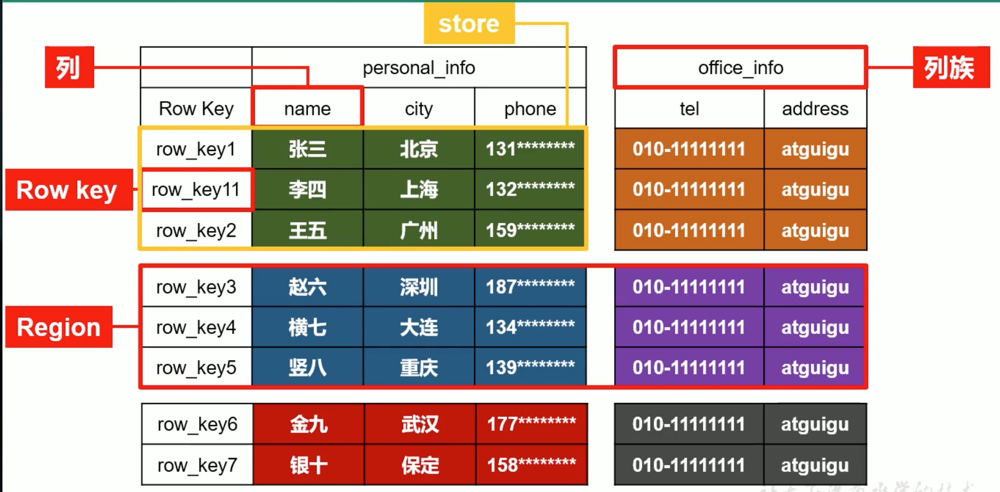
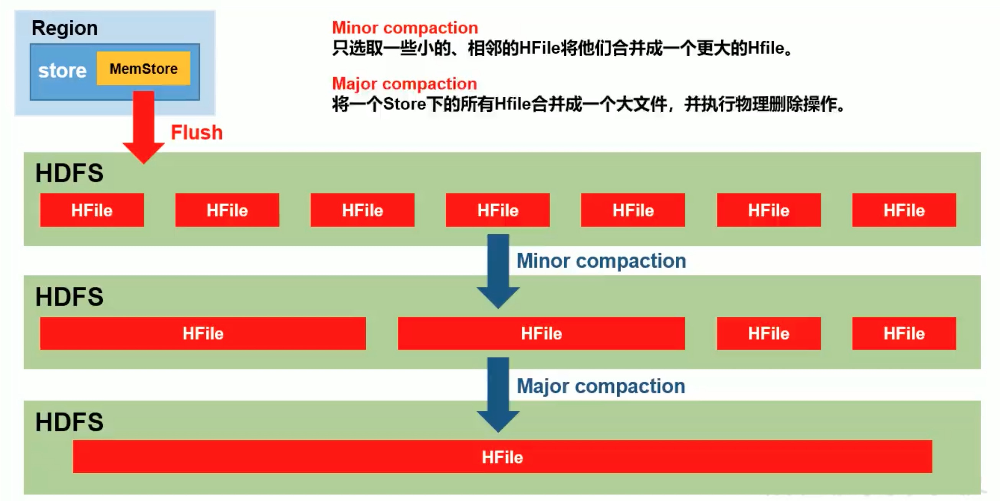

# 概述

## 定义

* Hbase是一个在HDFS上开发的面向列的分布式、可扩展支持海量数据存储的NoSQL数据库，如果需要实时访问超大规模数据集可以使用。
* 自底向上地进行构建，能够简单地通过增加节点来达到线性扩展。概念

## 数据模型

* 逻辑上，Hbase的数据模型同关系型数据库很类似，数据存储在一张表中，有行有列。但从Hbase的底层物理存储结构(K-V)来看，Hbase更像是一个`multi-dimensional map`

### Hbase的逻辑结构



* 按照RowKey横向切分成一个个的Region，按照列族纵向切分。
* Store为真正存储到HDFS的数据。

### 物理结构


### 数据模型

#### Name Sparce

* 命名空间，类似于关系型数据库的`database`概念，每个命名空间下有多个表。Hbase有`两个自带的命名空间`，分别为hbase和default，`hbase中存放的是Hbase内置的表，default表示用户默认使用的命名空间`。

#### Region

* 类似于关系型数据库的表概念，不同的是，Hbase定义表时只需要声明`列族`即可，不需要声明具体的列。这意味着Hbase写入数据时，字段可以`动态，按需`指定。因此，和关系型数据库相比，Hbase能够处理字段变更场景。
* Region也相当于表的切片，按照RowKey来切分Hbase的表。

#### Row

* HBase表中的每行数据都由一个`RowKey`和多个`Column(列)`组成，数据是按照RowKey的`字典顺序存储`的，并且查询数据时只能根据RowKey进行检索，所有RowKey的设计十分重要。

#### Column

* Hbase中的每个列都由`Column Family(列族)`和`Column Qualifier(列限定符)`进行限定，列入info:name, info:age。建表时，只需要指明列族，而列限定符无需预先定义。

#### Time Stamp

* 用于标识数据的不同版本(version),每条数据写入时，如果不指定时间戳，系统会指定为其加上该字段，其值为写入Hbase的时间。

#### Cell

* 由{rowdy,column Family:column Qualifier,time Stamp}唯一确定的单元。cell中的数据时没有类型的，全部是字节码形式存储。

## Hbase的基本架构

### HBase架构(不完整版)

.jpg)

#### Region Server

* Region Server为Region的管理者，其实现类为`HRegionServer`,主要作用如下:对于数据的操作:get、put、delete。

#### Master

* Master是所有Region Server的管理者，其实现类为`HMaster`,监控每个RegionServer的状态，负载均衡和故障转移。

#### Zookeeper

* HBase通过Zookeeper来做master的高可用、RegionServer的监控、元数据的入口以及

集群配置的维护等工作。

#### HDFS

* HDFS为HBase提供最终的底层数据存储服务，同为HBase提供高可用的支持。

### HBASE架构(完整版)

.jpg)

#### StoreFile

* 保存实际数据的物理文件，StoreFile以Hfile的形式存储在HDFS上。每个Store会有一个或多个StoreFile(HFile),数据在每个StoreFIle中都是有序的。

#### MemStore

* 写缓存，由于HFile中的数据要求是有序的，所以数据时先存储在MemStore中，排好序后，等达到刷写时机才会刷写到HFile，每次刷写都会形成一个新的HFile。

#### WAL

* 由于数据要经过MemStore排序后才能刷写到HDFS，但把数据保存在内存中会有很高的概率导致数据丢失，为了解决这个问题，数据会先写在一个叫作Write-Ahead logfile的文件中，然后再写入MemStore中。所以在系统出现故障的时候，数据可以通过这个日志文件重建。

# HBase快速入门

## Hbase按照部署

### 下载Hbase压缩包

```shell
curl https://mirror.bit.edu.cn/apache/hbase/2.3.0/
```

### 修改配置

* 修改regionservers

```
hadoop
```

* 修改hbase-env.sh

```properties
# 添加JAVA_HOME
export JAVA_HOME=/Library/Java/JavaVirtualMachines/jdk1.8.0_221.jdk/Contents/Home
# 不使用HBase内置的ZK
export HBASE_MANAGES_ZK=false
```

* 修改hbase-site.xml

```xml
<?xml version="1.0"?>
<?xml-stylesheet type="text/xsl" href="configuration.xsl"?>
<!--
/*
 * Licensed to the Apache Software Foundation (ASF) under one
 * or more contributor license agreements.  See the NOTICE file
 * distributed with this work for additional information
 * regarding copyright ownership.  The ASF licenses this file
 * to you under the Apache License, Version 2.0 (the
 * "License"); you may not use this file except in compliance
 * with the License.  You may obtain a copy of the License at
 *
 *     http://www.apache.org/licenses/LICENSE-2.0
 *
 * Unless required by applicable law or agreed to in writing, software
 * distributed under the License is distributed on an "AS IS" BASIS,
 * WITHOUT WARRANTIES OR CONDITIONS OF ANY KIND, either express or implied.
 * See the License for the specific language governing permissions and
 * limitations under the License.
 */
-->
<configuration>
  <!--
    The following properties are set for running HBase as a single process on a
    developer workstation. With this configuration, HBase is running in
    "stand-alone" mode and without a distributed file system. In this mode, and
    without further configuration, HBase and ZooKeeper data are stored on the
    local filesystem, in a path under the value configured for `hbase.tmp.dir`.
    This value is overridden from its default value of `/tmp` because many
    systems clean `/tmp` on a regular basis. Instead, it points to a path within
    this HBase installation directory.

    Running against the `LocalFileSystem`, as opposed to a distributed
    filesystem, runs the risk of data integrity issues and data loss. Normally
    HBase will refuse to run in such an environment. Setting
    `hbase.unsafe.stream.capability.enforce` to `false` overrides this behavior,
    permitting operation. This configuration is for the developer workstation
    only and __should not be used in production!__

    See also https://hbase.apache.org/book.html#standalone_dist
  -->
  <!--开启分布式模式-->
  <property>
    <name>hbase.cluster.distributed</name>
    <value>true</value>
  </property>
  <!--添加hbase数据存储目录为HDFS-->
  <property>
    <name>hbase.rootdir</name>
    <value>hdfs://hadoop:8020/hbase</value>
  </property>
  <!--hbase zk地址配置-->
   <property>
    <name>hbase.zookeeper.quorum</name>
    <value>hadoop:2182,hadoop:2183,hadoop:2184</value>
  </property>
  <!--Hbase  Master绑定端口-->
  <property >
    <name>hbase.master.port</name>
    <value>16000</value>
  </property>
  <!--Master的web ui端口-->
  <property>
    <name>hbase.master.info.port</name>
    <value>16010</value>
  </property>
  <!--zk工作目录-->
   <property>
    <name>hbase.zookeeper.property.dataDir</name>
    <value>/Users/babywang/Documents/reserch/middleware/zk/zkCluster/zookeeper_data1,/Users/babywang/Documents/reserch/middleware/zk/zkCluster/zookeeper_data2,/Users/babywang/Documents/reserch/middleware/zk/zkCluster/zookeeper_data3</value>
  </property>
</configuration>
```

### 配置Hbase环境变量

```shell
# 配置Hbase
export HBASE_HOME=/Users/babywang/Documents/reserch/studySummary/module/hbase/hbase-2.3.0
export PATH=$PATH:$HBASE_HOME/bin
```

## 启动Hbase

* 启动Master

```shell
hbase-daemon.sh start master
```

* 启动regionServer

```shell
hbase-daemon.sh start regionserver

# 如果RegionServer和Master时间不一致则无法启动RegionServer
```

# 原理深入

## 写流程


* Client先访问Zookeeper获取hbase:meta表位于哪个RegionServer下，然后在访问meta拿到写入表的RegionServer，该表即meta表会在客户端的meta cache中缓存
* Client在发送Put请求到RegionServer，RegionServer会先写数据到wal edit(预写入日志)中，然后在将数据写入内存MemStore并在MemStore中排序，向客户端发送ack，等到MemStore的刷写时机后，将数据刷写到HFile，最终同步wal edit日志，如果同步失败或者写内存失败那么存在基于MVCC多版本控制的事务，会去回滚。
* 老版本这里还有一个`-ROOT-`，先于Zookeeper之前。

## MemStore Flush


### MemStore刷写时机

* 当某个memstore的大小达到`hbase.hregion.memstore.flush.size(默认值128M)`,其所在region的所有memstore都会刷写。当memstore的大小达到`hbase.hregion.memstore.block.multiplier(默认4)`时会阻止继续往memstore写数据。
* 当region server中memstore的总大小达到java_heapsize、`hbase.regionserver.global.memstore.size(默认0.4,regionServer的0.4)`、`hbase.regionserver.global.memstore.size.lower.limit(默认值0.95，regionServer的0.4*0.95)`，region会按照其所有memstore的大小顺序(由大到小)依次进行刷写。知道region server中所有memstore的总大小减少到上述值以下。
* `hbase.regionserver.optionalcacheflushinterval`memstore内存中的文件在自动刷新之前能够存活的最长时间，默认是1h(最后一次的编辑时间)
* `老版本:`当WAL文件的数量超过`hbase.regionserver.max.logs`,region会按照时间顺序依次进行刷写，直到WAL文件数量减小到`hbase.regionser.max.log`以下。先已经废弃，默认32。

## 读流程


* Client先访问zk，获取hbase:meta表位于哪个Region Server
* 访问对应的Region Server，获取hbase:meta表，根据读请求的namespace:table/rowkey,查询出目标数据位于哪个Region Server中的哪个Region中，并将该table的region信息以及meta表的位置信息缓存在客户端的meta cache中。
* 与目标region Server通信
* 分别在Block Cache(读缓存)，memstore和store file(HFile)中查询目标数据，并肩查到的数据进行合并。此处所有数据都指向同一条数据的不同版本(timestamp)或者不同的类型(put/Delete)
* 将从文中查询的数据块(Block，HFile数据存储单元，默认大小64KB)缓存到Block Cache。
* 将合并后的结果返回客户端。

## StoreFile Compaction

* 由于memstore每次刷写都会产生一个新的Hfile，且同一个字段的不同版本和不同类型有可能会分布在不同的Hfile中，因此查询时需要遍历所有的HFile。为了减少HFile的个数，以及清理掉过期和删除的数据，会进行StoreFile Compaction
* Compaction为两种，分别是`Minor Compaction`和`Major Compaction`。Minor Compaction会将临近的若干个较小的HFile合并成一个较大的HFile，但`不会清理过期和删除的数据`。Major Compaction会将一个Store下的所有HFile合并成一个大HFile，并且`会清理掉过期和删除的数据`。



* `hbase.hregion.majorcompaction`
  * 一个region进行major compaction合并的周期，在这个时间的时候这个region下的所有hfile会进行合并，默认是7天，major compaction非常消耗资源，建议生产关闭该操作(设置为0)，在应用空闲时间手动触发。
* `hbase.hregion.majorcompaction.jitter`
  * 一个抖动比例上一个参数设置是7天进行一次合并，也可以有50的抖动比例
* `hbase.hstore.compactionThreshold`
  * 一个store里面运行存的hfile的个数，超过这个个数会被写到一个新的hfile里面，也即时每个region的每个列族对应的memstore在flush为hfile的时候，默认情况下当达到3个hfile的时候就会对这些文件进行合并重写为一个新文件，设置个数越大可以减少触发合并的时间，每次合并的时间就会越长。