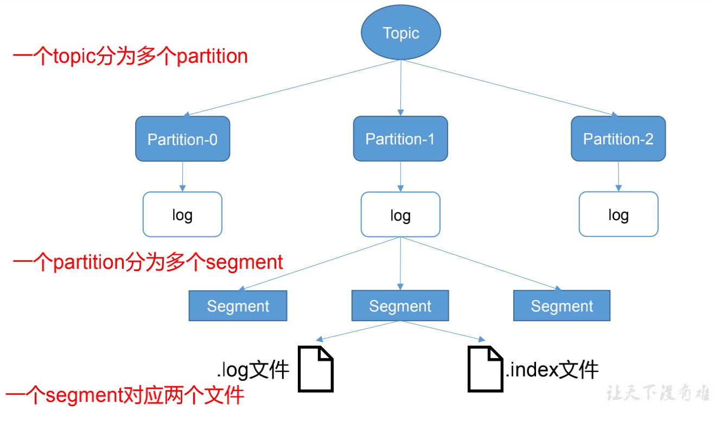

# 概述 

## 文件存储



* 生产者会不断的追加log至log文件末尾，为了防止log文件过大导致数据定位效率低下，Kafka采用了`分片`和`索引`机制，将每个Partition分为多个Segment。每个Segment对应两个文件--`index`和`log`文件，这些文件位于一个文件夹下，文件名为topic+分区序号。Index和log文件以当前segment的第一条消息的offset命名。


* `.index文件存储大量的索引信息`，`.log文件存储大量数据` ,索引文件中的元数据指向对应数据文件中message的物理偏移地址。
* 根据二分查找找到对应offset，然后找到offset后会拿到消息的大小，然后去log中定位这个消息的。

## 消息发送过程 


* 创建一个`ProducerRecord对象需要包含目标Topic和发送的内容，也可以指定键或分区`，在发送ProducerRecord对象时， 生产者要先把`键和值对象序列化成字节数组` 。 
* 数据传递给分区器，如果ProducerRecord指定了分区，那么分区器就不会做任何事情，直接把指定的分区返回 。如果没有指定分区，那么`分区器会根据ProducerRecord对象的键来选择一个分区` 。然后`这条记录被添加到一个记录批次里，这个批次里的所有消息都会发送到相同的Topic和分区上`，有个`独立的线程(Sender IO线程)负责把这些记录批次发送到相应的broker上 。 `
* 服务器在收到这些消息时会返回一个响应，如果消息写入成功，就返回一个RecordMetaData对象，它包含topic和分区信息，以及记录在分区里的offset 。如果写入失败，则会 返回一个错误，生产者在接收到错误之后会尝试重新发送消息，几次之后如果继续失败，就返回错误消息 。 
# 创建Kafka Producer 

## 生产者属性 


* bootstrap.servers 
```plain
该属性指定broker的地址清单，其格式为host:port，清单里不需要包含所有broker地址，生产者会从给定的broker里查找其他broker的信息。 
```

* key.serializer 
```plain
broker希望收到消息的键和值都是字节数组。生产者接口运行使用参数化类型，可以把Java对象作为键和值发送给broker。key.serializer必须被设置为实现了org.apache.kafka.common.serialization.Serializer接口的类，生产者会使用这个类把键对象序列化成字节数组。Kafka客户端默认提供了ByteArraySerializer、StringSerializer和IntegerSerializer，key.serializer必须设置。 
```

* value.serializer 
```plain
value.serializer指定的类将值序列化。 
```
## 发送消息 

```plain
private static final KafkaProducer<String, String> originalProducer; 
static { 
    originalProducer = new KafkaProducer<>(createProducerProp()); 
} 
private static Properties createProducerProp() { 
    Properties properties = new Properties(); 
    properties.put(ProducerConfig.BOOTSTRAP_SERVERS_CONFIG, "localhost:9092"); 
    properties.put(ProducerConfig.KEY_SERIALIZER_CLASS_CONFIG, StringSerializer.class.getName()); 
    properties.put(ProducerConfig.VALUE_SERIALIZER_CLASS_CONFIG, StringSerializer.class.getName()); 
    return properties; 
} 

/** 
 * 发送消息 
 * 
 * @param msg 
 * @param topic 
 */ 
public void sendMsg(String msg, String topic) { 
    ProducerRecord<String, String> producerRecord = new ProducerRecord<>(topic, msg); 
    originalProducer.send(producerRecord); 
} 
```

* 三种发送模式 
    * fire-and-forget 
```plain
消息发送给服务器并不关心它是否正常到达，大多数情况下，消息会正常到达，因为Kafka是高可用的，而且生产者会自动尝试重发，不过这种方式还是可能丢失一些消息。 
```

    * 同步发送 
```plain
使用send()方法发送消息，返回Future对象，调用get()方法进行等待，就能得知消息是否发送成功。 
/** 
 * 同步发送消息 
 * 
 * @param msg 
 * @param topic 
 */ 
public void syncSendMsg(String msg, String topic) { 
    ProducerRecord<String, String> producerRecord = new ProducerRecord<>(topic, msg); 
    try { 
        RecordMetadata recordMetadata = originalProducer.send(producerRecord).get(); 
        log.info("metaData:{}", recordMetadata); 
    } catch (InterruptedException e) { 
        log.error("消息发送失败"); 
    } catch (ExecutionException e) { 
        e.printStackTrace(); 
    } 
} 
```

    * 异步发送 
```plain
调用send()方法，并指定一个回调函数，服务器在返回响应时调用该函数。 
/** 
 * 异步发送消息 
 * 
 * @param msg 
 * @param topic 
 */ 
public void asyncSendMsg(String msg, String topic) { 
    ProducerRecord<String, String> producerRecord = new ProducerRecord<>(topic, msg); 
    originalProducer.send(producerRecord, (metadata, exception) -> log.info("metaData:{}", metadata)); 
} 
```
## 重试机制 


* KafkaProducer一般会发送俩种错误 ，其中一类可重试错误，这类错误可以通过重发消息来解决 。比如连接错误，“无主”错误则可以通过重新为分区选择首领来解决。KafkaProducer可以被配置成自动重试，如果多次重试后仍无法解决问题，应用程序会收到一个重试异常。 
* 无法通过重试解决错误 ，比如消息体过大异常，这类异常Kafkaproducer不会进行重试，直接抛出异常。 
## Exactly Once语义

* 将服务器的ACK级别设置为-1，可以保证Producer到Server之间不会丢失数据，即At Least Once语义。若将Ack级别设置为0，可以保证生产者每条消息只会被发送一次，即At Most Once语义。
* At Least Once可以保证数据不丢失，但不能保证数据不重复；At most Once可以保证数据不重复，但不能保证数据不丢失；需要保证数据不重复并且不丢失，即Exactly Once语义。
* 0.11版本之前保证Exactly Once需要在下游对数据去重，因此如果存在多个下游需要多次去重处理，在0.11版本之后Kafka引入幂等性，即无论Producer向Server发送多少次重复数据，Server只会持久化一条，幂等性结合At Least Once语义，构成了Kafka的Exactly Once语义。
* 启用幂等性,将Producer参数`enable.idompotence`设置为true。开启幂等性的Producer在初始化的时候回分配一个Pid，发往同一个Partition的消息会附带上Sequnce Nubmer,Broker端会对<PID,Partition,SeqNumber>做缓存，当具有相同PID的消息提交时，Broker会根据缓存对消息做筛选。
* PID重启就会变化，同时不同的Partition也具有不同的主键，所以幂等性无法保证跨分区会话的Exactly Once。

# 生产者配置 

## acks 

**acks参数指定了必须要有多少个分区副本收到消息，生产者才会认为消息写入时成功的，它对消息丢失的可能性有影响。** 


* 如果 acks=0，生产者在成功写入消息之间不会等待任何来自服务器的响应 。 如果发送消息中间出现任何问题，导致服务器没有收到消息，生产者是无法得知的，消息就丢失了。 不过，因为 生产者不需要等待服务器的响应，所以它可以以网络能够支持的最大速度发送消息，而达到很高的吞吐量 
* acks=1，只要集群的leader节点收到消息，生产者就会收到一个来自服务器的成功响应。 如果 消息无法到达leader节点(比如leader节点崩溃，新的leader还没有被选举出来)，生产者会收到一个错误响应，为了避免数据丢失，生产者会重发消息。如果一个没有收到消息的节点称为新leader，消息还是会丢失。 这个时候的吞吐量取决于 使用的是同步发送还是异步发送， 如果让发送客户端等待服务器的响应，显然会增加延迟。如果客户端使用回调，延迟问题可以得到缓解，不过吞吐量还是受到发送消息数量的限制。 
* acks=all， 只有当所有参与复制的节点全部收到消息时，生产者才会收到来自服务器的成功响应 。这种模式是安全的，可以保证不止一个服务器受到消息，就算服务器发生崩溃，整个集群可以运行。 
## buffer.memory 


* 设置 生产者内存缓冲区的大小，生产者用它缓存要发送到服务器的消息。如果应用程序发送消息的速度超过发送到服务器的速度，会导致生产者空间不足。这个时候，send()方法调用要么被阻塞，要么抛出异常，取决于如何设置max.block.ms(0.9.0.0之前是block.on.buffer.full)参数 。 
## compression.type 


* 默认情况下，消息发送时不会被压缩，该参数可以设置 snappy、gzip或lz4， 它指定了消息被发送到broker之前使用哪一种压缩算法进行压缩。 
    * snappy压缩算法由Google发明，它占用较少的CPU，却能提供较好的性能和相当可观的压缩比，如果比较关注性能和网络带宽，可以使用这种算法 
    * gzip压缩算法一般会占用较多的CPU，但会提供更高的压缩比，所以如果网络带宽比较有限，可以使用这种算法。 
* 使用压缩 可以降低网络传输和存储开销 ，这往往是Kafka发送消息的瓶颈所在。 
## retries 


* 生产者从服务器收到的错误有可能是临时性的错误(比如分区找不到learder) 。在这种情况下， retries参数的值决定了生产者可以重发消息的次数，如果达到这个次数，生产者会放弃重试并返回错误。 默认情况下，生产者会在每次重试之间等待100ms，不过可以通过 retry.backoff.ms 参数来 改变这个时间间隔 。建议在设置重试次数和重试时间间隔之前，先测试一下恢复一个崩溃节点需要多少时间(比如所有分区选举leader需要多长时间)，让总的重试时间比Kafka集群从崩溃总恢复的时间长， 否则生产者会过早的放弃重试 。 
* 一般情况下，代码里只需要处理无法重试的错误或者达到重试上线的错误。 
## batch.size 


* 当有 多个消息需要被发送到同一个分区时，生产者会把他们放到同一个批次里 。该参数设置了一个批次 可以使用的内存大小，按照字节数计算 。 
* 当批次被填满，批次里的所有消息会被发送出去，不过生产者并不一定都会等到批次被填满才发送，半满的批次，甚至只包含一个消息的批次也可能被发送 。 所以就算批次设置的很大，也不会造成延迟，只会占用更多的内存而已。如果设置太少，生产者需要更频繁地发送消息，增加一些而外的开销 
## linger.ms 


* 生产者 在发送批次之前等待更多消息加入批次的时间 。KafkaProducer 会在批次填满或linger.ms达到上限时把批次发送出去 。默认情况下， 只要有可用的线程，生产者就会把消息发送出去，就算一个批次只有一个消息。把linger.ms设置成比0大的数，让生产者发送批次之前等待一会，使更多的消息加入到这个批次。虽然会增加延迟，但是提升了吞吐量 。 
## client.id 


* 可以使任意字符串，服务器会用它来识别消息的来源，还可以在日志和配额指标里。 
## max.in.flight.requests.per.connection 


* 指定了生产者在收到服务器响应之前可以发送多少消息 。 它的值越高，就会占用越多的内存，不过也可以提升吞吐量 。把它设置 为1可以保证消息时按照发送的顺序写入服务器的，即使发生了重试 。 
## timeout.ms、request.timeout.ms和metadata.fetch.timeout.ms 


* request.timeout.ms指定了生产者在发送数据时等待服务器返回的响应的时间，metadata.fetch.timeout.ms指定了生产者在获取元数据(比如目标分区的leader是谁)时等待服务器返回响应的时间。如果等待响应超时，那么生产者要么重试发送数据，要么返回一个错误(抛出异常或执行回调)。timeout.ms指定了broker等待同步副本返回消息确认的时间，与acks的配置相匹配，如果在指定时间没有收到同步副本的确认，那么broker就返回一个错误 。 
## max.blocks.ms 


* 指定了 在调用send()方法或使用partitionFor()方法获取元数据时生产者的阻塞时间 。当 生产者的发送缓冲区已满，或者没有可用的元数据时，这些方法就会阻塞。在阻塞时间达到max.block.ms时，生产者会抛出异常 。 
## max.reqeust.size 


* 该参数用于控制 生产者发送请求大小。它可以指定能发送的单个消息的最大值，也可以指单个请求里所有消息总的大小 。例如， 假设这个值是1MB，那么可以发送的单个最大消息为1MB ，或者 生产者可以在单个请求里发送一个批次，该批次包含了1000个消息，每个消息大小为1KB 。另外， broker对可接收的消息最大值也有自己的限制(message.max.bytes)，所以两边的配置最好可以匹配，避免生产者发送的消息被broker拒绝 。 
## receive.buffer.bytes和send.buffer.bytes 


* 这两个参数分别指定了 TCP socket接收和发送数据包的缓存区大小 。 如果它们被设为-1，就使用操作系统的默认值 。如果 生产者或消费者与broker处于不同的数据中心，那么可以适当增大这些值，因为跨数据中心的网络一般都比较高的延迟和比较低的带宽 。 
## 消息顺序保证 


# 序列化器 

## 自定义序列化器 

```plain
public class CustomSerializer implements Serializer<Customer> { 
    @Override 
    public byte[] serialize(String topic, Customer data) { 
        String json = JSON.toJSONString(data); 
        return json.getBytes(); 
    } 
} 
```
## 使用Avro序列化 


* 使用avro可以灵活的修改数据的schema，并且可以做到修改完生产者的schema而不修改consumer的schema。 
    * 需要注意 写入数据和读取数据的schema必须是相互兼容的 。Avro文档提到了一个兼容性原则。 
    * 反序列化器需要用到用于写入数据schema，即使它可能与用于读取数据的schema不一样。Avro数据文件里就包含写入数据的schema 。 
## Kafka接入Avro 


* Avro的数据文件里包含了整个schema，如果每条Kafka记录都嵌入schema，会让记录的大小成倍增加。 
* 写入数据需要用到的schema保存在注册表里，然后在记录里引用schema的标识符 。 负责读取数据的应用程序使用标识符从注册表里拉取schema来反序列化记录 。 序列化器和序列化器分别负责处理schema的注册和拉取 。 


# 分区 

## 分区策略

### 概述


* ProducerRecord对象包含了`目标topic、键和值 。Kafka的消息是一个个键值对`，ProducerRecord对象`可以只包含目标topic和值，键可以设置为默认null`， 不过大多数应用程序会用到键。 
* 键的两个用途： `可以作为消息的附加信息，也可以用来决定消息被写到topic的哪个分区 `，拥有`相同键的消息被写到同一个分区 。` 
* 如果`键值被设置为null，并且使用默认的分区器，记录将被随机地发送到topic内各个可用的分区上。`分区器使用`轮询算法将消息均衡地分布到各个分区上 。`如果`键不为空，并且使用默认的分区器，那么Kafka会对键做散列，然后根据散列值把消息映射到特定的分区上。映射时会使用所有分区，如果写入数据的分区不可用，那么就会发生错误。 `
* 只有在不改变topic分区数量的情况下，`键与分区之间的映射才能保持不变，因此需要在创建topic将分区规划好` 。 
### ParoducerRecord分区原则

* 指明partition，直接将消息发送到这个partition中。
* 未指明partition但是指定了key值，将key的hash值和topic的partition数进行取余得到partition值。
* 既没有指明partition也没有指明key，第一次调用时随机生成一个整数后面每次自增，这个值与topic的partition总数取余得到partition，基于round-robin算法。

## 数据可靠性保证

* 为保证Producer发送的数据，能可靠的发送到指定topic，topic的每个partition收到producer发送的数据后，都需要向producer发送ack，如果producer收到ack，就会进行下一轮发送，否则重新发送数据。


### 副本数据同步策略


* 

## 实现自定义分区策略 

```plain
# 将Last都放到最后一个分区中 
public class CustomPartitioner implements Partitioner { 
    @Override 
    public int partition(String topic, Object key, byte[] keyBytes, Object value, byte[] valueBytes, Cluster cluster) { 
        //拿到全部的分区 
        List<PartitionInfo> partitionInfos = cluster.partitionsForTopic(topic); 
        //分区的总数 
        int numPartitions = partitionInfos.size(); 
        if (Objects.isNull(keyBytes) || !(key instanceof String)) { 
            throw new InvalidRecordException("we expect all messages to have consumer name as key"); 
        } 
        //如果key为Last让其写入最后一个分区中 
        if ("Last".equals(String.valueOf(key))) { 
            return numPartitions - 1; 
        } 
        //其他散列到其他分区 
        return Math.abs(Utils.murmur2(keyBytes) % (numPartitions - 2)); 
    } 
    @Override 
    public void close() { 
    } 
    @Override 
    public void configure(Map<String, ?> configs) { 
    } 
} 
```
