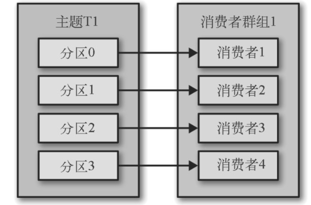
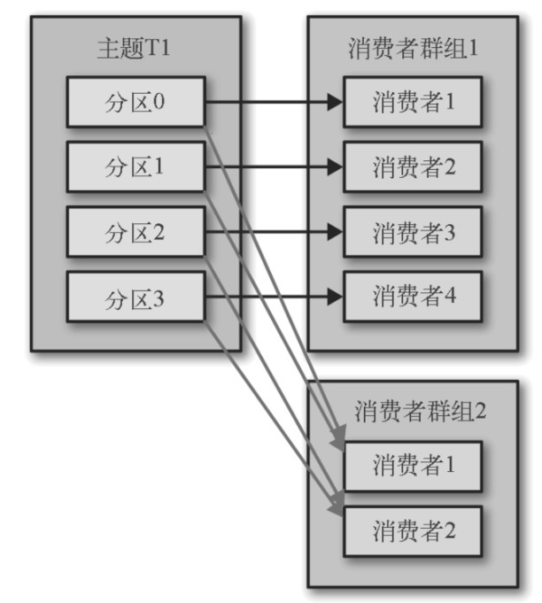
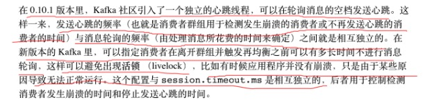
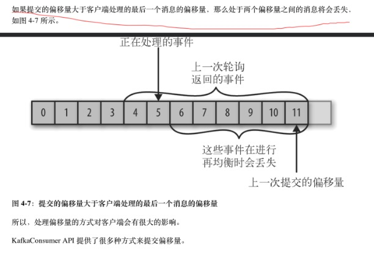
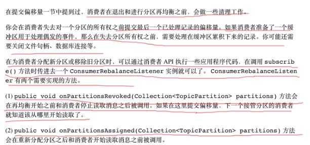

# 概念 

## 消费方式

* consumer采用pull模式从broker中读取数据
* push模式很难适应消费速率不同的消费者，因为消费发送速率是由broker决定的。

### pull的不足

* kafka如果没有数据，消费者可能会陷入循环中，一直返回空数据，针对这一点kafka的消费者在消费数据时会传入一个时长参数timeout，如果当前会有数据可供消费，consumer会等待一段时间之后再返回。

## 消费者和消费者组 


* kafka消费者从属于消费者组，一个消费者组可以订阅同一个topic，每个消费者接受topic的一部分分区的消息。 
### 一个消费者接受4个分区的消息 


### 增加一个消费者接受消息 


### 如果消费者组有4个消费者，那么每个分区可以消费一个分区的消息。 



### 如果5个消费者只会有4个消费者受到分区的消息 


### 多个消费组消费同一个Topic 




## 消费者组和分区再均衡 


* 当添加一个新的消费者到消费者组中，分区消息会被重新分配，当一个消费者崩溃离开分区消息也会重新分配，当为topic新增分区时，分区消息也会被重新分配 。 
### 再均衡 


* 分区的`所有权从一个消费者转移到另一个消费者称为再均衡`。 `再均衡期间消费者无法读取消息，造成整个消费者组一小段时间的不可用，因此需要避免再均衡 。` 
* 并且当一个分区被重新分配给另一个消费者时，消费者当前的读取状态会丢失，他有可能还需要去刷新缓存，在它重新恢复状态之前会拖慢应用程序 。 

**安全再均衡** 


* 消费者通过向被指派为`群组协调器的broker发送心跳来维持它们和群组的从属关系以及它们对分区的所有权关系 。`只要`消费者以正常的时间间隔发送心跳，就被认为活跃的，说明它还在读取分区里的消息 。`消费者会在`轮询消息或提交offset的时候发送心跳` 。如果消费者`停止发送心跳的时间足够长，会话就会过期，群组协调器会认为它已经死亡了，就会触发一次再均衡 。` 
* 如果一个`消费者发生崩溃，并停止读取消息，群组协调器会等待几秒，确认它死亡了才会触发再均衡 。`在这几秒时间里， 死掉的消费者不会读取分区里的消息 。 在清理消费者时，消费者会通知协调器它将要离开群组，协调器会立即触发一次再均衡，尽量降低处理停顿 。 
### 心跳行为在最近版本中的变化 



## 分区分配

### 分区分配策略

* 一个consumer group中有多个consumer，一个topic有多个partition，因此涉及到partition分配问题，Kafka有三种分配策略，一是RoundRobin，二是Range

### 分区分配过程


* 当消费者要加入消费者组时，它会向群组协调器发送一个JoinGroup请求 。 第一个加入消费者组的消费者将成为"群主" 。 群主从`协调器哪里获得消费者组的成员列表`(列表包含了所有最近发送过心跳的消费者，它们被认为是活跃的)，并负责给每一个消费者分配分区。 它使用了一个实现了 PartitionAssignor 接口的类来决定哪些分区应该被分配给哪个消费者。 
* Kafka内置 两种分配策略 ，分配完毕后， "群主"把分配情况列表发送给群组协调器，协调器再把这些信息发送给所有消费者。每个消费者只能看到自己的分配信息，只有"群主"知道消费者组里所有消费者的分配信息 。这个过程在 每次再均衡时重复发生 。 
# 使用Kafka消费者 

## 创建消费者配置 

```java
/** 
 * 创建消费者配置 
 * @return 
 */ 
private Properties createConsumerProperties() { 
    Properties properties = new Properties(); 
    properties.put(ConsumerConfig.BOOTSTRAP_SERVERS_CONFIG, "localhost:9092"); 
    properties.put(ConsumerConfig.GROUP_ID_CONFIG, "learning-kafka-consumer-group"); 
    properties.put(ConsumerConfig.KEY_DESERIALIZER_CLASS_CONFIG, StringDeserializer.class.getName()); 
    properties.put(ConsumerConfig.VALUE_DESERIALIZER_CLASS_CONFIG, StringDeserializer.class.getName()); 
    return properties; 
} 
```
## 订阅topic消费 

```java
public void consumer() { 
    KAFKA_CONSUMER.subscribe(Lists.newArrayList("learning-kafka")); 
    while (true) { 
        ConsumerRecords<String, String> poll = KAFKA_CONSUMER.poll(Duration.ofMillis(1000)); 
        Iterator<ConsumerRecord<String, String>> iterator = poll.iterator(); 
        if (iterator.hasNext()) { 
            log.info("message:{}", iterator.next()); 
        } 
    } 
} 
```

* 轮询的目的不光是为了获取数据，`第一次调用消费者的poll()方法时，它会负责查找GroupCoordinator，然后加入消费者组，接受分配的分区。` 如果发生再均衡，整个过程也是在轮询期间进行的。当然，心跳也是从轮询里发送出去的 ，所以我们要确保轮询期间所做的任何处理工作都应该尽快完成。 
## 线程安全问题 


* 在同一个消费组里，无法让一个线程运行多个消费者，也无法让多个线程安全地共享一个消费者。按照规则，一个消费者使用一个线程。如果要在同一个消费者组里运行多个消费者，需要让每个消费者运行在自己的线程里。最后把消费者的逻辑封装在自己的对象里，然后使用线程池来启动多个线程消费，使得每个消费者运行在自己的线程上。 
```java
/** 
 * 并发消费者 
 */ 
public void concurrentConsumer() { 
    KAFKA_CONSUMER.subscribe(Lists.newArrayList("learning-kafka")); 
    while (true) { 
        CONCURRENT_CONUSMER.submit(() -> { 
            ConsumerRecords<String, String> poll = KAFKA_CONSUMER.poll(Duration.ofMillis(1000)); 
            Iterator<ConsumerRecord<String, String>> iterator = poll.iterator(); 
            if (iterator.hasNext()) { 
                log.info("message:{}", iterator.next()); 
            } 
        }); 
    } 
} 
```
## 为特定消费者指定分区消费

```java
List<PartitionInfo> partitionInfos = consumer.partitionsFor(topic);

/*可以指定读取哪些分区 如这里假设只读取主题的 0 分区*/
for (PartitionInfo partition : partitionInfos) {
    if (partition.partition()==0){
        partitions.add(new TopicPartition(partition.topic(), partition.partition()));
    }
}

// 为消费者指定分区
consumer.assign(partitions);


while (true) {
    ConsumerRecords<Integer, String> records = consumer.poll(Duration.of(100, ChronoUnit.MILLIS));
    for (ConsumerRecord<Integer, String> record : records) {
        System.out.printf("partition = %s, key = %d, value = %s\n",
                          record.partition(), record.key(), record.value());
    }
    consumer.commitSync();
}
```


# 消费者配置 

## fetch.min.bytes 


* 该属性指定了`消费者从服务器获取记录的最小字节 。`broker在收到消费者的数据请求时，`如果可用的数据量小于fetch.min.bytes指定的大小，那么它会等到有足够的可用数据时才把它返回给消费者` 。这样可以 降低消费者和broker的工作负载 ，因为他们在topic不是很活跃的时候(或者一天里的低谷时段)就不需要来来回回地处理消息 。如果没有很多可用数据，单消费者的CPU使用率却很高，那么需要把该属性的值设置的比默认的大。如果消费者的数量比较多，把该属性的值设置的大一点可以降低broker的工作负载。 
## fetch.max.wait.ms 


* 用于指定broker的等待时间，默认为500ms。如果没有足够的数据流入Kafka，`消费者获取最小数据量的要求得不到满足，最终导致500ms延迟 。` 如果要降低潜在的延迟，可以把参数设置小一些。 如果fetch.max.wait.ms被设为100ms，并且fetch.min.bytes被设置为1MB，那么Kafka在收到消费者请求后，`要么返回1MB数据，要么在100ms后返回所有可用数据。 `
## max.partition.fetch.bytes 


* 指定了`服务器从每个分区里返回给消费者的最大字节数，默认值是1MB`，也就是 KafkaConsumer.poll()从每个分区里返回的记录最多不超过max.partition.fetch.bytes指定的字节 。如果一个topic有20个分区和5个消费者， 那么每个消费者需要至少4MB的可用内存来接收记录 。在为消费者分配内存时，可以给它们多分配一些，因为如果消费者组里有消费者发生崩溃，剩下的消费者需要处理更多的分区。 `max.partition.fetch.bytes`的值必须比broker能够接收的最大消息的字节数(通过`max.message.size`设置)大，否则消费者可能无法读取这些消息，导致消费者一直挂起重试( 否则broker就会因为消费端无法使用这个消息而挂起 )。 在设置该属性时， 需要考虑消费者处理数据的时间 ，消费者需要频繁调用poll()方法来避免会发过期和发生分区再均衡，如果单次调用poll()返回的数据太多，消费者需要更多的时间处理，可能无法及时进行下一个轮询来避免会话超时，如果出现这种情况， 可以把该属性调小，或者延长会话超时时间 。 
## session.timeout.ms 


* 指定了`消费者在被认为死亡之前可以与服务器断开连接的时间，默认为3s 。`如果消费者`没有在session.timeout.ms指定的时间内发送心跳给群组协调器，`就被认为 该消费者已经死亡 ， 群组协调器就会触发再均衡，把它的分区分配给消费者组中的其他消费者 。该属性与`heartbeat.interval.ms`紧密相关， `heartbeat.interval.ms`指定了poll()方法向协调器发送心跳的频率 ，session.timeout.ms指定了可以多久不发送心跳， 因此`heartbeat.interval.ms需要比session.timeout.ms小，一般为其的三分之一 。` 
* 把session.timeout.ms设置小点可以快速地检测和恢复崩溃的节点，不过长时间的轮询或GC可能导致非预期的再均衡，把该属性设置大一些，可以减少意外的再均衡，不过检测节点崩溃需要更长的时间。 
## auto.offset.reset 


* 指定了消费者在读取一个没有偏移量的分区或偏移量无效的情况下(因消费者长时间失效，包含偏移量的记录已经过时并被删除)该作何处理 。 默认为latest，`在偏移量失效的情况下，消费者将从最新的记录开始读取数据 (在消费者启动之后生成的记录)。`另一个是earliest，在偏移量无效的情况下， 消费者将从起始位置读取分区的记录 。 
## enable.auto.commit 


* 指定了是否自动提交偏移量，默认值为true。 为了`尽量避免出现重复数据和数据丢失，可以把它设置为false，由自己控制何时提交offset 。`如果设置为true， 可以通过`atuo.commit.interval.ms`属性来控制提交的频率 。 
## partition.assignment.strategy 


* 分区被分配给消费者组中的消费者，PartitionAssignor根据给定的消费者和Topic，决定哪些分区应该被分配给哪个消费者。Kafka有两个分配策略: 
    * Range 
```arduino
该策略会把topic的若干个连续的分区分配给消费者。假设消费者C1和消费者C2同时订阅了topic T1和T2，并且每个topic有3个分区。那么消费者C1有可能分配到这两个topic的分区0和分区1，而消费者C2分配到这两个topic的分区2。因为每个topic拥有奇数个分区，而分配是在topic内独立完成的，第一个消费者最后分配到比第二个消费者更多的分区。只要使用Range策略，而且分区数量无法被消费者属性整除，就会出现如上情况。 
```
* ​	RoundRobin 

```arduino
该策略把topic的所有分区逐个分配给消费者。使用RoundRobin策略来给消费者C1和消费者C2分配分区，那么消费者C1将分到主题T1的分区0和分区2以及主题T2的分区1，消费者C2将分配到topic T1的分区1以及topic T2的分区0和分区2。一般来说，如果所有消费者都订阅相同topic，RoundRobin策略会给所有消费者分配相同数量的分区。 
```

* 通过设置partition.assignment.strategy来选择分区策略 。默认使用的是 org.apache.kafka.clients.consumer.RangeAssignor，这个类实现了Range策略，不过也可以把它改成org.apache.kafka.clients.consumer.RoundRobinAssignor。也可以通过实现PartitionAssignor接口自定义分配策略 。 
## client.id 


* 可以使用任意字符串，broker用它来标识从客户端发送过来的消息，通过被用于在日志、度量指标和配额里。 
## max.poll.records 


* 控制单次调用call()方法能够返回的记录数量，可以帮你控制在轮询里需要处理的数据量 。 
## receive.buffer.bytes和send.buffer.bytes 


* socket在读写数据时用到TCP缓冲区也可以设置大小。 如果它们被设为-1，就使用操作系统的默认值。如果生产者或消费者与broker处于不同的数据中心内，可以适当增大这些值，因为跨数据中心的网络一般都有比较高的延迟和比较低的带宽 。 
# 提交和偏移量 


## 提交 


* 更新分区当前位置的操作叫作提交。 
### offset的维护

* 修改consumer.properties

```properties
exclude.internal.topics=false
```


* 消费者往一个叫作`__consumer_offsets`的特殊topic发送消息 ， 消息里包含每个分区的偏移量 。如果一个消费者一直处于运行状态，那么offset就没有什么用处。不过，如果消费者发生崩溃或者有新的消费者加入消费者组，就会触发再均衡，完成在均衡之后，每个消费者可能分配到新的分区，而不是之前处理的那个。为了能够继续之前的工作， 消费者需要读取每个分区最后一次提交的偏移量，然后从偏移量指定的地方继续处理。 
### 查看_consumer_offset

```shell
kafka-console-consumer.sh --topic __consumer_offsets --bootstrap-server hadoop:9092,hadoop:9093,hadoop:9094 --formatter "kafka.coordinator.group.GroupMetadataManager\$OffsetsMessageFormatter" --from-beginning
```

### 如果提交的offset小于最后一个消息的offset 


### 如果提交的偏移量大于客户端处理的最后一个消息的offset 



## 自动提交 


* 将enable.atuo.commit设置为ture ，那么消费者会自动把`从poll()方法接收到的最大偏移量提交上去 。` 提交时间间隔由`auto.commit.interval.ms`控制，默认为`5s` 。与消费者里的其他东西一样，自动提交也是在轮询里进行的 。 消费者进行轮询时会检查是否该提交offset了，如果是，就会提交从上次轮询返回的offset。 
### 存在的问题 


## 提交当前offset 


* 将`auto.commit.offset`设为false，让应用程序决定何时提交offset，使用commitSync提交偏移量 。 
* commitSync()会将提交由poll()返回的最新offset，所以在处理完所有记录后要确保调用了commitSync()，否则存在消息丢失的风险，`如果发生了再均衡，从最近一批消息到发生再均衡之间的所有消息都被重复处理 。` 
* 如果没有发生异常，`commitSync()会阻塞直到成功为止`。 
## 异步提交 


* 使用commitSync存在一个问题，在broker对提交请求作出回应之前，应用程序会一直阻塞，这样会限制应用程序的吞吐量 。 

* 在成功提交或碰到无法恢复的错误之前， commitSync()会一直重试，但是commitAsync()并不会，因为它在收到服务器响应的时候，可能一个更大的offset已经提交成功。 
### 重试异步提交 


* 可以使用一个`单调递增的序列号来维护异步提交的顺序`。在每次提交offset之后或在回调里提交偏移量时递增序列号。在进行重试之前，先检查回调的序列号和即将提交的offset是否相等，如果相等，说明没有新的提交，那么可以安全的进行重试，如果序列号比较大，说明有一个新的提交已经发送出去，应该停止重试。 
## 同步和异步组合提交 


* 如果提交失败因为临时问题导致的，那么后续的提交总会有成功的。但是如果这个发生在关闭消费者或再均衡前的最后一次提交，就要确保能够提交成功。 
* 在消费者关闭前一般会组合使用commitAsync()和commitSync()。 
```java
/** 
 * 同步和异步提交组合 
 */ 
public void combinationCommitOffset() { 
    KAFKA_CONSUMER.subscribe(Lists.newArrayList("learning-kafka")); 
    try { 
        while (true) { 
            ConsumerRecords<String, String> poll = KAFKA_CONSUMER.poll(Duration.ofMillis(1000)); 
            Iterator<ConsumerRecord<String, String>> iterator = poll.iterator(); 
            if (iterator.hasNext()) { 
                log.info("message:{}", iterator.next()); 
            } 
     /*   try { 
            KAFKA_CONSUMER.commitAsync(); 
        } catch (Exception e) { 
            log.error("提交offset失败"); 
        }*/ 
            //使用回调 
            KAFKA_CONSUMER.commitAsync((offsets, exception) -> { 
                if (Objects.nonNull(exception)) { 
                    log.error("commit fail for offsets:{}", offsets, exception); 
                } 
            }); 
        } 
    } catch (Exception e) { 
        log.error("offset提交异常"); 
    } finally { 
        try { 
            KAFKA_CONSUMER.commitSync(); 
        } catch (Exception e) { 
            log.error("同步提交一次"); 
        }finally { 
            KAFKA_CONSUMER.close(); 
        } 
    } 
} 
```
## 提交特定的offset 

```java
private Map<TopicPartition, OffsetAndMetadata> OFFSET = Maps.newHashMap(); 
int count = 0; 
/** 
 * 提交任意偏移量 
 */ 
public void commitArbitrarilyOffset() { 
    KAFKA_CONSUMER.subscribe(Lists.newArrayList("learning-kafka")); 
    try { 
        while (true) { 
            ConsumerRecords<String, String> poll = KAFKA_CONSUMER.poll(Duration.ofMillis(1000)); 
            Iterator<ConsumerRecord<String, String>> iterator = poll.iterator(); 
            if (iterator.hasNext()) { 
                ConsumerRecord<String, String> next = iterator.next(); 
                log.info("message:{}", next); 
                OFFSET.put(new TopicPartition(next.topic(), next.partition()), new OffsetAndMetadata(next.offset() + 1, "no metadata")); 
                if (count % 1000 == 0) { 
                    KAFKA_CONSUMER.commitSync(OFFSET, null); 
                } 
                count++; 
            } 

        } 
    } catch (Exception e) { 
        log.error("offset提交异常"); 
    } 
} 
```
# 再均衡监听器 



```java
@Slf4j 
public class HandleRebalance implements ConsumerRebalanceListener { 
    private KafkaConsumer<String, String> consumer; 
    private Map<TopicPartition, OffsetAndMetadata> currentOffset; 
    public HandleRebalance(KafkaConsumer<String, String> consumer, Map<TopicPartition, OffsetAndMetadata> currentOffset) { 
        this.consumer = consumer; 
        this.currentOffset = currentOffset; 
    } 
    /** 
     * 再均衡开始之前和消费者停止读取消息之后被调用。如果这里提交offset，下一个接管分区的consumer就知道从哪里开始消费了 
     * 
     * @param partitions 
     */ 
    @Override 
    public void onPartitionsRevoked(Collection<TopicPartition> partitions) { 
        log.info("再均衡之前，consumer停止消费后提交offset给服务器"); 
       // 防止重复消费
        consumer.commitSync(currentOffset); 
    } 
    /** 
     * 在重新分配分区之后和消费者开始读取消息之前被调用 
     * 
     * @param partitions 
     */ 
    @Override 
    public void onPartitionsAssigned(Collection<TopicPartition> partitions) { 
    } 
} 
```
# 从特定偏移量处开始处理记录 


* 通过 seekToBeginning (Collection<TopicPartition> partitions)和 seekToEnd (Collection<TopicPartition> partitions)可以从指定分区的开始处或结尾处开始读。 
* 使用seek()方法,传入指定的offset读取数据。
# 退出消费者 


* 通过另一个线程调用consumer.wakeup()方法，如果循环运行在主线程里，可以再ShutdownHook里调用该方法。 
* consumer.wakeup()是消费者唯一一个可以从其他线程里安全调用的方法。调用consumer.wakeup()可以退出poll,并抛出WakeupException异常，如果调用wakeup时线程没有等待轮询，那么异常将在下一轮调用poll()时抛出。 
* 在退出线程时调用consumer.close()可以将还没有提交的东西提交到服务端，并向群组协调性发送消息告知自己要离开消费者组，然后会触发再均衡，就不需要在依赖于心跳机制了。 
# 独立消费者 


* 单个消费者去消费一个分区的数据 
```java
public class StandAloneConsumer { 
    private static final KafkaConsumer<String, String> STANDALONE_CONSUMER; 
    private static final List<TopicPartition> partitions = Lists.newArrayList(); 
    static { 
        STANDALONE_CONSUMER = new KafkaConsumer<>(createConsumerProperties()); 
    } 
    /** 
     * 创建消费者配置 
     * 
     * @return 
     */ 
    private static Properties createConsumerProperties() { 
        Properties properties = new Properties(); 
        properties.put(ConsumerConfig.BOOTSTRAP_SERVERS_CONFIG, "localhost:9092"); 
        properties.put(ConsumerConfig.KEY_DESERIALIZER_CLASS_CONFIG, StringDeserializer.class.getName()); 
        properties.put(ConsumerConfig.GROUP_ID_CONFIG, StringDeserializer.class.getName()); 
        properties.put(ConsumerConfig.VALUE_DESERIALIZER_CLASS_CONFIG, StringDeserializer.class.getName()); 
        //关闭自动提交offset 
        properties.put(ConsumerConfig.ENABLE_AUTO_COMMIT_CONFIG, "false"); 
        return properties; 
    } 
    public void consumer() { 
        List<PartitionInfo> partitionInfos = STANDALONE_CONSUMER.partitionsFor("test-kafka"); 
        if (!CollectionUtils.isEmpty(partitionInfos)) { 
            for (PartitionInfo partitionInfo : partitionInfos) { 
                partitions.add(new TopicPartition(partitionInfo.topic(), partitionInfo.partition())); 
            } 
            STANDALONE_CONSUMER.assign(partitions); 
            while (true) { 
                ConsumerRecords<String, String> poll = STANDALONE_CONSUMER.poll(Duration.ofMillis(1000)); 
                for (ConsumerRecord<String, String> record : poll) { 
                    log.info("message:{}", record); 
                } 
                STANDALONE_CONSUMER.commitSync(); 
            } 
        } 
    } 
} 
```
