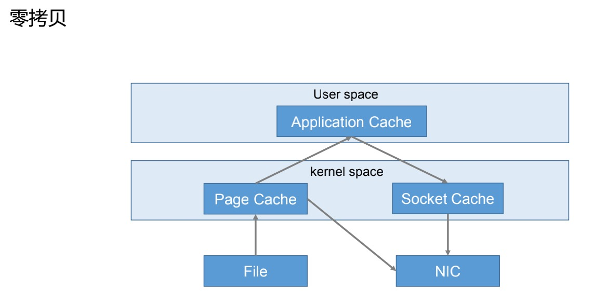

# Kafka高效读写数据

## 顺序写磁盘

* Kafka的producer生产数据，要写入到log文件中，写的过程是一直追加到文件末端为顺序写，顺序写省去了大量的寻址时间。

## 零复制技术 



* 数据先写入到Application Cache，然后再通过IO流通过Socket Cache写入到File或者NIC中，零拷贝记录无需Application Cache将数据传递至kernel space的概念，直接由操作系统将数据传递到File或者NIC中。

## 分区高并发

* 分布式分区并发读写，因此效率过高。

# Kafka事务

* Kafka从0.11版本后引入事务支持，事务保证Kafka在Exactly Once语义的基础上，生产者和消费者可以跨分区和会话，要么全部成功要么全部失败。

## Producer事务

* 为了实现跨分区会话的事务，需要引入一个全局唯一的Transaction ID，并将Producer获得的PID和Transaction ID绑定。这样Producer重启的时候可以通过正在进行的Transaction ID获得原来的PID。
* 为了管理Transaction,Kafka引入Transaction Coordinator。Producer就是通过和Transaction Coordinator交互获取Transaction ID对应的任务状态。Transaction Coordinator还负责将事务所有写入Kafka的一个内部Topic，这样即使服务重启，由于事务状态得到保存，进行中的事务状态可以得到回复。

# 集群成员的关系 


* Kafka使用`Zookeeper来维护集群成员的信息`，每个broker都有一个唯一标识符，这个标识符可以在配置文件里指定，也可以自动生成。在broker启动的时候，它通过`创建临时节点把自己的ID注册到Zookeeper 。`Kafka组件订阅Zookeeper的` /broker/ids路径 (broker在Zookeeper上的注册路径),当有broker加入集群或退出集群时，这些组件就可以获得通知 。` 
* 在`broker停机、出现网络分区或长时间GC停顿时，broker会从Zookeeper上断开连接，此时 broker在启动时创建的临时节点会从Zookeeper上移除 ， 监听broker列表的Kafka组件会告知该broker已被移除 。 `
* 在`关闭broker时，它对应的节点也会消失，不过它的ID继续存在于其他数据结构中 。`例如topic的副本列表里就可能包含这些ID。 `在完全关闭一个broker之后，如果使用相同的ID启动另一个全新的broker， 他会立即加入集群，并拥有与旧broker相同的分区和topic `。 
# 控制器 

## 首次启动controller 


* 控制器其实就是一个broker ，只不过它除了具有一般broker的功能之外，还`负责分区leader的选举` 。集群里`第一个启动的broker通过在Zookeeper里创建的一个临时节点/controller让自己成为控制器。`其他broker在启动时也会尝试创建这个节点，不过它们会收到一个"节点已存在"异常 。 
* 其他broker在控制器节点上创建Zookeeper watch对象，这样它们就可以收到这个节点的变更通知 ，这种方式可以确保集群里一次只有一个控制器存在。 


## 控制器被关闭或者与Zookeeper断开连接 

* Zookeeper上的临时节点就会消失。 集群里的其他broker通过watch对象得到控制器节点消失的通知，它们就会尝试让自己成为新的控制器。 第一个在Zookeeper里成功创建控制器的节点的broker就会成为新的控制器，其他节点会收到"节点已存在"异常，然后在新的控制器节点上再次创建watch对象 。`每个新选出的控制器通过Zookeeper的条件递增操作获得一个全新的、数值更大的controller_epoch 。其他broker 在知道当前controller_epoch后，如果收到由控制器发出的包含较旧epoch的消息 ，就会忽略它们。` 防止脑裂问题。


* 当控制器发现一个broker已经离开集群，那些失去leader的分区需要一个新的leader 。控制器遍历这些分区，并确定谁应该成为新的leader，然后向所包含新leader或现有follower的broker发送请求。该请求消息包含了谁是新的leader以及谁是分区follower的信息。随后，新leader开始处理来自生产者和消费者的请求，而follower从新leader那里复制消息。 
* 当一个控制器发现一个broker加入集群时，他会使用brokerID来检查新加入的broker是否包含现有分区的副本 。 如果有控制器就把变更通知发送给新加入的broker和其他broker，新broker上的副本开始从leader哪里复制消息 。 
* Kafka使用Zookeeper的临时节点来选举控制器，并在节点加入集群或退出集群时通知控制器，控制器负责在节点加入或离开集群时进行分区leader选举。控制器使用epoch来避免"脑裂"。 
# 复制 


* 复制功能是Kafka的核心，复制保证了个别节点在失效时仍能保证Kafka的可用性和持久性。 
## 数据存储格式 


* 使用Topic来组织数据， 每个topic被分为若干个分区，每个分区有若干个副本。那些副本被保存在broker上，每个broker可以保存成百上千个属于不同topic和分区的副本 。 
## 副本类型 

### 首领副本 


* 每个分区`都有一个首领副本`。为了保证一致性，所有生产者请求和消费者请求都会经过这个副本 。 
* leader的另一个任务就是搞清楚哪个follower的状态与自己一致 。 
### follower副本 


* leader以外的副本都是follower副本 。follower副本`不处理来自客户端的请求`，它们唯一的任务就是`从leader哪里复制消息，保持与leader一致的状态 。如果leader发生崩溃， 其中一个follower会被提升为leader。 `
* follower为了保持与leader状态一致，在有新消息到达时尝试从首领那里复制消息，不过有各种原因会导致失败。例如，网络阻塞导致复制变慢，broker发生奔溃导致复制滞后，知道重启broker才会继续。 
* 为了与leader保持同步，follower向leader发送获取数据的请求，这种请求与消费者为了读取消息而发送的请求时一样的。leader将响应消息发给follower。 请求消息包含了follower想要获取消息的offset，而这些offset总是有序的 。 
### follower副本的流程 


* follower的正常不活跃时间或成为不同步副本之前的时间通过`replica.lag.time.ms`来设置 。这个时间间隔直接影响着首领选举期间的客户端行为和数据保留机制。 
### 首选首领 


#### 找到首选首领 


# 处理请求 


* broker的大部分工作是`处理客户端、分区副本和controller发送给分区leader的请求 `。Kafka提供一个基于二进制的协议(基于TCP)，指定了请求消息的格式以及broker如何对请求作出响应 --包括 成功处理请求或处理请求过程中遇到错误 。客户端发起连接并发送请求，broker处理请求并作出响应。broker 按照请求到达的顺序来处理它们--这种顺序保证让kafka具有消息队列的特性，同时保证保存的消息也是有序的 。 
## 标准消息头 


* Request type(API type) 
* Request version(broker可以处理不同版本的客户端请求，并根据客户端版本作出不同的响应) 
* Correlation ID  一个具有唯一性的数字，用于标识请求消息，同时也会出现在响应消息和错误日志里(用于诊断问题) 
* Client ID  用于标识发送请求的客户端 
## broker处理请求 


* broker会在它所 监听的每一个端口上运行一个Acceptor线程 ，这个线程 会创建一个连接，并把它交给Processor线程去处理 。Processor线程(网络线程)的数量 是可配置的 。网络线程 负责从客户端获取请求消息，把它们放进请求队列，然后从响应队列获取响应消息，把它们发送给客户端 。 
* 请求消息被放到请求队列后，IO线程会负责处理它们 。 
## 请求类型 


* 生产请求 
    * 生产者发送的请求，它包含客户端要写入broker的消息 
* 获取请求 
    * 在消费者和follower副本需要从broker读取消息时发送的请求 
### Kafka处理请求的内部流程 


* 生产请求和获取请求都必须发送给 分区的leader副本 。如果broker 收到一个针对特定分区的请求，而该分区的leader在另一个broker上，那么发送请求的客户端会收到一个"非分区首领"的错误响应 。当针对 特定分区的获取请求被发送到一个不含有该分区首领的broker上，也会出现同样的问题 。客户端要 自己负责将生产请求和获取请求发送到正确的broker上 。 
### 客户端如何知道向那个broker发送请求呢？ 


* 客户端使用另一种请求类型， 元数据请求 ，这种请求包含了 客户端感兴趣的topic列表 。 服务器端的响应信息里指明了这些topic包含的分区、每个分区都有哪些副本，以及哪个副本是leader。 元数据请求 可以发送给任意一个broker，因为所有broker都缓存了这些信息 。 
* 一般请求下， 客户端会把这信息缓存起来 ，并直接往 目标broker上发送生产请求和获取请求 ，它们需要 每隔一段时间通过元数据请求来刷新这个缓存的数据(刷新的间隔通过metadata.max.age.ms来配置) 。 
* 如果发生"非leader副本"错误，会在重试重发元数据请求前刷新元数据。 


* 文字说明 


## 生产请求 


* leader副本的broker在收到生产请求时，会对请求做一些验证 
    * 发送数据的用户是否有主题写入权限 
    * 请求里包含的acks值是否有效 
    * 如果acks=all，是否有足够多的同步副本保证消息已经被安全写入 
```plain
消息被写入本地磁盘，在Linux系统上，消息会被写到文件系统缓存里，并不保证它们何时会被刷新到磁盘。Kafka不会一直等待数据被写到磁盘上--它依赖复制功能来保证消息的持久性。 
```

* 在消息被写入分区的leader副本之后，broker开始检查acks配置参数--如果acks被设为0或1，那么broker立即返回响应；如果acks为all，那么请求被保存在一个叫作 炼狱的缓冲区 里， 直到leader发现所有follower都复制了消息，响应才会被返回给客户端 。 
## 获取请求 


* broker处理获取请求的方式与处理生产请求的方式相似， 客户端发送请求，向broker请求topic分区具有特定offset的消息 。 


# 物理存储 


* Kafka的基本`存储单元是分区` 。 分区无法在多个broker间进行再细分，也无法在同一个broker的多个磁盘上进行细分 。所以，分区的大小受到单个挂载点可用空间的限制。 
* 在配置Kafka的时候可以指定一个用于存储分区的目录清单log.dirs参数，该参数一般包含每个挂载点的目录。 
## 分区分配 


* 创建topic时，kafka 首先会决定如何在broker间分配分区 ，假设你有6个broker打算创建一个包含10个分区的topic，并且复制系数为3。那么Kafka会有30个分区副本，它们可以分配给6个broker。 
* 分配的目标： 
    * 在broker间平均地分布分区副本 。对于上述需要保证每个broker可以分到5个副本。 
    * 确保`每个分区的每个副本分布在不同的broker上` 。假设分区0的leader副本在broekr2上，那么可以把follower副本放在broker3和broker4上，但是不能放在broker2上，也不能两个都放在broker3上。 
    * 如果broker指定了机架信息，那么尽可能把每个分区的副本分配到不同的机架的broker上。 这样做保证一个机架的不可用不会导致整体的分区不可用。 
### 分区分配策略 

#### 不配置机架信息 


* 随机选择一个broker，然后使用轮询的方式给每个broker分配分区来确定leader分区的位置， 假如leader分区0会在broker4上，leader分区1会在broker5上，leader分区2会在broker0上 ，并以此类推。然后在从分区leader开始，依次分配follower副本。如果分区0的leader在broker4上,那么它的第一个follower副本在broker5上，第二个follower副本在broker0上 ，以此类推。 
#### 配置机架信息 


* 使用交替机架的方式来选择broker ，假设broker0、broker1和broker2在同一个机架上，broker3、broker4和broker5分别放置在其他不同的机架上。 我们不按照从0到5的顺序来选择broker，而是按照0，3，1，4，2，5的顺序来选择 ，这样每个相邻的broker都在不同的机架上。如果分区0的leader在broker4上， 那么第一个follower副本会在broker2上，这两个broker在不同的机架上 。如果第一个机架下线，还有其他副本仍然活跃着，所以分区仍然可用。 


* 分区和副本选好合适的broker之后，接下来要决定这些分区应该使用哪个目录。我们单独为每个分区分配目录，规则很简单:计算每个目录里的分区数量，新的分区总是被添加到数量最小的哪个目录里 ，也就是说， 如果添加一个新的磁盘，所有新的分区都会被创建在这个磁盘上 。因为在完成分配工作之前，新磁盘的分区数量总是最少的，最少使用原则为分区分配文件存储目录。
### 注意磁盘空间 


* 在为broker分配分区时并没有考虑可用空间和工作负载问题，但在将分区分配给磁盘上时会考虑分区数量，不过不考虑分区大小 。也就是说，如果有些broker的磁盘空间比其他broker要大(有可能是因为集群同时使用了旧服务器和新服务器)， 有些分区异常大，或者同一个broker上有大小不同的磁盘， 那么在分配分区时要格外小心。 
## 文件管理 


* Kafka持久化消息，但是`会根据topic的配置来保存对应的时间或者保存数据的大小 。 `
* 在一个大文件里查找和删除消息时很费时，并且容易出错，所以我们`把分区分成若干个段 。`默认情况下， `每个片段包含1GB或一周的数据，以较小的为准 。`在broker往分区写入数据时， 如果达到片段上限，就关闭当前文件，并打开一个新文件 。 
* 正在写入数据的片段叫作`活跃片段`，它永远不会被删除 ，如果`要保留数据一天，但是片段里包含了5天的数据，那么这些数据就会保留5天 ，因为在片段被关闭之前这些数据无法删除。`如果保留数据一周，而且每天使用一个新片段，就会看到，每天在使用一个新片段的同时会删除一个最老的片段，所以大部分时间该分区会有7个片段存在。 
## 文件格式 


* Kafka将`消息和offset保存进文件 ， 保存在磁盘上的数据格式与从生产者发送过来或发送给消费者的消息格式一样` ，使 相同格式进行磁盘存储和网络传输，Kafka可以使用`零复制技术给消费者发送消息，同时避免了对生产者已经压缩过的消息进行解压和再压缩 。 `
* 除了key、值和offset外，消息里还包含`消息大小、校验和、消息格式版本号、压缩算法(Snappy、GZip和LZ4)和时间戳 。`时间戳可以是生产者发送消息的时间，也可以是消息达到broker的时间，可配置。 
* 如果生产者发送的是压缩消息，那么同一批次的消息会被压缩在一起，被当做"包装消息"进行发送，broker就会收到这个消息，然后再把它发送给消费者，消费者在解压这个消息之后，可以看到整个批次的消息，它们都有自己的时间戳和偏移量 。 


* 如果在生产端使用了压缩功能，那么发送的批次越大，就意味网络传输和磁盘存储方面会获得越好的压缩性能，同时也意味着如果修改了消费者使用的消息格式(例如，在消息里增加了时间戳)，那么网络传输和磁盘存储格式也要随之修改，而且broker要知道如何处理包含两种消息格式的文件 。 
* Kafka附带一个叫 DumpLogSegment 的工具，可以用它查看片段的内容，可以显示每个消息的offset、校验和、魔术数字节、消息大小和压缩算法 
```shell
./kafka-run-class.sh kafka.tools.DumpLogSegments 
* 使用--deep-iteration参数，可以参数被压缩到包装消息里的消息 
```
## 索引 


* 消费者`可以从Kafka的任意可用offset位置开始读取消息 。`假设消费者要读取从offset100开始的1MB消息，那么 broker必须立即定位到offset100(可能在任意分区的任意片段里) ，然后开始从这个位置读取消息。为了帮助broker更快地定位到指定的offset， Kafka为每个分区维护了一个索引 。 索引把offset映射到片段文件和offset在文件的位置 。 
* 索引也被分成片段，所以在删除消息时，可以删除相应的索引。Kafka不维护索引的校验和 。如果索引出现损坏，Kafka会通过重新读取消息并录制offset和位置来重新生成索引。如果有必要，管理员也可以删除索引，这样做事绝对安全的，Kafka会重新生成这些索引 。 
## 清理 


* Kafka会根据设置的时间保留数据，把超过时效的数据删除掉。 
* Kafka可以改变保留策略， 早于保留时间的旧事件会被删除，为每个键保留最新的值，从而达到清理的效果 。只有在应用程序生成的事件包含kv对时，设置compact策略才有意义，如果topic包含null键，清理就会失败。 
## 清理的工作原理 

### 日志片段的两个部分 


* 干净的部分 
    * 这些消息之前被清理过，每个键只有一个对应的值，这个值是上一次清理时保留下来的。 
* 污浊的部分 
    * 这些消息是在上一次清理之后写入的。 


* 在Kafka 启动时启用了清洁功能(`设置log.cleaner.enabled参数`),每个broker会启动一个清理管理器线程和多个清理线程，它们负责指定清理任务 。这些线程选择污浊率(污浊消息占分区总大小的比例)较高的分区进行清理 
* 为了清理分区，清理线程会读取分区的污浊部分， 并在内存里创建一个map。map里包含每个元素包含的消息键的散列值和消息的偏移量 ， 键的散列值是16B，加上偏移量总共24B 。如果要清理一个1GB的日志片段，并假设每个消息大小为1KB，那么这个片段包含1百万个消息，而我们只需要24MB的map就可以清理这个片段。 
* 管理员在配置Kafka时可以对map使用的内存大小进行配置，每个线程都有自己的map ，而这个参数指的是所有线程可使用的内存总大小。如果意味map分配1GB内存，并使用里5个清理线程，那么每个线程就可以使用200MB内存来创建自己的map。 
* 清理线程在创建好偏移量map后，开始从干净的片段处读取消息，从最旧的消息开始，把它们的内容与map里的内容进行比对。 他会 检查消息的键是否存在于map中，如果不存在，那么说明消息的值是最新的，就把消息复制到替换片段上。如果键已经存在消息就会被忽略， 因为在分区的后部已经有一个具有相同键消息存在。在复制完所有的消息之后，将替换片段与原始片段进行交换，然后开始清理下一个片段。完成整个清理过程之后，每个键对应一个不同的消息，这些消息的值都是最新的。 


## 被删除的事件 


* 因为清洁map中存放的数据的值时最近的一个值，如果想要把特定键对应的所有消息都删除时，应用程序需要发送一个包含该键且值为null的消息 。清理线程发现该消息时， 会先进行常规清理，只保留值为null的消息。该消息(称为墓碑消息)会被保留一段时间，时间长短可以配置 。在期间， 消费者可以看到这个墓碑消息，并且发现它的值已经被删除。于是，如果消费者往数据库复制kafka数据，当看到这个墓碑消息，就知道应该把相关的用户信息从数据库删除 。在这个时间段后，清理线程会移除这个墓碑消息 ，因为如果消费者离线几个小时并错过了墓碑消息，就看不到这个键，也就不知道它已经从kafka里删除，从而也就不会去删除数据库里的相关数据了。 
## 何时会清理主题 


* delete策略不会删除当前活跃片段，compact策略不会对当前片段进行清理。只有旧片段里的消息才会被清理。 


