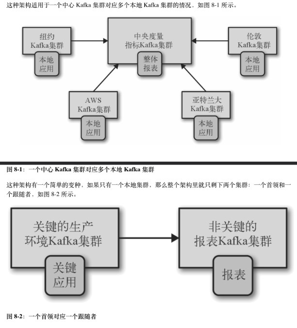
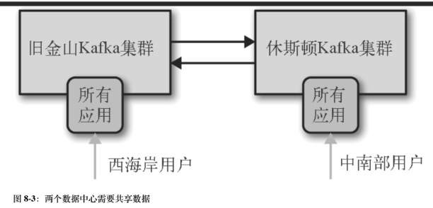
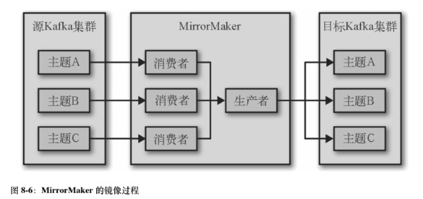

# 跨集群镜像的使用场景 

## 区域集群和中心集群 


* 当存在多个数据中心，它们分布在不同的地理区域，不同的城市。这些数据中心都有自己的Kafka集群。有些应用程序只需要与本地的Kafka集群通信，而有些则需要访问多个数据中心的数据 。 
## 冗余 


* 一个Kafka集群足以支撑所有的应用程序，不过仍可以使用一个副本集群来作为数据容灾方案。 
# 多集群架构 

## 跨数据中心通信的一些问题 

### 高延迟 


* Kafka集群之间的通信延迟随着集群间距离的增长而增加。集群间的网络跳转所带来的缓冲和堵塞会增加通信延迟。 
### 有限的带宽 


* 单个数据的广域带框很低，可用的带宽在时刻变化，高延迟让如何利用带宽变得困难。 
### 高成本 


* 带宽昂贵 
### 多集群架构原则 


* 每个数据中心至少需要一个集群。 
* 每两个数据中心之间的数据复制要做到每个事件仅复制一次。 
* 如果可能，尽量从远程数据中心读取数据，而不是向远程数据中心写入数据。 
## Hub和Spoke架构 




* 当消费者需要访问的数据集分散在各个数据中心时，可以使用这种架构。 
* 这种架构无法访问另一个集群的数据。 
## 双活架构 


* 当有两个或多个数据中心需要共享数据并且每个数据中心都可以生成和读取数据时，可以使用双活架构。 




* 可以为就近的用户提供服务，具有性能上的优势，而且不会因为数据的可用性问题在功能方面作出牺牲。 
* 冗余和弹性，每个数据中心具备完整的功能，一旦一个数据中心失效，就可以把用户重定向到另一个数据中心。 
* 存在的问题是如何在进行多个未知的数据异步读取和异步更新时避免冲突，以及数据一致性问题。 
## 主备架构 


* 在同一个数据中心安装两个集群，包含相同的数据，平常只使用一个，当提供服务的集群完全不可用时，可以使用第二个集群。又或者你希望它们具备地理位置弹性，比如整体业务运行在河南，但需要在杭州有第二个数据中心，第二个数据平常不怎么用，但一旦第一个数据中心发生问题，第二个数据中心可以派上用场。 


# MirrorMaker 


* MirrorMaker用于俩个数据中心之间镜像数据，它包含一组消费者(因为历史原因，它们在MirrorMaker文档里称为流)， 这些消费者属于同一个消费组，并从topic上读取数据 。 
* 每个MirrorMaker进程都由一个单独生产者，MirrorMaker为每个消费者分配一个线程，消费者从源集群的topic和分区上读取数据，然后通过公共生产者将数据发送到目标集群。 
* 默认情况下，消费者每60秒通知生产者发送所有的数据到Kafka，并等待Kafka确认。然后消费者再通知集群提交这些事件相应的offset。这样可以保证数据不丢失，如果MirrorMaker进程发生崩溃，最多重复60秒的数据。 



## 如何配置 


* MirrorMaker是高度可配置的，首先它使用多个消费者一个生产者，所以生产者和消费者的相关配置参数都可以用于配置MirrorMaker。 
* 启动MirrorMaker 
```shell
kafka-mirror-maker.sh --consumer.config ../config/consumer.properties --producer.config ../config/producer.properties --new.consumer --num.streams=2 --whitelist ".*" 
```
### consumer.config 

```plain
用于指定消费者的配置文件。所有的消费者将共用这个配置，只能配置一个源集群和一个group.id,所有消费者属于同一个消费组。 
```
### producer.config 

```plain
指定生产者配置文件，配置文件唯一必须参数是bootstrap.servers 
```
### new.consumer 

### num.streams 

```plain
一个流就是一个消费者。所有的消费者共用一个生产者，MirrorMaker将会使用这些流来填充同一个生产者。如果需要额外的吞吐量，可以创建另一个Mirrormaker进程。 
```
