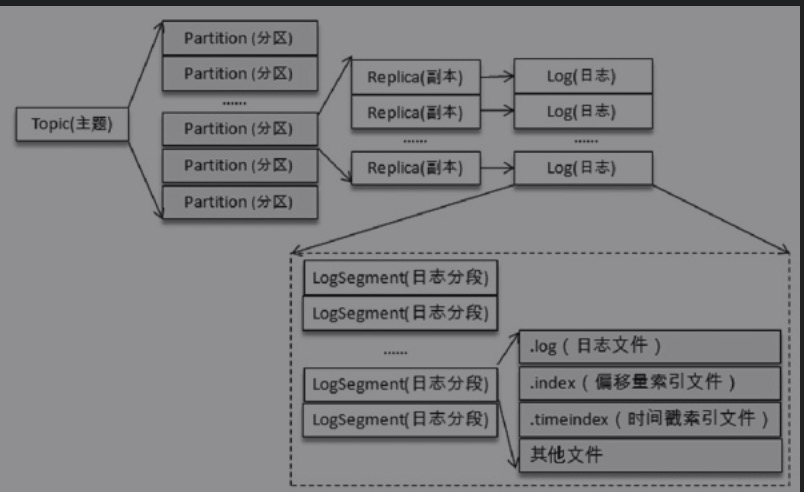
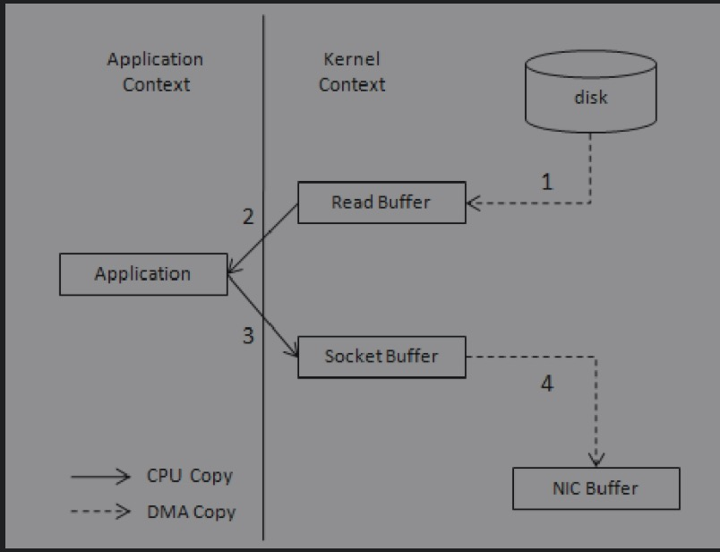
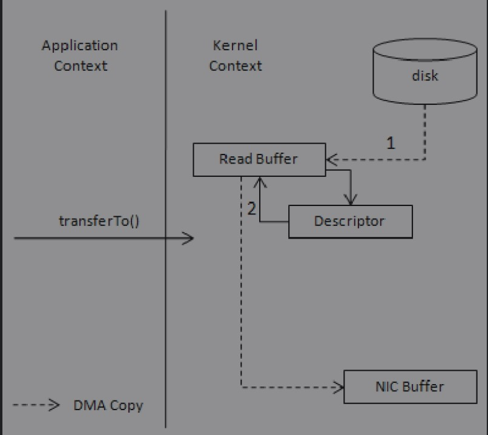
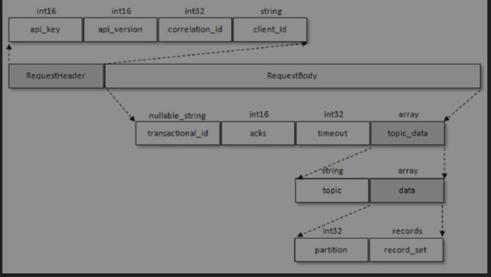

# 生产者原理分析

## 整体架构


* 整个生产者客户端由两个线程协调运行，这两个线程分别为主线程和Sender线程（发送线程）。在主线程中由KafkaProducer创建消息，然后通过可能的拦截器、序列化器和分区器的作用之后缓存到消息累加器（RecordAccumulator，也称为消息收集器）中。Sender 线程负责从RecordAccumulator中获取消息并将其发送到Kafka中。
* RecordAccumulator 主要`用来缓存消息以便 Sender 线程可以批量发送`，进而减少网络传输的资源消耗以提升性能。RecordAccumulator 缓存的大小可以`通过生产者客户端参数buffer.memory 配置，默认值为 33554432B，即 32MB。`如果生产者发送消息的速度超过发送到服务器的速度，则会导致生产者空间不足，这个时候KafkaProducer的send（）方法调用要么被阻塞，要么抛出异常，这个取决于参数max.block.ms的配置，此参数的默认值为60000，即60秒。
* 在RecordAccumulator的内部还有一个BufferPool，它主要用来`实现ByteBuffer的复用，以实现缓存的高效利用`。不过BufferPool`只针对特定大小的ByteBuffer进行管理，而其他大小的ByteBuffer不会缓存进BufferPool中`，这个特定的大小由`batch.size`参数来指定，默认值为16384B，即16KB。我们可以适当地调大batch.size参数以便多缓存一些消息。如果发送的消息不超过`batch.size`可以按照`batch.size`创建ProducerBatch，并且可以通过BufferPool进行复用，如果超过则没办法进行复用。

## 元数据更新

* 当客户端中没有需要使用的元数据信息时，比如没有指定的主题信息，或者超过metadata.max.age.ms 时间没有更新元数据都会引起元数据的更新操作。客户端参数metadata.max.age.ms的默认值为300000，即5分钟。元数据的更新操作是在客户端内部进行的，对客户端的外部使用者不可见。当需要更新元数据时，会先挑选出leastLoadedNode，然后向这个Node发送MetadataRequest请求来获取具体的元数据信息。这个更新操作是由Sender线程发起的，在创建完MetadataRequest之后同样会存入InFlightRequests，之后的步骤就和发送消息时的类似。元数据虽然由Sender线程负责更新，但是主线程也需要读取这些信息，这里的数据同步通过synchronized和final关键字来保障。

# 生产者参数

## acks

* acks=1。默认值即为1。生产者发送消息之后，只要分区的leader副本成功写入消息，那么它就会收到来自服务端的成功响应。如果消息无法写入leader副本，比如在leader 副本崩溃、重新选举新的leader 副本的过程中，那么生产者就会收到一个错误的响应，为了避免消息丢失，生产者可以选择重发消息。如果消息写入leader副本并返回成功响应给生产者，且在被其他follower副本拉取之前leader副本崩溃，那么此时消息还是会丢失，因为新选举的leader副本中并没有这条对应的消息。acks设置为1，是消息可靠性和吞吐量之间的折中方案。
*  acks=0。生产者发送消息之后不需要等待任何服务端的响应。如果在消息从发送到写入Kafka的过程中出现某些异常，导致Kafka并没有收到这条消息，那么生产者也无从得知，消息也就丢失了。在其他配置环境相同的情况下，acks 设置为 0 可以达到最大的吞吐量。
*  acks=-1或acks=all。生产者在消息发送之后，需要等待ISR中的所有副本都成功写入消息之后才能够收到来自服务端的成功响应。在其他配置环境相同的情况下，acks 设置为-1（all）可以达到最强的可靠性。但这并不意味着消息就一定可靠，因为ISR中可能只有leader副本，这样就退化成了acks=1的情况。要获得更高的消息可靠性需要配合 `min.insync.replicas `等参数的联动

## max.request.size

* 限制生产者客户端能发送的消息的最大值，默认值为 1048576B，即 1MB。
* 如果broker端的message.max.bytes参数，如果配置错误可能会引起一些不必要的异常。比如将broker端的message.max.bytes参数配置为10，而max.request.size参数配置为20，那么当我们发送一条大小为15B的消息时，生产者客户端就会报出异常。

## retries和retry.backoff.ms

* retries参数用来配置生产者重试的次数，默认值为0，即在发生异常的时候不进行任何重试动作。消息在从生产者发出到成功写入服务器之前可能发生一些临时性的异常，比如网络抖动、leader副本的选举等，这种异常往往是可以自行恢复的，生产者可以通过配置retries大于0的值，以此通过内部重试来恢复而不是一味地将异常抛给生产者的应用程序。如果重试达到设定的次数，那么生产者就会放弃重试并返回异常。不过并不是所有的异常都是可以通过重试来解决的，比如消息太大，超过max.request.size参数配置的值时，这种方式就不可行了。
* 重试还和另一个参数retry.backoff.ms有关，这个参数的默认值为100，它用来设定两次重试之间的时间间隔，避免无效的频繁重试。在配置 retries 和 retry.backoff.ms之前，最好先估算一下可能的异常恢复时间，这样可以设定总的重试时间大于这个异常恢复时间，以此来避免生产者过早地放弃重试。
* 当`max.in.flight.requests.per.connection`配置大于1，出现重试时会出现错序。

## compression.type

* 这个参数用来指定消息的压缩方式，默认值为“none”，即默认情况下，消息不会被压缩。该参数还可以配置为“gzip”“snappy”和“lz4”。对消息进行压缩可以极大地减少网络传输量、降低网络I/O，从而提高整体的性能。消息压缩是一种使用时间换空间的优化方式，如果对时延有一定的要求，则不推荐对消息进行压缩。

## connections.max.idle.ms

* 这个参数用来指定在多久之后关闭限制的连接，默认值是540000（ms），即9分钟。

## linger.ms

* 这个参数用来指定生产者发送 ProducerBatch 之前等待更多消息（ProducerRecord）加入ProducerBatch 的时间，默认值为 0。生产者客户端会在 ProducerBatch 被填满或等待时间超过linger.ms 值时发送出去。增大这个参数的值会增加消息的延迟，但是同时能提升一定的吞吐量。这个linger.ms参数与TCP协议中的Nagle算法有异曲同工之妙。

## receive.buffer.bytes

* 这个参数用来设置Socket接收消息缓冲区（SO_RECBUF）的大小，默认值为32768（B），即32KB。如果设置为-1，则使用操作系统的默认值。如果Producer与Kafka处于不同的机房，则可以适地调大这个参数值。

## send.buffer.bytes

* 这个参数用来设置Socket发送消息缓冲区（SO_SNDBUF）的大小，默认值为131072（B），即128KB。与receive.buffer.bytes参数一样，如果设置为-1，则使用操作系统的默认值。

## request.timeout.ms

* 这个参数用来配置Producer等待请求响应的最长时间，默认值为30000（ms）。请求超时之后可以选择进行重试。注意这个参数需要比broker端参数replica.lag.time.max.ms的值要大，这样可以减少因客户端重试而引起的消息重复的概率。

# 消费者和消费组

* 消费者（Consumer）负责订阅Kafka中的主题（Topic），并且从订阅的主题上拉取消息。与其他一些消息中间件不同的是：在Kafka的消费理念中还有一层消费组（Consumer Group）的概念，每个消费者都有一个对应的消费组。当消息发布到主题后，只会被投递给订阅它的每个消费组中的一个消费者。

## 分区分配策略

* 通过`partition.assignment.strategy`设置，默认为Robin，支持radom和Robin俩种方式。

## 消息投递方式

* 两种消息投递模式：点对点（P2P，Point-to-Point）模式和发布/订阅（Pub/Sub）模式。点对点模式是基于队列的，消息生产者发送消息到队列，消息消费者从队列中接收消息。发布订阅模式定义了如何向一个内容节点发布和订阅消息，这个内容节点称为主题（Topic），主题可以认为是消息传递的中介，消息发布者将消息发布到某个主题，而消息订阅者从主题中订阅消息。主题使得消息的订阅者和发布者互相保持独立，不需要进行接触即可保证消息的传递，发布/订阅模式在消息的一对多广播时采用，Kafka 同时支持两种消息投递模式。
* 如果所有的消费者都隶属于同一个消费组，那么所有的消息都会被均衡地投递给每一个消费者，即每条消息只会被一个消费者处理，这就相当于点对点模式的应用。
*  如果所有的消费者都隶属于不同的消费组，那么所有的消息都会被广播给所有的消费者，即每条消息会被所有的消费者处理，这就相当于发布/订阅模式的应用。

# 主题和分区

## 分区Leader选举

### 自动选举

* `auto.leader.rebalance.enable`默认为true，但是生产环境中不建议开启自动leader选举，这样可能会阻塞正常的使用。

### 手动选举

* 使用`kafka-perferred-replica-election.sh`脚本进行手动副本选举，这里会将Kafka的具体的元数据存储在Zookeeper的`/admin/preferred_replica_election`节点上，如果数据大小超过Zk的限制则会选举失败，默认为`1MB`。
* 可以创建一个json文件指定需要选举的分区清单，通过`--path-to-json-file`参数制定

```json
{
  "partitiuons":[
    {
      "partition":0,
      "topic": "test"
    }, 
    {
      "partition":1,
      "topic": "test"
    }
  ]
}
```

## 分区重分配

### kafka-reassign-partitions.sh

* 创建需要进行分区重新分配的topic

```json
{
		"topics":[
      {
        "topic":"test"
      }
    ],
  "version": 1
}
```

* kafka-reassign-partitions.sh --zookeeper localhost:2181/kafka --generate --topics-to-move-json-file test.json --broker-list 0,2

# 日志存储

## 文件目录布局

* 每条消息在发送的时候会根据分区规则被追加到指定的分区中，分区中的每条消息都会被分配一个唯一的序列号（offset）。分区规则设置合理可以保证所有消息均匀的分布到不同的分区中，这样可以实现水平扩展。
* 不考虑多副本情况，一个分区对应一个日志(Log)，为了防止Log过大，Kafka引入了日志分段(LogSegment)的概念,将Log切分为多个LogSegment。
* Log在物理上只以文件夹的形式存储，每个LogSegment对应磁盘上一个日志文件和两个索引文件，以及其他文件(.txnindex事务索引文件)。




## 日志清理

### 日志清理策略

* 日志删除(Log Retention):按照一定的保留策略直接删除不符合条件的日志分段。
* 日志压缩(Log compaction):针对每个消息的key进行整合，对于有相同key的不同value值，只保留最后一个版本。

### 相关配置

* `log.cleanup.policy`设置日志清理策略，默认值为"delete"，即采用日志删除的清理策略。如果要采用日志压缩的清理策略，就需要将log.cleanup.policy设置为“compact”，并且还需要将 `log.cleaner.enable`（默认值为true）设定为true。

### 日志删除

* 通过`log.retention.check.interval.ms`配置检测和删除不符合保留条件的日志分段文件，默认为5分钟。

#### 基于时间

* 日志删除任务会检查当前日志文件中是否有保留时间超过设定的阈值（retentionMs）来寻找可删除的日志分段文件集合（deletableSegments）。retentionMs可以通过broker端参数`log.retention.hours`、`log.retention.minutes`和`log.retention.ms`来配置，其中` log.retention.ms` 的优先级最高，`log.retention.minutes` 次之，`log.retention.hours`最低。默认情况下只配置了`log.retention.hours`参数，其值为168，故默认情况下日志分段文件的保留时间为7天。

#### 基于日志大小

* 日志删除任务会检查当前日志的大小是否超过设定的阈值（retentionSize）来寻找可删除的日志分段的文件集合（deletableSegments）。retentionSize可以通过broker端参数`log.retention.bytes`来配置，默认值为-1，表示无穷大。注意`log.retention.bytes`配置的是Log中所有日志文件的总大小，而不是单个日志分段（确切地说应该为.log日志文件）的大小。单个日志分段的大小由 broker 端参数 `log.segment.bytes` 来限制，默认值为1073741824，即1GB。

## Log Compaction（日志合并）

* Log Compaction对于相同key的不同value值只保留最后一个版本，如果只关心key的最新值可以开启kafka的日志清理功能。
* 类似于Redis的RDB持久化模式，只存储最新的一条记录进行存储，每个log.dir配置的目录下都存在一个`cleaner-offset-checkpoint`文件，这个文件就是清理检查点文件，记录每个topic的每个分区已清理的offset。通过清理检查点文件将log分成两个部分。


* 通过检查点cleaner checkpoint来划分出一个已经清理过的clean部分和一个还未清理过的 dirty 部分。在日志清理的同时，客户端也可以读取日志中的消息。dirty部分的消息偏移量是逐一递增的，而 clean 部分的消息偏移量是断续的，如果客户端总能赶上dirty部分，那么它就能读取日志的所有消息，反之就不可能读到全部的消息。
* activeSegment不会参与Log Compaction，防止因为ActiveSegment是热点文件从而影响正常的消息写入吞吐。
* 注意Log Compaction是针对key的，所以在使用时应注意每个消息的key值不为null。每个broker会启动log.cleaner.thread（默认值为1）个日志清理线程负责执行清理任务，这些线程会选择“污浊率”最高的日志文件进行清理。用cleanBytes表示clean部分的日志占用大小，dirtyBytes表示dirty部分的日志占用大小，那么这个日志的污浊率（dirtyRatio）为：`dirtyBytes/(cleanBytes+dirtyBytes)`。

# 磁盘存储

## 页缓存

* 页缓存是操作系统实现的一种主要的磁盘缓存，以此用来减少对磁盘 I/O 的操作。具体来说，就是把磁盘中的数据缓存到内存中，把对磁盘的访问变为对内存的访问。
* 当一个进程准备读取磁盘上的文件内容时，操作系统会先查看待读取的数据所在的页（page）是否在页缓存（pagecache）中，如果存在（命中）则直接返回数据，从而避免了对物理磁盘的 I/O 操作；如果没有命中，则操作系统会向磁盘发起读取请求并将读取的数据页存入页缓存，之后再将数据返回给进程。同样，如果一个进程需要将数据写入磁盘，那么操作系统也会检测数据对应的页是否在页缓存中，如果不存在，则会先在页缓存中添加相应的页，最后将数据写入对应的页。被修改过后的页也就变成了脏页，操作系统会在合适的时间把脏页中的数据写入磁盘，以保持数据的一致性。

### 脏页清理相关参数

* Linux操作系统中的vm.dirty_background_ratio参数用来指定当脏页数量达到系统内存的百分之多少之后就会触发 pdflush/flush/kdmflush 等后台回写进程的运行来处理脏页，一般设置为小于10的值即可，但不建议设置为0。与这个参数对应的还有一个vm.dirty_ratio参数，它用来指定当脏页数量达到系统内存的百分之多少之后就不得不开始对脏页进行处理，在此过程中，新的 I/O 请求会被阻挡直至所有脏页被冲刷到磁盘中。对脏页有兴趣的读者还可以自行查阅vm.dirty_expire_centisecs、vm.dirty_writeback.centisecs等参数的使用说明。

### 页缓存和进程缓存的区别

* 进程缓存会导致JVM的GC问题，并且在Kafka重启时进程缓存需要重新构建，页缓存会一直存在在操作系统级别，无需重新构建。

### Kafka的刷盘

* `log.flush.interval.messages`、`log.flush.interval.ms`等参数控制kafka的强制刷盘(fsync)和同步刷盘。

* `同步刷盘`可以提高消息的可靠性，防止由于机器掉电等异常造成处于页缓存而没有及时写入磁盘的消息丢失。但是会严重影响Kafka性能，将刷盘交给了操作系统去调度。

## 磁盘I/O流程

* 用户调用标准C库进行I/O操作，数据流为：应用程序buffer→C库标准IObuffer→文件系统页缓存→通过具体文件系统到磁盘。
* 用户调用文件 I/O，数据流为：应用程序 buffer→文件系统页缓存→通过具体文件系统到磁盘。
* 用户打开文件时使用O_DIRECT，绕过页缓存直接读写磁盘。
* 用户使用类似dd工具，并使用direct参数，绕过系统cache与文件系统直接写磁盘。

### 写操作

* 写操作：用户调用fwrite把数据写入C库标准IObuffer后就返回，即写操作通常是异步操作；数据写入C库标准IObuffer后，不会立即刷新到磁盘，会将多次小数据量相邻写操作先缓存起来合并，最终调用write函数一次性写入（或者将大块数据分解多次write 调用）页缓存；数据到达页缓存后也不会立即刷新到磁盘，内核有 pdflush 线程在不停地检测脏页，判断是否要写回到磁盘，如果是则发起磁盘I/O请求。

### 读操作

* 读操作：用户调用fread到C库标准IObuffer中读取数据，如果成功则返回，否则继续；到页缓存中读取数据，如果成功则返回，否则继续；发起 I/O 请求，读取数据后缓存buffer和C库标准IObuffer并返回。可以看出，读操作是同步请求。

### IO请求处理

* I/O请求处理：通用块层根据I/O请求构造一个或多个bio结构并提交给调度层；调度器将 bio 结构进行排序和合并组织成队列且确保读写操作尽可能理想：将一个或多个进程的读操作合并到一起读，将一个或多个进程的写操作合并到一起写，尽可能变随机为顺序（因为随机读写比顺序读写要慢），读必须优先满足，而写也不能等太久。


### I/O调度策略

* 目前Linux系统中的I/O调度策略有4种，分别为NOOP、CFQ、DEADLINE和ANTICIPATORY，默认为CFQ。

#### NOOP

* NOOP算法的全写为No Operation。该算法实现了最简单的FIFO队列，所有I/O请求大致按照先来后到的顺序进行操作。之所以说“大致”，原因是NOOP在FIFO的基础上还做了相邻I/O请求的合并，并不是完全按照先进先出的规则满足I/O请求。

#### CFQ

* CFQ算法的全写为Completely Fair Queuing。该算法的特点是按照I/O请求的地址进行排序，而不是按照先来后到的顺序进行响应。
* CFQ是默认的磁盘调度算法，对于通用服务器来说是最好的选择。它试图均匀地分布对/IO带宽的访问。CFQ为每个进程单独创建一个队列来管理该进程所产生的请求，也就是说，每个进程一个队列，各队列之间的调度使用时间片进行调度，以此来保证每个进程都能被很好地分配到I/O带宽。I/O调度器每次执行一个进程的4次请求。在传统的SAS盘上，磁盘寻道花去了绝大多数的I/O响应时间。CFQ的出发点是对I/O地址进行排序，以尽量少的磁盘旋转次数来满足尽可能多的I/O请求。在CFQ算法下，SAS盘的吞吐量大大提高了。相比于NOOP的缺点是，先来的I/O请求并不一定能被满足，可能会出现“饿死”的情况。

#### DEADLINE

* DEADLINE在CFQ的基础上，解决了I/O请求“饿死”的极端情况。除了CFQ本身具有的I/O排序队列，DEADLINE额外分别为读I/O和写I/O提供了FIFO队列。读FIFO队列的最大等待时间为500ms，写FIFO队列的最大等待时间为5s。FIFO队列内的I/O请求优先级要比CFQ队列中的高，而读FIFO队列的优先级又比写FIFO队列的优先级高。

#### ANTICIPATORY

* CFQ和DEADLINE考虑的焦点在于满足零散I/O请求上。对于连续的I/O请求，比如顺序读，并没有做优化。为了满足随机I/O和顺序I/O混合的场景，Linux还支持ANTICIPATORY调度算法。ANTICIPATORY在DEADLINE的基础上，为每个读I/O都设置了6ms的等待时间窗口。如果在6ms内OS收到了相邻位置的读I/O请求，就可以立即满足。ANTICIPATORY算法通过增加等待时间来获得更高的性能，假设一个块设备只有一个物理查找磁头（例如一个单独的SATA硬盘），将多个随机的小写入流合并成一个大写入流（相当于将随机读写变顺序读写），通过这个原理来使用读取/写入的延时换取最大的读取/写入吞吐量。适用于大多数环境，特别是读取/写入较多的环境。

## 零拷贝

* 除了消息顺序追加、页缓存等技术，Kafka还使用零拷贝（Zero-Copy）技术来进一步提升性能。所谓的零拷贝是指将数据直接从磁盘文件复制到网卡设备中，而不需要经由应用程序之手。零拷贝大大提高了应用程序的性能，减少了内核和用户模式之间的上下文切换。对 Linux操作系统而言，零拷贝技术依赖于底层的 `sendfile（）`方法实现。对应于 Java 语言，`FileChannal.transferTo（）方法的底层实现就是sendfile（）方法`。

### 正常读取数据流出

* 调用read（）时，文件A中的内容被复制到了内核模式下的Read Buffer中。
* CPU控制将内核模式数据复制到用户模式下。
* 调用write（）时，将用户模式下的内容复制到内核模式下的Socket Buffer中。
* 将内核模式下的Socket Buffer的数据复制到网卡设备中传送。



### 零拷贝流出



* 零拷贝技术通过DMA（Direct Memory Access）技术将文件内容复制到内核模式下的Read Buffer中。不过没有数据被复制到 Socket Buffer，相反只有包含数据的位置和长度的信息的文件描述符被加到Socket Buffer中。DMA引擎直接将数据从内核模式中传递到网卡设备（协议引擎）。这里数据只经历了2次复制就从磁盘中传送出去了，并且上下文切换也变成了2次。零拷贝是针对内核模式而言的，数据在内核模式下实现了零拷贝。

# 服务端原理剖析

## 协议设计

* Kafka自定义了一组基于TCP的二进制协议，只要遵守这组协议的格式，就可以向Kafka发送消息，也可以从Kafka中拉取消息，或者做一些其他的事情，比如提交消费位移等。

### 协议请求头


* 请求头包含4个域(Field):api_key、api_version、correlation_id和client_id。


### 协议响应头

* 协议响应头中只有一个correlation_id。

### ProduceRequet结构



#### RequestBody格式

* transactional_id:事务id，从Kafka0.11开始支持事务消息，不使用事务消息该值为null。
* acks:和生产者的acks类似
* timeout:请求超时时间，对应客户端参数为`request.timeout.ms`，默认为30000，即30秒。
* topic_data:array结构，包含topic和data(array),data包含partition(int32)和record_set(records)

### ProduceResponse结构


#### ResponseBody

* responses:array格式，包含topic和partition_responses
* throttle_time_ms:int32,如果超过了配额(quota)限制则需要延迟该请求的处理时间，如果没有配置配额，那么该字段的值为0.
* partition_responses:包含partition、error_code、base_offset(消息集的起始偏移量)、log_append_time(消息写入broker的时间)、log_start_offset(所在分区的起始偏移量)

## 时间轮

* Kafka没有使用JDK自带的Timer和DelayQueue因为其插入和删除操作的平均时间复杂度为O(nlogn)不满足Kafka的高性能要求。
* Kafka中的时间轮（TimingWheel）是一个存储定时任务的环形队列，底层采用数组实现，数组中的每个元素可以存放一个定时任务列表（TimerTaskList）。TimerTaskList是一个环形的双向链表，链表中的每一项表示的都是定时任务项（TimerTaskEntry），其中封装了真正的定时任务（TimerTask）。


### 延时操作

* 如果在使用生产者客户端发送消息的时候将 acks 参数设置为-1，那么就意味着需要等待ISR集合中的所有副本都确认收到消息之后才能正确地收到响应的结果，或者捕获超时异常，这里就涉及到Kafka的延时操作。

## 控制器

* 在 Kafka 集群中会有一个或多个 broker，其中有一个 broker 会被选举为控制器（KafkaController），它负责管理整个集群中所有分区和副本的状态。当某个分区的leader副本出现故障时，由控制器负责为该分区选举新的leader副本。当检测到某个分区的ISR集合发生变化时，由控制器负责通知所有broker更新其元数据信息。当使用kafka-topics.sh脚本为某个topic增加分区数量时，同样还是由控制器负责分区的重新分配。

### 控制器的选举及异常恢复

* Kafka的Controller选举依赖于Zookeeper，成功竞选为Controller的broker会在Zookeeper中创建/controller这个临时节点，类容包含version、brokerid、timestamp。
* 在任意时刻，集群中有且仅有一个控制器。每个 broker 启动的时候会去尝试读取/controller节点的brokerid的值，如果读取到brokerid的值不为-1，则表示已经有其他 broker 节点成功竞选为控制器，所以当前 broker 就会放弃竞选；如果 ZooKeeper 中不存在/controller节点，或者这个节点中的数据异常，那么就会尝试去创建/controller节点。当前broker去创建节点的时候，也有可能其他broker同时去尝试创建这个节点，只有创建成功的那个broker才会成为控制器，而创建失败的broker竞选失败。每个broker都会在内存中保存当前控制器的brokerid值，这个值可以标识为activeControllerId。
* ZooKeeper 中还有一个与控制器有关的/controller_epoch 节点，这个节点是持久（PERSISTENT）节点，节点中存放的是一个整型的controller_epoch值。controller_epoch用于记录控制器发生变更的次数，即记录当前的控制器是第几代控制器，我们也可以称之为“控制器的纪元”。
* controller_epoch的初始值为1，即集群中第一个控制器的纪元为1，当控制器发生变更时，每选出一个新的控制器就将该字段值加1。每个和控制器交互的请求都会携带controller_epoch这个字段，如果请求的controller_epoch值小于内存中的controller_epoch值，则认为这个请求是向已经过期的控制器所发送的请求，那么这个请求会被认定为无效的请求。如果请求的controller_epoch值大于内存中的controller_epoch值，那么说明已经有新的控制器当选了。由此可见，Kafka 通过 controller_epoch来保证控制器的唯一性，进而保证相关操作的一致性。

### controller的作用

* 监听分区相关的变化。为ZooKeeper中的/admin/reassign_partitions 节点注册PartitionReassignmentHandler，用来处理分区重分配的动作。为 ZooKeeper 中的/isr_change_notification节点注册IsrChangeNotificetionHandler，用来处理ISR集合变更的动作。为ZooKeeper中的/admin/preferred-replica-election节点添加PreferredReplicaElectionHandler，用来处理优先副本的选举动作。
* 监听主题相关的变化。为 ZooKeeper 中的/brokers/topics 节点添加TopicChangeHandler，用来处理主题增减的变化；为 ZooKeeper 中的/admin/delete_topics节点添加TopicDeletionHandler，用来处理删除主题的动作。
* 监听broker相关的变化。为ZooKeeper中的/brokers/ids节点添加BrokerChangeHandler，用来处理broker增减的变化。
* 从ZooKeeper中读取获取当前所有与主题、分区及broker有关的信息并进行相应的管理。对所有主题对应的 ZooKeeper 中的/brokers/topics/＜topic＞节点添加PartitionModificationsHandler，用来监听主题中的分区分配变化。
*  启动并管理分区状态机和副本状态机。
*  更新集群的元数据信息。
* 如果参数 auto.leader.rebalance.enable 设置为 true，则还会开启一个名为“auto-leader-rebalance-task”的定时任务来负责维护分区的优先副本的均衡。


### 分区leader的选举

* 分区leader副本的选举由控制器负责具体实施。当创建分区（创建主题或增加分区都有创建分区的动作）或分区上线（比如分区中原先的leader副本下线，此时分区需要选举一个新的leader 上线来对外提供服务）的时候都需要执行 leader 的选举动作，对应的选举策略为OfflinePartitionLeaderElectionStrategy。这种策略的基本思路是按照 AR 集合中副本的顺序查找第一个存活的副本，并且这个副本在ISR集合中。一个分区的AR集合在分配的时候就被指定，并且只要不发生重分配的情况，集合内部副本的顺序是保持不变的，而分区的ISR集合中副本的顺序可能会改变。
* 如果ISR集合中没有可用的副本，那么此时还要再检查一下所配置的`unclean.leader.election.enable`参数（默认值为false）。如果这个参数配置为true，那么表示允许从非ISR列表中的选举leader，从AR列表中找到第一个存活的副本即为leader。
* 当分区进行重分配（可以先回顾一下4.3.2节的内容）的时候也需要执行leader的选举动作，对应的选举策略为 ReassignPartitionLeaderElectionStrategy。这个选举策略的思路比较简单：从重分配的AR列表中找到第一个存活的副本，且这个副本在目前的ISR列表中。当发生优先副本（可以先回顾一下4.3.1节的内容）的选举时，直接将优先副本设置为leader即可，AR集合中的第一个副本即为优先副本（PreferredReplicaPartitionLeaderElectionStrategy）。还有一种情况会发生 leader 的选举，当某节点被优雅地关闭（也就是执行ControlledShutdown）时，位于这个节点上的leader副本都会下线，所以与此对应的分区需要执行leader的选举。与此对应的选举策略（ControlledShutdownPartitionLeaderElectionStrategy）为：从AR列表中找到第一个存活的副本，且这个副本在目前的ISR列表中，与此同时还要确保这个副本不处于正在被关闭的节点上。

# 客户端原理分析

## 分区分配策略

* Kafka提供了消费者客户端参数partition.assignment.strategy来设置消费者与订阅主题之间的分区分配策略。默认情况下，此参数的值为 org.apache.kafka.clients.consumer.RangeAssignor，即采用RangeAssignor分配策略。除此之外，Kafka还提供了另外两种分配策略：RoundRobinAssignor 和 StickyAssignor。

### RanageAssignor分配策略

* RangeAssignor 分配策略的原理是按照消费者总数和分区总数进行整除运算来获得一个跨度，然后将分区按照跨度进行平均分配，以保证分区尽可能均匀地分配给所有的消费者。对于每一个主题，RangeAssignor策略会将消费组内所有订阅这个主题的消费者按照名称的字典序排序，然后为每个消费者划分固定的分区范围，如果不够平均分配，那么字典序靠前的消费者会被多分配一个分区。
* 假设n=分区数/消费者数量，m=分区数%消费者数量，那么前m个消费者每个分配n+1个分区，后面的（消费者数量-m）个消费者每个分配n个分区。

### RoundRobinAssignor分配策略

* RoundRobinAssignor分配策略的原理是将消费组内所有消费者及消费者订阅的所有主题的分区按照字典序排序，然后通过轮询方式逐个将分区依次分配给每个消费者。RoundRobinAssignor分配策略对应的 `partition.assignment.strategy` 参数值为`org.apache.kafka.clients.consumer.RoundRobinAssignor`。

### StickyAssignor分配策略

* 分区的分配要尽可能均匀。
* 分区的分配尽可能与上次分配保持相同。
* 当俩个条件发生冲突时，一个条件优先于第二个条件。