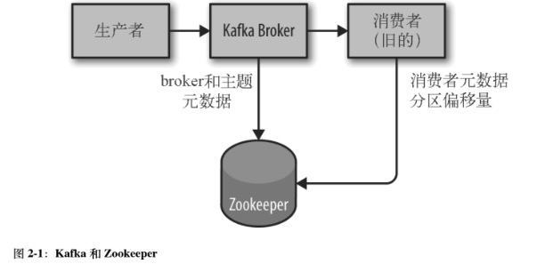
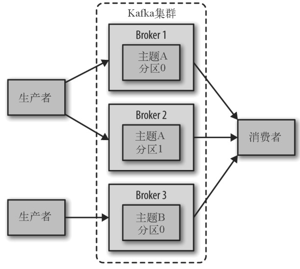

# 前置环境 

## 安装Java 


* 下载安装Java8+版本 
```properties
# 校验java是否安装成功 
java version 
```
## 安装Zookeeper 

```properties
kafka使用Zookeeper保存集群的元数据信息和消费者信息，Kafka发行版中自带了Zookeeper，可以通过脚本启动，不过推荐安装一个额外的Zookeeper 
```


### 搭建Zookeeper集群 


* 创建对应zk的数据目录，并且在上面创建myid文件 
```properties
tickTime=2000 
dataDir=/Users/babywang/Documents/reserch/middleware/zk/zkCluster/zookeeper_data1 
clientPort=2182 
initLimit=20 
syncLimit=5 
server.1=localhost:2182:3888 
server.2=localhost:2183:3889 
server.3=localhost:2184:3890 
initLimit表示用于在从节点与主节点之间建立初始化连接的时间上限 
syncLimit表示运行从节点与主节点处于不同步状态的时间上限 
这两个值都是tickTime的倍数，所以initLimit是20*2000ms，也就是40s 
服务器地址遵循sever.X=hostname:peerPort:leaderPort格式 
X:服务器的ID，他必须是一个整数，不过不一定要从0开始 
hostname:服务器的机器名或IP地址 
peerPort:用于节点间通信的TCP端口 
leaderPort:用于首领选举的TCP端口 
需要根据X在各个zookeeper下创建myid文件，内容为各自的X 
```
# 安装Kafka Broker 

## 配置详解 

### 常用配置 


* broker.id 
```
每个broker都需要一个标识符，使用broker.id来表示，它的默认值为0.也可以被设置成其他任意整数。这个值在整个Kafka集群里必须是唯一的。这个值可以任意选定，如果出于维护的需要，可以在整个服务器节点间交换使用这些ID。建议把其设置成与机器名具有相关性的整数，这样在进行维护时，将ID号映射到机器名就便捷很多。 
```
* port 
```properties
如果使用配置样本来启动Kafka，它会监听9092端口。修改port配置参数可以把它设置成其他任意可用的端口。注意:使用1024以下的端口，需要使用root权限启动Kafka。 
```
* zookeeper.connect 
```properties
用于保存broker元数据的Zookeeper地址是通过zookeeper.connect来指定的。localhost:2181表示这个Zookeeper是运行在本地2181端口上。该配置参数使用冒号分隔的一组hostname:port/path列表，每一部分的含义如下: 
* hostname是Zookeeper服务器的机器名或IP地址 
* port是Zookeeper的客户端连接端口 
* /path是可选的Zookeeper路径，作为Kafka集群的chroot环境。如果不指定，默认使用根路径 
```

* log.dirs 
```
Kafka把所有消息都保存到磁盘上，存储这些日志片的目录是通过log.dirs指定的。它用一组用逗号分隔的本地文件系统路径，如果制定了多个路径，namebroker会根据"最少使用"原则，把同一个分区的日志片段保存到同一个路径下。要注意,broker会往拥有最少数目分区的路径新增分区，而不是往拥有最少磁盘空间的路径新增分区。 
```

* num.recovery.threads.per.data.dir 
```
对于如下三种情况，Kafka会使用可配置的线程池来处理日志片段 
  * 服务器正常启动，用于打开每个分区的日志 
  * 服务器崩溃后重启，用于检查和截短每个分区的日志片段  
  * 服务器正常关闭，用于关闭日志片段 
默认情况下，每个日志目录只是用一个线程。
因为这些线程只会在服务器启动和关闭时会用到，所以完全可以设置大量的线程来达到并行操作的目的。特别对于包含大量分区的服务器来说，一旦发生崩溃，在进行恢复时使用并行操作可能会省下数小时的时间。 

注意：配置的数字对应的是log.dirs指定的单个日志目录，也就是说，如果num.recovery.threads.per.data.dir被设置为8，并且log.dir指定了3个路径，那么总共需要24个线程。
```

* auto.create.topics.enable 
```
默认情况下，Kafka会在如下几种情况自动创建topic: 
  1.当一个生产者开始往topic写入消息时 
  2.当一个消费者开始从topic读取消息时 
  3.当任意一个客户端向topic发送元数据请求时 
```
### topic的默认配置 


* num.partitions 
```plain
num.partitions参数指定了新创建的topic将包含多少分区。如果启用了topic自动创建功能，topic分区的个数就是该参数指定的值。该参数默认值是1，可以增加topic分区的个数，但不能减少分区的个数。如果让一个topic的分区数少于num.partitions指定的值，需要手动创建该topic。 
```
**如何选择分区数量?** 


* log.retenton.ms 
```plain
Kafka通常根据时间来决定数据可以保留多久。默认使用log.retenton.hours参数来配置时间，默认为168小时，也就是一周时间。也提供log.retention.minutes和log.retention.ms，这三个参数效果相同，都决定消息持久化到磁盘后保存多久以后会被删除，推荐使用log.retention.ms。如果制定了不止一个参数，kafka会优先使用最小的那个参数。 

# 实现方法 
根据实现保留数据是通过检查磁盘上日志片段文件的最后修改时间来实现的。一般来说，最后修改时间指的是日志片段的关闭时间，也就是文件的最后一个消息的时间戳。不过如果使用管理工具在服务期间移动分区，最后的修改时间就不准确了。时间误差可能导致这些分区过多地保留数据。 
```

* log.retention.bytes 
```plain
通过保留的消息字节数来判断消息是否过期，它的值通过参数log.retention.bytes来指定，作用在每一个分区上。也就是说，如果有一个包含8个分区的topic，并且log.retention.bytes被设置为1GB，那么这个topic最多可以保留8GB的数据。 
# 同时指定log.retention.bytes和log.retention.ms 
只要任一条件满足，消息就会被删除。 
```

* log.segment.bytes 
```
作用于日志片段，当消息到达broker时，被追加到分区的当前日志片段上。当日志片段大小达到log.segment.bytes指定的上限(默认是1GB)时，当前日志片段就会被关闭，一个新的日志片段被打开。如果一个日志片段被关闭，就开始等待过期，这个参数值越小就会越频繁的关闭和分配新文件，从而降低磁盘写入的整体效率。 
日志片段不被关闭前，消息就不会过期，如果关闭片段需要7天，而过期时间为5天，那么需要12天才能使得日志片段过期。 
```
**使用时间戳获取偏移量** 


* message.max.bytes 
```plain
broker通过设置message.max.bytes参数来限制单个消息大小，默认值是1000000，1MB。如果生产者尝试发送的消息超过这个大小，不仅消息不会被接受，还会受到broker返回的错误信息。跟其他与字节相关的配置参数意义，该参数指定是压缩后的消息大小。

这个配置越大，负责处理网络连接和请求的线程就需要花费越多的时间处理这些请求，还会增加磁盘写入块的大小，从而影响IO吞吐量。 
```
**服务端和客户端之间协调消息大小的配置** 


# 硬件的选择 


* 磁盘吞吐量和容量、内存、网络和CPU影响Kafka的性能 
## 磁盘吞吐量 

```plain
生产者客户端的性能直接受到服务端磁盘吞吐量的影响。生产者生成的消息必须被提交到服务器保存。大多数客户端在发送消息后一直等待，直到至少有一个服务器确认消息已经提交位置。也就是说，磁盘写入速度越快，生产消息的延迟就越低。 
```
## 磁盘的容量 


* 容量的考虑要基于每天接受消息的大小以及消息需要保存的天数，需要考虑上述过期日志片段的参数，还需要考虑其他文件和缓冲区，应对消息流量的增长和波动。
* 扩展Kafka集群时，也需要考虑容量，让Topic拥有多个分区，集群的流量被均衡到整个集群上，如果单个broker无法支持全部容量，可以让其他broker提供可用的容量。存储容量也会受到集群复制策略的影响。 
## 内存 


* `内存影响消费者`，消费者一般`从分区尾部读取消息，如果生产者中存在，就紧跟在生产者后面，在这种情况下，消费者读取的消息会直接存放在系统的页面缓存里 ，这比从磁盘重新读取要快得多。 `
* Kafka的`JVM不需要太多内存`， `剩余的系统内存可以用作页面缓存PageCache，或者用来缓存正在使用的日志片段 `。 
## 网络 


* 网络吞吐量`决定了Kafka能够处理的最大数据流量 。`它和磁盘存储是制约Kafka扩展规模的主要因素。 Kafka支持多个消费者，那么就可能造成写入和读取的网络流量不平衡 ，从而让情况变复杂。 
* 集群复制和镜像也会占用网络流量 ，如果网络接口出现饱和，那么集群的复制出现延时在所难免。 
## CPU 


* Kafka对集群处理能力要求比较低， 客户端为了优化网络会对消息进行压缩，服务器需要对消息进行批量解压，设置偏移量，然后重新进行批量压缩，再保存到磁盘，。这让Kafka对计算处理能力有所要求的地方 。 
# Kafka集群 


* 单个Kafka服务器足以满足本地开发或POC要求，不过集群也有它的强大之处。使用集群最大的好处是可以跨服务器进行负载均衡，也可以使用复制功能来避免因单点故障造成的数据丢失 。 
* 在维护Kafka或底层系统时， 使用集群可以确保为客户端提供高可用性 。 



## 需要多少个broker 


* 需要多少磁盘空间来保留数据，单个broker有多少空间可用 
```plain
如果集群需要保留10TB数据，每个broker可以存储2TB，那么至少需要5个broker。如果启用数据复制，那么至少还需要一倍的空间，这也取决于复制的系数。 
```

* 集群处理请求的能力 
```plain
通常与网络接口处理客户端流量的能力有关，特别是当多个消费者存在数据保留期间流量发生抖动时。如果单个broker的网络接口在高峰时段可以达到80%的使用量，并且有两个消费者，消费就无法保持峰值，除非有两个broker。如果集群启用了复制功能，则要把这个额外的消费者考虑在内。因磁盘吞吐量低和系统内存不足造成的性能问题，可以扩展多个broker来解决。 
```
## broker配置 


* 将broker加入集群需要修改俩个配置参数 
    * 相同的zookeeper.connect，该参数指定了用于保存元数据的Zookeeper群组和路径 
    * broker.id参数设置唯一的值。 
## 操作系统调优 


* 虚拟内存 
```plain
# 修改/etc/sysctl.conf文件 vm.swappiness参数为1 
Linux的虚拟内存会根据系统的工作负荷进行自动调整，可以对交换分区的处理方式和内存脏页进行调整，从而让Kafka更好地处理工作负载。 
对于依赖吞吐量的应用程序，需要尽量避免内存交换。内存页和磁盘之间交换对Kafka各方面的性能都有重大影响。Kafka大量地使用系统页面缓存，如果虚拟内存被交换到磁盘，说明已经没有多余内存可以分配给页面缓存了。 
1.不设置交换分区，内存交换不是必需的，不过它确实能够在系统发生灾难性错误时提供一些帮助。进行内存交换可以防止操作系统由于内存不足而突然终止进程。建议把vm.swappiness参数设置小一点,比如1.该参数指明了虚拟机的子系统将如何使用交换分区，而不是只把内存从页面缓存中移除。要优先考虑减小页面缓存，而不是进行内存交换。 
```


**为什么不把vm.swappiness设置为0？** 


* 网络子系统 
```plain
默认情况下，系统内核没有针对快速的大流量网络传输进行优化，所以对于应用程序来说，一般需要对linux系统的网络栈进行调优，以实现大流量的支持。实际上，调整Kafka的网络配置与调整其他大部分web服务器和网络应用程序的网络配置相同。可以对分配socket读写缓存区的内存大小作出调整，可以大大提升网络传输的性能。socket读写缓冲区对应参数分别为net.core.vmen_default和net.core.wmen_max和net.core.rmem_max合理值为2MB。注意最大值并不意味着每个socket一定有这么大缓冲空间，只是在必要情况下才能达到。 
```
* 存储日志片段的磁盘挂载点 
```plain
# 使用XFS文件系统，设置socket缓存区大小 
建议使用XFS文件系统，并且对挂载点的noatime参数进行合理的设置。文件源数据包含3个时间戳:创建时间(ctime)、最后修改时间(mtime)以及最后访问时间(atime)。默认情况下，每次文件被读取都会更新atmie，这会导致大量的磁盘写操作，而且atime属性的用处不大，除非某些应用程序想知道某个文件在最近一次修改后有没有被访问(这种情况可以使用realtime)。Kafka用不到该属性可以禁用它。未挂载点设置noatime参数可以防止更新atime，但是不会影响ctime和mtime 
# 设置tcp socket的读写缓冲区 
net.ipv4.tcp_wmem和net.ipv4.tcp_rmem，这些参数的值由3个整数组成，使用空格分隔，分别表示最小值，默认值和最大值。最大值不能大于net.core.wmem_max和net.core.rmem_max指定大小。 
# net.ipv4.tcp_window_scling设为1，启用TCP时间窗扩展，可以提升客户端传输数据效率，传输的数据可以在服务器段进行缓冲。 
设置net.ipv4.tcp_max_syn_backlog设置比默认值1024更大的值，接受更多的并发连接。把net.core.netdev_max_backlog设置比默认值1000更大的值，有助于应对网络流量的爆发，特别在KM网络下，运行更多的数据包排队等待内核处理。 
```
# 生产环境注意事项 

## Java GC设置 

### G1 GC参数 


* MaxGCPauseMillis 
```plain
该参数指定每次垃圾回收默认的停顿时间。该值不是固定的，G1可以根据需要使用更长的时间。它的默认值为200ms，G1会决定垃圾回收的频率以及每一轮需要回收多少个区域，这样算下来，每一轮垃圾回收大概需要200ms的时间 
```

* InitiatingHeapOccupancyPercent 
```plain
该参数制定了在G1启动新一轮垃圾回收之前可以使用的堆内存百分比，默认值是45.在堆内存的使用率达到45%之间，G1不会启用垃圾回收，这个百分比包括新生代和老年代的内存。 
```
### demo 

```plain
Kafka对堆内存的使用率非常高，容易产生垃圾对象，所以可以把这个值设置小一点，如果一台服务器4GB内存，并且使用5GB堆内存运行Kafka，name可以参考以下配置MaxGCPauseMillis为20ms;InitiatingHeapOccupancyPercent设置为35，可以让垃圾回收比默认早一些启动。 
Kafka默认使用Parallel New和CMS GC，可以通过环境变量来修改。 
export KAFKA_JVM_PERFORMANCE_OPTS="-server -XX:+UseG1GC" 
-XX:MaxGCPauseMillis=20 -XX:InitiatingHeapOccupancyPercent=35 
-XX:+DisableExplicitGC -Djava.awt.headless="true" 
```
## 数据中心布局 


* 设计考虑好数据中心所处的物理位置，在为broker新增分区时， broker并无法获知机架的信息。因此，两个broker有可能是在同一个机架上 ，获知在同一个可用区域里，所以在为分区添加副本的时候，这些副本可能被分配到同一个机架上的broker，它们使用相同的电源和网络连接。如果该机架出现问题，这些分区就会离线，客户端就无法访问它。并且如果发生不完整的主节点选举，那么在恢复时就可能丢失数据。 
## 共享Zookeeper 


* Kafka 使用Zookeeper来保存broker、topic和分区的元数据信息 。对于一个包含多个节点的Zookeeper集群来说，Kafka集群的这些流量并不多，那些写操作只是用来构造消费者组或集群本身。 
* 消费者可以选择将偏移量提交到Zookeeper或者Kafka上，还可以选择提交偏移量的时间间隔。 如果消费者将偏移量提交到Zookeeper，那么在每个提交时间点上，消费者会为每一个消费的分区向Zk写入一次偏移量。合理的提交间隔为1分钟，因为刚好是消费者组的某个消费者发生失效时能够读取到的重复消息的时间。 如果流量过大，可能导致Zk出现问题，建议使用最新版本的Kafka，消费者将偏移量提交到Kafka服务器上。 
