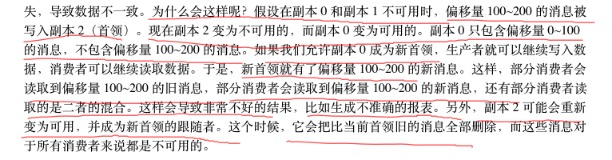
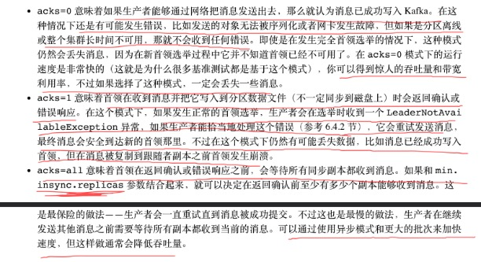

# 可靠性保证 


* Kafka 可以保证分区消息的顺序。如果使用同一个生产者往同一个分区写消息 ，而且消息B在消息A之后写入，那么Kafka可以保证消息B的偏移量大于消息A的偏移量，而且消费者会先读取消息A再读取消息B。 
* 只有当消息被写入分区的所有同步副本时(但不一定要写入磁盘)，它才被任务是"已提交"的。 生产者可以选择接受不同类型的ack，比如在消息被完全提交时的ack，或者在消息被写入leader副本时的ack，或者在消息被发送到网络时的ack 。 
* 只要还有一个副本是活跃的，那么已提交的消息就不会丢失 
* 消费者只能读取已经提交的消息 。 
```arduino
这些基本的保证机制可以用来构建可靠的系统，但仅仅依赖它们是无法保证系统的完全可靠。构建一个可靠的系统需要作出一些权衡，kafka管理员和开发者可以在配置参数上作出权衡，从而得到他们想要达到可靠性。基于CAP相关权衡 
```
# 复制 


* Kafka的复制机制和分区的多副本架构是kafka可靠性保证的核心。把消息写入多个副本可以使Kafka在发生故障是仍能保证消息的持久性 。 
* Kafka 的topic被分为多个分区，分区是基本的数据块。分区存储在单个磁盘上，kafka可以保证分区里的事件是有序的，分区可以在线，也可以离线 。每个分区可以有多个副本，其中一个副本是leader。所有的事件都直接发送给leader副本，或者直接从leader副本读取事件 。 其他副本只需要与leader保持同步，并及时复制最新的事件，当leader不可用时，其中一个同步副本将成为新的leader 。 
* 分区leader是同步副本，而对其他follower副本来说，它需要满足一下条件才被认为是同步的 ，是否剔除ISR队列的前提。 
    * 与Zookeeper之间有一个活跃的会话，也就是，它在过去6s(可配置)内向zookeeper发送过心跳 。 
    * 在过去的10s内(可配置)从leader那里获取过消息 。 
    * 在过去的10s内从leader那里获取过最新的消息。光从leader那里获取消息是不够的，它还必须是几乎0延迟的 。 
## 非同步副本 


* 但如果一个或多个副本在同步和非同步状态之间快速切换，说明集群内部出现里问题，通常是Java不恰当的垃圾回收配置导致的。不恰当的垃圾回收配置会造成几秒的停顿，从而让broker与zookeeper之间断开连接，最终变成不同步的，进而发送状态切换。 
# broker配置 


* broker有3个配置会影响Kafka消息存储的可靠性 。与其他配置参数一样，它们可以应用在broker级别，用于控制所有topic行为，也可以应用在topic级别，用于控制个别topic行为 。 
* 在topic级别控制可靠性，意味着Kafka集群可以同时拥有多个可靠的topic和非可靠的topic 。 
## 复制系数 


* topic级别的配置参数是`replication.factor`，而broker级别的配置参数是通过`defalut.replication.factor`来配置自动创建的topic 。 
```plain
假设topic的复制系数是3，也就是说每个分区总会被3个不同的broker复制3次，这样的假设是合理的，因为Kafka的默认复制系数就是3。 
如果复制系数是N，那么在N-1个broker失效的情况下，仍然能够从topic读取数据或向topic写入数据。所以更高的复制系数能够带来更高的可用性、可靠性和更少的故障。另一方面，N的复制系数需要N个broker，而且会有N个数据副本，也就是说会占用N倍的磁盘空间。 
```

* 副本的分布也很重要，默认情况下，Kafka会确保分区的每个副本分布在不同的broker上 ，不过有时候这样仍然不够安全， 如果这些broker处于同一个机架，一旦机架的交换机发生故障，分区就会不可用这时候把复制系数设置为多少都不管用 。为了避免机架级别的故障， 我们建议把broker分配在多个不同的机架上，并使用`broker.rack`参数来为每个broker的配置所在机架的名字。如果配置来机架的名字，Kafka会保证分区的副本被分布在多个机架，从而获得更高的可用性 。 
## 不完全的首领选举 


* `unclean.leader.election`只能在broker级别(实际上是集群范围内)进行配置，它的默认值是true 。 
* 当分区leader不可用时，一个同步副本会被选为新的leader。 如果在选择过程中有丢失数据，也就是说提交的数据同时存在于所有的同步副本上，那么这个选举就是"完全"的 
* 如果在leader不可用时，其他副本都是不同步的 ，如下： 
    * 分区有3个副本，其中两个follower副本不可用(两个broker发生奔溃)。这个时候，如果生产者继续往leader写入数据，所有消息都会得到ack并被提交(因为此时leader是唯一的同步副本)。现在我们假设leader也不可用了(又一个broker发生崩溃了)，这个适合如果之前的一个follower重新启动，它就成为了分区的唯一不同副本。 
    * 分区有3个副本，因为网络问题导致两个follower副本复制消息滞后，所以尽管它们还在复制消息，但是已经不同步了。leader作为唯一的同步副本继续接受消息，这个时候，如果leader不可用，另外两个副本再也无法变成同步的。 
```plain
# 对于上述情况，需要一个选择 
1.如果不同步的副本不能成为新的leader，那么旧leader没有恢复之前集群不可用。 
2.如果不同步的副本可以称为新的leader，那么在这个副本变为不同步之后写入旧首领的消息会全部丢失，导致数据不一致。 
```



* 如果把`unclean.leader.election`设置为true， 就是允许不同步的副本成为首领(不完全选举),那么我们就将面临丢失消息的风险 。 如果把这个参数设为false，就要等到原先的leader重新上线，从而降低了可用性 。 
## 最少同步副本 


* 在topic和broker级别上，这个参数都叫 `min.insync.replicas` 。 
* 确保已提交的数据被写入不止一个副本，就需要把最少同步副本数量设置大一些。对一个一个包含3个副本的topic，如果`min.insync.replicas`被设为2，那么至少要存在两个同步副本才能向分区写数据。 
* 如果3个副本都是同步的，或者其中一个副本变得不可用，都不会有问题。如果两个副本变得不可用，那么broker就会停止接受生产者的请求。尝试发送数据的生产者会收到NotEnoughReplicasException异常。消费者仍然可以继续读取已有的数据。 
# 可靠的系统里使用生产者 

## 不可靠生产者例子 


* 根据可靠性需求配置恰当的acks的值 
* 在参数配置和代码里正确处理错误 
## 发送acks 


* 生产者可以选择一下3种不同的确认模式 



## 配置生产者的重试参数 


* 生产者需要处理的错误包括两个部分 
    * 生产者可以自动处理的错误 
    * 需要开发者手动处理的错误 
* 如果broker范围的错误可以通过重试来解决，那么生产者会自动处理这些错误。生产者向broker发送消息时，broker可以返回一个成功响应或一个错误响应码。 错误响应码分为两种: 一种是在重试之后可以解决的，一种是无法通过重试解决的 。例如broker返回的是LEADER_NOT_AVAILABLE错误，生产者可以尝试重新发送消息。如果是INVALID_CONFIG错误，即使崇高重试也无法改变配置项，因此生产者不会自动重试。 
## 额外的错误处理 


* 使用生产者内置的重试机制可以在不造成消息丢失的情况下轻松的处理大部分错误，不过对于需要开发人员来说，仍然需要处理其他类型的错误，包括 
    * 不可重试的broker错误，例如消息大小错误、认证错误等； 
    * 在消息发送之前发生的错误，例如序列化错误 
    * 在生产者达到重试次数上限时或者在消息占用的内存达到上限时发送的错误。 
# 可靠的使用消费者 

## 已提交消息与已提交偏移量 


* 已提交消息指的是被写入所有同步副本并且对消费者可见的消息 ,HW之前的记录对消费都可见，HW是全部副本的最小LEO。
* 已提交偏移量是指消费者发送到Kafka的偏移量，用于确认它已经接收并处理好的消息位置 。 
## 消费者的可靠性配置 


* `group.id`， 两个消费者具有同一个group.id，并且订阅同一个topic，那么每个消费者会分到topic分区的一个子集，它们读取所有所有的一个子集(不过消费者会读取topic的所有消息) 。 
* `auto.offset.reset`， 指定在没有offset可以提交时(消费者第一次启动)或者请求的offset在broker上不存在时，消费者会做些什么 。 
    * earliest: 从分区的开始位置开始读取数据 ，不管偏移量是否有效，这样会导致消费者读取大量的重复数据，但可以保证最少的数据丢失 
    * latest， 消费者会从分区的末尾开始读取数据，这样可以减少重复处理消息 。 
    * timestamp:指定的timestamp开始消费
* `enable.auto.commit`
    * 设置为true， 消费者基于任务调度自动提交offset ，在实现消费者逻辑时可以少考虑一些问题，如果在消费者轮询操作里处理所有的数据，那么自动提交可以保证只提交已经处理过的offset。 缺点是无法控制重复处理消息，如果消息交给另外的一个后台线程去处理，自动提交机制可能会在消息还没有处理完毕就提交偏移量 。 
    * 设置为false，手动提交offset，可以异步方式也可以同步方式，同时也可以异步+同步组合方式，参考第四章内容。 
* `auto.commit.interval.ms`， 配合第三个参数，是自动提交offset的任务调度间隔，默认值是每5秒提交一次 。 
## 手动提交偏移量 


* 总是在处理完事件后再提交offset 
* 提交频率是性能和重复消息数量之间的权衡 
* 确保对提交的offset心里有数 
* 再均衡问题导致，重复消费需要使用在均衡监听器，在在均衡时提交offset
* 消费者可能需要重试 
# 验证系统可靠性 

## 配置验证 


* org.apache.kafka.tools包里的 VerifiableProducer和VerifiableConsumer用于验证配置 
* VerifiableProducer生成一系列消息这些消息包含从1到你指定的数字，你可以使用与生产者相同的方式来配置VerifiableProducer，比如配置相同的acks、重试次数和消息生成速度。 在运行VerifiableProducer时， 它会把每个消息是否成功发送到broker的结果打印出来。 VerifiableConsumer指定的时另一个检查--- 它读取事件并按顺序打印出这些事件。它会打印出再均衡和已提交offset的信息 。 
### 运行的测试 


* 首领选举:如果停掉leader会发生什么？生产者和消费者重新恢复正常需要多长时间？ 
* 控制器选举:重启控制器后系统需要多长事件恢复状态？ 
* 依次重启:可以依次重启broker而不丢失任何数据吗？ 
* 不完全leader选举测试：如果依次停掉所有副本(确保每个副本变成不同步的)，然后启动一个不同步的broker会发生生么？要怎么恢复正常？这样做时可接受的吗？ 
## 应用程序验证 


* 自定义的错误处理代码、offset提交的方式、再均衡监听器以及其他使用Kafka客户端的地方。 
## 在生产环境监控可靠性 


* 对于生产者有两个可靠性指标是消息的`error-rate`和`retry-rate`。这两个指标上升，说明系统存在问题。 
* 对于消费者来说最重要的指标是comsumer-lag，该指标表明了消费者的处理速度与最近提交到分区里的offset之间还有不少差距。理想情况下，该指标总是为0，消费者总能读到最新的消息。 
