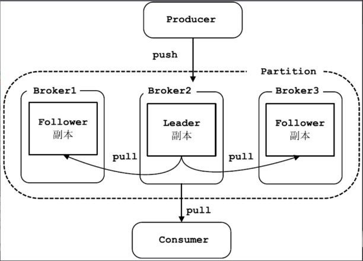
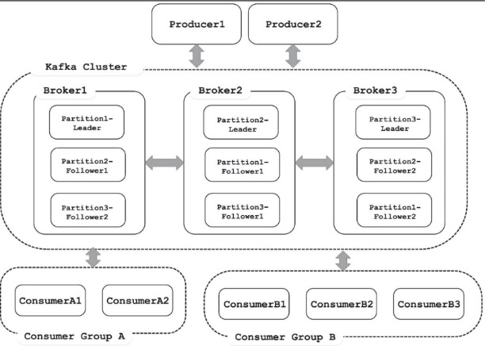
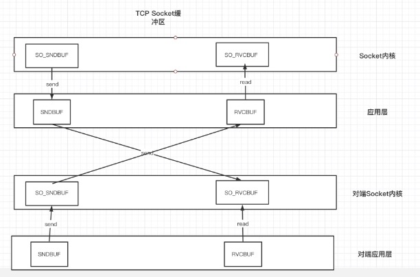

# Kafka概念 


* 数据持久化 
```plain
Kafka会把数据持久化到磁盘，并且提供日志清理、日志压缩功能，对于过时的、已经处理的数据进行清除。对于耗时的寻址操作，Kafka采用顺序读写的方式访问，实现高吞吐量。 
```

* 扩展与容灾 
```plain
Kafka的每个Topic都可以分为多个分区，每个分区都由多个Replica，实现消息冗余备份。类似于数据库中的水平切分，提高并发读写的能力。 
同一分区的不同副本中保存的是相同的消息，副本之间是一主多从的关系，其中Leader副本负责处理读写请求，Follower副本则只与Leader副本进行消息同步，当Leader副本出现故障时，则从Follower副本中重新选举Leader副本对外提供服务。通过提高分区的数量，就可以实现水平扩展；通过提高副本的数量，就可以提高容灾能力。 
```

* 顺序保证 
```plain
Kafka保证一个Partition内消息的有序性，但是并不保证多个partition之间的数据有顺序。 
```
* 缓冲&峰值处理能力 

* 异步通信 
```arduino
Kafka为系统提供了异步处理能力。例如，两个系统需要通过网络进行数据交换，其中一端可以把一个消息放入Kafka中后立即返回继续执行其他操作，不需要等待对端的响应。待后者将处理结果放入Kafka中之后，前者可以从其中获取并解析响应. 
```
## 基本概念 

### 副本概念 


* follower副本仅仅拉取leader的数据到本地同步更新到自己的log中。 



### 同步副本集合 


* ISR集合(In-Sync-Replica)集合，`同步副本是消息量与leader副本完全相同的副本，在leader副本挂掉后可以在整个集合中选举出新的leader副本。 `

    * 与Zookeeper之间有一个活跃的会话，也就是，它在过去6s(可配置)内向zookeeper发送过心跳 。 
    * 在过去的10s内(可配置`replica.lag.time.max.ms`)从leader那里获取过消息 。 
    * 在过去的10s内从leader那里获取过最新的消息。光从leader那里获取消息是不够的，它还必须是几乎0延迟的 。 

* 每个分区中的 Leader副本都会维护此分区的ISR集合 。 写请求首先由Leader副本处理，之后Follower副本会从Leader上拉取写入的消息，这个过程会有一定的延迟，导致Follower副本中保存的消息略少于Leader副本，只要未超出阈值都是可以容忍的。 如果一个Follower副本出现异常，比如：宕机，发生长时间GC而导致Kafka僵死或是网络断开连接导致长时间没有拉取消息进行同步，就会违反上面的两个条件，从而被Leader副本踢出ISR集合。当Follower副本从异常中恢复之后，会继续与Leader副本进行同步，当Follower副本“追上”（即最后一条消息的offset的差值小于指定阈值）Leader副本的时候，此Follower副本会被Leader副本重新加入到ISR中。 
### HighWaterMark和Log End Offset 


* HW是一个`特殊的offset`，当`消费者处理消息的时候，只能拉去到HW之前的消息，HW之后的消息对消费者不可见。` 与ISR集合类似，HW也是由leader副本管理的。当ISR集合中全部的 `Follower副本都拉去HW指定的消息进行同步后，Leader副本会递增HW的值 。`HW`之前的消息的状态为"commit"。`其含义是这些消息在多个副本中同时存在，即使leader副本出现问题也不会丢失。 
* `LEO是所有的副本都会有的一个offset标记，它指向追加到当前副本的最后一个消息的offset。`当`生产者向Leader副本追加消息的时候，Leader副本的Leo标记会增加`；当`follower副本成功从leader副本拉取消息并更新到本地的时候，Follower副本的LEO也会增加。 `


* follower故障
  * follower发生故障后会被临时踢出ISR，待该follower恢复后，follower会读取本地磁盘记录的上次的HW，并将log文件高于HW的部分截取，从HW开始向leader进行同步。等该`follower的LEO大于等于该Partition的HW`,即follower追上leader之后，就可以加入ISR队列。
* leader故障
  * leader发生故障后，会从ISR中选出一个新的leader，之后为了保证多副本之间的数据一致性，其余的follower会将各自的log文件`高于HW的部分截掉`，然后从新的leader同步数据。


### 同步复制和异步复制 


* `同步复制要求所有能工作的Follower副本都复制完，这条消息才会被认为提交成功。` 一旦有一个Follower副本出现故障，就会`导致HW无法完成递增，消息就无法提交，生产者获取不到消息。`这种情况下，故障的Follower副本会拖慢整个系统的性能，甚至导致整个系统不可用。 
* 异步复制中， Leader副本收到生产者推送的消息后，就认为此消息提交成功。Follower副本则异步地从Leader副本同步消息。 这种设计虽然避免了同步复制的问题，但同样也存在一定的风险。`现在假设所有Follower副本的同步速度都比较慢，它们保存的消息量都远远落后于Leader副本。 `


* 此时Leader副本所在的Broker突然宕机，则会重新选举新的Leader副本，而新Leader副本中没有原来Leader副本的消息，这就出现了消息的丢失，而有些消费者则可能消费了这些丢失的消息，状态变得不可控。
* Kafka权衡了同步复制和异步复制两种策略，通过引入了ISR集合，巧妙地解决了上面两种方案存在的缺陷：当Follower副本的延迟过高时，Leader副本被踢出ISR集合，消息依然可以快速提交，生产者可以快速得到响应，避免高延时的Follower副本影响整个Kafka集群的性能。 当Leader副本所在的Broker突然宕机的时候，会优先将ISR集合中Follower副本选举为Leader副本， 新Leader副本中包含了HW之前的全部消息 ，这就避免了消息的丢失。值得注意是，Follower副本可以批量地从Leader副本复制消息，这就加快了网络I/O，Follower 副本在更新消息时是批量写磁盘，加速了磁盘的I/O，极大减少了Follower与Leader的差距。 

### Cluster&Controller 


* 多个Broker可以做成一个Cluster（集群）对外提供服务，每个Cluster当中会 选举出一个Broker来担任Controller ，Controller是Kafka集群的指挥中心，而其他Broker则听从Controller指挥实现相应的功能。Controller负责管理分区的状态、管理每个分区的副本状态、监听Zookeeper中数据的变化等工作。Controller也是一主多从的实现，所有Broker都会监听Controller Leader的状态，当Leader Controller出现故障时则重新选举新的Controller Leader。 
### 消费者 


* 消费者的主要工作是从Topic中拉取消息，并对消息进行消费。某个消费者消费到Partition的哪一个位置(offset)的相关信息，是Consumer自己维护的。 


### 消费组 


* 多个Consumer属于一个ConsumerGroup，ConsumerGroup保证其订阅的Topic的每个分区只被分配此Consumergroup中的一个消费者处理。不同的Consumer group订阅同一个Topic可以实现消息的广播。 

* 同一个消费组内的消费者订阅一个Topic的分区分配 


## Kafka架构图 



## Socket缓冲区 



