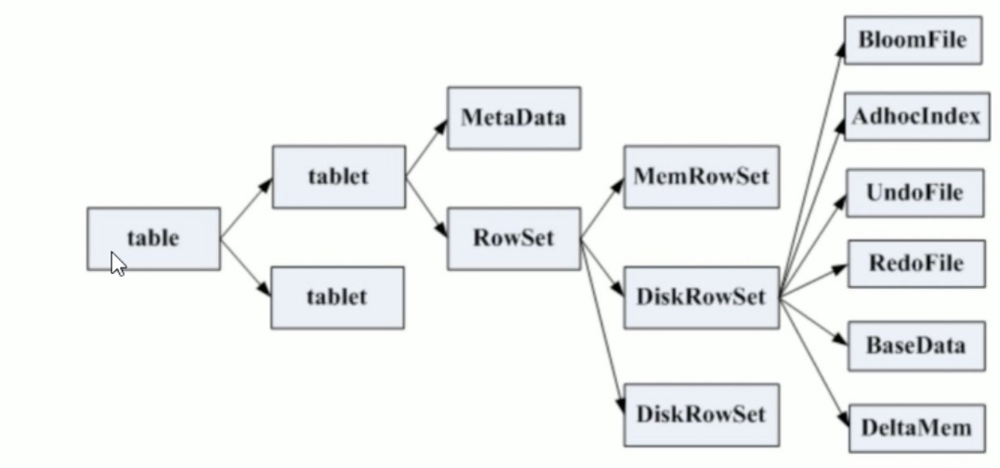
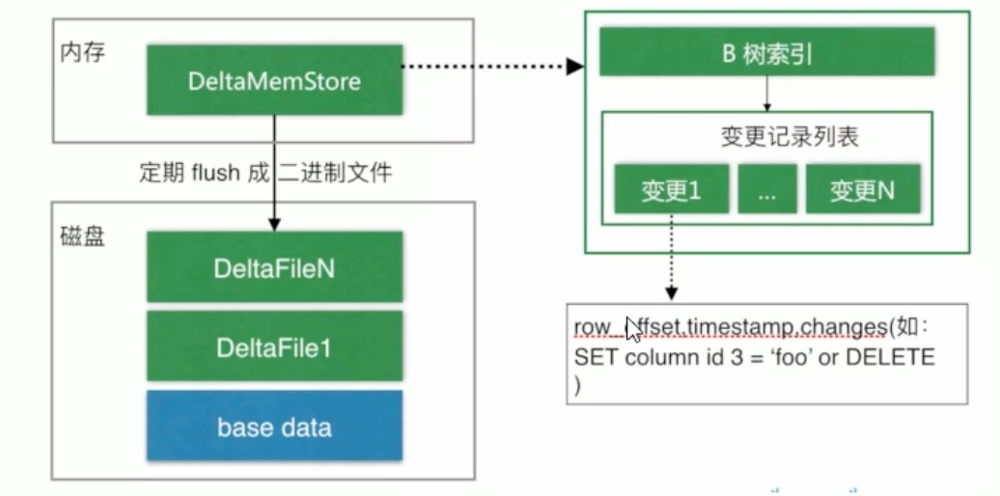
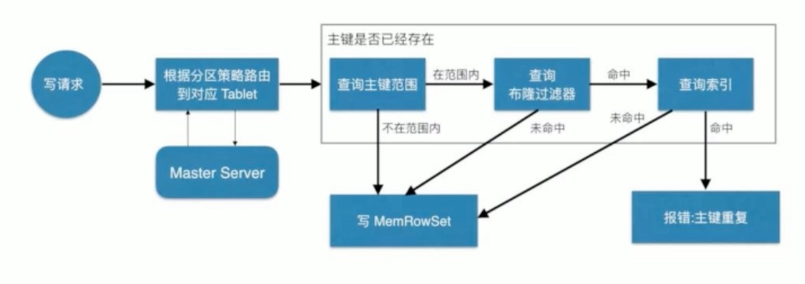
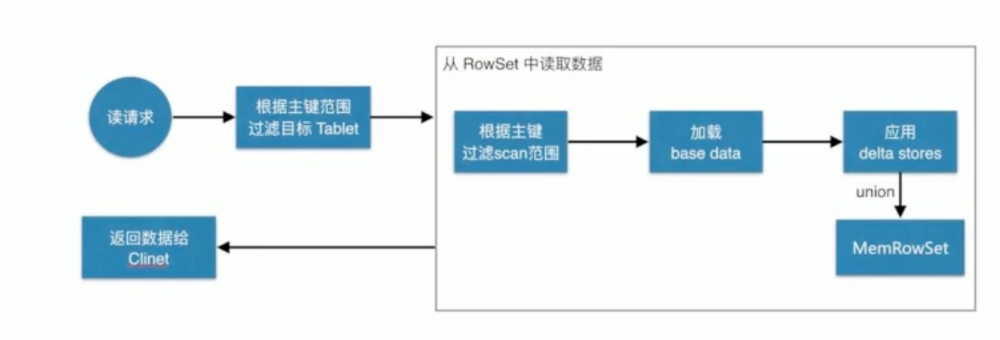
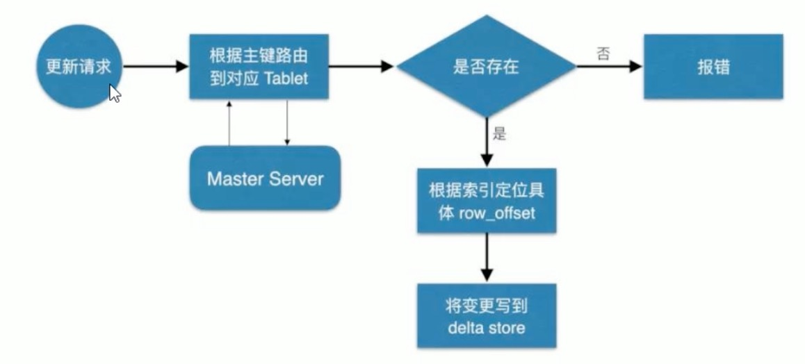

# Kudu存储原理



* RowSet包含一个MemRowSet及若干个DiskRowSet，DiskRowSet中包含一个BloomFile、Ad_hoc Index、BaseData、DeltaMem及若干个RedoFile和UndoFile。
* `MemRowSet`:用于`新数据insert及已在MemRowSet中的数据的更新`，一个MemRowSet写满后会将数据刷到磁盘形成若干个DiskRowSet。默认是1G或者120S溢写阈值。
* `DiskRowSet`:用于`老数据的变更`,后台定期对DiskRowSet做compaction，以删除没用的数据及合并历史数据，减少查询过程中的IO开销。
* `BloomFile`:根据一个DiskRowSet中的key生成一个bloom filter，用于`快速模糊定位某一个key是否在DiskRowSet`中，用于compaction和MemRowSet溢写DiskRowSet使用。
* `Ad_hoc Index`:是主键的索引，用于`定位key在DiskRowSet中的具体哪个偏移位置`。
* `BaseData`是MemRowSet flush下来的数据，按列存储，按主键排序。
* `UndoFile`是基于BaseData之后时间的变更记录，通过在BaseData上apply UndoFile中的记录，可获得历史数据。
* `RedoFile`是基于BaseData之后时间的变更记录，通过在BaseData上apply RedoFile中的记录，可获得较新数据一般指已经提交的数据。
* `DeltaMem`用于`DiskRowSet`中数据的变更，先写到内存中，写满后flush到磁盘形成RedoFile，RedoFile主要是溢写到磁盘的数据变更记录。

## Redo与Undo

* REDO与UNDO与关系型数据库中的REDO与UNDO类似(在关系型数据库中，REDO日志记录了更新后的数据，可以用来恢复尚未写入Data File的已成功事务更新的数据。而UNDO日志用来记录事务更新之前的数据，可以用来在事务失败时进行回滚)

## MemRowSets和DiskRowSets

* `MemRowSets`可以对比为HBase的`MemStore`，`DiskRowSets`可以理解为HBase的`HFile`。
* `MemRowSets`中的数据被Flush到磁盘之后，形成`DiskRowSets`。`DiskRowSets`中的数据，按照32MB大小为单位，按序划分成一个个的`DiskRowSet`。DiskRowSet中的数据按照`Column`进行组织，与Parquet类似。
* 每一个`Column`的数据被存储在一个相邻的数据区域，这个区域进一步被细分为一个个的小的Page单元，与HBase File中的Block类似，对每个Column Page可采用一些Encoding算法，及Compression算法。
* DiskRowSet是不可修改的，DiskRowSet分为base data和delta stores。base data负责存储`基础数据`，delta stores负责存储`base data中的变更数据`,最终再flush到redofile中。

### DiskRowSet底层存储模型



* 数据从MemRowSet刷到磁盘后形成了一份DiskRowSet(只包含base data)，每份DiskRowSet在`内存中都会有一个对应的DeltaMemStore`，负责记录此DiskRowSet后续的数据变更(更新、删除)。
* DeltaMemStore内部维护了一个B树索引，映射到每个`row_offset`对应得数据变更。DeltaMemStore数据增长到一定程度后转化成二进制文件存储到磁盘，形成一个DeltaFile，随着base data对应数据的不断变更，DeltaFile逐渐增长。

## tablet发现过程

* 当创建Kudu客户端时，会从master server上获取tablet位置信息，然后直接与服务于该tablet的tablet server进行连接，以此来操作对应的tablet。
* 为了优化读取与写入路径，`客户端将保留该信息的本地缓存(类似于Hbase中的Client，也会缓存RegionServer的地址)`，以防止他们在每个请求时都需要查询主机的tablet位置信息。客户端缓存会存在缓存过时的问题，并且当写入被发送到不再是tablet leader的tablet server时，则将被拒绝。然后客户端将通过`查询master server发现新leader的位置来更新其缓存`。


## 写数据流程

* 当client请求写数据时，`先根据主键从Master Server中获取要访问的目标Tablets，然后到依次对应的Tablet获取数据。`Kudu表存在主键约束需要进行主键是否存在的判断，这里可以通过底层DiskRowset的`BloomFilter`和`adHocIndex`结构来判断。一个Tablet中存在很多个`RowSets`，为了提高性能`尽可能减少要减少扫描的RowSets数量`。
* 通过每个RowSet中记录的`主键的(最大最小)范围`，过滤掉一批不存在目标主键的RowSets，然后在根据RowSet中的`BloomFilter`，过滤掉确定不存在目标主键的RowSets，再通过RowSets中的B树索引`adhocIndex`，精确定位目标主键是否存储。
* 如果主键已经存在，则报错(键重复)，否则就进行写数据(写MemRowSet)



## 读数据流程

* 先根据要扫描数据的主键范围,定位到目标的Tablets，然后读取Tablets中的RowSets。在读取每个RowSet时，先根据主键过滤要scan范围，然后加载范围内的`base data`，再找到对应的`delta stores`，apply所有变更，最后`union`上MemRowSet中的数据，返回数据给Client。



## 更新数据流出

* 数据更新的核心是定位到待更新的位置，定位到具体位置后，然后将变更写到对应的delta store中



# Kudu伸扩容

* 热副本：连续接收写操作的tablet副本。例如，在时间序列用例中，时间列上最近范围分区的tablet副本将持续接收最新数据，并且将是热副本。
* 冷副本:冷副本即不经常接收写操作的副本，例如，每隔几分钟一次。可以读取一个冷副本。例如，在时间序列用例中，一个时间列上以前的范围分区的tablet副本根本不会接收写操作，或者只是偶尔接收到最新的更新或添加操作，但可能会不断读取。
* 磁盘上的数据:跨所有磁盘、复制后、压缩后和编码后存储在tablet server上的数据总量。

## Memory

* 通过`memory_limit_hard_bytes`决定Kudu tablet server可能使用的最大内存数，这个内存大小将被一个tablet server用来伸缩数据大小，写入负载以及并发读取。

| Type                                    | Multiplier                           | Description                                                  |
| :-------------------------------------- | :----------------------------------- | :----------------------------------------------------------- |
| 磁盘上每TB数据所需的内存                | 1.5GB / 1TB数据                      | Tablet server的基本操作所需的磁盘上每单位数据的内存量。      |
| 热副本的 MemRowSets和DeltaMemStores大小 | 每个热副本至少128MB                  | 每次MemRowSet刷新要刷新的最小数据量。 在大多数情况下，与插入相比更新应该很少，因此DeltaMemStores应该很小。 |
| Scans                                   | 对于读取繁重的表，每核每列256KB      | 表的扫描器使用的内存量，以及经常被读取的表经常需要的内存量。 |
| Block Cache                             | `--block_cache_capacity_mb`默认512MB | 保留给块缓存使用的内存量。                                   |

* 8TB的硬盘大小，需要8*1.5GB的tablet server内存
* 200个热副本需要，200*128MB=25.6GB，MemRowSet需要的刷新数据量
* 40个列，40*40*256KB，表的扫描器使用的内存量
* Block Cache 512MB
* 预计内存大小38.5GB，推荐的hard limit为52GB，查看内存负载，应该在50到75%之间

### 验证内存限制是否足够

* 设置完`--memory_limit_hard_bytes`后，内存使用应该保持在硬限制的50-75%左右，偶尔会出现高于75%但低于100%的峰值。如果tablet服务器始终运行在75%以上，则应该增加内存限制。
* 另外，监视内存拒绝的日志也很有用，它类似于:

```
Service unavailable: Soft memory limit exceeded (at 96.35% of capacity)
```

### 内存指标

* 查看内存拒绝指标
  * `leader_memory_pressure_rejections`
  * `follower_memory_pressure_rejections`
  * `transaction_memory_pressure_rejections`
* 偶尔由于内存压力而被拒绝是正常的，并作为对客户机的背压。客户端将透明地重试操作。但是，任何操作都不应该超时。


## 文件描述符

* 进程被分配了最大数量的打开的文件描述符(也称为fds)。如果一个tablet server试图打开太多的fds，它通常会崩溃，并显示类似“打开的文件太多”之类的信息。

**下表总结了Kudu tablet服务器进程中文件描述符使用的来源**

| Type          | Multiplier                                                   | Description                                                  |
| :------------ | :----------------------------------------------------------- | :----------------------------------------------------------- |
| File cache    | Fixed by `--block_manager_max_open_files` (default 40% of process maximum) | Maximum allowed open fds reserved for use by the file cache. |
| Hot replicas  | 2 per WAL segment, 1 per WAL index                           | Number of fds used by hot replicas. See below for more explanation. |
| Cold replicas | 3 per cold replica                                           | Number of fds used per cold replica: 2 for the single WAL segment and 1 for the single WAL index. |

* 每个副本至少一个WAL segment和一个WAL index，并且应该有相同数量的段和索引。但是，如果一个副本的一个对等副本落后，那么它的段和索引的数量可能会更多。在对WALs进行垃圾收集时，关闭WAL段和索引fds。

| Type               | Amount                                                       |
| :----------------- | :----------------------------------------------------------- |
| file cache         | 40% * 32000 fds = 12800 fds                                  |
| 1600 cold replicas | 1600 cold replicas * 3 fds / cold replica = 4800 fds         |
| 200 hot replicas   | (2 / segment * 10 segments/hot replica * 200 hot replicas) + (1 / index * 10 indices / hot replica * 200 hot replicas) = 6000 fds |
| Total              | 23600 fds                                                    |

* 因此，对于本例，tablet服务器进程有大约32000 - 23600 = 8400个fds

## Threads

* 如果Kudu tablet server的线程数超过操作系统限制，则它将崩溃，通常在日志中显示一条消息，例如“ pthread_create失败：资源暂时不可用”。 如果超出系统线程数限制，则同一节点上的其他进程也可能崩溃。
* 整个Kudu都将线程和线程池用于各种目的，但几乎所有线程和线程池都不会随负载或数据/tablet大小而扩展； 而是，线程数可以是硬编码常量，由配置参数定义的常量，也可以是基于静态维度（例如CPU内核数）的常量。
* 唯一的例外是WAL append线程，它存在于每个“热”副本中。注意，所有的副本在启动时都被认为是热的，因此tablet服务器的线程使用通常会在启动时达到峰值，然后稳定下来。

# Kudu事务

* kudu最终被设计来满足ACID，但是多tablet的事务kudu不支持。
* 写操作是一组要在存储引擎中插入、更新或删除的行，这些行位于带有多个副本的单个tablet上。写操作没有独立的“读集”，即它们在执行写操作之前不会扫描现有数据。每次写操作只关心将要更改的行之前的状态。写不是由用户显式地“提交”的。相反，它们在完成后由系统自动提交。
* 扫描是读取操作，可以遍历多个tablet并读取具有不同级别一致性或正确性保证的信息。扫描可以执行时间旅行读取，即用户可以设置过去的扫描时间戳，并返回反映存储引擎在那个时间点的状态的结果。

## 单tablet写操作

* Kudu采用多版本并发控制(MVCC)和Raft一致性算法[4]。Kudu的每个写操作都必须通过tablet的领导者.
  1. leader获取它将要更改的行的所有锁。
  2. leader在写入提交副本之前给写入分配一个时间戳。这个时间戳将是MVCC中的写标记。
  3. 在大多数副本确认更改后，实际的行被更改。
  4. 更改完成后，它们对并发的写和读操作是可见的。
* 一个tablet的所有副本都遵循相同的操作顺序，如果一个写操作被分配了时间戳n并改变了行x，那么在时间戳m > n上的第二个写操作保证会看到新的x值。
* 这种锁获取和时间戳分配的严格顺序被强制在tablet的所有副本之间一致。因此，写操作完全是根据时钟分配的时间戳排序的，相对于同一块tablet上的其他写操作。换句话说，写入具有严格可序列化的语义，尽管在有限的上下文中。
* 虽然多行写操作在ACID意义上是孤立且持久的，但还不是完全原子的。`批处理操作中的单个写操作失败不会回滚该操作，但会产生每行错误`。

## 读操作

* 扫描是由客户机执行的读取操作，这些操作可能跨一个或多个tablet跨越一个或多个行。当服务器接收到扫描请求时，它将获取MVCC状态的快照，然后根据用户选择的读取模式，采用两种方式中的一种进行处理。
* 设置读取模式，Java Call `KuduScannerBuilder#readMode(…)`
  1. `READ_LATEST`:读默认读取模式，服务器获取MVCC状态的快照，并立即进行读取。这种模式下的读取只能产生“READ COMMIT”隔离。
  2. `READ_AT_SNAPSHOT`:在此读取模式下，扫描是一致且可重复的。 快照的时间戳由服务器选择，或者由用户通过KuduScanner :: SetSnapshotMicros（）显式设置。 建议明确设置时间戳； 服务器将等待，直到此时间戳为“安全”为止（直到所有具有较低时间戳的写操作都已完成并且可见）。 这种延迟加上外部一致性方法，最终将使Kudu对读取和写入具有完全严格的可序列化语义。

## 建议

* 如果需要重复读取快照，请使用READ_AT_SNAPSHOT，并将时间戳设置为稍早（在2-5秒之间）。 这将避免Writes中描述的异常。 即使解决了异常问题，但对时间戳进行回溯将始终使扫描速度更快，因为它们不太可能被阻止。
* 如果需要外部一致性，并且您决定使用COMMIT_WAIT，则需要仔细调整时间同步协议。 每个事务在执行时将等待最大时钟错误的2倍，通常为100毫秒 到1秒 默认设置的范围，也许更多。 因此，事务将至少花费200毫秒到2秒 使用默认设置时可能会完成，甚至可能超时。

