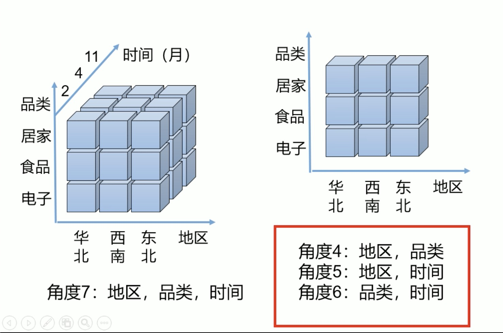
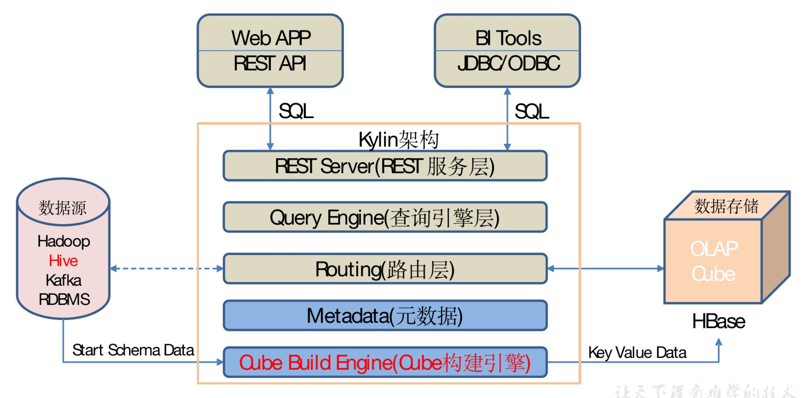

# 概述

## 定义

* Apache Kylin是一个开源的分布式分析引擎，提供`Hadoop/Spark`之上的SQL查询接口及`多维分析（MOLAP）`能力以支持超大规模数据，最初由eBay Inc开发并贡献至开源社区。它能`在亚秒内查询巨大的Hive表`。

### OLAP(online analytical processing)

* OLAP(online analytical processing)是一种软件技术，它使分析人员能够迅速、一致、交互地从各个方面观察信息，以达到深入理解数据的目的。从各个方面观察信息，也就是从不同的维度分析数据，因此OLAP也是多维度分析。

#### ROLAP（Relational OLAP）

* 基于关系型数据库，不需要预计算

#### MOLAP（Multidimensional OLAP）

* 基于多维数据集，需要预计算

### OLAP Cube

* MOLAP基于多维数据集，一个多维数据集称为一个OLAP Cube(立方体分析)。
* 一堆Cuboid(长方体)组成一个Cube。



* Kylin的工作原理本质上是MOLAP(Multidimension On-Line Analysis Processing)Cube，多维立方体分析。

#### 维度和度量

* `维度：即观察数据的角度。`比如员工数据，可以从性别角度来分析，也可以更加细化，从入职时间或者地区的维度来观察。维度是一组离散的值，比如说性别中的男和女，或者时间维度上的每一个独立的日期。因此在统计时可以将维度值相同的记录聚合在一起，然后应用聚合函数做累加、平均、最大和最小值等聚合计算。
* `度量：即被聚合（观察）的统计值，也就是聚合运算的结果。`比如说员工数据中不同性别员工的人数，又或者说在同一年入职的员工有多少。

#### Cube和Cuboid

* 有了`维度跟度量`，一个数据表或者数据模型上的所有字段就可以分类了，它们要么是维度，要么是度量（可以被聚合）。于是就有了根据维度和度量做预计算的Cube理论。
* 给定一个数据模型，我们可以对其上的所有维度进行聚合，对于N个维度来说，组合的所有可能性共有2n种。对于每一种维度的组合，将度量值做聚合计算，然后将结果保存为一个物化视图，称为`Cuboid`。所有维度组合的Cuboid作为一个整体，称为Cube。

## 特点

**Kylin的主要特点包括支持SQL接口、支持超大规模数据集 、亚秒级响应、可伸缩性、高吞吐率、BI工具集成等。**

* `标准化SQL接口`：Kylin是以标准化SQL作为对外服务的接口。
* 支持超大数据集：Kylin对于大数据的支撑能力可能是目前所有技术中最为领先的。早在2015年eBay的生产环境中就能支持百亿记录的秒级查询，之后在移动的应用场景中又有了千亿记录秒级查询的案例。
* `亚秒级响应`：Kylin拥有优异的查询相应速度，这点得益于预计算，很多复杂的计算，比如连接、聚合，在离线的预计算过程中就已经完成，这大大降低了查询时刻所需的计算量，提高了响应速度。
* `可伸缩性和高吞吐率`：单节点Kylin可实现每秒70个查询，还可以搭建Kylin的集群。
* `BI工具集成`

```
Kylin可以与现有的BI工具集成，具体包括如下内容。
ODBC：与Tableau、Excel、PowerBI等工具集成
JDBC：与Saiku、BIRT等Java工具集成
RestAPI：与JavaScript、Web网页集成
Kylin开发团队还贡献了Zepplin的插件，也可以使用Zepplin来访问Kylin服务。
```

## 架构




* REST Server

```
REST Server是一套面向应用程序开发的入口点，旨在实现针对Kylin平台的应用开发工作。 此类应用程序可以提供查询、获取结果、触发Cube构建任务、获取元数据以及获取用户权限等等。另外可以通过Restful接口实现SQL查询。
```

* 查询引擎（Query Engine）

```
当Cube准备就绪后，查询引擎就能够获取并解析用户查询。它随后会与系统中的其它组件进行交互，从而向用户返回对应的结果。 
```

* Routing

```
负责将解析的SQL生成的执行计划转换成Cube缓存的查询，Cube是通过预计算缓存在hbase中，这部分查询可以在秒级设置毫秒级完成，而且还有一些操作使用过的查询原始数据（存储在Hadoop的HDFS中通过Hive查询）。这部分查询延迟较高。
```

* 元数据管理工具（Metadata）

```
Kylin是一款元数据驱动型应用程序。元数据管理工具是一大关键性组件，用于对保存在Kylin当中的所有元数据进行管理，其中包括最为重要的Cube元数据。其它全部组件的正常运作都需以元数据管理工具为基础。Kylin的元数据存储在hbase中。 
```

* 任务引擎（Cube Build Engine）

```
这套引擎的设计目的在于处理所有离线任务，其中包括Shell脚本、Java API以及Map Reduce任务等等。任务引擎对Kylin当中的全部任务加以管理与协调，从而确保每一项任务都能得到切实执行并解决其间出现的故障。
```

## 安装

[参考官方文档](http://kylin.apache.org/cn/docs/gettingstarted/kylin-quickstart.html)


