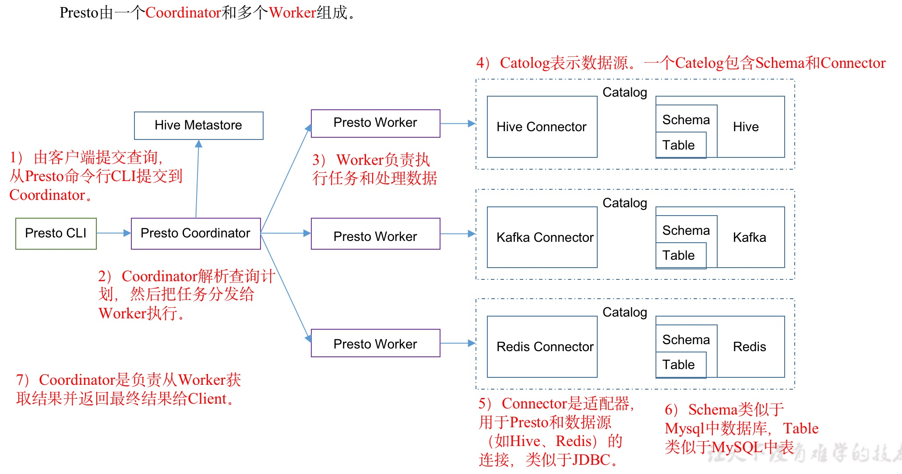
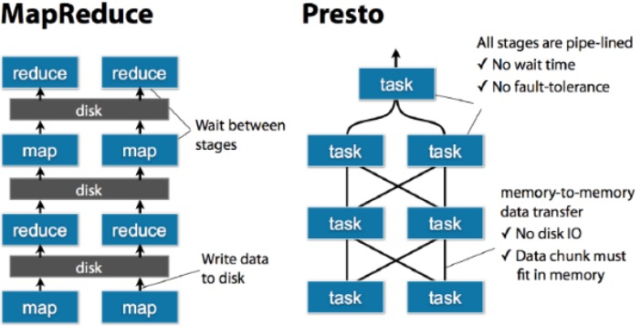

# 概念

## 特点

* Presto是一个开源的分布式SQL查询引擎，数据量支持GB到PB字节，主要用来处理秒级查询的场景，Presto不是OLTP数据库，而是一个OLAP数据库

## 架构



## 模型

### Connector

* presto通过不同的类型的Connector访问多种数据源，通过etc/catalog中配置对应的example.properties的connector。

### Catalog

* catalog类似于Mysql的一个数据库实例，通过etc/catalog的example.properties配置

### Schema

* Schema类似于Mysql的database，一个catalog名称和一个schema名称唯一确定了可以查询的一系列表的集合

### Table

* 单纯hive table、或者其他connector table。

## 查询执行模型

### Statement

* 输入的SQL语句，presto支持符合ANSI标准的SQL，这种语句由clause、expression和predicate组成。

### Query

* Query即查询执行，当Presto接收一个SQL语句并执行时，会解析该SQL语句，将其转换成一个查询执行和相关的查询执行计划。

### Stage

* Stage即查询执行阶段，当presto运行query时，presto会将一个query拆分成具有层级关系的多个stage，一个stage就代表查询执行计划的一部分。通常stage之间是树状层级结构，每个query都有一个root stage，该stage用于聚集所有其他stage的输出数据，并将最终的数据反馈给终端用户。
* stage并不会执行，它只是coordinator用于对查询执行计划进行管理和建模的逻辑概览。每个stage除了single stage和source stage都会有输入和输出，都会从上游stage读取数据然后产生结果输出给下游stage。source stage没有上游stage，它从connector获取数据。single stage没有下游stage，它直接将数据输出给ccoordinator。

#### presto的stage类型

* Coordinator_only:用于执行DDL或者DML语句
* single:聚合子stage的输出数据，并将最终数据输出给终端用户
* fixed:接受其子stage产生的数据并在集群中对这些数据进行分布式聚合或分组计算。
* source:直连数据源，从数据源读取数据，然后根据presto的执行结果优化的断言进行下发(pushdown)和条件过滤。

### Exchange

* 用于stage之间的连接和数据交换，有output buffer和exchange client两种exchange，生产数据的stage通过output buffer将数据传送给下游stage。
* 消费数据的stage通过exchange client来从上游stage消费数据，

### Task

* stage逻辑上划分为一系列的task，task是实际运行在presto各个worker节点的，查询集合->一系列stage->一个stage划分一系列task->每个task处理一个或多个split。
* 每个task都有对应的输入和输出，一个stage被分解为多个task，从而可以并行的执行一个stage，一个task可以划分为一个或者多个driver，从而也可以并行的执行一个task。

### driver

* 一个task包含一个或者多个driver，一个driver作用一个split的一系列的operator集合，driver也拥有一个输入和一个输出。

### operator

* 一个operator代表一个split的操作，，例如过滤、加权、转换等，一个operator依次读取一个split中的数据，将operator所代表的计算和操作作用于split的数据上，并产生输出。
* 每个operator均会以page为最小处理单位分别读取输入数据和产生输出数据。

### split

* split即分片一个分片就是一个大的数据集中的一个小的子集。

### page

* page是presto中处理的最小数据单元，一个page对象包含多个block对象，每个block对象是一个字节数组，存储一个字段的若干行。多个block横切的一行是真实的一行数据。
* 一个page最大为1MB，最多16*1024行数据，可以理解block就是列式存储的一列，一个page有多个block来表示多列，最终形成多行多列的数据。ß

## 优缺点

### Presto和MapReduce的区别



### 优点

* 基于内存运算，减少硬盘IO，和中间结果存储，计算更快
* 能够连接多个数据源，跨数据源连表查，如果从Hive查询大量网站访客记录，然后从Mysql中匹配出设备信息。

### 缺点

* Presto能够处理PB级别的数据，但是Presto不是把PB级别的数据放在内存中计算，而是根据场景，如Count，AVG等聚合运算，是边读数据边计算，再清内存，再读数据再计算，这种消耗的内存不高。`但是连表查，就可能产生大量的临时数据，因此速度会变慢，反而Hive此时更擅长。`

# Presto优化

## 合理设置分区

* 与Hive类似，Presto会根据元数据信息读取分区数据，合理的分区能减少Presto数据读取量，提升查询性能。

## 使用列式存储

* Presto对ORC文件读取做了特定优化，因此在Hive中创建Presto使用的表时，建议采用ORC格式存储，相同与Parquet，Presto对ORC支持更好。

## 使用压缩

* 数据压缩可以减少节点间数据传输对IO带宽压力，对于即席查询需要快速解压，建议使用Snappy压缩。

# 安装

## docker部署

```sh
# 启动presto
docker run -d -p 127.0.0.1:8080:8080 --name presto starburstdata/presto
# 启动presto-cli
docker exec -it presto presto-cli
```

## 物理机部署

### 前置条件

#### linux必须

* ssh信任关系建立
* 64bit
* 修改/etc/security/limits.conf

```
trino soft nofile 131072
trino hard nofile 131072
```

#### 编程环境

* jdk11之后，老版本jdk8
* python执行环境2.6.x以上

### 安装Trino

* 选择Trino351版本的tra.gz包，https://repo1.maven.org/maven2/io/trino/trino-server/351/
