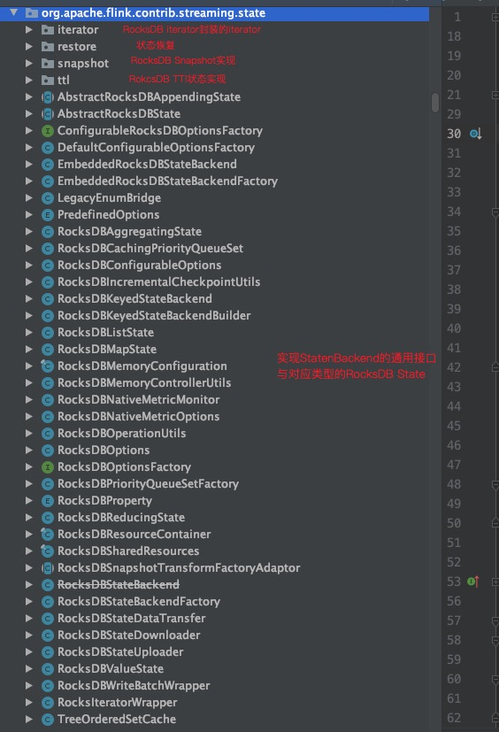

# RocksDB On Flink

* RocksDB应用在很多成熟的OLAP引擎中包括Doris、Kudu等，在流式计算引擎中也有它的一席之地，这篇文章我们通过RocksDB在Flink中的实现来深入学习了RocksDBJava的使用姿势，以及深入了解下Flink的StateBackend。

## 学习前置条件

* 了解RocksDB概念，数据结构等
* 了解Flink Rocksdb StateBackend
* 具有Flink源码环境

## 代码结构



* Iterator:rocksdb scan迭代器基于`RocksIteratorInterface`实现的包装类实现的各类Iterator，包含Queue、单状态、状态Keys和Namesapce迭代器、(key-group, kv-state)迭代器。
* restore:从状态中恢复RocksDB的Snapshot，主要包含对应的RocksDB实例、列族处理器、RocksDB指标采集器、SST文件、最后依次的ck id(具体查看`RocksDBRestoreResult`对象)。
  * RocksDBRestoreOperation:主要的RocksDB状态恢复操作接口，提供了增量恢复、全量快照恢复、不恢复等策略。
* snapshot:RocksDB快照恢复工具类，包含全量、增量方式快照恢复手段。

## StateBackend

* flink提供的状态后端接口，通过实现这个接口可以自定义flink的state管理后端。

### EmbeddedRocksDBStateBackend

* 嵌入是Rocksdb状态后端通过一个嵌入的Rocksdb实例来存储state，这个状态后端可以存储非常大的state超过内存会溢写到本地磁盘。所有的key/value状态(包含窗口)将按照key/value索引存储在RocksDB中。配置CheckpointStorge可以防止因机器崩溃导致的数据丢失。

#### 属性含义

```java
  /** The number of (re)tries for loading the RocksDB JNI library. */
    // Rocksdb loadLib的重试次数
    private static final int ROCKSDB_LIB_LOADING_ATTEMPTS = 3;

    /** Flag whether the native library has been loaded. */
    // 标识rocksdb是否已经初始化，保证一个jvm内rocksdb只会初始化依次
    private static boolean rocksDbInitialized = false;
    // 默认用于传输(下载和上传)文件的线程数(每个有状态操作符)
    private static final int UNDEFINED_NUMBER_OF_TRANSFER_THREADS = -1;

    // 默认write batch的大小 -1标识模式
    private static final long UNDEFINED_WRITE_BATCH_SIZE = -1;

    // ------------------------------------------------------------------------

    // -- configuration values, set in the application / configuration

    /**
     * Base paths for RocksDB directory, as configured. Null if not yet set, in which case the
     * configuration values will be used. The configuration defaults to the TaskManager's temp
     * directories.
     * RocksDB 目录的基本路径，如配置。 如果尚未设置，则为 Null，
     * 在这种情况下，将使用配置值。 配置默认为 TaskManager 的临时目录。
     */
    @Nullable private File[] localRocksDbDirectories;

    /** The pre-configured option settings. */
    // rocksdb的预先 option配置，包含dboption和columnFamilyOption的配置
    @Nullable private PredefinedOptions predefinedOptions;

    /** The options factory to create the RocksDB options in the cluster. */
    // 集群中的rocksdb的db配置和列族配置，包含compaction、操作db线程数等
    @Nullable private RocksDBOptionsFactory rocksDbOptionsFactory;

    /** This determines if incremental checkpointing is enabled. */
    private final TernaryBoolean enableIncrementalCheckpointing;

    /** Thread number used to transfer (download and upload) state, default value: 1. */
    // rocksdb文件传输线程数
    private int numberOfTransferThreads;

    /** The configuration for memory settings (pool sizes, etc.). */
    // rocksdb内存配置包含manageMemory state、固定内存
    private final RocksDBMemoryConfiguration memoryConfiguration;

    /** This determines the type of priority queue state. */
   // 决定timer服务存储使用的实现，是ROCKSDB还是HEAP，HEAP会存在OOM
    @Nullable private EmbeddedRocksDBStateBackend.PriorityQueueStateType priorityQueueStateType;

    /** The default rocksdb metrics options. */
    private final RocksDBNativeMetricOptions defaultMetricOptions;

    // -- runtime values, set on TaskManager when initializing / using the backend

    /** Base paths for RocksDB directory, as initialized. */
    // 初始化rocksdb的默认path
    private transient File[] initializedDbBasePaths;

    /** JobID for uniquifying backup paths. */
    private transient JobID jobId;

    /** The index of the next directory to be used from {@link #initializedDbBasePaths}. */
    private transient int nextDirectory;

    /** Whether we already lazily initialized our local storage directories. */
    private transient boolean isInitialized;

    /**
     * Max consumed memory size for one batch in {@link RocksDBWriteBatchWrapper}, default value
     * 2mb.
     */
    private long writeBatchSize;
```

#### 核心构造方法

```java
  private EmbeddedRocksDBStateBackend(
            EmbeddedRocksDBStateBackend original, ReadableConfig config, ClassLoader classLoader) {
        // configure incremental checkpoints
        this.enableIncrementalCheckpointing =
                original.enableIncrementalCheckpointing.resolveUndefined(
                        config.get(CheckpointingOptions.INCREMENTAL_CHECKPOINTS));

        if (original.numberOfTransferThreads == UNDEFINED_NUMBER_OF_TRANSFER_THREADS) {
            this.numberOfTransferThreads = config.get(CHECKPOINT_TRANSFER_THREAD_NUM);
        } else {
            this.numberOfTransferThreads = original.numberOfTransferThreads;
        }

        if (original.writeBatchSize == UNDEFINED_WRITE_BATCH_SIZE) {
            this.writeBatchSize = config.get(WRITE_BATCH_SIZE).getBytes();
        } else {
            this.writeBatchSize = original.writeBatchSize;
        }

        this.memoryConfiguration =
                RocksDBMemoryConfiguration.fromOtherAndConfiguration(
                        original.memoryConfiguration, config);
        this.memoryConfiguration.validate();

        if (null == original.priorityQueueStateType) {
            this.priorityQueueStateType = config.get(TIMER_SERVICE_FACTORY);
        } else {
            this.priorityQueueStateType = original.priorityQueueStateType;
        }

        // configure local directories
        if (original.localRocksDbDirectories != null) {
            this.localRocksDbDirectories = original.localRocksDbDirectories;
        } else {
            final String rocksdbLocalPaths = config.get(RocksDBOptions.LOCAL_DIRECTORIES);
            if (rocksdbLocalPaths != null) {
                String[] directories = rocksdbLocalPaths.split(",|" + File.pathSeparator);

                try {
                    setDbStoragePaths(directories);
                } catch (IllegalArgumentException e) {
                    throw new IllegalConfigurationException(
                            "Invalid configuration for RocksDB state "
                                    + "backend's local storage directories: "
                                    + e.getMessage(),
                            e);
                }
            }
        }

        // configure metric options
        this.defaultMetricOptions = RocksDBNativeMetricOptions.fromConfig(config);

        // configure RocksDB predefined options
        this.predefinedOptions =
                original.predefinedOptions == null
                        ? PredefinedOptions.valueOf(config.get(RocksDBOptions.PREDEFINED_OPTIONS))
                        : original.predefinedOptions;
        LOG.info("Using predefined options: {}.", predefinedOptions.name());

        // configure RocksDB options factory
        try {
            // 加载Rocksdb配置，可以通过自定义实现Factory然后配置自定义的Rocksdb
            rocksDbOptionsFactory =
                    configureOptionsFactory(
                            original.rocksDbOptionsFactory,
                            config.get(RocksDBOptions.OPTIONS_FACTORY),
                            config,
                            classLoader);
        } catch (DynamicCodeLoadingException e) {
            throw new FlinkRuntimeException(e);
        }

        // configure latency tracking
        latencyTrackingConfigBuilder = original.latencyTrackingConfigBuilder.configure(config);
    }
```

#### createKeyedStateBackend

* 创建Keyed状态后端，内部包含构建RocksDB实例以及一些状态后端组件

```java
public <K> AbstractKeyedStateBackend<K> createKeyedStateBackend(
            Environment env,
            JobID jobID,
            String operatorIdentifier,
            TypeSerializer<K> keySerializer,
            int numberOfKeyGroups,
            KeyGroupRange keyGroupRange,
            TaskKvStateRegistry kvStateRegistry,
            TtlTimeProvider ttlTimeProvider,
            MetricGroup metricGroup,
            @Nonnull Collection<KeyedStateHandle> stateHandles,
            CloseableRegistry cancelStreamRegistry,
            double managedMemoryFraction)
            throws IOException {

        // first, make sure that the RocksDB JNI library is loaded
        // we do this explicitly here to have better error handling
        // 获取临时目录
        String tempDir = env.getTaskManagerInfo().getTmpDirectories()[0];
        // 初始化Rocksdb，加载lib、外部lib等
        ensureRocksDBIsLoaded(tempDir);

        // replace all characters that are not legal for filenames with underscore
        //解析算子名
        String fileCompatibleIdentifier = operatorIdentifier.replaceAll("[^a-zA-Z0-9\\-]", "_");

        // 初始化rocksdb local dir
        lazyInitializeForJob(env, fileCompatibleIdentifier);

        File instanceBasePath =
                new File(
                        getNextStoragePath(),
                        "job_"
                                + jobId
                                + "_op_"
                                + fileCompatibleIdentifier
                                + "_uuid_"
                                + UUID.randomUUID());

        LocalRecoveryConfig localRecoveryConfig =
                env.getTaskStateManager().createLocalRecoveryConfig();

        final OpaqueMemoryResource<RocksDBSharedResources> sharedResources =
                RocksDBOperationUtils.allocateSharedCachesIfConfigured(
                        memoryConfiguration, env.getMemoryManager(), managedMemoryFraction, LOG);
        if (sharedResources != null) {
            LOG.info("Obtained shared RocksDB cache of size {} bytes", sharedResources.getSize());
        }
        final RocksDBResourceContainer resourceContainer =
                createOptionsAndResourceContainer(sharedResources);

        ExecutionConfig executionConfig = env.getExecutionConfig();
        StreamCompressionDecorator keyGroupCompressionDecorator =
                getCompressionDecorator(executionConfig);

        LatencyTrackingStateConfig latencyTrackingStateConfig =
                latencyTrackingConfigBuilder.setMetricGroup(metricGroup).build();
        // 创建keyed状态后端
        RocksDBKeyedStateBackendBuilder<K> builder =
                new RocksDBKeyedStateBackendBuilder<>(
                                operatorIdentifier,
                                env.getUserCodeClassLoader().asClassLoader(),
                                instanceBasePath,
                                resourceContainer,
                                stateName -> resourceContainer.getColumnOptions(),
                                kvStateRegistry,
                                keySerializer,
                                numberOfKeyGroups,
                                keyGroupRange,
                                executionConfig,
                                localRecoveryConfig,
                                getPriorityQueueStateType(),
                                ttlTimeProvider,
                                latencyTrackingStateConfig,
                                metricGroup,
                                stateHandles,
                                keyGroupCompressionDecorator,
                                cancelStreamRegistry)
                        .setEnableIncrementalCheckpointing(isIncrementalCheckpointsEnabled())
                        .setNumberOfTransferingThreads(getNumberOfTransferThreads())
                        .setNativeMetricOptions(
                                resourceContainer.getMemoryWatcherOptions(defaultMetricOptions))
                        .setWriteBatchSize(getWriteBatchSize());
        return builder.build();
    }

// build方法
 public RocksDBKeyedStateBackend<K> build() throws BackendBuildingException {
        // 构造Rocksdb基础组件
        RocksDBWriteBatchWrapper writeBatchWrapper = null;
        ColumnFamilyHandle defaultColumnFamilyHandle = null;
        RocksDBNativeMetricMonitor nativeMetricMonitor = null;
        CloseableRegistry cancelStreamRegistryForBackend = new CloseableRegistry();
        LinkedHashMap<String, RocksDBKeyedStateBackend.RocksDbKvStateInfo> kvStateInformation =
                new LinkedHashMap<>();
        LinkedHashMap<String, HeapPriorityQueueSnapshotRestoreWrapper<?>> registeredPQStates =
                new LinkedHashMap<>();
        RocksDB db = null;
        // 状态恢复Opeartion
        RocksDBRestoreOperation restoreOperation = null;
        RocksDbTtlCompactFiltersManager ttlCompactFiltersManager =
                new RocksDbTtlCompactFiltersManager(ttlTimeProvider);

        ResourceGuard rocksDBResourceGuard = new ResourceGuard();
        RocksDBSnapshotStrategyBase<K, ?> checkpointStrategy;
        PriorityQueueSetFactory priorityQueueFactory;
        SerializedCompositeKeyBuilder<K> sharedRocksKeyBuilder;
        // Number of bytes required to prefix the key groups.
        int keyGroupPrefixBytes =
                CompositeKeySerializationUtils.computeRequiredBytesInKeyGroupPrefix(
                        numberOfKeyGroups);

        try {
            // Variables for snapshot strategy when incremental checkpoint is enabled
            UUID backendUID = UUID.randomUUID();
            SortedMap<Long, Set<StateHandleID>> materializedSstFiles = new TreeMap<>();
            long lastCompletedCheckpointId = -1L;
            if (injectedTestDB != null) {
                db = injectedTestDB;
                defaultColumnFamilyHandle = injectedDefaultColumnFamilyHandle;
                nativeMetricMonitor =
                        nativeMetricOptions.isEnabled()
                                ? new RocksDBNativeMetricMonitor(
                                        nativeMetricOptions, metricGroup, db)
                                : null;
            } else {
                // 初始化前置实例目录
                prepareDirectories();
                // 获取状态恢复操作类
                restoreOperation =
                        getRocksDBRestoreOperation(
                                keyGroupPrefixBytes,
                                cancelStreamRegistry,
                                kvStateInformation,
                                registeredPQStates,
                                ttlCompactFiltersManager);
                // 恢复状态，获取RocksDBRestoreResult，其中包含rocksdb实例、最后一次ck等
                RocksDBRestoreResult restoreResult = restoreOperation.restore();
                // 获取rocksdb实例
                db = restoreResult.getDb();
                defaultColumnFamilyHandle = restoreResult.getDefaultColumnFamilyHandle();
                nativeMetricMonitor = restoreResult.getNativeMetricMonitor();
                // 如果是增量ck获取backendUID和最后一次ck以及需要恢复的sst文件用于增量恢复
                if (restoreOperation instanceof RocksDBIncrementalRestoreOperation) {
                    backendUID = restoreResult.getBackendUID();
                    materializedSstFiles = restoreResult.getRestoredSstFiles();
                    lastCompletedCheckpointId = restoreResult.getLastCompletedCheckpointId();
                }
            }

            writeBatchWrapper =
                    new RocksDBWriteBatchWrapper(
                            db, optionsContainer.getWriteOptions(), writeBatchSize);

            // it is important that we only create the key builder after the restore, and not
            // before;
            // restore operations may reconfigure the key serializer, so accessing the key
            // serializer
            // only now we can be certain that the key serializer used in the builder is final.
            sharedRocksKeyBuilder =
                    new SerializedCompositeKeyBuilder<>(
                            keySerializerProvider.currentSchemaSerializer(),
                            keyGroupPrefixBytes,
                            32);
            // init snapshot strategy after db is assured to be initialized
            checkpointStrategy =
                    // 初始化sp和ck
                    initializeSavepointAndCheckpointStrategies(
                            cancelStreamRegistryForBackend,
                            rocksDBResourceGuard,
                            kvStateInformation,
                            registeredPQStates,
                            keyGroupPrefixBytes,
                            db,
                            backendUID,
                            materializedSstFiles,
                            lastCompletedCheckpointId);
            // init priority queue factory
            priorityQueueFactory =
                    initPriorityQueueFactory(
                            keyGroupPrefixBytes,
                            kvStateInformation,
                            db,
                            writeBatchWrapper,
                            nativeMetricMonitor);
        } catch (Throwable e) {
            // Do clean up
            List<ColumnFamilyOptions> columnFamilyOptions =
                    new ArrayList<>(kvStateInformation.values().size());
            IOUtils.closeQuietly(cancelStreamRegistryForBackend);
            IOUtils.closeQuietly(writeBatchWrapper);
            RocksDBOperationUtils.addColumnFamilyOptionsToCloseLater(
                    columnFamilyOptions, defaultColumnFamilyHandle);
            IOUtils.closeQuietly(defaultColumnFamilyHandle);
            IOUtils.closeQuietly(nativeMetricMonitor);
            for (RocksDBKeyedStateBackend.RocksDbKvStateInfo kvStateInfo :
                    kvStateInformation.values()) {
                RocksDBOperationUtils.addColumnFamilyOptionsToCloseLater(
                        columnFamilyOptions, kvStateInfo.columnFamilyHandle);
                IOUtils.closeQuietly(kvStateInfo.columnFamilyHandle);
            }
            IOUtils.closeQuietly(db);
            // it's possible that db has been initialized but later restore steps failed
            IOUtils.closeQuietly(restoreOperation);
            IOUtils.closeAllQuietly(columnFamilyOptions);
            IOUtils.closeQuietly(optionsContainer);
            ttlCompactFiltersManager.disposeAndClearRegisteredCompactionFactories();
            kvStateInformation.clear();
            try {
                FileUtils.deleteDirectory(instanceBasePath);
            } catch (Exception ex) {
                logger.warn("Failed to delete base path for RocksDB: " + instanceBasePath, ex);
            }
            // Log and rethrow
            if (e instanceof BackendBuildingException) {
                throw (BackendBuildingException) e;
            } else {
                String errMsg = "Caught unexpected exception.";
                logger.error(errMsg, e);
                throw new BackendBuildingException(errMsg, e);
            }
        }
        InternalKeyContext<K> keyContext =
                new InternalKeyContextImpl<>(keyGroupRange, numberOfKeyGroups);
        logger.info("Finished building RocksDB keyed state-backend at {}.", instanceBasePath);
        return new RocksDBKeyedStateBackend<>(
                this.userCodeClassLoader,
                this.instanceBasePath,
                this.optionsContainer,
                columnFamilyOptionsFactory,
                this.kvStateRegistry,
                this.keySerializerProvider.currentSchemaSerializer(),
                this.executionConfig,
                this.ttlTimeProvider,
                latencyTrackingStateConfig,
                db,
                kvStateInformation,
                registeredPQStates,
                keyGroupPrefixBytes,
                cancelStreamRegistryForBackend,
                this.keyGroupCompressionDecorator,
                rocksDBResourceGuard,
                checkpointStrategy,
                writeBatchWrapper,
                defaultColumnFamilyHandle,
                nativeMetricMonitor,
                sharedRocksKeyBuilder,
                priorityQueueFactory,
                ttlCompactFiltersManager,
                keyContext,
                writeBatchSize);
    }
```

### 默认Flink RocksDB配置工厂

* `DefaultConfigurableOptionsFactory`类包含dbOptions、ColumnFamilyOptions、WriteOptions的默认配置等。

```java
 @Override
    public DBOptions createDBOptions(
            DBOptions currentOptions, Collection<AutoCloseable> handlesToClose) {
        if (isOptionConfigured(MAX_BACKGROUND_THREADS)) {
            // flush&compact thread
            currentOptions.setIncreaseParallelism(getMaxBackgroundThreads());
        }

        // 读取最大的文件数
        if (isOptionConfigured(MAX_OPEN_FILES)) {
            currentOptions.setMaxOpenFiles(getMaxOpenFiles());
        }
        
        if (isOptionConfigured(LOG_LEVEL)) {
            currentOptions.setInfoLogLevel(getLogLevel());
        }

        return currentOptions;
    }

    @Override
    public ColumnFamilyOptions createColumnOptions(
            ColumnFamilyOptions currentOptions, Collection<AutoCloseable> handlesToClose) {
        // compaction算法
        if (isOptionConfigured(COMPACTION_STYLE)) {
            currentOptions.setCompactionStyle(getCompactionStyle());
        }
        // 是否使用动态level size
        if (isOptionConfigured(USE_DYNAMIC_LEVEL_SIZE)) {
            currentOptions.setLevelCompactionDynamicLevelBytes(getUseDynamicLevelSize());
        }
        // target file基础大小
        if (isOptionConfigured(TARGET_FILE_SIZE_BASE)) {
            currentOptions.setTargetFileSizeBase(getTargetFileSizeBase());
        }
        
        if (isOptionConfigured(MAX_SIZE_LEVEL_BASE)) {
            currentOptions.setMaxBytesForLevelBase(getMaxSizeLevelBase());
        }
        // 每个列族的writer buffer大小
        if (isOptionConfigured(WRITE_BUFFER_SIZE)) {
            currentOptions.setWriteBufferSize(getWriteBufferSize());
        }

        if (isOptionConfigured(MAX_WRITE_BUFFER_NUMBER)) {
            currentOptions.setMaxWriteBufferNumber(getMaxWriteBufferNumber());
        }

        if (isOptionConfigured(MIN_WRITE_BUFFER_NUMBER_TO_MERGE)) {
            currentOptions.setMinWriteBufferNumberToMerge(getMinWriteBufferNumberToMerge());
        }

        TableFormatConfig tableFormatConfig = currentOptions.tableFormatConfig();
        // 表配置
        BlockBasedTableConfig blockBasedTableConfig;
        if (tableFormatConfig == null) {
            blockBasedTableConfig = new BlockBasedTableConfig();
        } else {
            if (tableFormatConfig instanceof PlainTableConfig) {
                // if the table format config is PlainTableConfig, we just return current
                // column-family options
                return currentOptions;
            } else {
                blockBasedTableConfig = (BlockBasedTableConfig) tableFormatConfig;
            }
        }

        if (isOptionConfigured(BLOCK_SIZE)) {
            blockBasedTableConfig.setBlockSize(getBlockSize());
        }

        if (isOptionConfigured(METADATA_BLOCK_SIZE)) {
            blockBasedTableConfig.setMetadataBlockSize(getMetadataBlockSize());
        }

        if (isOptionConfigured(BLOCK_CACHE_SIZE)) {
            blockBasedTableConfig.setBlockCacheSize(getBlockCacheSize());
        }

        return currentOptions.setTableFormatConfig(blockBasedTableConfig);
    }
```

### RocksDB在StateBackend中的实践

#### Iterator使用

* Key iterator

```java
  public <N> Stream<K> getKeys(String state, N namespace) {
        // 获取Rocksdb KV状态详情
        RocksDbKvStateInfo columnInfo = kvStateInformation.get(state);
        if (columnInfo == null
                || !(columnInfo.metaInfo instanceof RegisteredKeyValueStateBackendMetaInfo)) {
            return Stream.empty();
        }

        RegisteredKeyValueStateBackendMetaInfo<N, ?> registeredKeyValueStateBackendMetaInfo =
                (RegisteredKeyValueStateBackendMetaInfo<N, ?>) columnInfo.metaInfo;

        final TypeSerializer<N> namespaceSerializer =
                registeredKeyValueStateBackendMetaInfo.getNamespaceSerializer();
        final DataOutputSerializer namespaceOutputView = new DataOutputSerializer(8);
        boolean ambiguousKeyPossible =
                CompositeKeySerializationUtils.isAmbiguousKeyPossible(
                        getKeySerializer(), namespaceSerializer);
        final byte[] nameSpaceBytes;
        try {
            CompositeKeySerializationUtils.writeNameSpace(
                    namespace, namespaceSerializer, namespaceOutputView, ambiguousKeyPossible);
            nameSpaceBytes = namespaceOutputView.getCopyOfBuffer();
        } catch (IOException ex) {
            throw new FlinkRuntimeException("Failed to get keys from RocksDB state backend.", ex);
        }

        // 创建RocksDB Iterator
        RocksIteratorWrapper iterator =
                RocksDBOperationUtils.getRocksIterator(
                        db, columnInfo.columnFamilyHandle, readOptions);
        // 跳到第一个key
        iterator.seekToFirst();
        // 创建rocksDB key iterator，遍历获取每个rocksdb key
        final RocksStateKeysIterator<K> iteratorWrapper =
                new RocksStateKeysIterator<>(
                        iterator,
                        state,
                        getKeySerializer(),
                        keyGroupPrefixBytes,
                        ambiguousKeyPossible,
                        nameSpaceBytes);

        Stream<K> targetStream =
                StreamSupport.stream(
                        Spliterators.spliteratorUnknownSize(iteratorWrapper, Spliterator.ORDERED),
                        false);
        // 返回key stream
        return targetStream.onClose(iteratorWrapper::close);
    }
```

