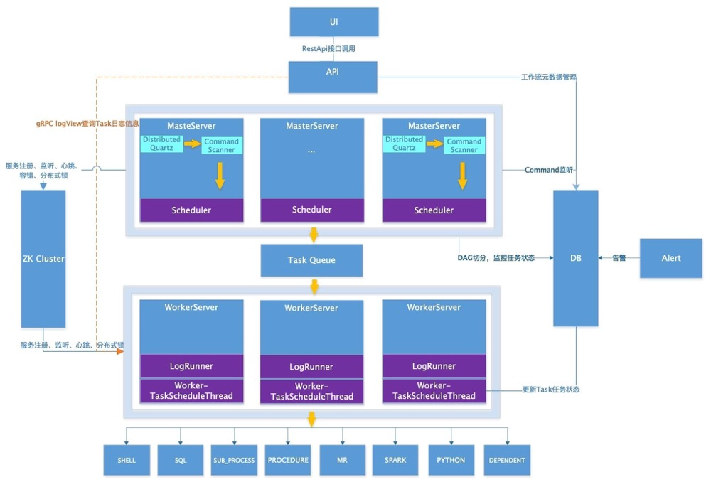

# 系统架构
## 架构图

## 架构说明

- **MasterServer**

  MasterServer采用分布式无中心设计理念，MasterServer主要负责 DAG 任务切分、任务提交监控，并同时监听其它MasterServer和WorkerServer的健康状态。 MasterServer服务启动时向Zookeeper注册临时节点，通过监听Zookeeper临时节点变化来进行容错处理。

  ##### 该服务内主要包含:

  - **Distributed Quartz**分布式调度组件，主要负责定时任务的启停操作，当quartz调起任务后，Master内部会有线程池具体负责处理任务的后续操作
  - **MasterSchedulerThread**是一个扫描线程，定时扫描数据库中的 **command** 表，根据不同的**命令类型**进行不同的业务操作
  - **MasterExecThread**主要是负责DAG任务切分、任务提交监控、各种不同命令类型的逻辑处理
  - **MasterTaskExecThread**主要负责任务的持久化

- **WorkerServer**

  WorkerServer也采用分布式无中心设计理念，WorkerServer主要负责任务的执行和提供日志服务。WorkerServer服务启动时向Zookeeper注册临时节点，并维持心跳。

  ##### 该服务包含：

  - **FetchTaskThread**主要负责不断从**Task Queue**中领取任务，并根据不同任务类型调用**TaskScheduleThread**对应执行器。
  - **LoggerServer**是一个RPC服务，提供日志分片查看、刷新和下载等功能

- **ZooKeeper**

  ZooKeeper服务，系统中的MasterServer和WorkerServer节点都通过ZooKeeper来进行集群管理和容错。另外系统还基于ZooKeeper进行事件监听和分布式锁。 我们也曾经基于Redis实现过队列，不过我们希望DolphinScheduler依赖到的组件尽量地少，所以最后还是去掉了Redis实现。

- **Task Queue**

  提供任务队列的操作，目前队列也是基于Zookeeper来实现。由于队列中存的信息较少，不必担心队列里数据过多的情况，实际上我们压测过百万级数据存队列，对系统稳定性和性能没影响。

- **Alert**

  提供告警相关接口，接口主要包括**告警**两种类型的告警数据的存储、查询和通知功能。其中通知功能又有**邮件通知**和**SNMP(暂未实现)**两种。

- **API**

  API接口层，主要负责处理前端UI层的请求。该服务统一提供RESTful api向外部提供请求服务。 接口包括工作流的创建、定义、查询、修改、发布、下线、手工启动、停止、暂停、恢复、从该节点开始执行等等。

- **UI**

  系统的前端页面，提供系统的各种可视化操作界面。