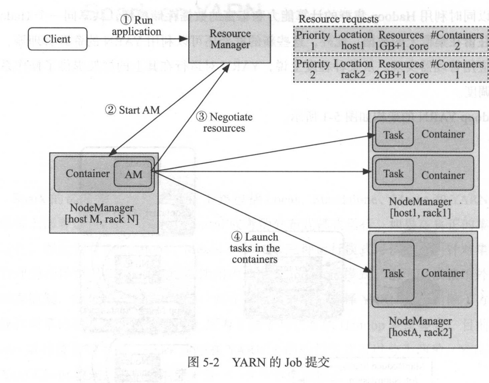
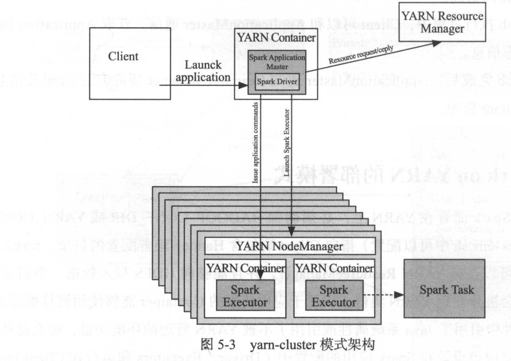
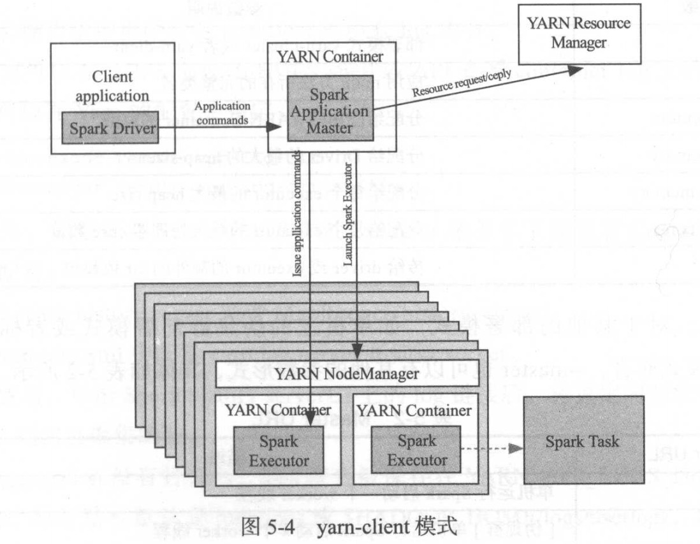
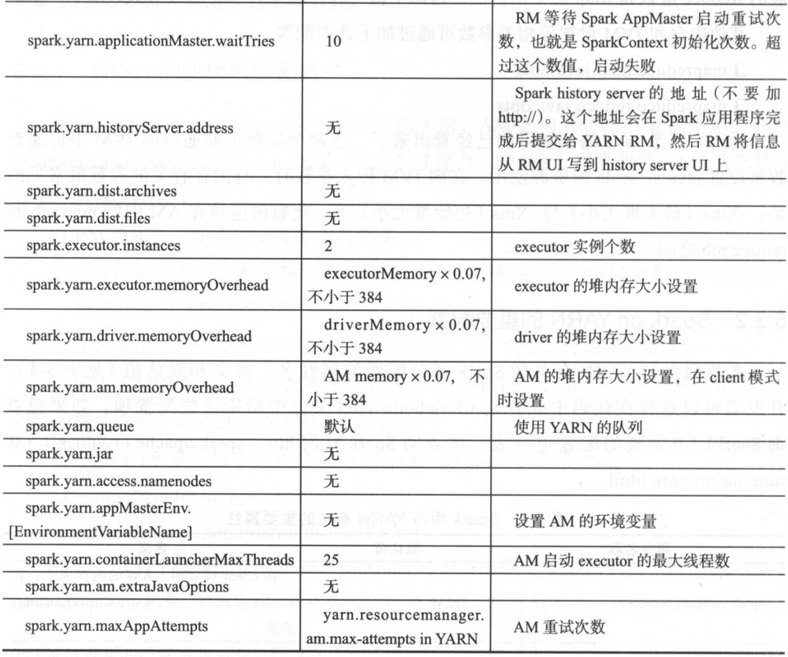

* Spark部署方式灵活多变，包含Local、Standalone、Mesos和Yarn、K8s的比你难过，如果是单机部署可以使用Local或者伪分布式模式运行。

# YARN概述

* Hadoop的资源协调者(Yet Another Resource Negotiator,YARN)是一个通用的资源管理系统，能够为上层应用提供统一的资源管理和资源调度。YARN的引入为集群在`利用率、资源统一管理和数据共享`带来巨大好处。
* YARN将资源管理和作业调度及监控分成了两个独立的服务程序---全局的资源管理(Resource Manager,RM)和针对每个应用的Master(ApplicationMaster,AM)。
* 在YARN的架构实现中，RM、NM、Container不需要关心应用程序的类型，一般特定的分布式框架运行在YARN上需要实现ApplicationMaster，然后就可以部署在YARN上，YARN`对运行在其上的框架提供了操作系统级别的调度`。

## Yarn架构


* ResourceManager(RN):负责全局资源管理。接收Client端任务请求，接收和监控NodeManager的资源情况汇报，负责资源的分配与调度，启动和监控ApplicationMaster。
* NodeManager(NM):可以看作节点上的资源和任务管理器，启动Container运行Task计算，汇报资源、Container情况给RM，汇报任务处理情况给AM。
* ApplicationMaster(AM):主要是的那个Application(JOB)的Task管理和调度，向RM申请资源，向NM发送launch Container指令，接收NM的Task处理状态信息。
* Container:YARN中的资源分配的单位。资源使用Container表示，每个任务占用一个Container，在Container中运行。

## Job处理流程



* Client提交一个Job到RM，进入RM的Scheduler队列等待调度。
* RM根据NM汇报的资源情况(NM会定时汇报资源和Container使用情况)，请求一个合适的NM启动Container，并在该Container中启动运行ApplicationMaster。
* ApplicationMaster启动后，注册到RM上，以使Client可以查看到AM的信息，便于Client直接和AM通信。
* AM根据Job划分的task情况，向RM协商申请Container资源。
* RM分配给AM Container资源后，AM根据Container内描述的资源信息，向对应的Nodemanager请求启动Container。
* NM启动Container并运行Task，各个Task在运行过程中向AM汇报进度状态信息，同时NM也会定时向RM汇报Container的使用情况。
* 在Job执行过程中，Client可以和AM通信，获取Application相关的进度和状态信息。
* 在Job完成后，AM通知RM清楚自己的相关信息，并释放Container资源。

# Spark on YARN部署模式

## 前提条件

* 确保HADOOP_CONF_DIR或YARN_CONF_DIR(在spark-env.sh中配置)指向Hadoop集群的相关配置。

## Spark在YARN的运行模式

### yarn-cluster

* Spark Driver运行在被YARN管理的ApplicationMaster进程中，在应用启动之后，Client端可以推出。

####  架构



#### 运行命令

```shell
spark-submit --class xxxx --master yarn-cluster \
[options] \
app jar \
[app options] \

# 例如
spark-submit --class org.apache.spark.examples.SparkPi \
--master yanr-cluster \
--num-executors 3 \
--driver-memory 4g \
--executor-memory 2g \
--executor-cores 4 \
---queue thequeue \
spark.jar 10
```

### yarn-client

* Driver运行在Client进程中，并且该模式下，ApplicationMaster只用于向YARN请求资源。，Client的Driver包含DAGScheduler及TaskScheduler因此必须等到应用执行完毕才能退出。

#### 架构



#### 运行命令

```shell
spark-submit --class xxxx --master yarn-client \
[options] \
app jar \
[app options] \

# 例如
spark-submit --class org.apache.spark.examples.SparkPi \
--master yarn-client \
--num-executors 3 \
--driver-memory 4g \
--executor-memory 2g \
--executor-cores 4 \
---queue thequeue \
spark.jar 10
```

### 常用参数

| 参数              | 参数说明                               |
| ----------------- | -------------------------------------- |
| --master          | 部署模式yarn-cluster或yarn-client      |
| --class           | 应用main方法所在的完整类名             |
| --num-executors   | 分配给应用的YARN Container的总数       |
| --driver-memory   | 分配给Driver的最大的heap size          |
| --executor-memory | 分配给每个executor的最大heap size      |
| --executor-cores  | 分配给每个executor的最大处理器core数量 |
| --jars            | 传给driver或executor的额外的jar依赖包  |

### 不同模式的区别

| Mode                | Yarn-client                       | Yarn-cluster                      | Spark Standalone      |
| ------------------- | --------------------------------- | --------------------------------- | --------------------- |
| Driver执行处        | Client                            | ApplicationMaster                 | Client                |
| 资源申请发起者      | ApplicationMaster                 | ApplicationMaster                 | Client                |
| Executor进程启动处  | Yarn NodeManager                  | Yarn NodeManager                  | Spark Worker          |
| 服务进程            | Yarn ResourceManager和NodeManager | Yarn ResourceManager和NodeManager | Spark Master及Workers |
| 是否支持Spark Shell | 是                                | 否                                | 是                    |

### Container log处理

* 如果log application开启(yarn.log-aggregation-enable)，container log会复制到HDFS中，然后在本地删除。这些log可以通过yarn logs -applicationId查看。也可以在HDFS shell或API查看container log文件，这些log文件目录通过以下参数指定

```shell
yarn.nodemanger.remote-app-log-dir
yarn.nodemanager.remote-app-log-dir-suffix
```

* Spark Web UI查看Container log，通过运行spark history server或MR history server，配置yarn-site.xml的yarn.log.server指向该server。
* 如果log aggregation没有开启，logs会保存在YARN_APP_LOGS_DIR指定的机器本地，保存路径默认为/tmp/logs或$HADOOP_HOME/logs/userlogs。

# Spark On YARN的配置重点

## YARN的自身内存配置

* yarn-site.xml

```properties
# 单个container可申请的最大与最小内存。运行Application时申请内存的大小应位于这两个参数指定的值之间。最小值还可用计算一个节点的最大container数目。
yarn.scheduler.maximum-allocation-mb
yarn.scheduler.minimum-allocation-mb
# 每个节点可用的最大内存，RM中的两个值不应该超过此值。此数值可用于计算container最大数目，即用此值除以RM中的最小容器内存。
yarn.nodemanager.resource.memory-mb
```

* mapred-site.xml

```properties
# 这两个参数指定用于MapReduce的两个Map任务和Reduce任务的内存大小。这两个值在RM中的最大、最小container内存值之间。没用配置通过max(MIN_CONTAINER_SIZE,(Total Available RAM)/containers))。
mapreduce.map.memory.mb
mapreduce.reduce.memory.mb
```

## Spark on YARN的重要配置

| 属性名称                                   | 默认值                   | 含义                                                         |
| ------------------------------------------ | ------------------------ | ------------------------------------------------------------ |
| spark.yarn.am.memory                       | 512M                     | 在client模式时，AM的内存大小;在cluster模式时，使用spark.driver.memory变量 |
| spark.driver.cores                         | 1                        | 在cluster模式时，driver使用的CPU核数，这时driver运行在AM中，其实也就是AM和核数；在client模式时，使用spark.yarn.am.cores变量 |
| spark.yarn.am.cores                        | 1                        | 在client模式时，AM的CPU核数                                  |
| spark.yarn.am.waitTime                     | 100000                   | 启动时等待时间                                               |
| spark.yarn.submit.file.replication         | 3                        | 应用程序上传到HDFS的文件的副本数                             |
| spark.yarn.preserve.staging.files          | false                    | 若为true，在Job结束后，将stage相关的文件保留而不是删除       |
| spark.yarn.scheduler.heartbeat.interval-ms | 5000                     | Spark AppMaster发送心跳信息给RM的时间间隔                    |
| spark.yarn.max.executor.failures           | 2倍于executor数，最小值3 | 导致应用程序宣告失败的最大executor失败次数                   |

