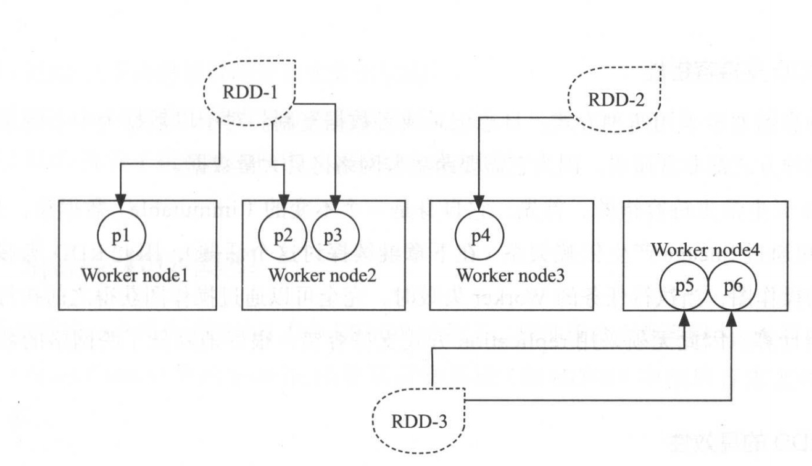
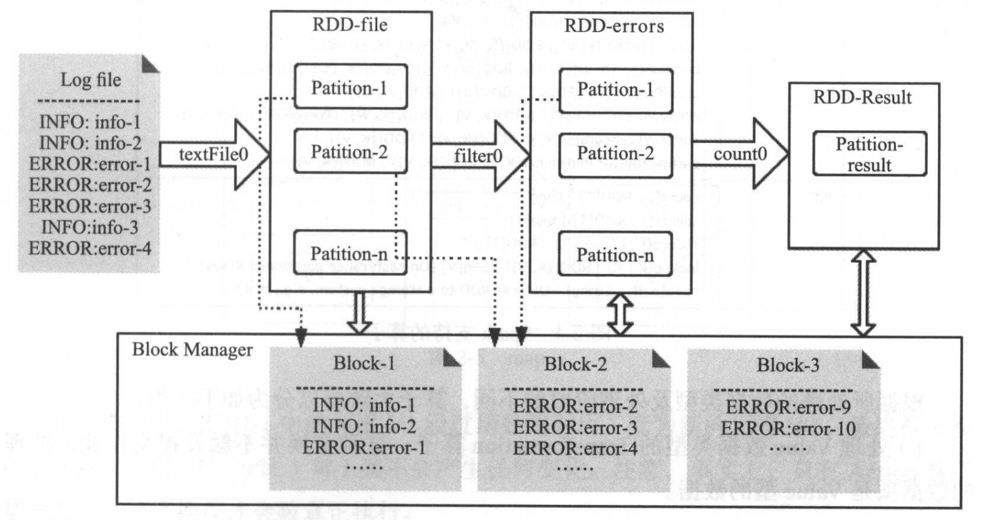
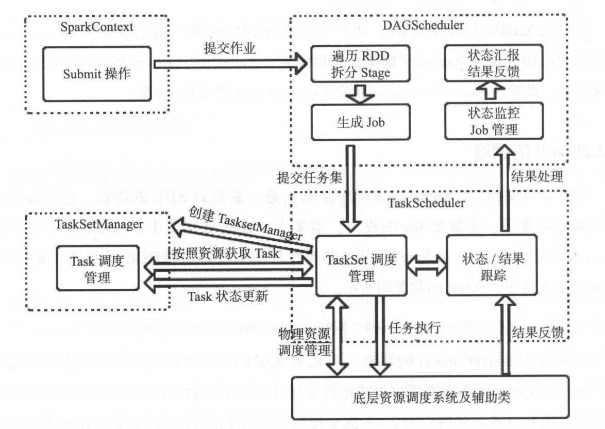
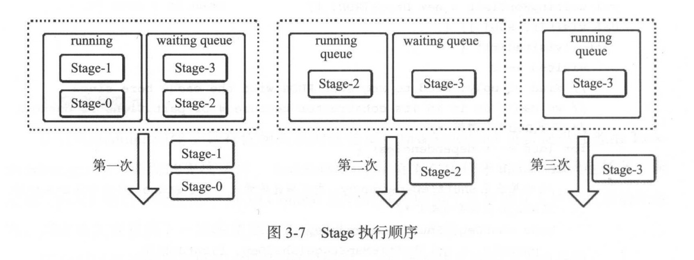
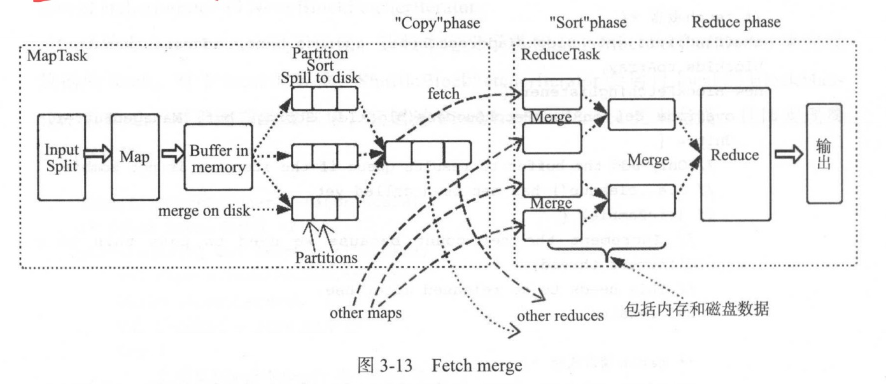

#          架构和环境
## 概述

* Spark基于内存计算，整合了内存计算的单元，并且启用了分布式数据集，能够提供交互式查询和优化迭代工作负载。
* MR不擅长长迭代、交互式和流式的计算工作，主要因为它缺乏计算的各个阶段有效的资源共享，Spark引入RDD解决这个问题，基于内存计算，提高数据处理实时性，并且高容错和可伸缩性，可以部署在大量廉价硬件上，形成集群。

### Spark和MapReduce的对比

#### 中间结果

* 基于MR的计算引擎通常将中间结果输出到磁盘，以达到存储和容错的目的。因此涉及到中间结果的迭代处理就会导致多个MR任务串联执行，此时就会导致数据处理延迟缓慢等问题。
* Spark将执行操作抽象成DAG，将多个Stage任务串联或并行执行，无需将Stage中间结果存储到HDFS。

#### 执行策略

* MapReduce在数据Shuffle之间需要在Map阶段需要进行分区快排并且在merge阶段时也需要对map输出阶段的各个文件进行归并排序，在shuffle拷贝文件也需要通过归并排序进行合并，此时就导致Shuffle十分消耗性能。
* Spark提供Bypass机制和不同模式numMapsForShuffle机制，会根据stage属性和配置决定shuffle过程是否需要排序，并且中间结果可以直接缓存在内存中。

#### 任务调度开销

* MapReduce系统为了处理长达数小时的批量作业，在一些极端情况，提交任务延迟非常高。
* Spark基于Actor模式并且基于Netty的NIO来进行进程间的通信，并且使用多线程以及Actor模型将任务解耦。

#### 容错性

* Spark RDD提供血缘关系(lineage),一旦失败可以根据父RDD自动重建，保证容错性。

## Spark架构

* 当计算与存储能力无法满足大规模数据处理需求时，自身CPU与存储无法水平扩展会导致先天的限制。

### 分布式系统架构

* 每个计算单元是松耦合的，并且计算单元包含自己的CPU、内存、总线及硬盘等私有计算资源。分布架构的问题在于共享资源的问题，因此为了资源的共享又不会导致IO的瓶颈，`分布式计算的原则是数据本地化计算`。

### Spark架构

* `基于Master-Slave模型`，Master负责控制整个集群的运行，Worker节点负责计算，接受Master节点指令并返回计算进程到Master；Executor负责任务的执行；Client是用户提交应用的客户端；Driver负责协调提交后的分布式应用。

<div align="center">  </div>

* worker负责管理计算节点并创建Executor来并行处理Task任务，Task执行过程所需文件和包由Driver序列化后传输给对应的Worker节点，Executor对相应分区的任务进行处理。

#### Spark基础组件

* Client:提交应用的客户端
* Driver:执行Application中的main函数并创建SparkContext
* ClusterManager:在Yarn中为RM，在Standalone模式为Master，控制整个集群。
* Worker:从节点，负责控制计算节点，启动Executor或Driver，在yarn模式中为NM
* Executor:在计算节点执行任务的组件。
* SparkContext:应用的上下文，控制应用的生命周期。
* RDD:弹性分布式数据集，Spark的基本计算单元，一组RDD可形成有向五环图。
* DAG Scheduler:根据应用构建基于Stage的DAG，并将Stage提交给Task Schduler
* Task Scheduler :将Task分发给Executor执行
* SparkEnv: 线程级别上下文，存储运行时重要组件
  * SparkConf:存储配置信息
  * BroadcastManager:负责广播变量的控制及元信息的存储。
  * BlockManager:负责Block的管理、创建和查找。
  * MetricsSystem:监控运行时的性能指标。
  * MapOutputTracker:负责shuffle元信息的存储。

#### Spark执行流程

* 用户在Client提交应用
* Master找到worker启动Driver
* Driver向RM或Master申请资源，并将应用转换为RDD Graph
* DAG Scheduler将RDD Graph转化为Stage的有向五环图提交给Task Scheduler
* Task Scheduler提交Task给Executor执行。

## Spark部署

### 环境准备

* JDK1.8和scala2.12
* 配置SSH免密码登陆

```shell
ssh-keygen -t rsa
scp ids_rsa.pub user@ip:~/.ssh/
mv id_rsa.pub authorized_keys
```

### Hadoop的安装配置

* 下载Hadoop压缩包
* 添加环境变量

```shell
export HADOOP_HOME=/usr/local/hadoop
export PATH=$HADOOP_HOME/bin:$PATH
export PATH=$HADOOP_HOME/sbin:$PATH
export HADOOP_MAPRED_HOME=$HADOOP_HOME
export HADOOP_COMMON=$HADOOP_HOME
export HADOOP_HDFS_HOME=$HADOOP_HOME
export YARN_HOME=$HADOOP_HOME
```

* 配置hadoop_env.sh

```shell
# The java implementation to use.
export JAVA_HOME=/Library/Java/JavaVirtualMachines/jdk1.8.0_221.jdk/Contents/Home
```

* core-site.xml

```xml
<property>
        <name>fs.defaultFS</name>
        <value>hdfs://bigdatadev:8020</value>
    </property>
    <property>
        <name>hadoop.tmp.dir</name>
        <value>/Users/xiamuguizhi/Documents/develop/learn/bigdata/hadoop-dir</value>
    </property>
    <!--修改缓冲区大小10MB，默认4KB-->
    <property>
        <name>io.file.buffer.size</name>
        <value>131072</value>
    </property>
    <!--开启代理用户权限相关-->
    <property>
        <name>hadoop.proxyuser.hduser.hosts</name>
        <value>*</value>
    </property>
    <property>
        <name>hadoop.proxyuser.hduser.groups</name>
        <value>*</value>
    </property>
```

* yarn-site.xml

```xml
    <property>
        <name>yarn.nodemanager.aux-services</name>
        <value>mapreduce_shuffle</value>
    </property>
    <property>
        <name>yarn.nodemanager.auxservices.mapreduce.shuffle.class</name>
        <value>org.apache.hadoop.mapred.ShuffleHandler</value>
    </property>    
    <property>
        <name>yarn.nodemanager.env-whitelist</name>
        <value>JAVA_HOME,HADOOP_COMMON_HOME,HADOOP_HDFS_HOME,HADOOP_CONF_DIR,CLASSPATH_PREPEND_DISTCACHE,HADOOP_YARN_HOME,HADOOP_MAPRED_HOME</value>
    </property>
    <property>
        <name>yarn.resourcemanager.hostname</name>
        <value>bigdatadev</value>
    </property>
    <property>
        <name>yarn.nodemanager.hostname</name>
        <value>bigdatadev</value>
    </property>
    <!--rm addrss配置-->
    <property>
        <name>yarn.resourcemanager.address</name>
        <value>bigdatadev:8032</value>
    </property>
    <!--rm调度器端口-->
    <property>
        <name>yarn.resourcemanager.scheduler.address</name>
        <value>bigdatadev:8030</value>
    </property>
    <!--resource-tracker端口-->
    <property>
        <name>yarn.resourcemanager.resource-tracker.address</name>
        <value>bigdatadev:8031</value>
    </property>
    <!--resource管理器端口-->
    <property>
        <name>yarn.resourcemanager.admin.address</name>
        <value>bigdatadev:8033</value>
    </property>    
    <!--webUI端口-->
    <property>
        <name>yarn.resourcemanager.webapp.address</name>
        <value>bigdatadev:8088</value>
    </property>   
```

* mapped-site.xml

```xml
<!--hadoop对map-reduce运行框架的三种实现，classic、yarn、local-->
   <property>
        <name>mapreduce.framework.name</name>
        <value>yarn</value>
    </property>
   <!--mapreduce jobHistory server地址，通过mr-history-server.sh start history启动-->
    <property>
        <name>mapreduce.jobhistory.address</name>
        <value>bigdatadev:10020</value>
    </property>
   <!--mapreduce jobHistory webUI地址-->
    <property>
        <name>mapreduce.jobhistory.webapp.address</name>
        <value>bigdatadev:19888</value>
    </property>
    <property>
        <name>mapreduce.application.classpath</name>
        <value>$HADOOP_HOME/share/hadoop/mapreduce/*:$HADOOP_HOME/share/hadoop/mapreduce/lib/*</value>
    </property>
```

* hdfs-site.xml

```xml
  <!--block副本数配置-->
  <property>
        <name>dfs.replication</name>
        <value>1</value>
  </property>
  <!--配置从节点名和端口号-->
  <property>
        <name>dfs.namenode.secondary.http-address</name>
        <value>bigdatadev:9001</value>
  </property>
  <!--配置namenode的存储目录-->
  <property>
        <name>dfs.namenode.name.dir</name>
        <value>file:/Users/xiamuguizhi/Documents/develop/learn/bigdata/hadoop-dir/namenode</value>
  </property>
  <!--配置datanode的存储目录-->
  <property>
        <name>dfs.datanode.data.dir</name>
        <value>file:/Users/xiamuguizhi/Documents/develop/learn/bigdata/hadoop-dir/datanode</value>
  </property>
  <!--开启webhdfs，否则不能使用webhdfs的liststatus、listfilestatus等命令来列出文件和状态等命令-->
  <property>
        <name>dfs.webhdfs.enabled</name>
        <value>true</value>
  </property>
```


* 创建目录

```shell
mkdir -p /Users/xiamuguizhi/Documents/develop/learn/bigdata/hadoop-dir/namenode
mkdir -p /Users/xiamuguizhi/Documents/develop/learn/bigdata/hadoop-dir/datanode
```

* 将所有从节点主机名加入slaves中

```properties
192.168.1.2 hadoop1
192.168.1.3 hadoop2
192.168.1.4 hadoop3
```

* 格式化namenode

### Spark安装部署

* 下载Spark安装包
* 配置Spark环境变量

```shell
export SPARK_HOME=/user/spark
PATH=$SPARK_HOME/bin
```

* 修改/etc/hosts加入集群中Master及各个Worker节点
* 配置spark-env.sh

```shell
export JAVA_HOME=/Library/Java/JavaVirtualMachines/jdk1.8.0_221.jdk/Contents/Home
export SCALA_HOME=/Users/xiamuguizhi/Documents/develop/workspace/tools/scala-2.12.11
export SPARK_MASTER_IP=127.0.0.1
export SPARK_WORKER_MEMORY=1g
```

* slaves,将各个worker节点添加至slaves节点

```
worker1
worker2
worker3
```

### Hadoop与Spark的集群复制

* 使用pssh工具将JDK、Scala、Hadoop环境、Spark环境、系统配置(host、profile)分发到集群服务器中

# Spark编程模型

## RDD弹性分布式数据集

### 数据处理模型

* Iterative Algorithms、Relational Queries、Map-Reduce、Stream Procesing。Hadoop MapReduce使用了MapReduce，Storm使用了Stream Processing模型。
* Spark的RDD使用了4种模型。

### 简介

* RDD是一个容错的、并行的数据结构，可以让用户显式地出将数据存储到磁盘或内存中，并控制数据的分区。RDD是Spark的核心，通过RDD的`依赖关系形成Spark的调度顺序`。
* 一个 RDD 由一个或者多个分区（Partitions）组成。对于 RDD 来说，每个分区会被一个计算任务所处理，用户可以在创建 RDD 时指定其分区个数，如果没有指定，则默认采用程序所分配到的 CPU 的核心数；
* RDD 拥有一个用于计算分区的函数 compute；
* RDD 会保存彼此间的依赖关系，RDD 的每次转换都会生成一个新的依赖关系，这种 RDD 之间的依赖关系就像流水线一样。在部分分区数据丢失后，可以通过这种依赖关系重新计算丢失的分区数据，而不是对 RDD 的所有分区进行重新计算；
* Key-Value 型的 RDD 还拥有 Partitioner(分区器)，用于决定数据被存储在哪个分区中，目前 Spark 中支持 HashPartitioner(按照哈希分区) 和 RangeParationer(按照范围进行分区);
* 一个优先位置列表 (可选)，用于存储每个分区的优先位置 (prefered location)。对于一个 HDFS 文件来说，这个列表保存的就是每个分区所在的块的位置，按照“移动数据不如移动计算“的理念，Spark 在进行任务调度的时候，会尽可能的将计算任务分配到其所要处理数据块的存储位置。

### 深入理解RDD

* RDD从直观上看是一个数组，本质上是逻辑分区记录的集合，在集群中，RDD可以包含多个分布在不同节点上的分区，每个分区是一个dataset片段。



#### RDD依赖

* RDD可以相互依赖，如果RDD的每个分区最多只能被一个Child RDD的分区使用，则为`窄依赖(narrow dependency)`;若多个Child RDD分区都可以依赖，则称之为`宽依赖(wide dependency)`。

#### RDD容错性

* 常用容错方式为日志记录和数据复制，这种方式都比较昂贵。
* RDD因为本身是不变的数据集，天然支持容错，RDD之间可以通过lineage产生依赖，RDD能够记住它的DAG图，当worker执行失败时，直接通过操作图获得之前执行的操作，重新计算。

#### RDD高效性

* RDD提供persistence和partitioning，用户可以通过persist与partitionBy控制这两个特性。RDD的分区特性与并行计算能力使得Spark可以更好的利用可伸缩硬件资源。

### RDD特性

* RDD是不变的数据结构存储
* RDD将数据存储内存中，从而提供了低延迟性。
* RDD是支持跨集群的分布式数据结构。
* RDD可以根据记录的key对结构分区。
* RDD提供粗粒度的操作，并且都支持分区。

## Spark的程序模型



* 对RDD的操作都会造成RDD的变换，其中RDD的每个逻辑分区Partition都应用BlockManager中的物理数据块Block。RDD核心是元数据结构，保存了逻辑分区与物理数据块之间的映射关系，以及父辈RDD的依赖转换。

# Spark机制原理

## Spark应用执行机制分析

* Spakr允许方式分为Cluster模式和Client模式

### 基础组件

#### Spark基础概念

* SparkContext:Spark应用程序的入口，负责调度各个运算资源，协调各个Worker Node上Executor
* Driver Program:运行Application的main()函数并创建SparkContext。
* RDD:Spark的核心数据结构，可以通过一系列算子进行操作，当RDD遇到Action算子时，将之前的所有算子形成一个有向无环图(DAG)。然后在Spark中转换为Job，提交到集群执行。
* Worker Node:集群中任何可以运行Application代码的节点，运行一个或多个Executor进程。
* Executor:为Application运行在Worker Node的一个进程，该进程负责运行Task，并且负责将数据存在内存或磁盘上。每个Application都会申请各自的Executor来处理任务。

#### Spark Application执行组件

* Task: RDD中的一个分区对应一个Task，Task是单个分区的最小处理流程单元。
* TaskSet:一组关联的，但相互之间没有Shuffle依赖关系的Task集合。
* Stage:一个TaskSet对应的调度阶段，每个Job会根据RDD的宽依赖关系被切分成很多Stage，每个Stage都包含一个TaskSet。
* Job:由Action算子触发生成的由一个或多个Stage组成的计算作业。
* Application:用户编写的Spark的应用程序，由一个或多个Job组成。提交到Spark之后，Spark为Application分配资源，将程序转换并执行。
* DAGScheduler:根据Job构建基于Stage的DAG，并提交Stage给TaskScheduler。
* TaskScheduler:将Taskset提交给Worker Node集群运行并返回结果。

### Client模式

* Driver进程运行在Client端，对应用进行管理监控
* 用户启动Client端，在Client端启动Driver进程。在Driver中启动或实例化DAGScheduler等组件
  * Driver向Master注册
  * Worker向Master注册，Master通过指令让那个Worker启动Executor。
  * Worker通过创建ExecutorRunner线程，进而ExecutorRunner线程启动ExecutBackend进程。
  * ExecutorBackend启动后，向Client端Driver进程内的SchedulerBackend注册，因此Driver进行就可以发现计算资源。
  * Driver的DAGScheduler解析应用中的RDD DAG并生成Stage，每个Stage包含的Taskset通过TaskScheduler分配给Executor。在Executor内部启动线程池并行化启动Task。

### Cluster模式

* Master节点指定某个Worker节点启动Driver进程，负责监控整个应用的执行。

1. Master调度应用，指定一个Worker节点启动Driver，即Schduler-Backend
2. Worker接收到Master命令后创建DriverRunner线程，在DriverRunner线程内创建SchedulerBackend进程。Driver充当整个作业主控进程。
3. Master指定其他Worker节点启动Executor。
4. Worker通过创建ExecutorRunner线程，进而ExecutorRunner现场启动ExecutBackend进程。
5. ExecutorBackend启动后，向Client端Driver进程内的SchedulerBackend注册，因此Driver进行就可以发现计算资源。
6. Driver的DAGScheduler解析应用中的RDD DAG并生成Stage，每个Stage包含的Taskset通过TaskScheduler分配给Executor。在Executor内部启动线程池并行化启动Task。

### Job的调度

* Job的提交都是在Action算子中隐式完成，最终会调用DAGScheduler中的Job提交接口。


* 详细调度流程



### Stage和TaskSetManager调度

* 当Job提交后，DAGScheduler会从RDD依赖链的末端触发，遍历整个RDD依赖链，根据ShuffleDependency划分Stage。

#### Stage调度

* 执行Action算子的RDD所在的Stage称为Final Stage，提交Stage，DAGScheduler会先判断该Stage的父Stage的执行结果是否可用，如果所有父Stage的执行结果可用，则提交该Stage。如果存在任意一个父Stage的结果不可用，则尝试迭代提交该父Stage。`不可用的Stage将会加入到waiting队列,等待执行`。



#### TaskSetManager

* DAGScheduler会将Stage转换成Taskset，最后提交给TaskScheduler，在taskScheduler内部创建`taskSetManager`来管理TaskSet的生命周期。可以说每个`stage`对应一个`taskManager`。taskScheduler在得到集群计算资源时，taskSetManager会分配task到具体worker节点执行。

## Spark存储与IO

### 存储概览


* 通信层:用于Master与Slave之间传递控制指令、状态等信息，通信层在架构也采用Master-Slave架构
* 存储层:用于保存数据块到内存、磁盘、或远端复制数据块。

#### 存储功能模块

* BlockManager:Spark提供操作Storage的统一接口类。
* BlockManagerMasterActor:Master创建，Slave利用该模块向Master传递信息。
* BlockManagerSlaveActor:Slave创建，Master利用该模块向Slave节点传递控制命令，控制Slave节点对block的读写。
* BlockManagerMaster:管理Actor通信。
* DiskStore:支持以文件方式读写的方式操作block
* MemoryStore:支持内存中的block读写。
* BlockManagerWorker:对远端异步传输进行管理。
* ConnectionManager:支持本地节点与远端节点数据block的传输。

### BlockManager通信

* BlockManager之间的通信由`Actor`来实现。
* Master节点上的BlockManagerMaster包含内容
  * BlockManagerManagerActor的Actor引用
  * BlockManagerSlaveActor的Ref引用
* Slave节点上的BlockManagerMaster包含内容
  * BlockManagerMasterActor的Ref引用
  * BlockManagerSlaveActor的Actor引用

## 容错机制及依赖

### 分布式系统数据集容错方案

* 数据检查点(Checkpoint机制)
* 记录数据的更新(Lineage血统机制)

### Spark容错性保证

* Spark为了降低容错操作成本，使用记录数据更新并且为了防止记录粒度过细，`RDD只支持粗粒度转换，即只记录单个块上执行的单个操作。`

#### Lineage机制

* RDD除了包含分区信息外，还包含父辈RDD变换过来的步骤，以及如何重建某一块数据的信息，RDD这种容错机制称为血统机制。
* RDD的Lineage记录是粗粒度的特定数据Transformation操作。当RDD的部分数据丢失，可以通过Lineage获取足够的信息重新计算和恢复丢失的数据分区。

## Shuffle机制

* Spark Shuffle机制是将一组无规则的数据转换为一组有一定规则的过程。Shuffle产生的经过排序的或者有规则的数据分片会溢写到磁盘，每个分片对应一个文件或所有分片放到一个数据文件中，在通过索引文件来记录每个分片在数据文件中的offset（类比Kafka存储的数据）。

### Shuffle的影响

* Shuffle 是一项昂贵的操作，因为它通常会跨节点操作数据，这会涉及磁盘 I/O，网络 I/O，和数据序列化。某些 Shuffle 操作还会消耗大量的堆内存，因为它们使用堆内存来临时存储需要网络传输的数据。Shuffle 还会在磁盘上生成大量中间文件，从 Spark 1.3 开始，这些文件将被保留，直到相应的 RDD 不再使用并进行垃圾回收，这样做是为了避免在计算时重复创建 Shuffle 文件。如果应用程序长期保留对这些 RDD 的引用，则垃圾回收可能在很长一段时间后才会发生，这意味着长时间运行的 Spark 作业可能会占用大量磁盘空间，通常可以使用 `spark.local.dir` 参数来指定这些临时文件的存储目录。

### 基于key的Hash方式


* 每个MapTask会根据ReduceTask的数量创建出相应的bucket，bucket的数量是M x R，其中M是Map的个数，R是Reduce的个数。
* MapTask产生的结果会根据`partition算法`填充到每个bucket中,ReduceTask启动时会根据task的id和所依赖的Mapper的id从远端或本地的block manager中取得响应的bucket作为Reducer的输入进行处理。

#### Spark Shuffle过程

* 将数据分成bucket，并将其写入磁盘的过程称为Shuffle Write
* 在存储Shuffle数据的节点Fetch数据，并执行用户定义的聚集操作，这个过程为Shuffle Fetch。

#### 存在的问题

* 容易形成过多的文件，假设MapperTask有1K，ReduceTask有1K那么最终就会生成1M个bucket文件。

### Shuffle consolidation

### 基本原理


* 在Shuffle consolidation中，每个bucket并非对应一个文件，而对应文件中的一个segement。同时Shuffle consolidation产生的Shuffle文件数量与Spark core的个数有关系。
* 假设job有4个Mapper和4个Reduce，有2个core能并行运行两个task，那么spark shuffle write需要16个bucket，也就是16个write handler。job中有4个Mapper分为两批运行，在第一批2个Mapper运行时会生成8个bucket，产生8个Shuffle文件。
* 理论上Shuffle consolidation产生的Shuffle文件数量为C X R，C时spark的core number数，R时Reduce的个数。如果core数和Mapper个数相同就和基于Hash的方式没太大区别了。

### Shuffle Fetch



* Shuffle fetch过来的数据会进行归并排序，根据相同key下不同的value会发送到同一个reducer使用，Aggregator本质是HashMap，它以map output的key为key，以所要的combine的类型为value的hashmap。shuffle fetch到的每一个key-value对更新或插入hashmap中，这样就不需要预先把所有的key-value进行merge sort，而是来一个处理一个省去外部排序的阶段。

