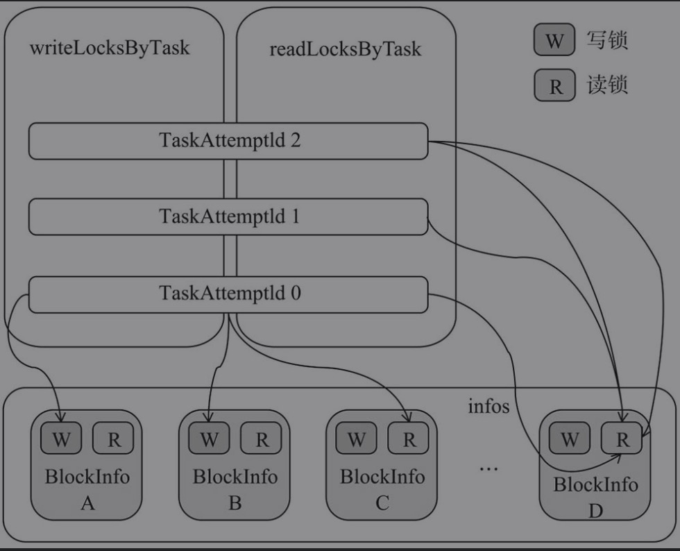

# 概述

* Spark存储体系是各个Driver和Executor实例中的BlockManager所组成的。

## 存储体系架构


* MemoryStore:内存存储，依赖于MemoryManager，负责对Block的内存存储。
* DiskStore：磁盘存储。依赖于DiskBlockManager，负责对Block的磁盘存储。
* BlockInfoManager：块信息管理器。负责对Block的元数据及锁资源进行管理。
* DiskBlockManager：磁盘块管理器。对磁盘上的文件及目录的读写操作进行管理。
* BlockManagerMaster：代理BlockManager与Driver上的BlockManagerMasterEndpoint通信。
* BlockManagerMasterEndpoint：由Driver上的SparkEnv负责创建和注册到Driver的RpcEnv中。BlockManagerMasterEndpoint只存在于Driver的SparkEnv中，Driver或Executor上的BlockManagerMaster的driverEndpoint属性将持有BlockManagerMaster-Endpoint的RpcEndpointRef。BlockManagerMasterEndpoint主要对各个节点上的BlockManager、BlockManager与Executor的映射关系及Block位置信息（即Block所在的BlockManager）等进行管理。
* BlockManagerSlaveEndpoint：每个Executor或Driver的SparkEnv中都有属于自己的BlockManagerSlaveEndpoint，分别由各自的SparkEnv负责创建和注册到各自的RpcEnv中。

## 基本概念

### BlockManagerId

* 在`Dirver或Executor执行的SparkEnv都有自己的Blockmanager，这些Blockmanager位于不同的节点和实例上`，BlockManager之间需要通过RpcEnv、shuffleClient及BlockTransferServer进行通信，每个BlockManager在集群中都有一个唯一标识。
* Spark通过BlockaManagerId中的`host、port、executorId`等信息来区别BlockManager。

```scala
class BlockManagerId private (
    // 当前blockManager所载的实例ID，如果是driver，id为driver，否则由Master负责给各个Executor分配，格式为app-日期格式字符串-数字
    private var executorId_ : String,
    private var host_ : String,
    private var port_ : Int,
    //拓扑信息。
    private var topologyInfo_ : Option[String])
  extends Externalizable {

  private def this() = this(null, null, 0, None)  // For deserialization only

  def executorId: String = executorId_

  if (null != host_) {
    Utils.checkHost(host_)
    assert (port_ > 0)
  }

  def hostPort: String = {
    // DEBUG code
    Utils.checkHost(host)
    assert (port > 0)
    host + ":" + port
  }

  def host: String = host_

  def port: Int = port_

  def topologyInfo: Option[String] = topologyInfo_

  // 当前BlockManager所在的实例是否是Driver。此方法实际根据executorId_的值是否是driver来判断。
  def isDriver: Boolean = {
    executorId == SparkContext.DRIVER_IDENTIFIER ||
      executorId == SparkContext.LEGACY_DRIVER_IDENTIFIER
  }

  // 将BlockManagerId写入
  override def writeExternal(out: ObjectOutput): Unit = Utils.tryOrIOException {
    out.writeUTF(executorId_)
    out.writeUTF(host_)
    out.writeInt(port_)
    out.writeBoolean(topologyInfo_.isDefined)
    // we only write topologyInfo if we have it
    topologyInfo.foreach(out.writeUTF(_: String))
  }

  // 读取数据
  override def readExternal(in: ObjectInput): Unit = Utils.tryOrIOException {
    executorId_ = in.readUTF()
    host_ = in.readUTF()
    port_ = in.readInt()
    val isTopologyInfoAvailable = in.readBoolean()
    topologyInfo_ = if (isTopologyInfoAvailable) Option(in.readUTF()) else None
  }

  @throws(classOf[IOException])
  private def readResolve(): Object = BlockManagerId.getCachedBlockManagerId(this)

  override def toString: String = s"BlockManagerId($executorId, $host, $port, $topologyInfo)"

  override def hashCode: Int =
    ((executorId.hashCode * 41 + host.hashCode) * 41 + port) * 41 + topologyInfo.hashCode

  override def equals(that: Any): Boolean = that match {
    case id: BlockManagerId =>
      executorId == id.executorId &&
        port == id.port &&
        host == id.host &&
        topologyInfo == id.topologyInfo
    case _ =>
      false
  }
}
```

### BlockId

* Spark存储体系中，数据读写是以Block为单位的，每个Block都有一个唯一标识。
* BlockId对象属性

```scala
 def name: String

  // convenience methods
  // 如果是RDD将转换为RDDBlockId
  def asRDDId: Option[RDDBlockId] = if (isRDD) Some(asInstanceOf[RDDBlockId]) else None
  // 当前BlockId是否是RddBlockId
  def isRDD: Boolean = isInstanceOf[RDDBlockId]
  // 是否ShuffleBlockId
  def isShuffle: Boolean = isInstanceOf[ShuffleBlockId]
  // 是否BroadcastBlockId
  def isBroadcast: Boolean = isInstanceOf[BroadcastBlockId]
```

### StorageLevel

```scala
 val NONE = new StorageLevel(false, false, false, false)
  val DISK_ONLY = new StorageLevel(true, false, false, false)
  val DISK_ONLY_2 = new StorageLevel(true, false, false, false, 2)
  val MEMORY_ONLY = new StorageLevel(false, true, false, true)
  val MEMORY_ONLY_2 = new StorageLevel(false, true, false, true, 2)
  val MEMORY_ONLY_SER = new StorageLevel(false, true, false, false)
  val MEMORY_ONLY_SER_2 = new StorageLevel(false, true, false, false, 2)
  val MEMORY_AND_DISK = new StorageLevel(true, true, false, true)
  val MEMORY_AND_DISK_2 = new StorageLevel(true, true, false, true, 2)
  val MEMORY_AND_DISK_SER = new StorageLevel(true, true, false, false)
  val MEMORY_AND_DISK_SER_2 = new StorageLevel(true, true, false, false, 2)
  val OFF_HEAP = new StorageLevel(true, true, true, false, 1)

// 传输属性
   private var _useDisk: Boolean,
    private var _useMemory: Boolean,
    private var _useOffHeap: Boolean,
    private var _deserialized: Boolean,
    private var _replication: Int = 1
```

#### toInt

* toInt方法实现，将boolean类型转换为整型

```scala
def toInt: Int = {
    var ret = 0
    if (_useDisk) {
      ret |= 8 // 1000 | 0000=1000
    }
    if (_useMemory) {
      ret |= 4 // 0100 | 0000 =0100
    }
    if (_useOffHeap) {
      ret |= 2  // 0010 | 0000 =0010
    }
    if (_deserialized) {
      ret |= 1  // 0001
    }
    ret  
  }
// 1000表示存储级别为允许写入磁盘；1100表示存储级别为允许写入磁盘和堆内存；1111表示存储级别为允许写入磁盘、堆内存及堆外内存，并且需要反序列化。
```

#### writeExternal

```scala
override def writeExternal(out: ObjectOutput): Unit = Utils.tryOrIOException {
    out.writeByte(toInt)
    out.writeByte(_replication)
  }
```

#### readExternal

```scala
 override def readExternal(in: ObjectInput): Unit = Utils.tryOrIOException {
    val flags = in.readByte()
    _useDisk = (flags & 8) != 0
    _useMemory = (flags & 4) != 0
    _useOffHeap = (flags & 2) != 0
    _deserialized = (flags & 1) != 0 // 0001 & 0001 =1 true
    _replication = in.readByte()
  }
```

### BlockInfo

* 描述块的元数据信息，包括存储级别，block类型，大小，锁信息等。

```scala
private[storage] class BlockInfo(
    // 存储级别
    val level: StorageLevel,
    // BlockInfo描述的Block的类型
    val classTag: ClassTag[_],
    // BlockInfo所描述的Block是否需要告知Master。
    val tellMaster: Boolean) {

  /**
   * The size of the block (in bytes)
   * block的大小
   */
  def size: Long = _size
  def size_=(s: Long): Unit = {
    _size = s
    checkInvariants()
  }
  private[this] var _size: Long = 0

  /**
   * The number of times that this block has been locked for reading.
   * BlockInfo所描述的Block被锁定读取的次数。
   */
  def readerCount: Int = _readerCount
  def readerCount_=(c: Int): Unit = {
    _readerCount = c
    checkInvariants()
  }
  private[this] var _readerCount: Int = 0

  /**
   * 任务尝试在对Block进行写操作前，首先必须获得对应BlockInfo的写锁。
   * _writerTask用于保存任务尝试的ID（每个任务在实际执行时，会多次尝试，每次尝试都会分配一个ID）。
   *
   * The task attempt id of the task which currently holds the write lock for this block, or
   * [[BlockInfo.NON_TASK_WRITER]] if the write lock is held by non-task code, or
   * [[BlockInfo.NO_WRITER]] if this block is not locked for writing.
   */
  def writerTask: Long = _writerTask
  def writerTask_=(t: Long): Unit = {
    _writerTask = t
    checkInvariants()
  }
  private[this] var _writerTask: Long = BlockInfo.NO_WRITER

  private def checkInvariants(): Unit = {
    // A block's reader count must be non-negative:
    assert(_readerCount >= 0)
    // A block is either locked for reading or for writing, but not for both at the same time:
    assert(_readerCount == 0 || _writerTask == BlockInfo.NO_WRITER)
  }

  checkInvariants()
}
```

### BlockResult

* 用于封装从本地的BlockManager中获取的Block数据及与Block相关联的度量数据。

```scala
private[spark] class BlockResult(
    // block及Block相关联的度量数据
    val data: Iterator[Any],
    // 读取block的方法，readMethod采用枚举类型DataReadMethod提供的Memory、Disk、Hadoop、Network四个枚举值。
    val readMethod: DataReadMethod.Value,
    // 读取block的字节长度                                
    val bytes: Long)
```

### BlockStatus

```scala
@DeveloperApi
case class BlockStatus(storageLevel: StorageLevel, memSize: Long, diskSize: Long) {
  // 是否存储到存储体系中
  def isCached: Boolean = memSize + diskSize > 0
}

@DeveloperApi
object BlockStatus {
  def empty: BlockStatus = BlockStatus(StorageLevel.NONE, memSize = 0L, diskSize = 0L)
}
```

# BlockInfoManager

* 对BlockInfo进行一些简单管理，主要对Block的锁资源进行管理。

## Block锁基本概念

* BlockInfoManager是BlockManager内部的子组件之一，BlockInfoManager对Block的锁管理采用了共享锁与排他锁，其中读锁是共享锁，写锁是排他锁。

### BlockInfoManager对Block的锁管理



* 由TaskAttemptId 0标记的任务尝试执行线程获取了BlockInfo A和BlockInfo B的写锁，并且获取了BlockInfo C和BlockInfo D的读锁。
* 由TaskAttemptId 1标记的任务尝试执行线程获取了BlockInfo D的读锁。
* 由TaskAttemptId 2标记的任务尝试执行线程多次获取了BlockInfo D的读锁，这说明Block的读锁是可以重入的。

## Block锁的实现

### registerTask

```scala
def registerTask(taskAttemptId: TaskAttemptId): Unit = synchronized {
    // 如果该taskAttemptId的读锁已经注册
    require(!readLocksByTask.contains(taskAttemptId),
      s"Task attempt $taskAttemptId is already registered")
    readLocksByTask(taskAttemptId) = ConcurrentHashMultiset.create()
  }
```

### currentTaskAttemptId

* 获取任务上下文TaskContext中当前正在执行的任务的TaskAttemptId。如果TaskContext中没有则返回BlockInfo.Not_Task_Writer

```scala
private def currentTaskAttemptId: TaskAttemptId = {
    Option(TaskContext.get()).map(_.taskAttemptId()).getOrElse(BlockInfo.NON_TASK_WRITER)
  }
```

### lockForReading

```scala
 def lockForReading(
      // blockId                    
      blockId: BlockId,
      // 当存在写锁时是否阻塞               
      blocking: Boolean = true): Option[BlockInfo] = synchronized {
    logTrace(s"Task $currentTaskAttemptId trying to acquire read lock for $blockId")
    do {
      // 获取对应的BlockInfo
      infos.get(blockId) match {
        case None => return None
        case Some(info) =>
          // 如果没有写锁，读锁+1
          if (info.writerTask == BlockInfo.NO_WRITER) {
            info.readerCount += 1
            // 将currentTaskAttemptId加入读锁队列
            readLocksByTask(currentTaskAttemptId).add(blockId)
            logTrace(s"Task $currentTaskAttemptId acquired read lock for $blockId")
            return Some(info)
          }
      }
      // 如果开启阻塞，则等到写锁完成进行读取
      if (blocking) {
        wait()
      }
    } while (blocking)
    None
  }
```

### lockForWriting

```scala
 def lockForWriting(
      blockId: BlockId,
      blocking: Boolean = true): Option[BlockInfo] = synchronized {
    logTrace(s"Task $currentTaskAttemptId trying to acquire write lock for $blockId")
    do {
      infos.get(blockId) match {
        case None => return None
        case Some(info) =>
          // 如果当前没有写锁，并且没有读锁
          if (info.writerTask == BlockInfo.NO_WRITER && info.readerCount == 0) {
            // 将当前TaskAttemptId赋值给_writerTask，表示目前该Block存在写锁
            info.writerTask = currentTaskAttemptId
            // 添加到写锁map中
            writeLocksByTask.addBinding(currentTaskAttemptId, blockId)
            logTrace(s"Task $currentTaskAttemptId acquired write lock for $blockId")
            // 返回info信息
            return Some(info)
          }
      }
      // 如果存在写锁或读锁阻塞，知道对方释放
      if (blocking) {
        wait()
      }
    } while (blocking)
    None
  }
```

### unlock

```scala
 def unlock(blockId: BlockId, taskAttemptId: Option[TaskAttemptId] = None): Unit = synchronized {
    // 获取taskId，如果当前没传入就调用currentTaskAttemptId
    val taskId = taskAttemptId.getOrElse(currentTaskAttemptId)
    logTrace(s"Task $taskId releasing lock for $blockId")
    // 获取当前blockInfo
    val info = get(blockId).getOrElse {
      throw new IllegalStateException(s"Block $blockId not found")
    }
    // 如果存在写锁
    if (info.writerTask != BlockInfo.NO_WRITER) {
      // 将writerTask设置为不存在写锁
      info.writerTask = BlockInfo.NO_WRITER
      // 移除写锁在map中的存储
      writeLocksByTask.removeBinding(taskId, blockId)
    } else {
      assert(info.readerCount > 0, s"Block $blockId is not locked for reading")
      // 读锁可重入减1
      info.readerCount -= 1
      // 获取读锁集合
      val countsForTask: ConcurrentHashMultiset[BlockId] = readLocksByTask(taskId)
      // 移除该锁
      val newPinCountForTask: Int = countsForTask.remove(blockId, 1) - 1
      assert(newPinCountForTask >= 0,
        s"Task $taskId release lock on block $blockId more times than it acquired it")
    }
    // 唤醒全部wait
    notifyAll()
  }
```

### downgradeLock

```scala
def downgradeLock(blockId: BlockId): Unit = synchronized {
    logTrace(s"Task $currentTaskAttemptId downgrading write lock for $blockId")
    val info = get(blockId).get
    require(info.writerTask == currentTaskAttemptId,
      s"Task $currentTaskAttemptId tried to downgrade a write lock that it does not hold on" +
        s" block $blockId")
    // 释放写锁
    unlock(blockId)
    // 添加读锁
    val lockOutcome = lockForReading(blockId, blocking = false)
    assert(lockOutcome.isDefined)
  }
```

### lockNewBlockForWriting

```scala
def lockNewBlockForWriting(
      blockId: BlockId,
      newBlockInfo: BlockInfo): Boolean = synchronized {
    logTrace(s"Task $currentTaskAttemptId trying to put $blockId")
    lockForReading(blockId) match {
        // 如果块已经存在，就没必要在获取写锁了
      case Some(info) =>
        // Block already exists. This could happen if another thread races with us to compute
        // the same block. In this case, just keep the read lock and return.
        false
      case None =>
        // Block does not yet exist or is removed, so we are free to acquire the write lock
        infos(blockId) = newBlockInfo
        lockForWriting(blockId)
        true
    }
  }
```

### removeBlock

```scala
 def removeBlock(blockId: BlockId): Unit = synchronized {
    logTrace(s"Task $currentTaskAttemptId trying to remove block $blockId")
    // 获取BlockInfo
    infos.get(blockId) match {
      case Some(blockInfo) =>
        if (blockInfo.writerTask != currentTaskAttemptId) {
          throw new IllegalStateException(
            s"Task $currentTaskAttemptId called remove() on block $blockId without a write lock")
        } else {
          // 将block在内存中移除
          infos.remove(blockId)
          // 释放读写锁
          blockInfo.readerCount = 0
          blockInfo.writerTask = BlockInfo.NO_WRITER
          writeLocksByTask.removeBinding(currentTaskAttemptId, blockId)
        }
      case None =>
        throw new IllegalArgumentException(
          s"Task $currentTaskAttemptId called remove() on non-existent block $blockId")
    }
    // 唤醒全部阻塞操作
    notifyAll()
  }
```

# DiskBlockManager

* 负责为逻辑的Block与数据写入磁盘的位置之间建立逻辑的映射关系。

## 相关属性

```scala
private[spark] class DiskBlockManager(conf: SparkConf,
                                       deleteFilesOnStop: Boolean) extends Logging {
  // 本地子目录个数
  private[spark] val subDirsPerLocalDir = conf.getInt("spark.diskStore.subDirectories", 64)

  /* Create one local directory for each path mentioned in spark.local.dir; then, inside this
   * directory, create multiple subdirectories that we will hash files into, in order to avoid
   * having really large inodes at the top level. */
  // 本地目录数组，创建本地目录
  private[spark] val localDirs: Array[File] = createLocalDirs(conf)
  // 本地目录创建失败
  if (localDirs.isEmpty) {
    logError("Failed to create any local dir.")
    System.exit(ExecutorExitCode.DISK_STORE_FAILED_TO_CREATE_DIR)
  }
  // The content of subDirs is immutable but the content of subDirs(i) is mutable. And the content
  // of subDirs(i) is protected by the lock of subDirs(i)
  private val subDirs = Array.fill(localDirs.length)(new Array[File](subDirsPerLocalDir))

  // 添加shutdown钩子函数
  private val shutdownHook = addShutdownHook()
```


## 本地目录结构

### createLocalDirs

```scala
 private def createLocalDirs(conf: SparkConf): Array[File] = {
   // 获取spark.local.dir配置
    Utils.getConfiguredLocalDirs(conf).flatMap { rootDir =>
      try {
        val localDir = Utils.createDirectory(rootDir, "blockmgr")
        logInfo(s"Created local directory at $localDir")
        Some(localDir)
      } catch {
        case e: IOException =>
          logError(s"Failed to create local dir in $rootDir. Ignoring this directory.", e)
          None
      }
    }
  }
```

### addShutdownHook

```scala
 private def addShutdownHook(): AnyRef = {
    logDebug("Adding shutdown hook") // force eager creation of logger
    ShutdownHookManager.addShutdownHook(ShutdownHookManager.TEMP_DIR_SHUTDOWN_PRIORITY + 1) { () =>
      logInfo("Shutdown hook called")
      // 关闭DiskBlockManager
      DiskBlockManager.this.doStop()
    }
  }
```


## DiskBlockManager相关方法

### getFile

```scala
 def getFile(filename: String): File = {
    // Figure out which local directory it hashes to, and which subdirectory in that
   // 获取非负数的hash值
    val hash = Utils.nonNegativeHash(filename)
    // 按照取余方式选中一级目录
    val dirId = hash % localDirs.length
    // 获取subDirId
    val subDirId = (hash / localDirs.length) % subDirsPerLocalDir

    // Create the subdirectory if it doesn't already exist
    val subDir = subDirs(dirId).synchronized {
      // 获取oldSubDir
      val old = subDirs(dirId)(subDirId)
      if (old != null) {
        old
      } else {
        val newDir = new File(localDirs(dirId), "%02x".format(subDirId))
        if (!newDir.exists() && !newDir.mkdir()) {
          throw new IOException(s"Failed to create local dir in $newDir.")
        }
        subDirs(dirId)(subDirId) = newDir
        newDir
      }
    }

    new File(subDir, filename)
  }
```

* 调用Utils工具类的nonNegativeHash方法获取文件名的非负哈希值。
* 从localDirs数组中按照取余方式获得选中的一级目录。
* 哈希值除以一级目录的大小获得商，然后用商数与subDirsPerLocalDir取余获得的余数作为选中的二级目录。
* 获取二级目录。如果二级目录不存在，则需要创建二级目录。
* 返回二级目录下的文件。

###  containsBlock

```scala
 def containsBlock(blockId: BlockId): Boolean = {
    getFile(blockId.name).exists()
  }
```

### getAllFiles

```scala
def getAllFiles(): Seq[File] = {
  // Get all the files inside the array of array of directories
  subDirs.flatMap { dir =>
    dir.synchronized {
      // Copy the content of dir because it may be modified in other threads
      dir.clone()
    }
  }.filter(_ != null).flatMap { dir =>
    val files = dir.listFiles()
    if (files != null) files else Seq.empty
  }
}
```

### createTempLocalBlock

* 为中间结果创建唯一的BlockId和文件，此文件将用于保存本地Block的数据。

```scala
 def createTempLocalBlock(): (TempLocalBlockId, File) = {
    // 创建中间零食结果本地BlockId
    var blockId = new TempLocalBlockId(UUID.randomUUID())
    // 如果存在则在生产
    while (getFile(blockId).exists()) {
      blockId = new TempLocalBlockId(UUID.randomUUID())
    }
    (blockId, getFile(blockId))
  }
```

### createTempShuffleBlock

* 创建唯一的BlockId和文件，用来存储Shuffle中间结果（即map任务的输出）。

```scala
def createTempShuffleBlock(): (TempShuffleBlockId, File) = {
    var blockId = new TempShuffleBlockId(UUID.randomUUID())
    while (getFile(blockId).exists()) {
      blockId = new TempShuffleBlockId(UUID.randomUUID())
    }
    (blockId, getFile(blockId))
  }
```

