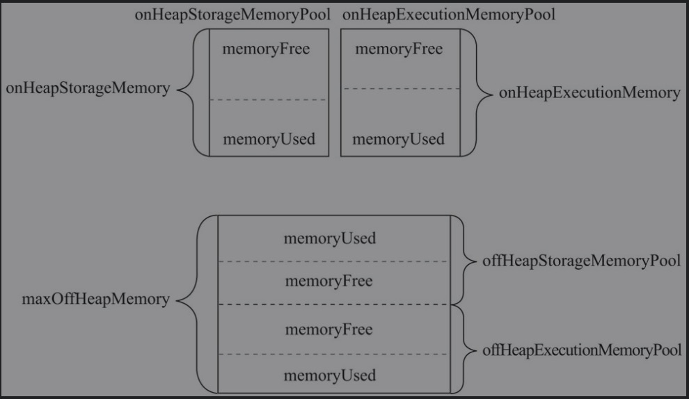
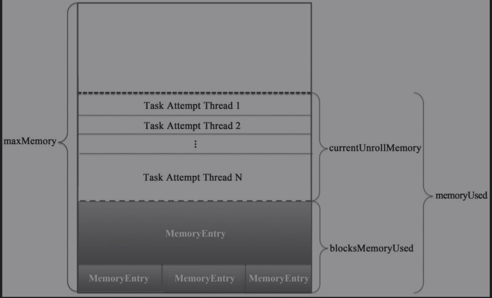

# 概述

* Spark存储体系是各个Driver和Executor实例中的BlockManager所组成的。

## 存储体系架构


* MemoryStore:内存存储，依赖于MemoryManager，负责对Block的内存存储。
* DiskStore：磁盘存储。依赖于DiskBlockManager，负责对Block的磁盘存储。
* BlockInfoManager：块信息管理器。负责对Block的元数据及锁资源进行管理。
* DiskBlockManager：磁盘块管理器。对磁盘上的文件及目录的读写操作进行管理。
* BlockManagerMaster：代理BlockManager与Driver上的BlockManagerMasterEndpoint通信。
* BlockManagerMasterEndpoint：由Driver上的SparkEnv负责创建和注册到Driver的RpcEnv中。BlockManagerMasterEndpoint只存在于Driver的SparkEnv中，Driver或Executor上的BlockManagerMaster的driverEndpoint属性将持有BlockManagerMaster-Endpoint的RpcEndpointRef。BlockManagerMasterEndpoint主要对各个节点上的BlockManager、BlockManager与Executor的映射关系及Block位置信息（即Block所在的BlockManager）等进行管理。
* BlockManagerSlaveEndpoint：每个Executor或Driver的SparkEnv中都有属于自己的BlockManagerSlaveEndpoint，分别由各自的SparkEnv负责创建和注册到各自的RpcEnv中。

## 基本概念

### BlockManagerId

* 在`Dirver或Executor执行的SparkEnv都有自己的Blockmanager，这些Blockmanager位于不同的节点和实例上`，BlockManager之间需要通过RpcEnv、shuffleClient及BlockTransferServer进行通信，每个BlockManager在集群中都有一个唯一标识。
* Spark通过BlockaManagerId中的`host、port、executorId`等信息来区别BlockManager。

```scala
class BlockManagerId private (
    // 当前blockManager所载的实例ID，如果是driver，id为driver，否则由Master负责给各个Executor分配，格式为app-日期格式字符串-数字
    private var executorId_ : String,
    private var host_ : String,
    private var port_ : Int,
    //拓扑信息。
    private var topologyInfo_ : Option[String])
  extends Externalizable {

  private def this() = this(null, null, 0, None)  // For deserialization only

  def executorId: String = executorId_

  if (null != host_) {
    Utils.checkHost(host_)
    assert (port_ > 0)
  }

  def hostPort: String = {
    // DEBUG code
    Utils.checkHost(host)
    assert (port > 0)
    host + ":" + port
  }

  def host: String = host_

  def port: Int = port_

  def topologyInfo: Option[String] = topologyInfo_

  // 当前BlockManager所在的实例是否是Driver。此方法实际根据executorId_的值是否是driver来判断。
  def isDriver: Boolean = {
    executorId == SparkContext.DRIVER_IDENTIFIER ||
      executorId == SparkContext.LEGACY_DRIVER_IDENTIFIER
  }

  // 将BlockManagerId写入
  override def writeExternal(out: ObjectOutput): Unit = Utils.tryOrIOException {
    out.writeUTF(executorId_)
    out.writeUTF(host_)
    out.writeInt(port_)
    out.writeBoolean(topologyInfo_.isDefined)
    // we only write topologyInfo if we have it
    topologyInfo.foreach(out.writeUTF(_: String))
  }

  // 读取数据
  override def readExternal(in: ObjectInput): Unit = Utils.tryOrIOException {
    executorId_ = in.readUTF()
    host_ = in.readUTF()
    port_ = in.readInt()
    val isTopologyInfoAvailable = in.readBoolean()
    topologyInfo_ = if (isTopologyInfoAvailable) Option(in.readUTF()) else None
  }

  @throws(classOf[IOException])
  private def readResolve(): Object = BlockManagerId.getCachedBlockManagerId(this)

  override def toString: String = s"BlockManagerId($executorId, $host, $port, $topologyInfo)"

  override def hashCode: Int =
    ((executorId.hashCode * 41 + host.hashCode) * 41 + port) * 41 + topologyInfo.hashCode

  override def equals(that: Any): Boolean = that match {
    case id: BlockManagerId =>
      executorId == id.executorId &&
        port == id.port &&
        host == id.host &&
        topologyInfo == id.topologyInfo
    case _ =>
      false
  }
}
```

### BlockId

* Spark存储体系中，数据读写是以Block为单位的，每个Block都有一个唯一标识。
* BlockId对象属性

```scala
 def name: String

  // convenience methods
  // 如果是RDD将转换为RDDBlockId
  def asRDDId: Option[RDDBlockId] = if (isRDD) Some(asInstanceOf[RDDBlockId]) else None
  // 当前BlockId是否是RddBlockId
  def isRDD: Boolean = isInstanceOf[RDDBlockId]
  // 是否ShuffleBlockId
  def isShuffle: Boolean = isInstanceOf[ShuffleBlockId]
  // 是否BroadcastBlockId
  def isBroadcast: Boolean = isInstanceOf[BroadcastBlockId]
```

### StorageLevel

```scala
 val NONE = new StorageLevel(false, false, false, false)
  val DISK_ONLY = new StorageLevel(true, false, false, false)
  val DISK_ONLY_2 = new StorageLevel(true, false, false, false, 2)
  val MEMORY_ONLY = new StorageLevel(false, true, false, true)
  val MEMORY_ONLY_2 = new StorageLevel(false, true, false, true, 2)
  val MEMORY_ONLY_SER = new StorageLevel(false, true, false, false)
  val MEMORY_ONLY_SER_2 = new StorageLevel(false, true, false, false, 2)
  val MEMORY_AND_DISK = new StorageLevel(true, true, false, true)
  val MEMORY_AND_DISK_2 = new StorageLevel(true, true, false, true, 2)
  val MEMORY_AND_DISK_SER = new StorageLevel(true, true, false, false)
  val MEMORY_AND_DISK_SER_2 = new StorageLevel(true, true, false, false, 2)
  val OFF_HEAP = new StorageLevel(true, true, true, false, 1)

// 传输属性
   private var _useDisk: Boolean,
    private var _useMemory: Boolean,
    private var _useOffHeap: Boolean,
    private var _deserialized: Boolean,
    private var _replication: Int = 1
```

#### toInt

* toInt方法实现，将boolean类型转换为整型

```scala
def toInt: Int = {
    var ret = 0
    if (_useDisk) {
      ret |= 8 // 1000 | 0000=1000
    }
    if (_useMemory) {
      ret |= 4 // 0100 | 0000 =0100
    }
    if (_useOffHeap) {
      ret |= 2  // 0010 | 0000 =0010
    }
    if (_deserialized) {
      ret |= 1  // 0001
    }
    ret  
  }
// 1000表示存储级别为允许写入磁盘；1100表示存储级别为允许写入磁盘和堆内存；1111表示存储级别为允许写入磁盘、堆内存及堆外内存，并且需要反序列化。
```

#### writeExternal

```scala
override def writeExternal(out: ObjectOutput): Unit = Utils.tryOrIOException {
    out.writeByte(toInt)
    out.writeByte(_replication)
  }
```

#### readExternal

```scala
 override def readExternal(in: ObjectInput): Unit = Utils.tryOrIOException {
    val flags = in.readByte()
    _useDisk = (flags & 8) != 0
    _useMemory = (flags & 4) != 0
    _useOffHeap = (flags & 2) != 0
    _deserialized = (flags & 1) != 0 // 0001 & 0001 =1 true
    _replication = in.readByte()
  }
```

### BlockInfo

* 描述块的元数据信息，包括存储级别，block类型，大小，锁信息等。

```scala
private[storage] class BlockInfo(
    // 存储级别
    val level: StorageLevel,
    // BlockInfo描述的Block的类型
    val classTag: ClassTag[_],
    // BlockInfo所描述的Block是否需要告知Master。
    val tellMaster: Boolean) {

  /**
   * The size of the block (in bytes)
   * block的大小
   */
  def size: Long = _size
  def size_=(s: Long): Unit = {
    _size = s
    checkInvariants()
  }
  private[this] var _size: Long = 0

  /**
   * The number of times that this block has been locked for reading.
   * BlockInfo所描述的Block被锁定读取的次数。
   */
  def readerCount: Int = _readerCount
  def readerCount_=(c: Int): Unit = {
    _readerCount = c
    checkInvariants()
  }
  private[this] var _readerCount: Int = 0

  /**
   * 任务尝试在对Block进行写操作前，首先必须获得对应BlockInfo的写锁。
   * _writerTask用于保存任务尝试的ID（每个任务在实际执行时，会多次尝试，每次尝试都会分配一个ID）。
   *
   * The task attempt id of the task which currently holds the write lock for this block, or
   * [[BlockInfo.NON_TASK_WRITER]] if the write lock is held by non-task code, or
   * [[BlockInfo.NO_WRITER]] if this block is not locked for writing.
   */
  def writerTask: Long = _writerTask
  def writerTask_=(t: Long): Unit = {
    _writerTask = t
    checkInvariants()
  }
  private[this] var _writerTask: Long = BlockInfo.NO_WRITER

  private def checkInvariants(): Unit = {
    // A block's reader count must be non-negative:
    assert(_readerCount >= 0)
    // A block is either locked for reading or for writing, but not for both at the same time:
    assert(_readerCount == 0 || _writerTask == BlockInfo.NO_WRITER)
  }

  checkInvariants()
}
```

### BlockResult

* 用于封装从本地的BlockManager中获取的Block数据及与Block相关联的度量数据。

```scala
private[spark] class BlockResult(
    // block及Block相关联的度量数据
    val data: Iterator[Any],
    // 读取block的方法，readMethod采用枚举类型DataReadMethod提供的Memory、Disk、Hadoop、Network四个枚举值。
    val readMethod: DataReadMethod.Value,
    // 读取block的字节长度                                
    val bytes: Long)
```

### BlockStatus

```scala
@DeveloperApi
case class BlockStatus(storageLevel: StorageLevel, memSize: Long, diskSize: Long) {
  // 是否存储到存储体系中
  def isCached: Boolean = memSize + diskSize > 0
}

@DeveloperApi
object BlockStatus {
  def empty: BlockStatus = BlockStatus(StorageLevel.NONE, memSize = 0L, diskSize = 0L)
}
```

# BlockInfoManager

* 对BlockInfo进行一些简单管理，主要对Block的锁资源进行管理。

## Block锁基本概念

* BlockInfoManager是BlockManager内部的子组件之一，BlockInfoManager对Block的锁管理采用了共享锁与排他锁，其中读锁是共享锁，写锁是排他锁。

### BlockInfoManager对Block的锁管理


* 由TaskAttemptId 0标记的任务尝试执行线程获取了BlockInfo A和BlockInfo B的写锁，并且获取了BlockInfo C和BlockInfo D的读锁。
* 由TaskAttemptId 1标记的任务尝试执行线程获取了BlockInfo D的读锁。
* 由TaskAttemptId 2标记的任务尝试执行线程多次获取了BlockInfo D的读锁，这说明Block的读锁是可以重入的。

## Block锁的实现

### registerTask

```scala
def registerTask(taskAttemptId: TaskAttemptId): Unit = synchronized {
    // 如果该taskAttemptId的读锁已经注册
    require(!readLocksByTask.contains(taskAttemptId),
      s"Task attempt $taskAttemptId is already registered")
    readLocksByTask(taskAttemptId) = ConcurrentHashMultiset.create()
  }
```

### currentTaskAttemptId

* 获取任务上下文TaskContext中当前正在执行的任务的TaskAttemptId。如果TaskContext中没有则返回BlockInfo.Not_Task_Writer

```scala
private def currentTaskAttemptId: TaskAttemptId = {
    Option(TaskContext.get()).map(_.taskAttemptId()).getOrElse(BlockInfo.NON_TASK_WRITER)
  }
```

### lockForReading

```scala
 def lockForReading(
      // blockId                    
      blockId: BlockId,
      // 当存在写锁时是否阻塞               
      blocking: Boolean = true): Option[BlockInfo] = synchronized {
    logTrace(s"Task $currentTaskAttemptId trying to acquire read lock for $blockId")
    do {
      // 获取对应的BlockInfo
      infos.get(blockId) match {
        case None => return None
        case Some(info) =>
          // 如果没有写锁，读锁+1
          if (info.writerTask == BlockInfo.NO_WRITER) {
            info.readerCount += 1
            // 将currentTaskAttemptId加入读锁队列
            readLocksByTask(currentTaskAttemptId).add(blockId)
            logTrace(s"Task $currentTaskAttemptId acquired read lock for $blockId")
            return Some(info)
          }
      }
      // 如果开启阻塞，则等到写锁完成进行读取
      if (blocking) {
        wait()
      }
    } while (blocking)
    None
  }
```

### lockForWriting

```scala
 def lockForWriting(
      blockId: BlockId,
      blocking: Boolean = true): Option[BlockInfo] = synchronized {
    logTrace(s"Task $currentTaskAttemptId trying to acquire write lock for $blockId")
    do {
      infos.get(blockId) match {
        case None => return None
        case Some(info) =>
          // 如果当前没有写锁，并且没有读锁
          if (info.writerTask == BlockInfo.NO_WRITER && info.readerCount == 0) {
            // 将当前TaskAttemptId赋值给_writerTask，表示目前该Block存在写锁
            info.writerTask = currentTaskAttemptId
            // 添加到写锁map中
            writeLocksByTask.addBinding(currentTaskAttemptId, blockId)
            logTrace(s"Task $currentTaskAttemptId acquired write lock for $blockId")
            // 返回info信息
            return Some(info)
          }
      }
      // 如果存在写锁或读锁阻塞，知道对方释放
      if (blocking) {
        wait()
      }
    } while (blocking)
    None
  }
```

### unlock

```scala
 def unlock(blockId: BlockId, taskAttemptId: Option[TaskAttemptId] = None): Unit = synchronized {
    // 获取taskId，如果当前没传入就调用currentTaskAttemptId
    val taskId = taskAttemptId.getOrElse(currentTaskAttemptId)
    logTrace(s"Task $taskId releasing lock for $blockId")
    // 获取当前blockInfo
    val info = get(blockId).getOrElse {
      throw new IllegalStateException(s"Block $blockId not found")
    }
    // 如果存在写锁
    if (info.writerTask != BlockInfo.NO_WRITER) {
      // 将writerTask设置为不存在写锁
      info.writerTask = BlockInfo.NO_WRITER
      // 移除写锁在map中的存储
      writeLocksByTask.removeBinding(taskId, blockId)
    } else {
      assert(info.readerCount > 0, s"Block $blockId is not locked for reading")
      // 读锁可重入减1
      info.readerCount -= 1
      // 获取读锁集合
      val countsForTask: ConcurrentHashMultiset[BlockId] = readLocksByTask(taskId)
      // 移除该锁
      val newPinCountForTask: Int = countsForTask.remove(blockId, 1) - 1
      assert(newPinCountForTask >= 0,
        s"Task $taskId release lock on block $blockId more times than it acquired it")
    }
    // 唤醒全部wait
    notifyAll()
  }
```

### downgradeLock

```scala
def downgradeLock(blockId: BlockId): Unit = synchronized {
    logTrace(s"Task $currentTaskAttemptId downgrading write lock for $blockId")
    val info = get(blockId).get
    require(info.writerTask == currentTaskAttemptId,
      s"Task $currentTaskAttemptId tried to downgrade a write lock that it does not hold on" +
        s" block $blockId")
    // 释放写锁
    unlock(blockId)
    // 添加读锁
    val lockOutcome = lockForReading(blockId, blocking = false)
    assert(lockOutcome.isDefined)
  }
```

### lockNewBlockForWriting

```scala
def lockNewBlockForWriting(
      blockId: BlockId,
      newBlockInfo: BlockInfo): Boolean = synchronized {
    logTrace(s"Task $currentTaskAttemptId trying to put $blockId")
    lockForReading(blockId) match {
        // 如果块已经存在，就没必要在获取写锁了
      case Some(info) =>
        // Block already exists. This could happen if another thread races with us to compute
        // the same block. In this case, just keep the read lock and return.
        false
      case None =>
        // Block does not yet exist or is removed, so we are free to acquire the write lock
        infos(blockId) = newBlockInfo
        lockForWriting(blockId)
        true
    }
  }
```

### removeBlock

```scala
 def removeBlock(blockId: BlockId): Unit = synchronized {
    logTrace(s"Task $currentTaskAttemptId trying to remove block $blockId")
    // 获取BlockInfo
    infos.get(blockId) match {
      case Some(blockInfo) =>
        if (blockInfo.writerTask != currentTaskAttemptId) {
          throw new IllegalStateException(
            s"Task $currentTaskAttemptId called remove() on block $blockId without a write lock")
        } else {
          // 将block在内存中移除
          infos.remove(blockId)
          // 释放读写锁
          blockInfo.readerCount = 0
          blockInfo.writerTask = BlockInfo.NO_WRITER
          writeLocksByTask.removeBinding(currentTaskAttemptId, blockId)
        }
      case None =>
        throw new IllegalArgumentException(
          s"Task $currentTaskAttemptId called remove() on non-existent block $blockId")
    }
    // 唤醒全部阻塞操作
    notifyAll()
  }
```

# DiskBlockManager

* 负责为逻辑的Block与数据写入磁盘的位置之间建立逻辑的映射关系。

## 相关属性

```scala
private[spark] class DiskBlockManager(conf: SparkConf,
                                       deleteFilesOnStop: Boolean) extends Logging {
  // 本地子目录个数
  private[spark] val subDirsPerLocalDir = conf.getInt("spark.diskStore.subDirectories", 64)

  /* Create one local directory for each path mentioned in spark.local.dir; then, inside this
   * directory, create multiple subdirectories that we will hash files into, in order to avoid
   * having really large inodes at the top level. */
  // 本地目录数组，创建本地目录
  private[spark] val localDirs: Array[File] = createLocalDirs(conf)
  // 本地目录创建失败
  if (localDirs.isEmpty) {
    logError("Failed to create any local dir.")
    System.exit(ExecutorExitCode.DISK_STORE_FAILED_TO_CREATE_DIR)
  }
  // The content of subDirs is immutable but the content of subDirs(i) is mutable. And the content
  // of subDirs(i) is protected by the lock of subDirs(i)
  private val subDirs = Array.fill(localDirs.length)(new Array[File](subDirsPerLocalDir))

  // 添加shutdown钩子函数
  private val shutdownHook = addShutdownHook()
```


## 本地目录结构

### createLocalDirs

```scala
 private def createLocalDirs(conf: SparkConf): Array[File] = {
   // 获取spark.local.dir配置
    Utils.getConfiguredLocalDirs(conf).flatMap { rootDir =>
      try {
        val localDir = Utils.createDirectory(rootDir, "blockmgr")
        logInfo(s"Created local directory at $localDir")
        Some(localDir)
      } catch {
        case e: IOException =>
          logError(s"Failed to create local dir in $rootDir. Ignoring this directory.", e)
          None
      }
    }
  }
```

### addShutdownHook

```scala
 private def addShutdownHook(): AnyRef = {
    logDebug("Adding shutdown hook") // force eager creation of logger
    ShutdownHookManager.addShutdownHook(ShutdownHookManager.TEMP_DIR_SHUTDOWN_PRIORITY + 1) { () =>
      logInfo("Shutdown hook called")
      // 关闭DiskBlockManager
      DiskBlockManager.this.doStop()
    }
  }
```


## DiskBlockManager相关方法

### getFile

```scala
 def getFile(filename: String): File = {
    // Figure out which local directory it hashes to, and which subdirectory in that
   // 获取非负数的hash值
    val hash = Utils.nonNegativeHash(filename)
    // 按照取余方式选中一级目录
    val dirId = hash % localDirs.length
    // 获取subDirId
    val subDirId = (hash / localDirs.length) % subDirsPerLocalDir

    // Create the subdirectory if it doesn't already exist
    val subDir = subDirs(dirId).synchronized {
      // 获取oldSubDir
      val old = subDirs(dirId)(subDirId)
      if (old != null) {
        old
      } else {
        val newDir = new File(localDirs(dirId), "%02x".format(subDirId))
        if (!newDir.exists() && !newDir.mkdir()) {
          throw new IOException(s"Failed to create local dir in $newDir.")
        }
        subDirs(dirId)(subDirId) = newDir
        newDir
      }
    }

    new File(subDir, filename)
  }
```

* 调用Utils工具类的nonNegativeHash方法获取文件名的非负哈希值。
* 从localDirs数组中按照取余方式获得选中的一级目录。
* 哈希值除以一级目录的大小获得商，然后用商数与subDirsPerLocalDir取余获得的余数作为选中的二级目录。
* 获取二级目录。如果二级目录不存在，则需要创建二级目录。
* 返回二级目录下的文件。

###  containsBlock

```scala
 def containsBlock(blockId: BlockId): Boolean = {
    getFile(blockId.name).exists()
  }
```

### getAllFiles

```scala
def getAllFiles(): Seq[File] = {
  // Get all the files inside the array of array of directories
  subDirs.flatMap { dir =>
    dir.synchronized {
      // Copy the content of dir because it may be modified in other threads
      dir.clone()
    }
  }.filter(_ != null).flatMap { dir =>
    val files = dir.listFiles()
    if (files != null) files else Seq.empty
  }
}
```

### createTempLocalBlock

* 为中间结果创建唯一的BlockId和文件，此文件将用于保存本地Block的数据。

```scala
 def createTempLocalBlock(): (TempLocalBlockId, File) = {
    // 创建中间零食结果本地BlockId
    var blockId = new TempLocalBlockId(UUID.randomUUID())
    // 如果存在则在生产
    while (getFile(blockId).exists()) {
      blockId = new TempLocalBlockId(UUID.randomUUID())
    }
    (blockId, getFile(blockId))
  }
```

### createTempShuffleBlock

* 创建唯一的BlockId和文件，用来存储Shuffle中间结果（即map任务的输出）。

```scala
def createTempShuffleBlock(): (TempShuffleBlockId, File) = {
    var blockId = new TempShuffleBlockId(UUID.randomUUID())
    while (getFile(blockId).exists()) {
      blockId = new TempShuffleBlockId(UUID.randomUUID())
    }
    (blockId, getFile(blockId))
  }
```

## DiskStore

```scala
private[spark] class DiskStore(
    conf: SparkConf,
    diskManager: DiskBlockManager,
    securityManager: SecurityManager) extends Logging {

  private val minMemoryMapBytes = conf.getSizeAsBytes("spark.storage.memoryMapThreshold", "2m")
  private val maxMemoryMapBytes = conf.get(config.MEMORY_MAP_LIMIT_FOR_TESTS)
  // 存储blockId和对应的blockSize
  private val blockSizes = new ConcurrentHashMap[BlockId, Long]()

  def getSize(blockId: BlockId): Long = blockSizes.get(blockId)

  /**
   * Invokes the provided callback function to write the specific block.
   *
   * @throws IllegalStateException if the block already exists in the disk store.
   */
  def put(blockId: BlockId)(writeFunc: WritableByteChannel => Unit): Unit = {
    if (contains(blockId)) {
      throw new IllegalStateException(s"Block $blockId is already present in the disk store")
    }
    logDebug(s"Attempting to put block $blockId")
    val startTime = System.currentTimeMillis
    // 根据block从DiskBlockManager中获取file
    val file: File = diskManager.getFile(blockId)
    val out = new CountingWritableChannel(openForWrite(file))
    var threwException: Boolean = true
    try {
      writeFunc(out)
      blockSizes.put(blockId, out.getCount)
      threwException = false
    } finally {
      try {
        out.close()
      } catch {
        case ioe: IOException =>
          if (!threwException) {
            threwException = true
            throw ioe
          }
      } finally {
         if (threwException) {
          remove(blockId)
        }
      }
    }
    val finishTime = System.currentTimeMillis
    logDebug("Block %s stored as %s file on disk in %d ms".format(
      file.getName,
      Utils.bytesToString(file.length()),
      finishTime - startTime))
  }

  def putBytes(blockId: BlockId, bytes: ChunkedByteBuffer): Unit = {
    put(blockId) { channel: WritableByteChannel =>
      bytes.writeFully(channel)
    }
  }

  def getBytes(blockId: BlockId): BlockData = {
    val file = diskManager.getFile(blockId.name)
    val blockSize = getSize(blockId)

    securityManager.getIOEncryptionKey() match {
      case Some(key) =>
        // Encrypted blocks cannot be memory mapped; return a special object that does decryption
        // and provides InputStream / FileRegion implementations for reading the data.
        new EncryptedBlockData(file, blockSize, conf, key)

      case _ =>
        new DiskBlockData(minMemoryMapBytes, maxMemoryMapBytes, file, blockSize)
    }
  }

  def remove(blockId: BlockId): Boolean = {
    blockSizes.remove(blockId)
    val file = diskManager.getFile(blockId.name)
    if (file.exists()) {
      val ret = file.delete()
      if (!ret) {
        logWarning(s"Error deleting ${file.getPath()}")
      }
      ret
    } else {
      false
    }
  }

  def contains(blockId: BlockId): Boolean = {
    val file = diskManager.getFile(blockId.name)
    file.exists()
  }

  private def openForWrite(file: File): WritableByteChannel = {
    val out = new FileOutputStream(file).getChannel()
    try {
      securityManager.getIOEncryptionKey().map { key =>
        CryptoStreamUtils.createWritableChannel(out, conf, key)
      }.getOrElse(out)
    } catch {
      case e: Exception =>
        Closeables.close(out, true)
        file.delete()
        throw e
    }
  }
```

# MemoryManager

## 内存池模型

* 内存池实质上是对物理内存的逻辑规划，协助Spark任务在运行时合理地使用内存资源。Spark将内存从逻辑上区分为堆内存和堆外内存，称为内存模式（MemoryMode）。这里的堆内存只是Jvm堆的一部分，堆外内存是Spark使用Unsafe的API直接在工作节点的系统内存中开辟的空间。

```java
@Private
public enum MemoryMode {
  ON_HEAP,
  OFF_HEAP
}
```

## MeoryPool

```scala
// lock对内存池提供线程安全保证的锁对象
private[memory] abstract class MemoryPool(lock: Object) {

  /**
   * 内存池大小，单位字节
   */
  @GuardedBy("lock")
  private[this] var _poolSize: Long = 0

  /**
   * Returns the current size of the pool, in bytes.
   */
  final def poolSize: Long = lock.synchronized {
    _poolSize
  }

  /**
   * Returns the amount of free memory in the pool, in bytes.
   */
  final def memoryFree: Long = lock.synchronized {
    _poolSize - memoryUsed
  }

  /**
   * Expands the pool by `delta` bytes.
   */
  final def incrementPoolSize(delta: Long): Unit = lock.synchronized {
    require(delta >= 0)
    _poolSize += delta
  }

  /**
   * Shrinks the pool by `delta` bytes.
   */
  final def decrementPoolSize(delta: Long): Unit = lock.synchronized {
    require(delta >= 0)
    require(delta <= _poolSize)
    require(_poolSize - delta >= memoryUsed)
    _poolSize -= delta
  }

  /**
   * Returns the amount of used memory in this pool (in bytes).
   */
  def memoryUsed: Long

```

### 内存模型

* PoolSize
  * memoryUsed
  * memoryFree

### StorageMemoryPool

* 存储物理内存的逻辑抽象，通过对存储内存的逻辑管理，提高Spark存储体系对内存的使用效率。

```scala
private[memory] class StorageMemoryPool(
    lock: Object,
    memoryMode: MemoryMode
  ) extends MemoryPool(lock) with Logging {

  /**
   * Storage内存池名称
   */
  private[this] val poolName: String = memoryMode match {
    case MemoryMode.ON_HEAP => "on-heap storage"
    case MemoryMode.OFF_HEAP => "off-heap storage"
  }

  @GuardedBy("lock")
  private[this] var _memoryUsed: Long = 0L

  /**
    * 使用内存量
    * @return
    */
  override def memoryUsed: Long = lock.synchronized {
    _memoryUsed
  }

  /**
   * memoryStore
   */
  private var _memoryStore: MemoryStore = _
  def memoryStore: MemoryStore = {
    if (_memoryStore == null) {
      throw new IllegalStateException("memory store not initialized yet")
    }
    _memoryStore
  }

  /**
   * Set the [[MemoryStore]] used by this manager to evict cached blocks.
   * This must be set after construction due to initialization ordering constraints.
   */
  final def setMemoryStore(store: MemoryStore): Unit = {
    _memoryStore = store
  }

  /**
   * 申请内存的N bytes换成给定的block
   * Acquire N bytes of memory to cache the given block, evicting existing ones if necessary.
   *
   * @return whether all N bytes were successfully granted.
   */
  def acquireMemory(blockId: BlockId, numBytes: Long): Boolean = lock.synchronized {
    val numBytesToFree = math.max(0, numBytes - memoryFree)
    acquireMemory(blockId, numBytes, numBytesToFree)
  }

  /**
   * Acquire N bytes of storage memory for the given block, evicting existing ones if necessary.
   *
   * @param blockId the ID of the block we are acquiring storage memory for
   * @param numBytesToAcquire the size of this block
   * @param numBytesToFree the amount of space to be freed through evicting blocks
   * @return whether all N bytes were successfully granted.
   */
  def acquireMemory(
      blockId: BlockId,
      numBytesToAcquire: Long,
      numBytesToFree: Long): Boolean = lock.synchronized {
    assert(numBytesToAcquire >= 0)
    assert(numBytesToFree >= 0)
    assert(memoryUsed <= poolSize)
    // 如果numBytesToFree大于0，说明memoryFree内存不足，需要使用内存
    if (numBytesToFree > 0) {
      memoryStore.evictBlocksToFreeSpace(Some(blockId), numBytesToFree, memoryMode)
    }
    // 释放内存后继续判断是否内足够可用内存可以申请
    // NOTE: If the memory store evicts blocks, then those evictions will synchronously call
    // back into this StorageMemoryPool in order to free memory. Therefore, these variables
    // should have been updated.
    val enoughMemory = numBytesToAcquire <= memoryFree
    if (enoughMemory) {
      _memoryUsed += numBytesToAcquire
    }
    enoughMemory
  }

  def releaseMemory(size: Long): Unit = lock.synchronized {
    if (size > _memoryUsed) {
      logWarning(s"Attempted to release $size bytes of storage " +
        s"memory when we only have ${_memoryUsed} bytes")
      _memoryUsed = 0
    } else {
      _memoryUsed -= size
    }
  }

  def releaseAllMemory(): Unit = lock.synchronized {
    _memoryUsed = 0
  }

  /**
   * Free space to shrink the size of this storage memory pool by `spaceToFree` bytes.
   * Note: this method doesn't actually reduce the pool size but relies on the caller to do so.
   *
   * @return number of bytes to be removed from the pool's capacity.
   * 用于释放指定大小的空间，缩小内存池的大小。
   */
  def freeSpaceToShrinkPool(spaceToFree: Long): Long = lock.synchronized {
    // 计算最小的空闲逻辑内存
    val spaceFreedByReleasingUnusedMemory = math.min(spaceToFree, memoryFree)
    // 计算剩余的空闲内存
    val remainingSpaceToFree = spaceToFree - spaceFreedByReleasingUnusedMemory
    // 如果大于0
    if (remainingSpaceToFree > 0) {
      // If reclaiming free memory did not adequately shrink the pool, begin evicting blocks:
      // 后收其他block的内存
      val spaceFreedByEviction =
        memoryStore.evictBlocksToFreeSpace(None, remainingSpaceToFree, memoryMode)
      // When a block is released, BlockManager.dropFromMemory() calls releaseMemory(), so we do
      // not need to decrement _memoryUsed here. However, we do need to decrement the pool size.
      spaceFreedByReleasingUnusedMemory + spaceFreedByEviction
    } else {
      spaceFreedByReleasingUnusedMemory
    }
  }
}
```

## MemoryManager模型

### MemoryManager属性

```scala
/**
 *
 * @param conf spark集群配置
 * @param numCores CPU核数
 * @param onHeapStorageMemory 堆内Storage区域内存
 * @param onHeapExecutionMemory  堆内Execution内存
 */
private[spark] abstract class MemoryManager(
    conf: SparkConf,
    numCores: Int,
    onHeapStorageMemory: Long,
    onHeapExecutionMemory: Long) extends Logging {

  // -- Methods related to memory allocation policies and bookkeeping ------------------------------

  /**
    *  堆内/堆外，内存管理池
    */
  @GuardedBy("this")
  protected val onHeapStorageMemoryPool = new StorageMemoryPool(this, MemoryMode.ON_HEAP)
  @GuardedBy("this")
  protected val offHeapStorageMemoryPool = new StorageMemoryPool(this, MemoryMode.OFF_HEAP)
  @GuardedBy("this")
  protected val onHeapExecutionMemoryPool = new ExecutionMemoryPool(this, MemoryMode.ON_HEAP)
  @GuardedBy("this")
  protected val offHeapExecutionMemoryPool = new ExecutionMemoryPool(this, MemoryMode.OFF_HEAP)

  onHeapStorageMemoryPool.incrementPoolSize(onHeapStorageMemory)
  onHeapExecutionMemoryPool.incrementPoolSize(onHeapExecutionMemory)

  //"spark.memory.offHeap.size" 最大堆外内存
  protected[this] val maxOffHeapMemory = conf.get(MEMORY_OFFHEAP_SIZE)
  // 堆外storage区域内存
  protected[this] val offHeapStorageMemory =
    (maxOffHeapMemory * conf.getDouble("spark.memory.storageFraction", 0.5)).toLong

  // 初始化堆外execution poolSize
  offHeapExecutionMemoryPool.incrementPoolSize(maxOffHeapMemory - offHeapStorageMemory)
  offHeapStorageMemoryPool.incrementPoolSize(offHeapStorageMemory)
```



* 毫不相干的onHeapStorageMemoryPool和onHeapExecutionMemory-Pool合在了一起，将堆内存作为一个整体看待。而且onHeapStorageMemoryPool与onHeap-ExecutionMemoryPool之间，offHeapStorageMemoryPool与offHeapExecutionMemoryPool之间的实线也调整为虚线，表示它们之间都是“软”边界。存储方或计算方的空闲空间（即memoryFree表示的区域）都可以借给另一方使用。

### UnifiedMemoryManager

```scala
private[spark] class UnifiedMemoryManager private[memory] (
    conf: SparkConf,
    val maxHeapMemory: Long,
    onHeapStorageRegionSize: Long,
    numCores: Int)
  extends MemoryManager(
    conf,
    numCores,
    onHeapStorageRegionSize,
    maxHeapMemory - onHeapStorageRegionSize) {

  /**
   * 判断内存大小
   */
  private def assertInvariants(): Unit = {
    assert(onHeapExecutionMemoryPool.poolSize + onHeapStorageMemoryPool.poolSize == maxHeapMemory)
    assert(
      offHeapExecutionMemoryPool.poolSize + offHeapStorageMemoryPool.poolSize == maxOffHeapMemory)
  }

  assertInvariants()

  /**
   * 最大堆内内存
   * @return
   */
  override def maxOnHeapStorageMemory: Long = synchronized {
    maxHeapMemory - onHeapExecutionMemoryPool.memoryUsed
  }

  override def maxOffHeapStorageMemory: Long = synchronized {
    maxOffHeapMemory - offHeapExecutionMemoryPool.memoryUsed
  }

  /**
   * Try to acquire up to `numBytes` of execution memory for the current task and return the
   * number of bytes obtained, or 0 if none can be allocated.
   *
   * This call may block until there is enough free memory in some situations, to make sure each
   * task has a chance to ramp up to at least 1 / 2N of the total memory pool (where N is the # of
   * active tasks) before it is forced to spill. This can happen if the number of tasks increase
   * but an older task had a lot of memory already.
   */
  override private[memory] def acquireExecutionMemory(
      numBytes: Long,
      taskAttemptId: Long,
      memoryMode: MemoryMode): Long = synchronized {
    assertInvariants()
    assert(numBytes >= 0)
    val (executionPool, storagePool, storageRegionSize, maxMemory) = memoryMode match {
      case MemoryMode.ON_HEAP => (
        onHeapExecutionMemoryPool,
        onHeapStorageMemoryPool,
        onHeapStorageRegionSize,
        maxHeapMemory)
      case MemoryMode.OFF_HEAP => (
        offHeapExecutionMemoryPool,
        offHeapStorageMemoryPool,
        offHeapStorageMemory,
        maxOffHeapMemory)
    }

    /**
     * 申请storge区域的内存到execution中使用
     * Grow the execution pool by evicting cached blocks, thereby shrinking the storage pool.
     *
     * When acquiring memory for a task, the execution pool may need to make multiple
     * attempts. Each attempt must be able to evict storage in case another task jumps in
     * and caches a large block between the attempts. This is called once per attempt.
     */
    def maybeGrowExecutionPool(extraMemoryNeeded: Long): Unit = {
      if (extraMemoryNeeded > 0) {
        // There is not enough free memory in the execution pool, so try to reclaim memory from
        // storage. We can reclaim any free memory from the storage pool. If the storage pool
        // has grown to become larger than `storageRegionSize`, we can evict blocks and reclaim
        // the memory that storage has borrowed from execution.
        val memoryReclaimableFromStorage: Long = math.max(
          storagePool.memoryFree,
          storagePool.poolSize - storageRegionSize)
        if (memoryReclaimableFromStorage > 0) {
          // Only reclaim as much space as is necessary and available:
          val spaceToReclaim = storagePool.freeSpaceToShrinkPool(
            math.min(extraMemoryNeeded, memoryReclaimableFromStorage))
          storagePool.decrementPoolSize(spaceToReclaim)
          executionPool.incrementPoolSize(spaceToReclaim)
        }
      }
    }

    /**
     * The size the execution pool would have after evicting storage memory.
     *
     * The execution memory pool divides this quantity among the active tasks evenly to cap
     * the execution memory allocation for each task. It is important to keep this greater
     * than the execution pool size, which doesn't take into account potential memory that
     * could be freed by evicting storage. Otherwise we may hit SPARK-12155.
     *
     * Additionally, this quantity should be kept below `maxMemory` to arbitrate fairness
     * in execution memory allocation across tasks, Otherwise, a task may occupy more than
     * its fair share of execution memory, mistakenly thinking that other tasks can acquire
     * the portion of storage memory that cannot be evicted.
     */
    def computeMaxExecutionPoolSize(): Long = {
      maxMemory - math.min(storagePool.memoryUsed, storageRegionSize)
    }

    executionPool.acquireMemory(
      numBytes, taskAttemptId, maybeGrowExecutionPool, () => computeMaxExecutionPoolSize)
  }

  override def acquireStorageMemory(
      blockId: BlockId,
      numBytes: Long,
      memoryMode: MemoryMode): Boolean = synchronized {
    assertInvariants()
    assert(numBytes >= 0)
    val (executionPool, storagePool, maxMemory) = memoryMode match {
      case MemoryMode.ON_HEAP => (
        onHeapExecutionMemoryPool,
        onHeapStorageMemoryPool,
        maxOnHeapStorageMemory)
      case MemoryMode.OFF_HEAP => (
        offHeapExecutionMemoryPool,
        offHeapStorageMemoryPool,
        maxOffHeapStorageMemory)
    }
    // 超过最大内存限制
    if (numBytes > maxMemory) {
      // Fail fast if the block simply won't fit
      logInfo(s"Will not store $blockId as the required space ($numBytes bytes) exceeds our " +
        s"memory limit ($maxMemory bytes)")
      return false
    }
    // 如果大于storagePool的free内存
    if (numBytes > storagePool.memoryFree) {
      // There is not enough free memory in the storage pool, so try to borrow free memory from
      // the execution pool.
      // 尝试区execution申请内存
      // fixme 这里storage区域不足，去申请execution区域内存，但是这里没有校验execution+storge的free内存是否满足申请，如果不满足还需要走到最终storagePool后才能感知，
      // fixme 然后去尝试回收其他block的内存，为什么不能在这里直接就进行尝试，回收其他block，链路不用在走下去
      val memoryBorrowedFromExecution = Math.min(executionPool.memoryFree,
        numBytes - storagePool.memoryFree)
      executionPool.decrementPoolSize(memoryBorrowedFromExecution)
      storagePool.incrementPoolSize(memoryBorrowedFromExecution)
    }
    storagePool.acquireMemory(blockId, numBytes)
  }

  override def acquireUnrollMemory(
      blockId: BlockId,
      numBytes: Long,
      memoryMode: MemoryMode): Boolean = synchronized {
    acquireStorageMemory(blockId, numBytes, memoryMode)
  }
}

object UnifiedMemoryManager {

  // Set aside a fixed amount of memory for non-storage, non-execution purposes.
  // This serves a function similar to `spark.memory.fraction`, but guarantees that we reserve
  // sufficient memory for the system even for small heaps. E.g. if we have a 1GB JVM, then
  // the memory used for execution and storage will be (1024 - 300) * 0.6 = 434MB by default.
  private val RESERVED_SYSTEM_MEMORY_BYTES = 300 * 1024 * 1024

  def apply(conf: SparkConf, numCores: Int): UnifiedMemoryManager = {
    val maxMemory = getMaxMemory(conf)
    new UnifiedMemoryManager(
      conf,
      maxHeapMemory = maxMemory,
      onHeapStorageRegionSize =
        (maxMemory * conf.getDouble("spark.memory.storageFraction", 0.5)).toLong,
      numCores = numCores)
  }

  /**
   * 返回storage和execution区域共享内存部分
   * Return the total amount of memory shared between execution and storage, in bytes.
   */
  private def getMaxMemory(conf: SparkConf): Long = {
    val systemMemory = conf.getLong("spark.testing.memory", Runtime.getRuntime.maxMemory)
    val reservedMemory = conf.getLong("spark.testing.reservedMemory",
      if (conf.contains("spark.testing")) 0 else RESERVED_SYSTEM_MEMORY_BYTES)
    val minSystemMemory = (reservedMemory * 1.5).ceil.toLong
    if (systemMemory < minSystemMemory) {
      throw new IllegalArgumentException(s"System memory $systemMemory must " +
        s"be at least $minSystemMemory. Please increase heap size using the --driver-memory " +
        s"option or spark.driver.memory in Spark configuration.")
    }
    // SPARK-12759 Check executor memory to fail fast if memory is insufficient
    if (conf.contains("spark.executor.memory")) {
      // executor内存
      val executorMemory = conf.getSizeAsBytes("spark.executor.memory")
      if (executorMemory < minSystemMemory) {
        throw new IllegalArgumentException(s"Executor memory $executorMemory must be at least " +
          s"$minSystemMemory. Please increase executor memory using the " +
          s"--executor-memory option or spark.executor.memory in Spark configuration.")
      }
    }
    val usableMemory = systemMemory - reservedMemory
    val memoryFraction = conf.getDouble("spark.memory.fraction", 0.6)
    (usableMemory * memoryFraction).toLong
  }
}
```

### StaticMemoryManager

* Exection和Storage区域不能互相使用对方的内存。

## MemoryStore

* MemoryStore负责将Block存储到内存。Spark通过将广播数据、RDD、Shuffle数据存储到内存，减少了对磁盘I/O的依赖，提高了程序的读写效率。

### 内存模型



* 整个MemoryStore的存储分为三块：一块是MemoryStore的entries属性持有的很多MemoryEntry所占据的内存blocksMemoryUsed；一块是onHeapUnroll-MemoryMap或offHeapUnrollMemoryMap中使用展开方式占用的内存currentUnroll-Memory。展开Block的行为类似于人们生活中的“占座”，一间教室里有些座位有人，有些则空着。在座位上放一本书表示有人正在使用，那么别人就不会坐这些座位。这可以防止在你需要座位的时候，却发现已经没有了位置。这样可以防止在向内存真正写入数据时，内存不足发生溢出。blocksMemoryUsed和currentUnrollMemory的空间之和是已经使用的空间，用memoryUsed表示。还有一块内存没有任何标记，表示未使用。

#### Block的抽象模式

```scala
/**
 * Block的抽象形式
 * @tparam T
 */
private sealed trait MemoryEntry[T] {
  // block当前大小
  def size: Long
  // block存入内存的模式
  def memoryMode: MemoryMode
  // block的类型标志
  def classTag: ClassTag[T]
}
// 反序列化后的MemoryEntry
private case class DeserializedMemoryEntry[T](
    value: Array[T],
    size: Long,
    classTag: ClassTag[T]) extends MemoryEntry[T] {
  val memoryMode: MemoryMode = MemoryMode.ON_HEAP
}

/**
 * 序列化后的MemoryEntry
 * @param buffer
 * @param memoryMode
 * @param classTag
 * @tparam T
 */
private case class SerializedMemoryEntry[T](
    buffer: ChunkedByteBuffer,
    memoryMode: MemoryMode,
    classTag: ClassTag[T]) extends MemoryEntry[T] {
  def size: Long = buffer.size
}
```

