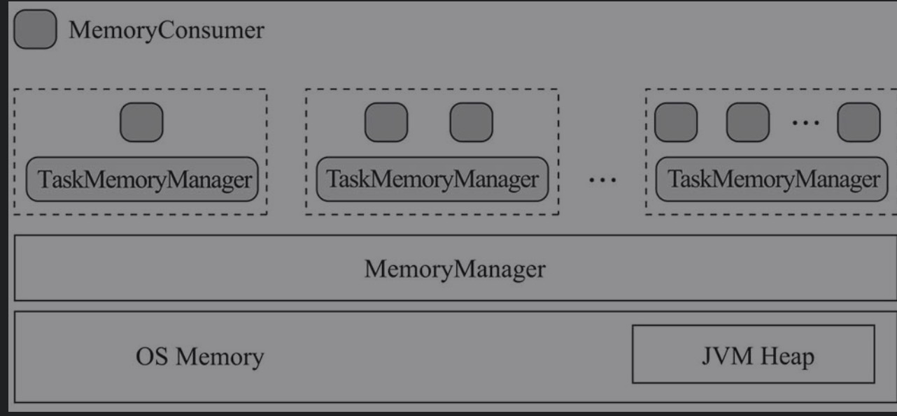
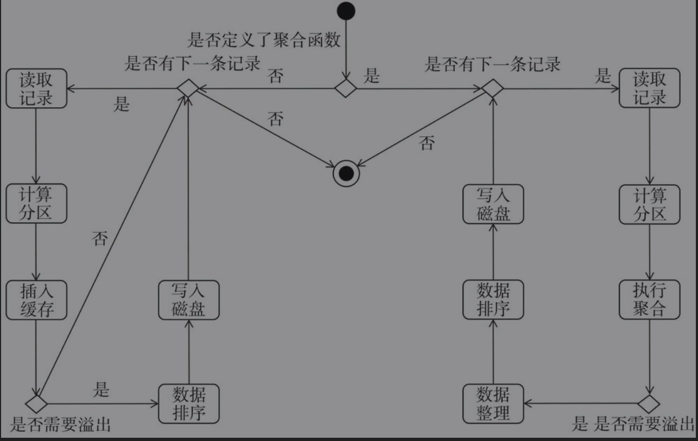

# 计算引擎概述

* 计算引擎包括执行内存和Shuffle两部分

## 执行内存

```reStructuredText
   执行内存主要包括执行内存、任务内存管理器（TaskMemoryManager）、内存消费者（MemoryConsumer）等内容。执行内存包括在JVM堆上进行分配的执行内存池（ExecutionMemoryPool）和在操作系统的内存中进行分配的Tungsten。内存管理器将提供API对执行内存和Tungsten进行管理（包括申请内存、释放内存等）。因为同一节点上能够运行多次任务尝试，所以需要每一次任务尝试都有单独的任务内存管理器为其服务。任务尝试通过任务内存管理器与内存管理器交互，以申请任务尝试所需要的执行内存，并在任务尝试结束后释放使用的执行内存。一次任务尝试过程中会有多个组件需要使用执行内存，这些组件统称为内存消费者。内存消费者多种多样，有对map任务的中间输出数据在JVM堆上进行缓存、聚合、溢出、持久化等处理的ExternalSorter，也有在操作系统内存中进行缓存、溢出、持久化处理的ShuffleExternalSorter，还有将key/value对存储到连续的内存块中的RowBasedKeyValueBatch。消费者需要的执行内存都是向任务内存管理器所申请的。
```



## Shuffle

* Shuffle是所有MapReduce计算框架必须面临的执行阶段，Shuffle用于打通map任务的输出与reduce任务的输入，map任务的中间输出结果按照指定的分区策略（例如，按照key值哈希）分配给处理某一个分区的reduce任务

### Spark早期Shuffle


1. map任务会为每一个reduce任务创建一个bucket。假设有M个map任务，R个reduce任务，则map阶段一共会创建M× R个桶（bucket）。
2. map任务会将产生的中间结果按照分区（partition）写入到不同的bucket中。
3. reduce任务从本地或者远端的map任务所在的BlockManager获取相应的bucket作为输入。

#### 存在的问题

1. map任务的中间结果首先存入内存，然后才写入磁盘。这对于内存的开销很大，当一个节点上map任务的输出结果集很大时，很容易导致内存紧张，进而发生内存溢出（Out Of Memory，简称OOM）。
2. 每个map任务都会输出R（reduce任务数量）个bucket。假如M等于1000, R也等于1000，那么共计生成100万个bucket，在bucket本身不大，但是Shuffle很频繁的情况下，磁盘I/O将成为性能瓶颈。

#### 解决方法

1. 将map任务给每个partition的reduce任务输出的bucket合并到同一个文件中，这解决了bucket数量很多，但是数据本身的体积不大时，造成Shuffle频繁，磁盘I/O成为性能瓶颈的问题。
2. map任务逐条输出计算结果，而不是一次性输出到内存，并使用AppendOnlyMap缓存及其聚合算法对中间结果进行聚合，这大大减小了中间结果所占的内存大小。
3. 对SizeTrackingAppendOnlyMap、SizeTrackingPairBuffer及Tungsten的Page进行溢出判断，当超出溢出限制的大小时，将数据写入磁盘，防止内存溢出。
4. reduce任务对拉取到的map任务中间结果逐条读取，而不是一次性读入内存，并在内存中进行聚合（其本质上也使用了AppendOnlyMap缓存）和排序，这也大大减小了数据占用的内存大小。
5. reduce任务将要拉取的Block按照BlockManager地址划分，然后将同一Block Manager地址中的Block累积为少量网络请求，减少网络I/O。

## Spark Shuffle流程

```
  map任务在输出时会进行分区计算并生成数据文件和索引文件等步骤，可能还伴随有缓存、排序、聚合、溢出、合并等操作。reduce任务将map任务输出的Block划分为本地和远端的Block，对于远端的Block，需要使用ShuffleClient从远端节点下载，而对于本地的Block，只需要从本地的存储体系中读取即可。reduce任务读取到map任务输出的数据后，可能进行缓存、排序、聚合、溢出、合并等操作，最终输出结果。
```

# 内存管理器与Tungsten

## Memoryblock

* 操作系统中的Page是一个内存块，在Page中可以存放数据，操作系统中会有多种不同的Page。操作系统对数据的读取，往往是先确定数据所在的Page，然后使用Page的偏移量（offset）和所读取数据的长度（length）从Page中读取数据。
* 在Tungsten中实现了一种与操作系统的内存Page非常相似的数据结构，这个对象就是MemoryBlock。MemoryBlock中的数据可能位于JVM的堆上，也可能位于JVM的堆外内存（操作系统内存）中。

### MemoryLocation

```java
public class MemoryLocation {

  /**
   * 这里为null的主要原因是，当数据存储在offheap时，jvm堆内是不存在数据的，只存储对应的offset
   */
  @Nullable
  Object obj;

  long offset;

  public MemoryLocation(@Nullable Object obj, long offset) {
    this.obj = obj;
    this.offset = offset;
  }

  public MemoryLocation() {
    this(null, 0);
  }

  public void setObjAndOffset(Object newObj, long newOffset) {
    this.obj = newObj;
    this.offset = newOffset;
  }

  public final Object getBaseObject() {
    return obj;
  }

  public final long getBaseOffset() {
    return offset;
  }
}
```

### MemoryBlock

```java
public class MemoryBlock extends MemoryLocation {

  /** Special `pageNumber` value for pages which were not allocated by TaskMemoryManagers */
  public static final int NO_PAGE_NUMBER = -1;

  /**
   * Special `pageNumber` value for marking pages that have been freed in the TaskMemoryManager.
   * We set `pageNumber` to this value in TaskMemoryManager.freePage() so that MemoryAllocator
   * can detect if pages which were allocated by TaskMemoryManager have been freed in the TMM
   * before being passed to MemoryAllocator.free() (it is an error to allocate a page in
   * TaskMemoryManager and then directly free it in a MemoryAllocator without going through
   * the TMM freePage() call).
   */
  public static final int FREED_IN_TMM_PAGE_NUMBER = -2;

  /**
   * Special `pageNumber` value for pages that have been freed by the MemoryAllocator. This allows
   * us to detect double-frees.
   */
  public static final int FREED_IN_ALLOCATOR_PAGE_NUMBER = -3;

  // 当前MemoryBlock的连续内存块的长度
  private final long length;

  /**
   * Optional page number; used when this MemoryBlock represents a page allocated by a
   * TaskMemoryManager. This field is public so that it can be modified by the TaskMemoryManager,
   * which lives in a different package.
   */
  //当前MemoryBlock的页号。TaskMemoryManager分配由MemoryBlock表示的Page时，将使用此属性。
  public int pageNumber = NO_PAGE_NUMBER;

  public MemoryBlock(@Nullable Object obj, long offset, long length) {
    super(obj, offset);
    this.length = length;
  }

  /**
   * MemoryBlock的大小，即length。
   * Returns the size of the memory block.
   */
  public long size() {
    return length;
  }

  /**
   * 创建一个指向由长整型数组使用的内存的MemoryBlock。
   * Creates a memory block pointing to the memory used by the long array.
   */
  public static MemoryBlock fromLongArray(final long[] array) {
    return new MemoryBlock(array, Platform.LONG_ARRAY_OFFSET, array.length * 8L);
  }

  /**
   * 以指定的字节填充整个MemoryBlock，即将obj对象从offset开始，长度为length的堆内存替换为指定字节的值。Platform中封装了对sun.misc.Unsafe[插图]的API调用，Platform的setMemory方法实际调用了sun.misc.Unsafe的setMemory方法。
   * Fills the memory block with the specified byte value.
   */
  public void fill(byte value) {
    Platform.setMemory(obj, offset, length, value);
  }
}
```

# IndexShuffleBlockResolver

* ShuffleBlockResolver定义了对Shuffle Block进行解析的规范，包括获取Shuffle数据文件、获取Shuffle索引文件、删除指定的Shuffle数据文件和索引文件、生成Shuffle索引文件、获取Shuffle块的数据等。
* ShuffleBlockResolver目前只有IndexShuffleBlockResolver这唯一的实现类。IndexShuffleBlockResolver用于创建和维护Shuffle Block与物理文件位置之间的映射关系。

```scala
private[spark] class IndexShuffleBlockResolver(
    conf: SparkConf,
    _blockManager: BlockManager = null)
  extends ShuffleBlockResolver
  with Logging {

  private lazy val blockManager = Option(_blockManager).getOrElse(SparkEnv.get.blockManager)

  // shuffle 网络配置
  private val transportConf = SparkTransportConf.fromSparkConf(conf, "shuffle")

  /**
   * 获取data文件
   * @param shuffleId
   * @param mapId
   * @return
   */
  def getDataFile(shuffleId: Int, mapId: Int): File = {
    // 获取data文件
    blockManager.diskBlockManager.getFile(ShuffleDataBlockId(shuffleId, mapId, NOOP_REDUCE_ID))
  }

  private def getIndexFile(shuffleId: Int, mapId: Int): File = {
    // 获取index文件
    blockManager.diskBlockManager.getFile(ShuffleIndexBlockId(shuffleId, mapId, NOOP_REDUCE_ID))
  }

  /**
   * 用于删除Shuffle过程中包含指定map任务输出数据的Shuffle数据文件和索引文件。
   * Remove data file and index file that contain the output data from one map.
   */
  def removeDataByMap(shuffleId: Int, mapId: Int): Unit = {
    // 获取data文件
    var file: File = getDataFile(shuffleId, mapId)
    if (file.exists()) {
      if (!file.delete()) {
        logWarning(s"Error deleting data ${file.getPath()}")
      }
    }
    // 获取index文件
    file = getIndexFile(shuffleId, mapId)
    if (file.exists()) {
      if (!file.delete()) {
        logWarning(s"Error deleting index ${file.getPath()}")
      }
    }
  }

  /**
   * 校验index和data文件
   * Check whether the given index and data files match each other.
   * If so, return the partition lengths in the data file. Otherwise return null.
   */
  private def checkIndexAndDataFile(index: File, data: File, blocks: Int): Array[Long] = {
    // the index file should have `block + 1` longs as offset.
    if (index.length() != (blocks + 1) * 8L) {
      return null
    }
    val lengths = new Array[Long](blocks)
    // Read the lengths of blocks
    val in = try {
      new DataInputStream(new NioBufferedFileInputStream(index))
    } catch {
      case e: IOException =>
        return null
    }
    try {
      // Convert the offsets into lengths of each block
      var offset = in.readLong()
      if (offset != 0L) {
        return null
      }
      var i = 0
      while (i < blocks) {
        val off = in.readLong()
        lengths(i) = off - offset
        offset = off
        i += 1
      }
    } catch {
      case e: IOException =>
        return null
    } finally {
      in.close()
    }

    // the size of data file should match with index file
    if (data.length() == lengths.sum) {
      lengths
    } else {
      null
    }
  }

  /**
   * Write an index file with the offsets of each block, plus a final offset at the end for the
   * end of the output file. This will be used by getBlockData to figure out where each block
   * begins and ends.
   *
   * It will commit the data and index file as an atomic operation, use the existing ones, or
   * replace them with new ones.
   *
   * Note: the `lengths` will be updated to match the existing index file if use the existing ones.
   */
  def writeIndexFileAndCommit(
      shuffleId: Int,
      mapId: Int,
      lengths: Array[Long],
      dataTmp: File): Unit = {
    val indexFile = getIndexFile(shuffleId, mapId)
    // 创建indexTmp
    val indexTmp = Utils.tempFileWith(indexFile)
    try {
      // data文件
      val dataFile: File = getDataFile(shuffleId, mapId)
      // There is only one IndexShuffleBlockResolver per executor, this synchronization make sure
      // the following check and rename are atomic.
      synchronized {
        val existingLengths = checkIndexAndDataFile(indexFile, dataFile, lengths.length)
        if (existingLengths != null) {
          // Another attempt for the same task has already written our map outputs successfully,
          // so just use the existing partition lengths and delete our temporary map outputs.
          System.arraycopy(existingLengths, 0, lengths, 0, lengths.length)
          if (dataTmp != null && dataTmp.exists()) {
            dataTmp.delete()
          }
        } else {
          // This is the first successful attempt in writing the map outputs for this task,
          // so override any existing index and data files with the ones we wrote.
          val out = new DataOutputStream(new BufferedOutputStream(new FileOutputStream(indexTmp)))
          Utils.tryWithSafeFinally {
            // We take in lengths of each block, need to convert it to offsets.
            var offset = 0L
            out.writeLong(offset)
            for (length <- lengths) {
              offset += length
              out.writeLong(offset)
            }
          } {
            out.close()
          }

          if (indexFile.exists()) {
            indexFile.delete()
          }
          if (dataFile.exists()) {
            dataFile.delete()
          }
          if (!indexTmp.renameTo(indexFile)) {
            throw new IOException("fail to rename file " + indexTmp + " to " + indexFile)
          }
          if (dataTmp != null && dataTmp.exists() && !dataTmp.renameTo(dataFile)) {
            throw new IOException("fail to rename file " + dataTmp + " to " + dataFile)
          }
        }
      }
    } finally {
      if (indexTmp.exists() && !indexTmp.delete()) {
        logError(s"Failed to delete temporary index file at ${indexTmp.getAbsolutePath}")
      }
    }
  }

  /**
   *  获取shuffleBlock
   * @param blockId
   * @return
   */
  override def getBlockData(blockId: ShuffleBlockId): ManagedBuffer = {
    // The block is actually going to be a range of a single map output file for this map, so
    // find out the consolidated file, then the offset within that from our index
    // 获取IndexFile
    val indexFile: File = getIndexFile(blockId.shuffleId, blockId.mapId)

    // SPARK-22982: if this FileInputStream's position is seeked forward by another piece of code
    // which is incorrectly using our file descriptor then this code will fetch the wrong offsets
    // (which may cause a reducer to be sent a different reducer's data). The explicit position
    // checks added here were a useful debugging aid during SPARK-22982 and may help prevent this
    // class of issue from re-occurring in the future which is why they are left here even though
    // SPARK-22982 is fixed.
    val channel: SeekableByteChannel = Files.newByteChannel(indexFile.toPath)
    channel.position(blockId.reduceId * 8L)
    val in = new DataInputStream(Channels.newInputStream(channel))
    try {
      val offset = in.readLong()
      val nextOffset = in.readLong()
      val actualPosition = channel.position()
      val expectedPosition = blockId.reduceId * 8L + 16
      if (actualPosition != expectedPosition) {
        throw new Exception(s"SPARK-22982: Incorrect channel position after index file reads: " +
          s"expected $expectedPosition but actual position was $actualPosition.")
      }
      new FileSegmentManagedBuffer(
        transportConf,
        // 获取dataFile
        getDataFile(blockId.shuffleId, blockId.mapId),
        offset,
        nextOffset - offset)
    } finally {
      in.close()
    }
  }

  override def stop(): Unit = {}
}
```

## SizeTracker

* Spark在Shuffle阶段，给map任务的输出增加了缓存、聚合的数据结构。这些数据结构将使用各种执行内存，为了对这些数据结构的大小进行计算，以便于扩充大小或在没有足够内存时溢出到磁盘，特质SizeTracker定义了对集合进行采样和估算的规范。

## WritablePartitionedPairCollection

* WritablePartitionedPairCollection是对由键值对构成的集合进行大小跟踪的通用接口。这里的每个键值对都有相关联的分区，例如，key为（0, #）, value为1的键值对，真正的键实际是#，而0则是键#的分区ID。WritablePartitionedPairCollection支持基于内存进行有效排序，并可以创建将集合内容按照字节写入磁盘的WritablePartitionedIterator。

# AppendOnlyMap

* AppendOnlyMap是在内存中对任务执行结果进行聚合运算的利器，最大可以支持375809 638（即0.7×2^29）个元素。

```scala
class AppendOnlyMap[K, V](initialCapacity: Int = 64)
  extends Iterable[(K, V)] with Serializable {

  import AppendOnlyMap._

  require(initialCapacity <= MAXIMUM_CAPACITY,
    s"Can't make capacity bigger than ${MAXIMUM_CAPACITY} elements")
  require(initialCapacity >= 1, "Invalid initial capacity")

  // 负载因子，超过该Capacity*0。7自动扩容
  private val LOAD_FACTOR = 0.7

  // 容量，转换为2的n次方，主要为了后去计算hash时可以直接将取模的逻辑运算优化为算术运算
  private var capacity = nextPowerOf2(initialCapacity)
  // 计算数据存放位置的掩码。计算mask的表达式为capacity -1。
  private var mask = capacity - 1
  // 记录当前已经放入data的key与聚合值的数量。
  private var curSize = 0
  // :data数组容量增长的阈值。计算growThreshold的表达式为grow-Threshold =LOAD_FACTOR * capacity。
  private var growThreshold = (LOAD_FACTOR * capacity).toInt

  // Holds keys and values in the same array for memory locality; specifically, the order of
  // elements is key0, value0, key1, value1, key2, value2, etc.
  // 存储数据的数组，初始化为2倍的capacity
  private var data = new Array[AnyRef](2 * capacity)

  // Treat the null key differently so we can use nulls in "data" to represent empty items.
  // 是否存在null值
  private var haveNullValue = false
  // 控制
  private var nullValue: V = null.asInstanceOf[V]

  // Triggered by destructiveSortedIterator; the underlying data array may no longer be used
  // 表示data数组是否不再使用
  private var destroyed = false
  // 当destroyed为true时，打印的消息内容为"Map state is invalid fromdestructive sorting! "。
  private val destructionMessage = "Map state is invalid from destructive sorting!"
```

## apply

* 根据key获取value

```scala
def apply(key: K): V = {
    assert(!destroyed, destructionMessage)
    val k = key.asInstanceOf[AnyRef]
    if (k.eq(null)) {
      return nullValue
    }
    // 相当于key的hashcode&cap-1 === k.hashcode % cap
    var pos = rehash(k.hashCode) & mask
    var i = 1
    while (true) {
      // 计算当前key的offset
      val curKey: AnyRef = data(2 * pos)
      // 如果k等于当前key
      if (k.eq(curKey) || k.equals(curKey)) {
        // 返回当前key的value，value存储在key的offset+1的位置
        return data(2 * pos + 1).asInstanceOf[V]
        // 如果key为null，返回null
      } else if (curKey.eq(null)) {
        return null.asInstanceOf[V]
      } else {
        val delta = i
        // pos往后移动
        pos = (pos + delta) & mask
        i += 1
      }
    }
    null.asInstanceOf[V]
  }
```

## incrementSize

```scala
 private def incrementSize() {
    // 当前size+1
    curSize += 1
    // 如果当前size大于growThreshold则扩容
    if (curSize > growThreshold) {
      growTable()
    }
  }

// growTable
protected def growTable() {
    // capacity < MAXIMUM_CAPACITY (2 ^ 29) so capacity * 2 won't overflow
    // 新的容量
    val newCapacity = capacity * 2
    // check cap
    require(newCapacity <= MAXIMUM_CAPACITY, s"Can't contain more than ${growThreshold} elements")
    // 穿件新的数组
    val newData = new Array[AnyRef](2 * newCapacity)
    // 计算新的mask
    val newMask = newCapacity - 1
    // Insert all our old values into the new array. Note that because our old keys are
    // unique, there's no need to check for equality here when we insert.
    var oldPos = 0
    // 遍历data数组
    while (oldPos < capacity) {
      // 过滤key为null的数据
      if (!data(2 * oldPos).eq(null)) {
        // 获取key
        val key = data(2 * oldPos)
        // 获取value
        val value = data(2 * oldPos + 1)
        // 重新计算新的pos
        var newPos = rehash(key.hashCode) & newMask
        var i = 1
        // 保持前进
        var keepGoing = true
        while (keepGoing) {
          // 计算新的key
          val curKey = newData(2 * newPos)
          // 如果key为null
          if (curKey.eq(null)) {
            // 赋值key和value
            newData(2 * newPos) = key
            newData(2 * newPos + 1) = value
            keepGoing = false
          } else {
            // 如果已经存在数据
            val delta = i
            // 向后移动
            newPos = (newPos + delta) & newMask
            i += 1
          }
        }
      }
      oldPos += 1
    }
    // 重新复制
    data = newData
    capacity = newCapacity
    mask = newMask
    growThreshold = (LOAD_FACTOR * newCapacity).toInt
  }
```

## update

```scala
def update(key: K, value: V): Unit = {
    assert(!destroyed, destructionMessage)
    val k = key.asInstanceOf[AnyRef]
    // 如果key为null
    if (k.eq(null)) {
      // 判断是否存在null值，如果不存在，这容量增长
      if (!haveNullValue) {
        // 判断是否需要扩容
        incrementSize()
      }
      // 为nullValue赋值
      nullValue = value
      // 设置存在key为Null的value
      haveNullValue = true
      // 返回
      return
    }
    // 计算pos
    var pos = rehash(key.hashCode) & mask
    var i = 1
    // 遍历
    while (true) {
      // 计算当前key的位置
      val curKey = data(2 * pos)
      // 如果当前key在数组中的位置不存在
      if (curKey.eq(null)) {
        // 设置值
        data(2 * pos) = k
        data(2 * pos + 1) = value.asInstanceOf[AnyRef]
        incrementSize()  // Since we added a new key
        return
        // 如果存在
      } else if (k.eq(curKey) || k.equals(curKey)) {
        // 修改value
        data(2 * pos + 1) = value.asInstanceOf[AnyRef]
        return
      } else {
        // 如果不等，则向后移动
        val delta = i
        pos = (pos + delta) & mask
        i += 1
      }
    }
  }
```

## changeValue

* 实现了缓存聚合算法

```scala
 def changeValue(key: K, updateFunc: (Boolean, V) => V): V = {
    assert(!destroyed, destructionMessage)
    val k = key.asInstanceOf[AnyRef]
    if (k.eq(null)) {
      if (!haveNullValue) {
        incrementSize()
      }
      // nullVlaue等于Null
      nullValue = updateFunc(haveNullValue, nullValue)
      haveNullValue = true
      // 返回null
      return nullValue
    }
    var pos = rehash(k.hashCode) & mask
    var i = 1
    while (true) {
      val curKey = data(2 * pos)
      if (curKey.eq(null)) {
        // newValue为null
        val newValue = updateFunc(false, null.asInstanceOf[V])
        data(2 * pos) = k
        // 设置value为null
        data(2 * pos + 1) = newValue.asInstanceOf[AnyRef]
        // 判断是否需要扩容
        incrementSize()
        return newValue
      } else if (k.eq(curKey) || k.equals(curKey)) {
        // 根据聚合函数求出来的值
        val newValue = updateFunc(true, data(2 * pos + 1).asInstanceOf[V])
        data(2 * pos + 1) = newValue.asInstanceOf[AnyRef]
        return newValue
      } else {
        val delta = i
        pos = (pos + delta) & mask
        i += 1
      }
    }
    null.asInstanceOf[V] // Never reached but needed to keep compiler happy
  }
```

## destructiveSortedIterator

* 不使用额外的内存和不牺牲AppendOnlyMap的有效性的前提下，对AppendOnlyMap的data数组中的数据进行排序的实现。

```scala
def destructiveSortedIterator(keyComparator: Comparator[K]): Iterator[(K, V)] = {
    destroyed = true
    // Pack KV pairs into the front of the underlying array
    var keyIndex, newIndex = 0
    // 遍历数组
    while (keyIndex < capacity) {
      // 如果key不为null，去掉不连续的null key
      if (data(2 * keyIndex) != null) {
        data(2 * newIndex) = data(2 * keyIndex)
        data(2 * newIndex + 1) = data(2 * keyIndex + 1)
        newIndex += 1
      }
      keyIndex += 1
    }
    assert(curSize == newIndex + (if (haveNullValue) 1 else 0))

    // 创建Sort排序起
    new Sorter(new KVArraySortDataFormat[K, AnyRef]).sort(data, 0, newIndex, keyComparator)

    new Iterator[(K, V)] {
      var i = 0
      var nullValueReady = haveNullValue
      def hasNext: Boolean = (i < newIndex || nullValueReady)
      def next(): (K, V) = {
        if (nullValueReady) {
          nullValueReady = false
          (null.asInstanceOf[K], nullValue)
        } else {
          val item = (data(2 * i).asInstanceOf[K], data(2 * i + 1).asInstanceOf[V])
          i += 1
          item
        }
      }
    }
  }
```

* 利用Sorter、KVArraySortDataFormat及指定的比较器进行排序。这其中用到了TimSort，也就是优化版的归并排序。

## AppendOnlyMap的扩展

### SizeTrackingAppendOnlyMap

* SizeTrackingAppendOnlyMap的确继承了AppendOnlyMap和Size-Tracker。SizeTrackingAppendOnlyMap采用代理模式重写了AppendOnlyMap的三个方法（包括update、changeValue及growTable）。SizeTrackingAppendOnlyMap确保对data数组进行数据更新、缓存聚合等操作后，调用SizeTracker的afterUpdate方法完成采样；在扩充data数组的容量后，调用SizeTracker的resetSamples方法对样本进行重置，以便于对AppendOnlyMap的大小估算更加准确。

```scala
private[spark] class SizeTrackingAppendOnlyMap[K, V]
  extends AppendOnlyMap[K, V] with SizeTracker
{
  override def update(key: K, value: V): Unit = {
    super.update(key, value)
    // 采样和估算自身大小
    super.afterUpdate()
  }

  override def changeValue(key: K, updateFunc: (Boolean, V) => V): V = {
    val newValue = super.changeValue(key, updateFunc)
    super.afterUpdate()
    newValue
  }

  override protected def growTable(): Unit = {
    super.growTable()
    // 重新采样
    resetSamples()
  }
}
```

### PartitionedAppendOnlyMap

*  PartitionedAppendOnlyMap实现了特质WritablePartitionedPairCol lection定义的partitionedDestructiveSortedIterator接口和insert接口。

```scala
private[spark] class PartitionedAppendOnlyMap[K, V]
  extends SizeTrackingAppendOnlyMap[(Int, K), V] with WritablePartitionedPairCollection[K, V] {

  def partitionedDestructiveSortedIterator(keyComparator: Option[Comparator[K]])
    : Iterator[((Int, K), V)] = {
    // 获取key比较器
    val comparator = keyComparator.map(partitionKeyComparator).getOrElse(partitionComparator)
    // 聚合比较器排序
    destructiveSortedIterator(comparator)
  }

  def insert(partition: Int, key: K, value: V): Unit = {
    // 带分区的排序
    update((partition, key), value)
  }
}
```

# PartitionedPairBuffer

* map任务除了采用AppendOnlyMap对键值对在内存中进行更新或聚合，Spark还提供了一种将键值对缓存在内存中，并支持对元素进行排序的数据结构。
* AppendOnlyMap的表现行为类似于Map，而这种数据结构类似于Collection，它就是PartitionedPairBuffer。PartitionedPairBuffer最大支持1073741823（即2^30-1）个元素。

```scala
private[spark] class PartitionedPairBuffer[K, V](initialCapacity: Int = 64)
  extends WritablePartitionedPairCollection[K, V] with SizeTracker
{
  import PartitionedPairBuffer._

  require(initialCapacity <= MAXIMUM_CAPACITY,
    s"Can't make capacity bigger than ${MAXIMUM_CAPACITY} elements")
  require(initialCapacity >= 1, "Invalid initial capacity")

  // Basic growable array data structure. We use a single array of AnyRef to hold both the keys
  // and the values, so that we can sort them efficiently with KVArraySortDataFormat.
  // cap容量默认为64
  private var capacity = initialCapacity
  // 当前集合大小
  private var curSize = 0
  // 数组，2被的cap
  private var data = new Array[AnyRef](2 * initialCapacity)
```

## insert

```scala
def insert(partition: Int, key: K, value: V): Unit = {
    // 如果超过容量
    if (curSize == capacity) {
      growArray()
    }
    // key存储一个tuple2为 (partition,key)
    data(2 * curSize) = (partition, key.asInstanceOf[AnyRef])
    // 设置value
    data(2 * curSize + 1) = value.asInstanceOf[AnyRef]
    curSize += 1
    // 记录采样
    afterUpdate()
  }
```

##  growArray

```scala
 private def growArray(): Unit = {
    // check cap
    if (capacity >= MAXIMUM_CAPACITY) {
      throw new IllegalStateException(s"Can't insert more than ${MAXIMUM_CAPACITY} elements")
    }
    // 计算新的cap，2*oldCap
    val newCapacity =
      if (capacity * 2 > MAXIMUM_CAPACITY) { // Overflow
        MAXIMUM_CAPACITY
      } else {
        capacity * 2
      }
    // 计算新的数组
    val newArray = new Array[AnyRef](2 * newCapacity)
    // 数组拷贝
    System.arraycopy(data, 0, newArray, 0, 2 * capacity)
    data = newArray
    capacity = newCapacity
    // 重新采样
    resetSamples()
  }
```

## partitionedDestructiveSortedIterator

```scala
 override def partitionedDestructiveSortedIterator(keyComparator: Option[Comparator[K]])
  : Iterator[((Int, K), V)] = {
    val comparator = keyComparator.map(partitionKeyComparator).getOrElse(partitionComparator)
    // 排序
    new Sorter(new KVArraySortDataFormat[(Int, K), AnyRef]).sort(data, 0, curSize, comparator)
    // 返回迭代器
    iterator
  }
```

# 外部排序器

## ExternalSorter

* 将map任务的输出存储到JVM的堆中，如果指定了聚合函数，则还会对数据进行聚合；使用分区计算器首先将Key分组到各个分区中，然后使用自定义比较器对每个分区中的键进行可选的排序；可以将每个分区输出到单个文件的不同字节范围中，便于reduce端的Shuffle获取。

```scala
private[spark] class ExternalSorter[K, V, C](
    context: TaskContext,
    aggregator: Option[Aggregator[K, V, C]] = None, // 聚合函数
    partitioner: Option[Partitioner] = None, // 分区器
    ordering: Option[Ordering[K]] = None, // 对map任务的输出数据按照key进行排序的scala.math.Ordering的实现类。
    serializer: Serializer = SparkEnv.get.serializer) // 序列化器
  extends Spillable[WritablePartitionedPairCollection[K, C]](context.taskMemoryManager())
  with Logging {

  private val conf = SparkEnv.get.conf

  // 分区数量
  private val numPartitions = partitioner.map(_.numPartitions).getOrElse(1)
  // 是否应该分区
  private val shouldPartition = numPartitions > 1
  private def getPartition(key: K): Int = {
    if (shouldPartition) partitioner.get.getPartition(key) else 0
  }

  private val blockManager = SparkEnv.get.blockManager
  private val diskBlockManager = blockManager.diskBlockManager
  private val serializerManager = SparkEnv.get.serializerManager
  // 序列器实例
  private val serInstance = serializer.newInstance()

  // Use getSizeAsKb (not bytes) to maintain backwards compatibility if no units are provided
  // shufle文件缓存，默认32k 用于设置DiskBlockObjectWriter内部的文件缓冲大小。
  private val fileBufferSize = conf.getSizeAsKb("spark.shuffle.file.buffer", "32k").toInt * 1024

  // Size of object batches when reading/writing from serializers.
  //
  // Objects are written in batches, with each batch using its own serialization stream. This
  // cuts down on the size of reference-tracking maps constructed when deserializing a stream.
  //
  // NOTE: Setting this too low can cause excessive copying when serializing, since some serializers
  // grow internal data structures by growing + copying every time the number of objects doubles.
  // 用于将DiskBlockObjectWriter内部的文件缓冲写到磁盘的大小。可通过spark.shuffle.spill.batchSize属性进行配置，默认是10000。
  private val serializerBatchSize = conf.getLong("spark.shuffle.spill.batchSize", 10000)

  // Data structures to store in-memory objects before we spill. Depending on whether we have an
  // Aggregator set, we either put objects into an AppendOnlyMap where we combine them, or we
  // store them in an array buffer.
  // 分区AppendOnlyMap 当设置了聚合器（Aggregator）时，map端将中间结果溢出到磁盘前，先利用此数据结构在内存中对中间结果进行聚合处理。
  @volatile private var map = new PartitionedAppendOnlyMap[K, C]
  // 分区缓存Collection，当没有设置聚合器（Aggregator）时，map端将中间结果溢出到磁盘前，先利用此数据结构将中间结果存储在内存中。
  @volatile private var buffer = new PartitionedPairBuffer[K, C]

  // Total spilling statistics
  // spill 到磁盘的总数量
  private var _diskBytesSpilled = 0L
  def diskBytesSpilled: Long = _diskBytesSpilled

  // Peak size of the in-memory data structure observed so far, in bytes
  // 内存中数据结构大小的峰值（单位为字节）。peakMemory-UsedBytes方法专门用于返回_peakMemoryUsedBytes的值。
  private var _peakMemoryUsedBytes: Long = 0L
  def peakMemoryUsedBytes: Long = _peakMemoryUsedBytes
  // 是否在shuffle时排序
  @volatile private var isShuffleSort: Boolean = true
  // 缓存强制溢出的文件数组。forceSpillFiles的类型为ArrayBuffer[SpilledFile]。SpilledFile保存了溢出文件的信息，包括file（文件）、blockId（BlockId）、serializerBatchSizes、elementsPerPartition（每个分区的元素数量）。
  private val forceSpillFiles = new ArrayBuffer[SpilledFile]
  // 类型为SpillableIterator，用于包装内存中数据的迭代器和溢出文件，并表现为一个新的迭代器。
  @volatile private var readingIterator: SpillableIterator = null

  // A comparator for keys K that orders them within a partition to allow aggregation or sorting.
  // Can be a partial ordering by hash code if a total ordering is not provided through by the
  // user. (A partial ordering means that equal keys have comparator.compare(k, k) = 0, but some
  // non-equal keys also have this, so we need to do a later pass to find truly equal keys).
  // Note that we ignore this if no aggregator and no ordering are given.
  private val keyComparator: Comparator[K] = ordering.getOrElse(new Comparator[K] {
    override def compare(a: K, b: K): Int = {
      val h1 = if (a == null) 0 else a.hashCode()
      val h2 = if (b == null) 0 else b.hashCode()
      if (h1 < h2) -1 else if (h1 == h2) 0 else 1
    }
  })
    
// 缓存溢出的文件数组。spills的类型为ArrayBuffer[SpilledFile]。numSpills方法用于返回spills的大小，即溢出的文件数量。
  private val spills = new ArrayBuffer[SpilledFile]
    
 /**
   * spill文件数量
   * Number of files this sorter has spilled so far.
   * Exposed for testing.
   */
  private[spark] def numSpills: Int = spills.size    
```

### insertAll

```scala
def insertAll(records: Iterator[Product2[K, V]]): Unit = {
    // TODO: stop combining if we find that the reduction factor isn't high
    val shouldCombine = aggregator.isDefined
    // 是否需要预聚合
    if (shouldCombine) {
      // Combine values in-memory first using our AppendOnlyMap
      // 获取聚合函数的mergeFunction
      val mergeValue: (C, V) => C = aggregator.get.mergeValue
      // 创建预聚合函数
      val createCombiner: V => C = aggregator.get.createCombiner
      var kv: Product2[K, V] = null
      // 创建updateFunc
      val update: (Boolean, C) => C = (hadValue: Boolean, oldValue: C) => {
        // 如果存在值，使用合并函数，否则创建Combiner函数
        if (hadValue) mergeValue(oldValue, kv._2) else createCombiner(kv._2)
      }
      // 遍历迭代器
      while (records.hasNext) {
        // 添加读取数据记录
        addElementsRead()
        // 获取kv
        kv = records.next()
        // 内存使用聚合函数，相同的partition，key，的value为上一次value+这次value
        map.changeValue((getPartition(kv._1), kv._1), update)
        // 可能一些到集合
        maybeSpillCollection(usingMap = true)
      }
      // 不需要聚合函数
    } else {
      // Stick values into our buffer
      while (records.hasNext) {
        addElementsRead()
        val kv = records.next()
        buffer.insert(getPartition(kv._1), kv._1, kv._2.asInstanceOf[C])
        maybeSpillCollection(usingMap = false)
      }
    }
  }
```


### maybeSpillCollection

```scala
private def maybeSpillCollection(usingMap: Boolean): Unit = {
    var estimatedSize = 0L
    if (usingMap) {
      // 输出的Size大小
      estimatedSize = map.estimateSize()
      // 是否需要spill
      if (maybeSpill(map, estimatedSize)) {
        map = new PartitionedAppendOnlyMap[K, C]
      }
    } else {
      estimatedSize = buffer.estimateSize()
      if (maybeSpill(buffer, estimatedSize)) {
        buffer = new PartitionedPairBuffer[K, C]
      }
    }

    if (estimatedSize > _peakMemoryUsedBytes) {
      _peakMemoryUsedBytes = estimatedSize
    }
  }
```

###  maybeSpill

```scala
protected def maybeSpill(collection: C, currentMemory: Long): Boolean = {
    var shouldSpill = false
    // 如果当前内存大小大于内存的上线
    if (elementsRead % 32 == 0 && currentMemory >= myMemoryThreshold) {
      // Claim up to double our current memory from the shuffle memory pool
      val amountToRequest = 2 * currentMemory - myMemoryThreshold
      val granted = acquireMemory(amountToRequest)
      myMemoryThreshold += granted
      // If we were granted too little memory to grow further (either tryToAcquire returned 0,
      // or we already had more memory than myMemoryThreshold), spill the current collection
      // 判断是否需要spill
      shouldSpill = currentMemory >= myMemoryThreshold
    }
    // 读取数据大于numElementsForceSpillThreshold
    shouldSpill = shouldSpill || _elementsRead > numElementsForceSpillThreshold
    // Actually spill
    if (shouldSpill) {
      _spillCount += 1
      // 一些当前内存日志
      logSpillage(currentMemory)
      // spill到磁盘
      spill(collection)
      _elementsRead = 0
      _memoryBytesSpilled += currentMemory
      // 释放内存
      releaseMemory()
    }
    shouldSpill
  }
```

### spill

```scala
override protected[this] def spill(collection: WritablePartitionedPairCollection[K, C]): Unit = {
  // 排序
    val inMemoryIterator = collection.destructiveSortedWritablePartitionedIterator(comparator)
    val spillFile = spillMemoryIteratorToDisk(inMemoryIterator)
    spills += spillFile
  }
```

### map端输出过程



### writePartitionedFile

```scala
 def writePartitionedFile(
      blockId: BlockId,
      outputFile: File): Array[Long] = {

    // Track location of each range in the output file
    // 分区数组
    val lengths = new Array[Long](numPartitions)
    // 过去DiskBlockObjectWriter
    val writer: DiskBlockObjectWriter = blockManager.getDiskWriter(blockId, outputFile, serInstance, fileBufferSize,
      context.taskMetrics().shuffleWriteMetrics)

    // 如果一些文件为null
    if (spills.isEmpty) {
      // Case where we only have in-memory data
      // 直接从集合中拉取文件
      val collection = if (aggregator.isDefined) map else buffer
      val it: WritablePartitionedIterator = collection.destructiveSortedWritablePartitionedIterator(comparator)
      while (it.hasNext()) {
        // 获取分区id
        val partitionId: Int = it.nextPartition()
        
        while (it.hasNext && it.nextPartition() == partitionId) {
          it.writeNext(writer)
        }
        // 提交
        val segment = writer.commitAndGet()
        lengths(partitionId) = segment.length
      }
    } else {
      // We must perform merge-sort; get an iterator by partition and write everything directly.
      for ((id, elements) <- this.partitionedIterator) {
        if (elements.hasNext) {
          for (elem <- elements) {
            writer.write(elem._1, elem._2)
          }
          val segment = writer.commitAndGet()
          lengths(id) = segment.length
        }
      }
    }

    writer.close()
    context.taskMetrics().incMemoryBytesSpilled(memoryBytesSpilled)
    context.taskMetrics().incDiskBytesSpilled(diskBytesSpilled)
    context.taskMetrics().incPeakExecutionMemory(peakMemoryUsedBytes)

    lengths
  }
```

## ShuffleExternalSorter

```java
final class ShuffleExternalSorter extends MemoryConsumer {

  private static final Logger logger = LoggerFactory.getLogger(ShuffleExternalSorter.class);

  @VisibleForTesting
  static final int DISK_WRITE_BUFFER_SIZE = 1024 * 1024;

  private final int numPartitions;
  private final TaskMemoryManager taskMemoryManager;
  private final BlockManager blockManager;
  private final TaskContext taskContext;
  private final ShuffleWriteMetrics writeMetrics;

  /**
   * 磁盘溢出的元素数量。可通过spark.shuffle.spill.numElementsForceSpillThreshold属性进行配置，默认为1MB。
   * Force this sorter to spill when there are this many elements in memory.
   */
  private final int numElementsForSpillThreshold;

  /** The buffer size to use when writing spills using DiskBlockObjectWriter */
  // ：创建的DiskBlockObjectWriter内部的文件缓冲大小。可通过spark.shuffle.file.buffer属性进行配置，默认是32KB。
  private final int fileBufferSizeBytes;

  /** The buffer size to use when writing the sorted records to an on-disk file */
  private final int diskWriteBufferSize;

  /**
   * Memory pages that hold the records being sorted. The pages in this list are freed when
   * spilling, although in principle we could recycle these pages across spills (on the other hand,
   * this might not be necessary if we maintained a pool of re-usable pages in the TaskMemoryManager
   * itself).
   */
  private final LinkedList<MemoryBlock> allocatedPages = new LinkedList<>();

  private final LinkedList<SpillInfo> spills = new LinkedList<>();

  /** Peak memory used by this sorter so far, in bytes. **/
  private long peakMemoryUsedBytes;

  // These variables are reset after spilling:
  @Nullable private ShuffleInMemorySorter inMemSorter;
  @Nullable private MemoryBlock currentPage = null;
  private long pageCursor = -1;

```

# ShuffleManager

## ShuffleWriter详解

* SortShuffleManager依赖于ShuffleWriter提供的服务，抽象类ShuffleWriter定义了将map任务的中间结果输出到磁盘上的功能规范，包括将数据写入磁盘和关闭ShuffleWriter。

```scala
private[spark] abstract class ShuffleWriter[K, V] {
  /** Write a sequence of records to this task's output */
  // 写一个记录的seq到这个task的输出
  @throws[IOException]
  def write(records: Iterator[Product2[K, V]]): Unit

  /** Close this writer, passing along whether the map completed */
  def stop(success: Boolean): Option[MapStatus]
}
```

* ShuffleWriter一共有三个子类，分别为SortShuffleWriter、UnsafeShuffleWriter及BypassMergeSortShuffleWriter

### ShuffleHandle

* ShuffleHandle是不透明的Shuffle句柄，ShuffleManager使用它向Task传递Shuffle信息

```scala
abstract class ShuffleHandle(val shuffleId: Int) extends Serializable {}
```

#### BaseShuffleHandle

```scala
private[spark] class BaseShuffleHandle[K, V, C](
    shuffleId: Int,
    val numMaps: Int,
    val dependency: ShuffleDependency[K, V, C])
  extends ShuffleHandle(shuffleId)
```

####  SerializedShuffleHandle

```scala
private[spark] class SerializedShuffleHandle[K, V](
  shuffleId: Int,
  numMaps: Int,
  dependency: ShuffleDependency[K, V, V])
  extends BaseShuffleHandle(shuffleId, numMaps, dependency) {
}
```

####  BypassMergeSortShuffleHandle

```scala
/**
 * Subclass of [[BaseShuffleHandle]], used to identify when we've chosen to use the
 * bypass merge sort shuffle path.
 */
private[spark] class BypassMergeSortShuffleHandle[K, V](
  shuffleId: Int,
  numMaps: Int,
  dependency: ShuffleDependency[K, V, V])
  extends BaseShuffleHandle(shuffleId, numMaps, dependency) {
}
```

### MapStatus

```scala
private[spark] sealed trait MapStatus {
  /** Location where this task was run. */
  //task运行的location
  def location: BlockManagerId

  /**
   * reduce需要拉取的block的大小
   * Estimated size for the reduce block, in bytes.
   *
   * If a block is non-empty, then this method MUST return a non-zero size.  This invariant is
   * necessary for correctness, since block fetchers are allowed to skip zero-size blocks.
   */
  def getSizeForBlock(reduceId: Int): Long
}
```

### SortShuffleWriter

* SortShuffleWriter使用ExternalSorter作为排序器，由于ExternalSorter底层使用了Partitioned AppendOnlyMap和PartitionedPairBuffer两种缓存，因此SortShuffleWriter还支持对Shuffle数据的聚合功能。

```scala
private[spark] class SortShuffleWriter[K, V, C](
    shuffleBlockResolver: IndexShuffleBlockResolver, // 操作shuffle底层存储文件的解析器
    handle: BaseShuffleHandle[K, V, C], // shuffleHandle 传输shuffle的相关信息
    mapId: Int, // mapId
    context: TaskContext)
  extends ShuffleWriter[K, V] with Logging {

  // handle（即BaseShuffleHandle）的dependency属性（类型为ShuffleDependency）。
  private val dep = handle.dependency

  private val blockManager = SparkEnv.get.blockManager
  // 外部排序器
  private var sorter: ExternalSorter[K, V, _] = null

  // Are we in the process of stopping? Because map tasks can call stop() with success = true
  // and then call stop() with success = false if they get an exception, we want to make sure
  // we don't try deleting files, etc twice.
  private var stopping = false

  private var mapStatus: MapStatus = null

  private val writeMetrics = context.taskMetrics().shuffleWriteMetrics
```

#### write

```scala
override def write(records: Iterator[Product2[K, V]]): Unit = {
    // 如果存在map端预聚合，将聚合函数传入ExternalSorter中，这里会使用PartitionedAppendOnlyMap
    sorter = if (dep.mapSideCombine) {
      new ExternalSorter[K, V, C](
        context, dep.aggregator, Some(dep.partitioner), dep.keyOrdering, dep.serializer)
    } else {
      // In this case we pass neither an aggregator nor an ordering to the sorter, because we don't
      // care whether the keys get sorted in each partition; that will be done on the reduce side
      // if the operation being run is sortByKey.
      // 这里使用Collection PartitionedPairBuffer
      new ExternalSorter[K, V, V](
        context, aggregator = None, Some(dep.partitioner), ordering = None, dep.serializer)
    }
    // 将记录插入到外部排序器中，会在内存聚合、合并，如果达到阈值会spill到磁盘
    sorter.insertAll(records)

    // Don't bother including the time to open the merged output file in the shuffle write time,
    // because it just opens a single file, so is typically too fast to measure accurately
    // (see SPARK-3570).
    // 获取shuffle的dataFile
    val output: File = shuffleBlockResolver.getDataFile(dep.shuffleId, mapId)
    val tmp = Utils.tempFileWith(output)
    // 将map端缓存的数据写到磁盘，并生成对应的index文件
    try {
      val blockId = ShuffleBlockId(dep.shuffleId, mapId, IndexShuffleBlockResolver.NOOP_REDUCE_ID)
      val partitionLengths: Array[Long] = sorter.writePartitionedFile(blockId, tmp)
      // 写索引文件并且提交
      shuffleBlockResolver.writeIndexFileAndCommit(dep.shuffleId, mapId, partitionLengths, tmp)
      mapStatus = MapStatus(blockManager.shuffleServerId, partitionLengths)
    } finally {
      if (tmp.exists() && !tmp.delete()) {
        logError(s"Error while deleting temp file ${tmp.getAbsolutePath}")
      }
    }
  }
```


#### shouldBypassMergeSort

```scala
/**
  * 判断SortShuffleWriter是否满足bypass机制
  */
private[spark] object SortShuffleWriter {
  def shouldBypassMergeSort(conf: SparkConf, dep: ShuffleDependency[_, _, _]): Boolean = {
    // We cannot bypass sorting if we need to do map-side aggregation.
    // 如果shuffle依赖存在map端聚合，
    if (dep.mapSideCombine) {
      false
    } else {
      // 拿到spark.shuffle.sort.bypassMergeThreshold配置
      val bypassMergeThreshold: Int = conf.getInt("spark.shuffle.sort.bypassMergeThreshold", 200)
      // 如果分区数小于等于bypassMergeThreshold则进行bypass机制
      dep.partitioner.numPartitions <= bypassMergeThreshold
    }
  }
}
```

### BypassMergeSortShuffleWriter

* 当mao端不需要在持久化数据之前进行聚合、排序等操作，可以使用BypassMergeSortShuffleWriter，需要满足shuffle的输出文件没有指定排序、聚合函数，并且分区数小于`spark.shuffle.sort.bypassMergeThreshold`

#### write

```scala
 public void write(Iterator<Product2<K, V>> records) throws IOException {
        assert (partitionWriters == null);
        if (!records.hasNext()) {
            partitionLengths = new long[numPartitions];
            shuffleBlockResolver.writeIndexFileAndCommit(shuffleId, mapId, partitionLengths, null);
            // $代表获取其伴生对象
            mapStatus = MapStatus$.MODULE$.apply(blockManager.shuffleServerId(), partitionLengths);
            return;
        }
        final SerializerInstance serInstance = serializer.newInstance();
        final long openStartTime = System.nanoTime();
        // 每个分区分配一个DiskBlockObjectWriter和FileSegment
        partitionWriters = new DiskBlockObjectWriter[numPartitions];
        partitionWriterSegments = new FileSegment[numPartitions];
        // 初始化DiskBlockObjectWriter
        for (int i = 0; i < numPartitions; i++) {
          // 创建temp临时文件
            final Tuple2<TempShuffleBlockId, File> tempShuffleBlockIdPlusFile =
                    blockManager.diskBlockManager().createTempShuffleBlock();
            final File file = tempShuffleBlockIdPlusFile._2();
            final BlockId blockId = tempShuffleBlockIdPlusFile._1();
            partitionWriters[i] =
                    blockManager.getDiskWriter(blockId, file, serInstance, fileBufferSize, writeMetrics);
        }
        // Creating the file to write to and creating a disk writer both involve interacting with
        // the disk, and can take a long time in aggregate when we open many files, so should be
        // included in the shuffle write time.
        writeMetrics.incWriteTime(System.nanoTime() - openStartTime);

        // 遍历records shulle文件，写入磁盘
        while (records.hasNext()) {
            final Product2<K, V> record = records.next();
            final K key = record._1();
            partitionWriters[partitioner.getPartition(key)].write(key, record._2());
        }
        // 初始化partitionWriterSegments
        for (int i = 0; i < numPartitions; i++) {
            final DiskBlockObjectWriter writer = partitionWriters[i];
            partitionWriterSegments[i] = writer.commitAndGet();
            writer.close();
        }

        // 创建shuffle的index文件
        File output = shuffleBlockResolver.getDataFile(shuffleId, mapId);
        File tmp = Utils.tempFileWith(output);
        try {
            partitionLengths = writePartitionedFile(tmp);
            shuffleBlockResolver.writeIndexFileAndCommit(shuffleId, mapId, partitionLengths, tmp);
        } finally {
            if (tmp.exists() && !tmp.delete()) {
                logger.error("Error while deleting temp file {}", tmp.getAbsolutePath());
            }
        }
        mapStatus = MapStatus$.MODULE$.apply(blockManager.shuffleServerId(), partitionLengths);
    }
```


* 输入记录的key计算分区ID，并给每个分区ID指定一个DiskBlock ObjectWriter，将此分区的记录写入到临时Shuffle文件，然后调用BypassMergeSortShuffle Writer的writePartitionedFile方法，将所有的临时Shuffle文件按照分区ID升序写入正式的Shuffle数据文件，最后调用IndexShuffleBlockResolver的writeIndexFile AndCommit方法创建Shuffle索引文件。

## ShuffleBlockFetcherIterator

* ShuffleBlockFetcherIterator是用于获取多个Block的迭代器。如果Block在本地，那么从本地的BlockManager获取；如果Block在远端，那么通过ShuffleClient请求远端节点上的BlockTransferService获取。

## BlockStoreShuffleReader

* BlockStoreShuffleReader用于Shuffle执行过程中，reduce任务从其他节点的Block文件中读取由起始分区（startPartition）和结束分区（endPartition）指定范围内的数据。

## SortShuffleManager

* SortShuffleManager管理基于排序的Shuffle——输入的记录按照目标分区ID排序，然后输出到一个单独的map输出文件中。reduce为了读出map输出，需要获取map输出文件的连续内容。当map的输出数据太大已经不适合放在内存中时，排序后的输出子集将被溢出到文件中，这些磁盘上的文件将被合并生成最终的输出文件。

### registerShuffle

```scala
override def registerShuffle[K, V, C](
      shuffleId: Int,
      numMaps: Int,
      dependency: ShuffleDependency[K, V, C]): ShuffleHandle = {
    // 是否开启bypass机制
    if (SortShuffleWriter.shouldBypassMergeSort(conf, dependency)) {
      // If there are fewer than spark.shuffle.sort.bypassMergeThreshold partitions and we don't
      // need map-side aggregation, then write numPartitions files directly and just concatenate
      // them at the end. This avoids doing serialization and deserialization twice to merge
      // together the spilled files, which would happen with the normal code path. The downside is
      // having multiple files open at a time and thus more memory allocated to buffers.
      new BypassMergeSortShuffleHandle[K, V](
        shuffleId, numMaps, dependency.asInstanceOf[ShuffleDependency[K, V, V]])
      // 是否使用序列化shuffle
    } else if (SortShuffleManager.canUseSerializedShuffle(dependency)) {
      // Otherwise, try to buffer map outputs in a serialized form, since this is more efficient:
      new SerializedShuffleHandle[K, V](
        shuffleId, numMaps, dependency.asInstanceOf[ShuffleDependency[K, V, V]])
    } else {
      // Otherwise, buffer map outputs in a deserialized form:
      new BaseShuffleHandle(shuffleId, numMaps, dependency)
    }
  }
```

### unregisterShuffle

```scala
override def unregisterShuffle(shuffleId: Int): Boolean = {
    // 移除map和shuffle的内存映射，移除shuffle的dataFile、indexFile
    Option(numMapsForShuffle.remove(shuffleId)).foreach { numMaps =>
      (0 until numMaps).foreach { mapId =>
        shuffleBlockResolver.removeDataByMap(shuffleId, mapId)
      }
    }
    true
  }
```

### getWriter

```scala
override def getWriter[K, V](
      handle: ShuffleHandle,
      mapId: Int,
      context: TaskContext): ShuffleWriter[K, V] = {
    // 将指定的shuffleId和shuffle对应的map任务数注册到numMapsForShuffle中
    numMapsForShuffle.putIfAbsent(
      handle.shuffleId, handle.asInstanceOf[BaseShuffleHandle[_, _, _]].numMaps)
    val env = SparkEnv.get
    handle match {
        // 不同模式numMapsForShuffle
      case unsafeShuffleHandle: SerializedShuffleHandle[K @unchecked, V @unchecked] =>
        new UnsafeShuffleWriter(
          env.blockManager,
          shuffleBlockResolver.asInstanceOf[IndexShuffleBlockResolver],
          context.taskMemoryManager(),
          unsafeShuffleHandle,
          mapId,
          context,
          env.conf)
        // bypass运行机制
      case bypassMergeSortHandle: BypassMergeSortShuffleHandle[K @unchecked, V @unchecked] =>
        new BypassMergeSortShuffleWriter(
          env.blockManager,
          shuffleBlockResolver.asInstanceOf[IndexShuffleBlockResolver],
          bypassMergeSortHandle,
          mapId,
          context,
          env.conf)
      case other: BaseShuffleHandle[K @unchecked, V @unchecked, _] =>
        new SortShuffleWriter(shuffleBlockResolver, other, mapId, context)
    }
  }
```

