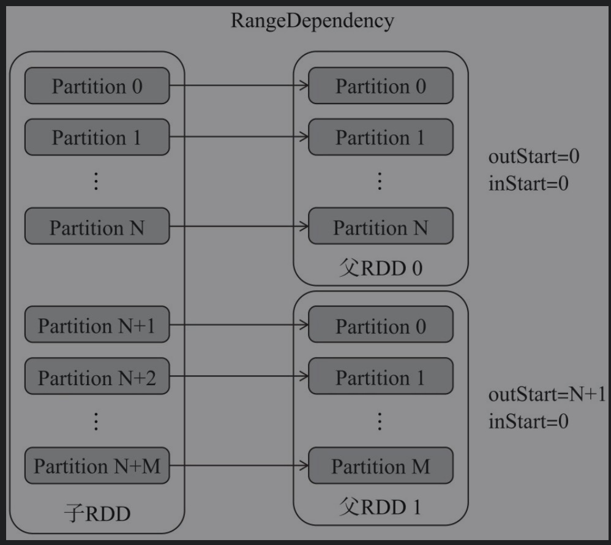
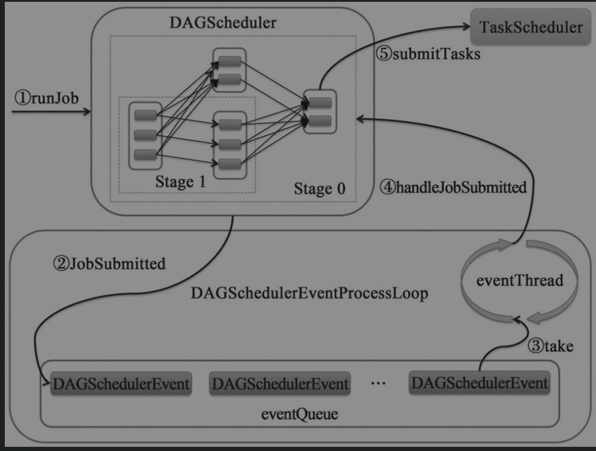

# 调度系统概述

## 主要工作流程


1. build operator DAG：用户提交的Job将首先被转换为一系列RDD并通过RDD之间的依赖关系构建DAG，然后将RDD构成的DAG提交到调度系统。
2. split graph into stages of tasks:DAGScheduler负责接收由RDD构成的DAG，将一系列RDD划分到不同的Stage。根据Stage的不同类型（目前有ResultStage和Shuffle MapStage两种），给Stage中未完成的Partition创建不同类型的Task（目前有ResultTask和ShuffleMapTask两种）。每个Stage将因为未完成Partition的多少，创建零到多个Task。DAGScheduler最后将每个Stage中的Task以任务集合（TaskSet）的形式提交给Task Scheduler继续处理。
3. launch tasks via cluster manager：使用集群管理器（clustermanager）分配资源与任务调度，对于失败的任务还会有一定的重试与容错机制。TaskScheduler负责从DAGScheduler接 收TaskSet，创 建TaskSetManager对TaskSet进 行 管 理，并 将 此TaskSetManager添加到调度池中，最后将对Task的调度交给调度后端接口（SchedulerBackend）处理。SchedulerBackend首先申请TaskScheduler，按照Task调度算法（目前有FIFO和FAIR两种）对调度池中的所有TaskSetManager进行排序，然后对TaskSet按照最大本地性原则分配资源，最后在各个分配的节点上运行TaskSet中的Task。
4. execute tasks：执行任务，并将任务中间结果和最终结果存入存储体系。

# RDD详解

* RDD（Resilient Distributed Datasets，弹性分布式数据集）代表可并行操作元素的不可变分区集合。

## RDD的特点

### 数据处理模型

* RDD是一个`容错的、并行的数据结构，可以控制将数据存储到磁盘或内存，能够获取数据的分区。`RDD提供了一组类似于Scala的操作，比如map、flatMap、filter、reduceByKey、join、mapPartitions等，这些操作实际是对RDD进行转换（transformation）。此外，RDD还提供了collect、foreach、count、reduce、countByKey等操作完成数据计算的动作（action）。
* 通常数据处理的模型包括迭代计算、关系查询、MapReduce、流式处理等。Hadoop使用MapReduce模型，Storm采用流式模型，Spark使用了全部模型。

### 依赖划分原则

* 一个RDD包含多个分区，每个分区实际是一个数据集合的片段。在构建DAG的过程中，会讲RDD串联起来，每个RDD都有其依赖项（最顶级RDD的依赖是空列表），这些依赖分为窄依赖（即NarrowDependency）和Shuffle依赖（即ShuffleDependency，也称为宽依赖）两种。
* NarrowDependency会被划分到同一个Stage中，这样它们就能以管道的方式迭代执行。ShuffleDependency由于所依赖的分区Task不止一个，所以往往需要跨节点传输数据。从容灾角度讲，它们恢复计算结果的方式不同。NarrowDependency只需要重新执行父RDD的丢失分区的计算即可恢复，而ShuffleDependency则需要考虑恢复所有父RDD的丢失分区。

### 数据处理效率

* RDD的计算过程允许在多个节点并发执行。如果数据量很大，可以适当增加分区数量，这种根据硬件条件对并发任务数量的控制，能更好地利用各种资源，也能有效提高Spark的数据处理效率。

### 容错处理

* 传统数据库往往采用日志记录来容灾容错，数据恢复都依赖于重新执行日志。Hadoop为了避免单机故障概率较高的问题，通常将数据备份到其他机器容灾。
* 由于所有备份机器同时出故障的概率比单机故障概率低很多，所以在发生宕机等问题时能够从备份机读取数据。RDD本身是一个不可变的（Scala中称为immutable）数据集，当某个Worker节点上的Task失败时，可以利用DAG重新调度计算这些失败的Task（执行已成功的Task可以从CheckPoint（检查点）中读取，而不用重新计算）。在流式计算的场景中，Spark需要记录日志和CheckPoint，以便利用CheckPoint和日志对数据恢复。

## RDD实现分析

### RDD类属性

* _sc:SparkContext
* deps:DEpendency的序列，用于存储当前RDD的依赖
* partitioner:当前RDD的分区计算器。
* id:当前RDD的唯一身份标识。
* name:RDD的名称
* partitions_:存储当前RDD的所有分区的数组
* creationSite:创建当前RDD的用户代码
* scope:当前RDD的操作作用域
* checkpointData:当前RDD的检查点数据
* checkpointAllMarkedAncestors：是否对所有标记了需要保存检查点的祖先保存检查点。
* doCheckpointCalled:是否已经调用了doCheckpoint方法设置检查点。此属性可以阻止对RDD多次设置检查点。

### 模版方法

#### compute

* 对RDD的分区进行计算,采用模版方法，不同的RDD类型有不同的compute模型。

```scala
def compute(split: Partition, context: TaskContext): Iterator[T]
```

#### getPartitions

* 获取当前RDD的所有分区。

```scala
protected def getPartitions: Array[Partition]
```

#### getDependencies

* 获取当前RDD的所有依赖

```scala
 protected def getDependencies: Seq[Dependency[_]] = deps
```

#### getPreferredLocations

* 获取某一分区的偏好位置

```scala
protected def getPreferredLocations(split: Partition): Seq[String] = Nil
```

### 通用方法

#### partitions

```scala
final def partitions: Array[Partition] = {
    // 先从CheckPoint查找->partitions_->getPartitions
    checkpointRDD.map((_: CheckpointRDD[T]).partitions).getOrElse {
      // 如果partitions_为null，double check
      if (partitions_ == null) {
        stateLock.synchronized {
          if (partitions_ == null) {
            // 拿到分区
            partitions_ = getPartitions
            partitions_.zipWithIndex.foreach { case (partition, index) =>
              require(partition.index == index,
                s"partitions($index).partition == ${partition.index}, but it should equal $index")
            }
          }
        }
      }
      partitions_
    }
  }
```

####  preferredLocations

```scala
  final def preferredLocations(split: Partition): Seq[String] = {
    // 先从checkpoint中查找偏好location，如果不存在再去getPreferredLocations()方法
    checkpointRDD.map(_.getPreferredLocations(split)).getOrElse {
      getPreferredLocations(split)
    }
  }
```

#### dependencies

```scala
 final def dependencies: Seq[Dependency[_]] = {
    //1. 先从checkpoint中查找，获取CheckpointRDD放入OneToOneDependency列表，如果chckpoint找不到
    //2.dependencies_属性
    //3.getDependencies方法
    checkpointRDD.map((r: CheckpointRDD[T]) => List(new OneToOneDependency(r))).getOrElse {
      if (dependencies_ == null) {
        stateLock.synchronized {
          if (dependencies_ == null) {
            dependencies_ = getDependencies
          }
        }
      }
      dependencies_
    }
  }
```

####  context

```scala
def context: SparkContext = sc
```

#### getNarrowAncestors

```scala
/**
   * 返回给定RDD是仅通过狭窄的依赖关系的顺序与它的祖先。 该遍历使用DFS给定的RDD的依赖关系树，但仍保持在返回的RDDS没有顺序。
   * Return the ancestors of the given RDD that are related to it only through a sequence of
   * narrow dependencies. This traverses the given RDD's dependency tree using DFS, but maintains
   * no ordering on the RDDs returned.
   */
  private[spark] def getNarrowAncestors: Seq[RDD[_]] = {
    // 窄依赖RDD的祖先集合
    val ancestors = new mutable.HashSet[RDD[_]]
    // 偏方法
    def visit(rdd: RDD[_]): Unit = {
      // 变量rdd的依赖，筛选出来窄依赖
      val narrowDependencies = rdd.dependencies.filter(_.isInstanceOf[NarrowDependency[_]])
      // 获取窄依赖的父RDD
      val narrowParents = narrowDependencies.map(_.rdd)
      // 判断祖先是否包含该RDD
      val narrowParentsNotVisited = narrowParents.filterNot(ancestors.contains)
      // 将祖先添加到集合，并且DFS方式回溯搜索祖先的祖先
      narrowParentsNotVisited.foreach { parent =>
        ancestors.add(parent)
        visit(parent)
      }
    }

    // 调用查询组件方法
    visit(this)

    // In case there is a cycle, do not include the root itself
    // 移除当前RDD进入组件集合
    ancestors.filterNot(_ == this).toSeq
  }
```

## RDD依赖

### 窄依赖

* RDD与上游RDD的分区是一对一的关系

```scala
abstract class NarrowDependency[T](_rdd: RDD[T]) extends Dependency[T] {
  /**
   * 根据子分区id获取其父亲分区id，可以由多个父亲分区id
   * Get the parent partitions for a child partition.
   * @param partitionId a partition of the child RDD
   * @return the partitions of the parent RDD that the child partition depends upon
   */
  def getParents(partitionId: Int): Seq[Int]

  /**
   * 上游RDD
   * @return
   */
  override def rdd: RDD[T] = _rdd
}
```

#### OneToOneDependency

* NarrowDependency的实现之一，RDD和上游RDD分区一对一的实现

```scala
class OneToOneDependency[T](rdd: RDD[T]) extends NarrowDependency[T](rdd) {
  override def getParents(partitionId: Int): List[Int] = List(partitionId)
}
```


#### RangeDependency

```scala
/**
 * :: DeveloperApi ::
 * Represents a one-to-one dependency between ranges of partitions in the parent and child RDDs.
 * @param rdd the parent RDD
 * @param inStart the start of the range in the parent RDD 父RDD中range的开始
 * @param outStart the start of the range in the child RDD 子RDD中range的开始
 * @param length the length of the range range的长度
 */
@DeveloperApi
class RangeDependency[T](rdd: RDD[T], inStart: Int, outStart: Int, length: Int)
  extends NarrowDependency[T](rdd) {

  override def getParents(partitionId: Int): List[Int] = {
    if (partitionId >= outStart && partitionId < outStart + length) {
      List(partitionId - outStart + inStart)
    } else {
      Nil
    }
  }
}
```



#### PruneDependency

```scala
private[spark] class PruneDependency[T](rdd: RDD[T], partitionFilterFunc: Int => Boolean)
  extends NarrowDependency[T](rdd) {

  @transient
  val partitions: Array[Partition] = rdd.partitions
    .filter(s => partitionFilterFunc(s.index)).zipWithIndex
    .map { case(split, idx) => new PartitionPruningRDDPartition(idx, split) : Partition }

  override def getParents(partitionId: Int): List[Int] = {
    List(partitions(partitionId).asInstanceOf[PartitionPruningRDDPartition].parentSplit.index)
  }
}
```

### 宽依赖

* RDD与上游RDD的分区如果不是一对一关系，或者RDD的分区依赖于上游RDD的多个分区，这种依赖就是宽依赖(Shuffle依赖)

```scala
/**
 * :: DeveloperApi ::
 * Represents a dependency on the output of a shuffle stage. Note that in the case of shuffle,
 * the RDD is transient since we don't need it on the executor side.
 *
 * @param _rdd the parent RDD 父RDD
 * @param partitioner partitioner used to partition the shuffle output 分区器，用于对shuffle输出进行分区
 * @param serializer [[org.apache.spark.serializer.Serializer Serializer]] to use. If not set
 *                   explicitly then the default serializer, as specified by `spark.serializer`
 *                   config option, will be used.
 * @param keyOrdering key ordering for RDD's shuffles 排序的key
 * @param aggregator map/reduce-side aggregator for RDD's shuffle rdd的shuffle是map端或者reduce端聚合
 * @param mapSideCombine whether to perform partial aggregation (also known as map-side combine) 是否在map端进行预计算
 */
@DeveloperApi
class ShuffleDependency[K: ClassTag, V: ClassTag, C: ClassTag](
    @transient private val _rdd: RDD[_ <: Product2[K, V]],
    val partitioner: Partitioner,
    val serializer: Serializer = SparkEnv.get.serializer,
    val keyOrdering: Option[Ordering[K]] = None,
    val aggregator: Option[Aggregator[K, V, C]] = None,
    val mapSideCombine: Boolean = false)
  extends Dependency[Product2[K, V]] {

  // 如果设置map端预算，判断aggregator是否定义
  if (mapSideCombine) {
    require(aggregator.isDefined, "Map-side combine without Aggregator specified!")
  }
  // 判断rdd
  override def rdd: RDD[Product2[K, V]] = _rdd.asInstanceOf[RDD[Product2[K, V]]]

  // rdd的key的全类名
  private[spark] val keyClassName: String = reflect.classTag[K].runtimeClass.getName
  // rdd的value的全类名
  private[spark] val valueClassName: String = reflect.classTag[V].runtimeClass.getName
  // Note: It's possible that the combiner class tag is null, if the combineByKey
  // methods in PairRDDFunctions are used instead of combineByKeyWithClassTag.
  // 预计算函数的全类名
  private[spark] val combinerClassName: Option[String] =
    Option(reflect.classTag[C]).map(_.runtimeClass.getName)

  // shuffleId
  val shuffleId: Int = _rdd.context.newShuffleId()

  // shuffle处理器，向shuffleManager注册
  val shuffleHandle: ShuffleHandle = _rdd.context.env.shuffleManager.registerShuffle(
    shuffleId, _rdd.partitions.length, this)

  // 注册shuffle的contextCleaner，用于清理shuffle中间结果
  _rdd.sparkContext.cleaner.foreach(_.registerShuffleForCleanup(this))
}
```

## Partitioner

* ShuffleDependency的partitioner属性的类型是Partitioner，抽象类Partitioner定义了分区计算器的接口规范，ShuffleDependency的分区取决于Partitioner的具体实现。

```scala
abstract class Partitioner extends Serializable {
  // 分区总数量
  def numPartitions: Int
  // 根据key获取对应的分区
  def getPartition(key: Any): Int
}
```


### 默认分区器

```scala
def defaultPartitioner(rdd: RDD[_], others: RDD[_]*): Partitioner = {
    // 将可变参数放入到一个Seq中
    val rdds: Seq[RDD[_]] = (Seq(rdd) ++ others)
    // 筛选出不存在分区的RDD
    val hasPartitioner: Seq[RDD[_]] = rdds.filter(_.partitioner.exists(_.numPartitions > 0))

    // 获取最大分区的RDD
    val hasMaxPartitioner: Option[RDD[_]] = if (hasPartitioner.nonEmpty) {
      Some(hasPartitioner.maxBy(_.partitions.length))
    } else {
      None
    }

    // 得到默认分区数量，如果spark.default.parallelism存在则为他，否则为传入rdd中的最大分区数
    val defaultNumPartitions: Int = if (rdd.context.conf.contains("spark.default.parallelism")) {
      rdd.context.defaultParallelism
    } else {
      rdds.map(_.partitions.length).max
    }

    // If the existing max partitioner is an eligible one, or its partitions number is larger
    // than the default number of partitions, use the existing partitioner.
    // 如果存在最大分区器，并且是合格的分区程序，或者默认分区数量小雨最大分区器的分区数，则返回最大分区的分区器，否则默认为Hash分区器，并且分区个数为"spark.default.parallelism"
    if (hasMaxPartitioner.nonEmpty && (isEligiblePartitioner(hasMaxPartitioner.get, rdds) ||
        defaultNumPartitions < hasMaxPartitioner.get.getNumPartitions)) {
      hasMaxPartitioner.get.partitioner.get
    } else {
      new HashPartitioner(defaultNumPartitions)
    }
  }
```

### HashPartitioner

```scala
class HashPartitioner(partitions: Int) extends Partitioner {
  require(partitions >= 0, s"Number of partitions ($partitions) cannot be negative.")

  def numPartitions: Int = partitions

  def getPartition(key: Any): Int = key match {
    case null => 0
      // 获取key的hashcode和分区数的非负数取余为分区数
    case _ => Utils.nonNegativeMod(key.hashCode, numPartitions)
  }

  override def equals(other: Any): Boolean = other match {
    case h: HashPartitioner =>
      h.numPartitions == numPartitions
    case _ =>
      false
  }

  override def hashCode: Int = numPartitions
}
```

### RangePartitioner

```scala
/**
 * A [[org.apache.spark.Partitioner]] that partitions sortable records by range into roughly
 * equal ranges. The ranges are determined by sampling the content of the RDD passed in.
 *
 * @note The actual number of partitions created by the RangePartitioner might not be the same
 * as the `partitions` parameter, in the case where the number of sampled records is less than
 * the value of `partitions`.
 */
```

## RDDInfo

### 相关属性

```scala
class RDDInfo(
    val id: Int, //rdd id
    var name: String, // rdd name
    val numPartitions: Int, // rdd partition num
    var storageLevel: StorageLevel, //存储级别
    val parentIds: Seq[Int], //  父RDDid集合
    val callSite: String = "", // RDD的用户调用栈信息
    val scope: Option[RDDOperationScope] = None) // rdd的操作范围。scope的类型为RDDOperationScope，每一个RDD都有一个RDDOperationScope。RDDOperationScope与Stage或Job之间并无特殊关系，一个RDDOperationScope可以存在于一个Stage内，也可以跨越多个Job。
  extends Ordered[RDDInfo] {

  // 缓存的分区数量
  var numCachedPartitions = 0
  // 使用的内存大小
  var memSize = 0L
  // 使用的磁盘大小
  var diskSize = 0L
  // block存储在外部的大小
  var externalBlockStoreSize = 0L
```

### 相关方法

#### isCached

```scala
 // 是否已经缓存
  def isCached: Boolean = (memSize + diskSize > 0) && numCachedPartitions > 0
```

#### compare

```scala
# 比较传入的rdd和当前rdd的大小关系,用于排序
override def compare(that: RDDInfo): Int = {
    this.id - that.id
  }
```

#### fromRDD

```scala
 def fromRdd(rdd: RDD[_]): RDDInfo = {
    // rddName
    val rddName = Option(rdd.name).getOrElse(Utils.getFormattedClassName(rdd))
    // 父RDDid集合
    val parentIds = rdd.dependencies.map(_.rdd.id)
    // rdd调用栈
    val callsiteLongForm = Option(SparkEnv.get)
      .map(_.conf.get(EVENT_LOG_CALLSITE_LONG_FORM))
      .getOrElse(false)

    val callSite = if (callsiteLongForm) {
      rdd.creationSite.longForm
    } else {
      rdd.creationSite.shortForm
    }
    new RDDInfo(rdd.id, rddName, rdd.partitions.length,
      rdd.getStorageLevel, parentIds, callSite, rdd.scope)
  }
```

# Stage详解

* DAGScheduler将Job的RDD划分到不同的Stage，并构建这些Stage的依赖关系。这样可以使没有依赖关系的Stage并行执行，并保证有依赖关系的Stage顺序执行。

```scala
 * @param id Unique stage ID 唯一的stage ID
 * @param rdd RDD that this stage runs on: for a shuffle map stage, it's the RDD we run map tasks
 *   on, while for a result stage, it's the target RDD that we ran an action on
 * @param numTasks Total number of tasks in stage; result stages in particular may not need to
 *   compute all partitions, e.g. for first(), lookup(), and take().
 * @param parents List of stages that this stage depends on (through shuffle dependencies). stage依赖
 * @param firstJobId ID of the first job this stage was part of, for FIFO scheduling. 第一个job的id作为这个stage的一部分
 * @param callSite Location in the user program associated with this stage: either where the target
 *   RDD was created, for a shuffle map stage, or where the action for a result stage was called.
 */
private[scheduler] abstract class Stage(
    val id: Int,
    val rdd: RDD[_],
    val numTasks: Int,
    val parents: List[Stage],
    val firstJobId: Int,
    val callSite: CallSite)
  extends Logging {

  // rdd分区数量
  val numPartitions = rdd.partitions.length

  /** Set of jobs that this stage belongs to. */
  // jobId集合
  val jobIds = new HashSet[Int]

  /** The ID to use for the next new attempt for this stage. */
  // 下次重试id
  private var nextAttemptId: Int = 0

  // stage name
  val name: String = callSite.shortForm
  // stage详情
  val details: String = callSite.longForm

  /**
   * 返回最近一次Stage尝试的StageInfo，即返回_latestInfo。
   * Pointer to the [[StageInfo]] object for the most recent attempt. This needs to be initialized
   * here, before any attempts have actually been created, because the DAGScheduler uses this
   * StageInfo to tell SparkListeners when a job starts (which happens before any stage attempts
   * have been created).
   */
  private var _latestInfo: StageInfo = StageInfo.fromStage(this, nextAttemptId)

  /**
   * 失败的attemptId集合
   * Set of stage attempt IDs that have failed. We keep track of these failures in order to avoid
   * endless retries if a stage keeps failing.
   * We keep track of each attempt ID that has failed to avoid recording duplicate failures if
   * multiple tasks from the same stage attempt fail (SPARK-5945).
   */
  val failedAttemptIds = new HashSet[Int]
```

* makeNewStageAttempt

```scala
/**
   * 通过使用新的attempt ID创建一个新的StageInfo，为这个阶段创建一个新的attempt
   */
  /** Creates a new attempt for this stage by creating a new StageInfo with a new attempt ID. */
  def makeNewStageAttempt(
      numPartitionsToCompute: Int,
      taskLocalityPreferences: Seq[Seq[TaskLocation]] = Seq.empty): Unit = {
    val metrics = new TaskMetrics
    // 注册度量
    metrics.register(rdd.sparkContext)
    // 得到最后一次访问Stage的StageInfo信息
    _latestInfo = StageInfo.fromStage(
      this, nextAttemptId, Some(numPartitionsToCompute), metrics, taskLocalityPreferences)
    nextAttemptId += 1
  }
```

## ResultStage实现

```scala
/**
 *
 * @param id Unique stage ID 唯一的stage ID
 * @param rdd RDD that this stage runs on: for a shuffle map stage, it's the RDD we run map tasks
 *   on, while for a result stage, it's the target RDD that we ran an action on
 * @param func  即对RDD的分区进行计算的函数。
 * @param partitions 由RDD的哥哥分区的索引组成的数组
 * @param parents List of stages that this stage depends on (through shuffle dependencies). stage依赖
 * @param firstJobId ID of the first job this stage was part of, for FIFO scheduling. 第一个job的id作为这个stage的一部分
 * @param callSite Location in the user program associated with this stage: either where the target
 *   RDD was created, for a shuffle map stage, or where the action for a result stage was called.
 */
private[spark] class ResultStage(
    id: Int,
    rdd: RDD[_],
    val func: (TaskContext, Iterator[_]) => _,
    val partitions: Array[Int],
    parents: List[Stage],
    firstJobId: Int,
    callSite: CallSite)
  extends Stage(id, rdd, partitions.length, parents, firstJobId, callSite) {

  /**
   * result stage的活跃job 如果job已经完成将会为空
   * The active job for this result stage. Will be empty if the job has already finished
   * 例如这个任务被取消
   * (e.g., because the job was cancelled).
   */
  private[this] var _activeJob: Option[ActiveJob] = None

  /**
   * 活跃job
   * @return
   */
  def activeJob: Option[ActiveJob] = _activeJob

  // 设置活跃job
  def setActiveJob(job: ActiveJob): Unit = {
    _activeJob = Option(job)
  }

  // 移除当前活跃job
  def removeActiveJob(): Unit = {
    _activeJob = None
  }

  /**
   * 返回丢失分区id集合的seq
   * Returns the sequence of partition ids that are missing (i.e. needs to be computed).
   *
   * This can only be called when there is an active job.
   */
  override def findMissingPartitions(): Seq[Int] = {
    // 获取当前活跃job
    val job = activeJob.get
    // 筛选出没有完成的分区
    (0 until job.numPartitions).filter(id => !job.finished(id))
  }

  override def toString: String = "ResultStage " + id
}
```

## ShuffleMapStage实现

* ShuffleMapStage是DAG调度流程的中间Stage，他可以包括一个到多个ShuffleMap-Task，这些Task用于生产Shuffle的数据。

```scala
/**
 *
 * @param id Unique stage ID 唯一的stage ID
 * @param rdd RDD that this stage runs on: for a shuffle map stage, it's the RDD we run map tasks
 *   on, while for a result stage, it's the target RDD that we ran an action on
 * @param numTasks Total number of tasks in stage; result stages in particular may not need to
 *   compute all partitions, e.g. for first(), lookup(), and take().
 * @param parents List of stages that this stage depends on (through shuffle dependencies). stage依赖
 * @param firstJobId ID of the first job this stage was part of, for FIFO scheduling. 第一个job的id作为这个stage的一部分
 * @param callSite Location in the user program associated with this stage: either where the target
 *   RDD was created, for a shuffle map stage, or where the action for a result stage was called.
 * @param shuffleDep shuffle依赖
 * @param mapOutputTrackerMaster map端输出中间数据追中器Master
 */
private[spark] class ShuffleMapStage(
    id: Int,
    rdd: RDD[_],
    numTasks: Int,
    parents: List[Stage],
    firstJobId: Int,
    callSite: CallSite,
    val shuffleDep: ShuffleDependency[_, _, _],
    mapOutputTrackerMaster: MapOutputTrackerMaster)
  extends Stage(id, rdd, numTasks, parents, firstJobId, callSite) {

  // map阶段job集合
  private[this] var _mapStageJobs: List[ActiveJob] = Nil

  /**
   * 暂停的分区集合
   *
   * 要么尚未计算，或者被计算在此后已失去了执行程序，它，所以应该重新计算。 此变量用于由DAGScheduler以确定何时阶段已完成。 在该阶段，无论是积极的尝试或较早尝试这一阶段可能会导致paritition IDS任务成功摆脱pendingPartitions删除。 其结果是，这个变量可以是与在TaskSetManager挂起任务的阶段主动尝试不一致（这里存储分区将始终是分区的一个子集，该TaskSetManager自以为待定）。
   * Partitions that either haven't yet been computed, or that were computed on an executor
   * that has since been lost, so should be re-computed.  This variable is used by the
   * DAGScheduler to determine when a stage has completed. Task successes in both the active
   * attempt for the stage or in earlier attempts for this stage can cause paritition ids to get
   * removed from pendingPartitions. As a result, this variable may be inconsistent with the pending
   * tasks in the TaskSetManager for the active attempt for the stage (the partitions stored here
   * will always be a subset of the partitions that the TaskSetManager thinks are pending).
   */
  val pendingPartitions = new HashSet[Int]

  override def toString: String = "ShuffleMapStage " + id

  /**
   * Returns the list of active jobs,
   * i.e. map-stage jobs that were submitted to execute this stage independently (if any).
   */
  def mapStageJobs: Seq[ActiveJob] = _mapStageJobs

  /** Adds the job to the active job list. */
  def addActiveJob(job: ActiveJob): Unit = {
    _mapStageJobs = job :: _mapStageJobs
  }

  /** Removes the job from the active job list. */
  def removeActiveJob(job: ActiveJob): Unit = {
    _mapStageJobs = _mapStageJobs.filter(_ != job)
  }

  /**
   * Number of partitions that have shuffle outputs.
   * When this reaches [[numPartitions]], this map stage is ready.
   */
  def numAvailableOutputs: Int = mapOutputTrackerMaster.getNumAvailableOutputs(shuffleDep.shuffleId)

  /**
   * Returns true if the map stage is ready, i.e. all partitions have shuffle outputs.
   */
  def isAvailable: Boolean = numAvailableOutputs == numPartitions

  /** Returns the sequence of partition ids that are missing (i.e. needs to be computed). */
  override def findMissingPartitions(): Seq[Int] = {
    mapOutputTrackerMaster
      // 查询计算完成的分区
      .findMissingPartitions(shuffleDep.shuffleId)
      .getOrElse(0 until numPartitions)
  }
}
```

## StageInfo

```scala
class StageInfo(
    val stageId: Int,
    @deprecated("Use attemptNumber instead", "2.3.0") val attemptId: Int,
    val name: String,
    val numTasks: Int, //当前Stage的task数量
    val rddInfos: Seq[RDDInfo], // rddInfo集合
    val parentIds: Seq[Int], //父Stage集合
    val details: String,//详细线程栈信息
    val taskMetrics: TaskMetrics = null,
    private[spark] val taskLocalityPreferences: Seq[Seq[TaskLocation]] = Seq.empty) {
  /** When this stage was submitted from the DAGScheduler to a TaskScheduler. */
  // DAGScheduler将当前Stage提交给TaskScheduler的时间。
  var submissionTime: Option[Long] = None
  /** Time when all tasks in the stage completed or when the stage was cancelled. */
  // 当前Stage中的所有Task完成的时间（即Stage完成的时间）或者Stage被取消的时间。
  var completionTime: Option[Long] = None
  /** If the stage failed, the reason why. */
  // 失败的原因
  var failureReason: Option[String] = None

  /**
   * Terminal values of accumulables updated during this stage, including all the user-defined
   * accumulators.
   */
    // 存储了所有聚合器计算的最终值。
  val accumulables = HashMap[Long, AccumulableInfo]()

  def stageFailed(reason: String) {
    failureReason = Some(reason)
    completionTime = Some(System.currentTimeMillis)
  }

  def attemptNumber(): Int = attemptId

  private[spark] def getStatusString: String = {
    if (completionTime.isDefined) {
      if (failureReason.isDefined) {
        "failed"
      } else {
        "succeeded"
      }
    } else {
      "running"
    }
  }
}

private[spark] object StageInfo {
  /**
   * Construct a StageInfo from a Stage.
   *
   * Each Stage is associated with one or many RDDs, with the boundary of a Stage marked by
   * shuffle dependencies. Therefore, all ancestor RDDs related to this Stage's RDD through a
   * sequence of narrow dependencies should also be associated with this Stage.
   */
  def fromStage(
      stage: Stage,
      attemptId: Int,
      numTasks: Option[Int] = None,
      taskMetrics: TaskMetrics = null,
      taskLocalityPreferences: Seq[Seq[TaskLocation]] = Seq.empty
    ): StageInfo = {
    val ancestorRddInfos = stage.rdd.getNarrowAncestors.map(RDDInfo.fromRdd)
    val rddInfos = Seq(RDDInfo.fromRdd(stage.rdd)) ++ ancestorRddInfos
    new StageInfo(
      stage.id,
      attemptId,
      stage.name,
      numTasks.getOrElse(stage.numTasks),
      rddInfos,
      stage.parents.map(_.id),
      stage.details,
      taskMetrics,
      taskLocalityPreferences)
  }
}
```

# DAGScheduler

* DAGScheduler实现了面向DAG的高层次调度，即将DAG中的各个RDD划分到不同的Stage。DAGScheduler可以通过计算将DAG中的一系列RDD划分到不同的Stage，然后构建这些Stage之间的父子关系，最后将每个Stage按照Partition切分为多个Task，并以Task集合（即TaskSet）的形式提交给底层的TaskScheduler。
* 所有的组件都通过向DAGScheduler投递DAGSchedulerEvent来使用DAGScheduler。DAGScheduler内部的DAGSchedulerEventProcessLoop将处理这些DAGScheduler-Event，并调用DAGScheduler的不同方法。JobListener用于对作业中每个Task执行成功或失败进行监听，JobWaiter实现了JobListener并最终确定作业的成功与失败。

## JobListener和JobWaiter

### JobListener

```scala
private[spark] trait JobListener {
  /**
   * task执行成功后
   * @param index
   * @param result
   */
  def taskSucceeded(index: Int, result: Any): Unit

  /**
   * job执行失败
   * @param exception
   */
  def jobFailed(exception: Exception): Unit
}
```

### JobWaiter

```scala
private[spark] class JobWaiter[T](
    dagScheduler: DAGScheduler,
    val jobId: Int,
    totalTasks: Int, // 全部等待完成Task数量
    resultHandler: (Int, T) => Unit)
  extends JobListener with Logging {

  // 完成的task数量
  private val finishedTasks = new AtomicInteger(0)
  // If the job is finished, this will be its result. In the case of 0 task jobs (e.g. zero
  // partition RDDs), we set the jobResult directly to JobSucceeded.
  // jobPromise用来代表Job完成后的结果。如果totalTasks等于零，说明没有Task需要执行，此时jobPromise将被直接设置为Success。
  private val jobPromise: Promise[Unit] =
    if (totalTasks == 0) Promise.successful(()) else Promise()

  def jobFinished: Boolean = jobPromise.isCompleted

  def completionFuture: Future[Unit] = jobPromise.future

  /**
   * Sends a signal to the DAGScheduler to cancel the job. The cancellation itself is handled
   * asynchronously. After the low level scheduler cancels all the tasks belonging to this job, it
   * will fail this job with a SparkException.
   */
  def cancel() {
    dagScheduler.cancelJob(jobId, None)
  }

  override def taskSucceeded(index: Int, result: Any): Unit = {
    // resultHandler call must be synchronized in case resultHandler itself is not thread safe.
    synchronized {
      resultHandler(index, result.asInstanceOf[T])
    }
    if (finishedTasks.incrementAndGet() == totalTasks) {
      jobPromise.success(())
    }
  }

  override def jobFailed(exception: Exception): Unit = {
    if (!jobPromise.tryFailure(exception)) {
      logWarning("Ignore failure", exception)
    }
  }

}
```

## ActiveJob详解

```scala
private[spark] class ActiveJob(
    val jobId: Int,
    val finalStage: Stage,
    val callSite: CallSite,
    val listener: JobListener,
    val properties: Properties) {

  /**
    * 拿到分区的数量，模式匹配
   * Number of partitions we need to compute for this job. Note that result stages may not need
   * to compute all partitions in their target RDD, for actions like first() and lookup().
   */
  val numPartitions = finalStage match {
      // 最终阶段为最终阶段的分区数量
    case r: ResultStage => r.partitions.length
      // m的rdd的分区数量
    case m: ShuffleMapStage => m.rdd.partitions.length
  }

  /** Which partitions of the stage have finished */
  val finished = Array.fill[Boolean](numPartitions)(false)

  var numFinished = 0

  /** Resets the status of all partitions in this stage so they are marked as not finished. */
  def resetAllPartitions(): Unit = {
    (0 until numPartitions).foreach(finished.update(_, false))
    numFinished = 0
  }
}
```

## DAGSchedulerEventProcessLoop

* DAGSchedulerEventProcessLoop是DAGScheduler内部的事件循环处理器，用于处理DAGSchedulerEvent类型的事件

```scala
/**
 * DAG时间循环处理器，主要处理DAGSchedulerEvent事件
 * @param dagScheduler
 */
private[scheduler] class DAGSchedulerEventProcessLoop(dagScheduler: DAGScheduler)
  extends EventLoop[DAGSchedulerEvent]("dag-scheduler-event-loop") with Logging {
  
  private[this] val timer = dagScheduler.metricsSource.messageProcessingTimer

  /**
   * The main event loop of the DAG scheduler.
    *  DAG调度器的主事件循环
   */
  override def onReceive(event: DAGSchedulerEvent): Unit = {
    // 定时器上下文
    val timerContext: Timer.Context = timer.time()
    try {
      doOnReceive(event)
    } finally {
      timerContext.stop()
    }
  }

  /**
    * 处理DAGSchedulerEvent
    * @param event
    */
  private def doOnReceive(event: DAGSchedulerEvent): Unit = event match {
      // 模式匹配来处理不同的DAG事件
    case JobSubmitted(jobId, rdd, func, partitions, callSite, listener, properties) =>
      dagScheduler.handleJobSubmitted(jobId, rdd, func, partitions, callSite, listener, properties)

    case MapStageSubmitted(jobId, dependency, callSite, listener, properties) =>
      dagScheduler.handleMapStageSubmitted(jobId, dependency, callSite, listener, properties)

    case StageCancelled(stageId, reason) =>
      dagScheduler.handleStageCancellation(stageId, reason)

    case JobCancelled(jobId, reason) =>
      dagScheduler.handleJobCancellation(jobId, reason)

    case JobGroupCancelled(groupId) =>
      dagScheduler.handleJobGroupCancelled(groupId)

    case AllJobsCancelled =>
      dagScheduler.doCancelAllJobs()

    case ExecutorAdded(execId, host) =>
      dagScheduler.handleExecutorAdded(execId, host)

    case ExecutorLost(execId, reason) =>
      val workerLost = reason match {
        case SlaveLost(_, true) => true
        case _ => false
      }
      dagScheduler.handleExecutorLost(execId, workerLost)

    case WorkerRemoved(workerId, host, message) =>
      dagScheduler.handleWorkerRemoved(workerId, host, message)

    case BeginEvent(task, taskInfo) =>
      dagScheduler.handleBeginEvent(task, taskInfo)

    case SpeculativeTaskSubmitted(task) =>
      dagScheduler.handleSpeculativeTaskSubmitted(task)

    case GettingResultEvent(taskInfo) =>
      dagScheduler.handleGetTaskResult(taskInfo)

    case completion: CompletionEvent =>
      dagScheduler.handleTaskCompletion(completion)

    case TaskSetFailed(taskSet, reason, exception) =>
      dagScheduler.handleTaskSetFailed(taskSet, reason, exception)

    case ResubmitFailedStages =>
      dagScheduler.resubmitFailedStages()
  }

  override def onError(e: Throwable): Unit = {
    logError("DAGSchedulerEventProcessLoop failed; shutting down SparkContext", e)
    try {
      dagScheduler.doCancelAllJobs()
    } catch {
      case t: Throwable => logError("DAGScheduler failed to cancel all jobs.", t)
    }
    dagScheduler.sc.stopInNewThread()
  }

  override def onStop(): Unit = {
    // Cancel any active jobs in postStop hook
    dagScheduler.cleanUpAfterSchedulerStop()
  }
}

private[spark] object DAGScheduler {
  // The time, in millis, to wait for fetch failure events to stop coming in after one is detected;
  // this is a simplistic way to avoid resubmitting tasks in the non-fetchable map stage one by one
  // as more failure events come in
  val RESUBMIT_TIMEOUT = 200

  // Number of consecutive stage attempts allowed before a stage is aborted
  val DEFAULT_MAX_CONSECUTIVE_STAGE_ATTEMPTS = 4
}
```

## DAGScheduler的组成

```scala
private[spark] class DAGScheduler(
    private[scheduler] val sc: SparkContext,
    private[scheduler] val taskScheduler: TaskScheduler,
    listenerBus: LiveListenerBus,
    mapOutputTracker: MapOutputTrackerMaster,
    blockManagerMaster: BlockManagerMaster,
    env: SparkEnv,
    clock: Clock = new SystemClock())
  extends Logging {

  def this(sc: SparkContext, taskScheduler: TaskScheduler) = {
    this(
      sc,
      taskScheduler,
      sc.listenerBus,
      sc.env.mapOutputTracker.asInstanceOf[MapOutputTrackerMaster],
      sc.env.blockManager.master,
      sc.env)
  }

  def this(sc: SparkContext) = this(sc, sc.taskScheduler)

  private[spark] val metricsSource: DAGSchedulerSource = new DAGSchedulerSource(this)

  // 下一个jobid
  private[scheduler] val nextJobId = new AtomicInteger(0)
  // 总job数量
  private[scheduler] def numTotalJobs: Int = nextJobId.get()
  // 下一个stageid
  private val nextStageId = new AtomicInteger(0)

  // jobid和stageid的映射
  private[scheduler] val jobIdToStageIds = new HashMap[Int, HashSet[Int]]
  // stageid和stage的映射
  private[scheduler] val stageIdToStage = new HashMap[Int, Stage]
  /**
   * shuffleid和ShuffleMapStage的映射
   * Mapping from shuffle dependency ID to the ShuffleMapStage that will generate the data for
   * that dependency. Only includes stages that are part of currently running job (when the job(s)
   * that require the shuffle stage complete, the mapping will be removed, and the only record of
   * the shuffle data will be in the MapOutputTracker).
   */
  private[scheduler] val shuffleIdToMapStage = new HashMap[Int, ShuffleMapStage]
  // jobid和activeJob的映射
  private[scheduler] val jobIdToActiveJob = new HashMap[Int, ActiveJob]

  // Stages we need to run whose parents aren't done
  // 等待中的stage
  private[scheduler] val waitingStages = new HashSet[Stage]

  // Stages we are running right now
  private[scheduler] val runningStages = new HashSet[Stage]

  // Stages that must be resubmitted due to fetch failures
  private[scheduler] val failedStages = new HashSet[Stage]

  private[scheduler] val activeJobs = new HashSet[ActiveJob]

  /**
   * Contains the locations that each RDD's partitions are cached on.  This map's keys are RDD ids
   * and its values are arrays indexed by partition numbers. Each array value is the set of
   * locations where that RDD partition is cached.
   *
   * All accesses to this map should be guarded by synchronizing on it (see SPARK-4454).
   */
    //缓存每个RDD的所有分区的位置信息。cacheLocs的数据类型是HashMap[Int, IndexedSeq[Seq[TaskLocation]]]，所以每个RDD的分区按照分区号作为索引存储到IndexedSeq。由于RDD的每个分区作为一个Block以及存储体系的复制因素，因此RDD的每个分区的Block可能存在于多个节点的BlockManager上，RDD每个分区的位置信息为TaskLocation的序列。
  private val cacheLocs = new HashMap[Int, IndexedSeq[Seq[TaskLocation]]]

  // For tracking failed nodes, we use the MapOutputTracker's epoch number, which is sent with
  // every task. When we detect a node failing, we note the current epoch number and failed
  // executor, increment it for new tasks, and use this to ignore stray ShuffleMapTask results.
  //
  // TODO: Garbage collect information about failure epochs when we know there are no more
  //       stray messages to detect.
  private val failedEpoch = new HashMap[String, Long]

  private [scheduler] val outputCommitCoordinator = env.outputCommitCoordinator

  // A closure serializer that we reuse.
  // This is only safe because DAGScheduler runs in a single thread.
  private val closureSerializer = SparkEnv.get.closureSerializer.newInstance()

  /** If enabled, FetchFailed will not cause stage retry, in order to surface the problem. */
  private val disallowStageRetryForTest = sc.getConf.getBoolean("spark.test.noStageRetry", false)

  /**
   * Whether to unregister all the outputs on the host in condition that we receive a FetchFailure,
   * this is set default to false, which means, we only unregister the outputs related to the exact
   * executor(instead of the host) on a FetchFailure.
   */
  private[scheduler] val unRegisterOutputOnHostOnFetchFailure =
    sc.getConf.get(config.UNREGISTER_OUTPUT_ON_HOST_ON_FETCH_FAILURE)

  /**
   * Number of consecutive stage attempts allowed before a stage is aborted.
   */
  private[scheduler] val maxConsecutiveStageAttempts =
    sc.getConf.getInt("spark.stage.maxConsecutiveAttempts",
      DAGScheduler.DEFAULT_MAX_CONSECUTIVE_STAGE_ATTEMPTS)

  /**
   * Number of max concurrent tasks check failures for each barrier job.
   */
  private[scheduler] val barrierJobIdToNumTasksCheckFailures = new ConcurrentHashMap[Int, Int]

  /**
   * Time in seconds to wait between a max concurrent tasks check failure and the next check.
   */
  private val timeIntervalNumTasksCheck = sc.getConf
    .get(config.BARRIER_MAX_CONCURRENT_TASKS_CHECK_INTERVAL)

  /**
   * Max number of max concurrent tasks check failures allowed for a job before fail the job
   * submission.
   */
  private val maxFailureNumTasksCheck = sc.getConf
    .get(config.BARRIER_MAX_CONCURRENT_TASKS_CHECK_MAX_FAILURES)

  private val messageScheduler =
    ThreadUtils.newDaemonSingleThreadScheduledExecutor("dag-scheduler-message")

  private[spark] val eventProcessLoop = new DAGSchedulerEventProcessLoop(this)
  taskScheduler.setDAGScheduler(this)
```

## DAGScheduler与Job的提交

### 提交Job

* 用户提交的Job首先会被转换为一系列RDD，然后才交给DAGScheduler进行处理。

```scala
def runJob[T, U](
                    rdd: RDD[T],
                    func: (TaskContext, Iterator[T]) => U,
                    partitions: Seq[Int],
                    callSite: CallSite,
                    resultHandler: (Int, U) => Unit,
                    properties: Properties): Unit = {
    val start = System.nanoTime
    // 提交Job,得到一个JobWaiter，包含Job的相关信息
    val waiter: JobWaiter[U] = submitJob(rdd, func, partitions, callSite, resultHandler, properties)
    // 等待job完成
    ThreadUtils.awaitReady(waiter.completionFuture, Duration.Inf)
    // job执行成功
    waiter.completionFuture.value.get match {
      case scala.util.Success(_) =>
        logInfo("Job %d finished: %s, took %f s".format
        (waiter.jobId, callSite.shortForm, (System.nanoTime - start) / 1e9))
        // 执行失败
      case scala.util.Failure(exception) =>
        logInfo("Job %d failed: %s, took %f s".format
        (waiter.jobId, callSite.shortForm, (System.nanoTime - start) / 1e9))
        // SPARK-8644: Include user stack trace in exceptions coming from DAGScheduler.
        val callerStackTrace = Thread.currentThread().getStackTrace.tail
        exception.setStackTrace(exception.getStackTrace ++ callerStackTrace)
        throw exception
    }
  }

//submitJob
  def submitJob[T, U](
                       rdd: RDD[T],
                       func: (TaskContext, Iterator[T]) => U,
                       partitions: Seq[Int],
                       callSite: CallSite,
                       resultHandler: (Int, U) => Unit,
                       properties: Properties): JobWaiter[U] = {
    // Check to make sure we are not launching a task on a partition that does not exist.
    // 拿到rdd的分区数量，最大分区数
    val maxPartitions: Int = rdd.partitions.length
    // 校验分区集合中的分区信息
    partitions.find(p => p >= maxPartitions || p < 0).foreach { p =>
      throw new IllegalArgumentException(
        "Attempting to access a non-existent partition: " + p + ". " +
          "Total number of partitions: " + maxPartitions)
    }

    // 拿到jobId
    val jobId: Int = nextJobId.getAndIncrement()
    // 如果分区数量为0
    if (partitions.size == 0) {
      // Return immediately if the job is running 0 tasks
      // 这个任务运行0个task，返回这个JobWaiter
      return new JobWaiter[U](this, jobId, 0, resultHandler)
    }

    assert(partitions.size > 0)
    // 转换func
    val func2 = func.asInstanceOf[(TaskContext, Iterator[_]) => _]
    // 创建JobWaiter
    val waiter = new JobWaiter(this, jobId, partitions.size, resultHandler)
    // 将JobSubmitted放入event队列，actor模式
    eventProcessLoop.post(JobSubmitted(
      jobId, rdd, func2, partitions.toArray, callSite, waiter,
      SerializationUtils.clone(properties)))
    waiter
  }
```

### 处理提交的Job

#### handleJobSubmitted

```scala
 private[scheduler] def handleJobSubmitted(jobId: Int,
                                            finalRDD: RDD[_],
                                            func: (TaskContext, Iterator[_]) => _,
                                            partitions: Array[Int],
                                            callSite: CallSite,
                                            listener: JobListener,
                                            properties: Properties) {
    // 创建finalStage
    var finalStage: ResultStage = null
    try {
      // New stage creation may throw an exception if, for example, jobs are run on a
      // HadoopRDD whose underlying HDFS files have been deleted.
      // 创建ResultStage阶段，如果存在shuffleDependency则创建ShuffleMapStage
      finalStage = createResultStage(finalRDD, func, partitions, jobId, callSite)
    } catch {
      case e: BarrierJobSlotsNumberCheckFailed =>
        logWarning(s"The job $jobId requires to run a barrier stage that requires more slots " +
          "than the total number of slots in the cluster currently.")
        // If jobId doesn't exist in the map, Scala coverts its value null to 0: Int automatically.
        val numCheckFailures: Int = barrierJobIdToNumTasksCheckFailures.compute(jobId,
          new BiFunction[Int, Int, Int] {
            override def apply(key: Int, value: Int): Int = value + 1
          })
        if (numCheckFailures <= maxFailureNumTasksCheck) {
          // 重试机制
          messageScheduler.schedule(
            new Runnable {
              override def run(): Unit = eventProcessLoop.post(JobSubmitted(jobId, finalRDD, func,
                partitions, callSite, listener, properties))
            },
            timeIntervalNumTasksCheck,
            TimeUnit.SECONDS
          )
          return
        } else {
          // Job failed, clear internal data.
          barrierJobIdToNumTasksCheckFailures.remove(jobId)
          listener.jobFailed(e)
          return
        }

      case e: Exception =>
        logWarning("Creating new stage failed due to exception - job: " + jobId, e)
        listener.jobFailed(e)
        return
    }
    // Job submitted, clear internal data.
    barrierJobIdToNumTasksCheckFailures.remove(jobId)
    // 创建一个ActiveJob
    val job = new ActiveJob(jobId, finalStage, callSite, listener, properties)
    // 清空task位置缓存
    clearCacheLocs()
    logInfo("Got job %s (%s) with %d output partitions".format(
      job.jobId, callSite.shortForm, partitions.length))
    logInfo("Final stage: " + finalStage + " (" + finalStage.name + ")")
    logInfo("Parents of final stage: " + finalStage.parents)
    logInfo("Missing parents: " + getMissingParentStages(finalStage))

    // 得到任务提交的时间
    val jobSubmissionTime: Long = clock.getTimeMillis()
    // 提交的任务放置jobIdToActiveJob集合中
    jobIdToActiveJob(jobId) = job
    // 放置activeJobs
    activeJobs += job
    // 向finalStage设置setActiveJob
    finalStage.setActiveJob(job)
    val stageIds = jobIdToStageIds(jobId).toArray
    // 获取stage详情
    val stageInfos = stageIds.flatMap(id => stageIdToStage.get(id).map(_.latestInfo))
    listenerBus.post(
      // 监听任务开始
      SparkListenerJobStart(job.jobId, jobSubmissionTime, stageInfos, properties))
    // 提交Stage
    submitStage(finalStage)
  }
```

#### createResultStage

```scala
private def createResultStage(
                                 rdd: RDD[_],
                                 func: (TaskContext, Iterator[_]) => _,
                                 partitions: Array[Int],
                                 jobId: Int,
                                 callSite: CallSite): ResultStage = {
    // 校验rdd相关配置
    checkBarrierStageWithDynamicAllocation(rdd)
    checkBarrierStageWithNumSlots(rdd)
    checkBarrierStageWithRDDChainPattern(rdd, partitions.toSet.size)
    // 获取父Stage
    val parents: List[Stage] = getOrCreateParentStages(rdd, jobId)
    val id = nextStageId.getAndIncrement()
    // 将parents阶段放置restltStage中
    val stage = new ResultStage(id, rdd, func, partitions, parents, jobId, callSite)
    stageIdToStage(id) = stage
    // 一个job对应一个stage，不过resultStage内部放置着shuffleMapStage等
    updateJobIdStageIdMaps(jobId, stage)
    stage
  } 
```

#### getOrCreateParentStages

```scala
 private def getOrCreateParentStages(rdd: RDD[_], firstJobId: Int): List[Stage] = {
    // 拿到所有rdd的shuffle依赖，根据一个shuffle依赖来添加一个依赖
    getShuffleDependencies(rdd).map { shuffleDep =>
      // 拿到或者创建ShuffleMapStage
      getOrCreateShuffleMapStage(shuffleDep, firstJobId)
    }.toList
  }
```

#### getOrCreateShuffleMapStage

```scala
private def getOrCreateShuffleMapStage(
                                          shuffleDep: ShuffleDependency[_, _, _],
                                          firstJobId: Int): ShuffleMapStage = {
    // 根据shuffle依赖id查找对应ShuffleMapStage，如果相同则直接返回，否则直接进行创建
    shuffleIdToMapStage.get(shuffleDep.shuffleId) match {
      case Some(stage) =>
        stage

      case None =>
        // Create stages for all missing ancestor shuffle dependencies.
        // 创建shuffleStage
        getMissingAncestorShuffleDependencies(shuffleDep.rdd).foreach { dep =>
          // Even though getMissingAncestorShuffleDependencies only returns shuffle dependencies
          // that were not already in shuffleIdToMapStage, it's possible that by the time we
          // get to a particular dependency in the foreach loop, it's been added to
          // shuffleIdToMapStage by the stage creation process for an earlier dependency. See
          // SPARK-13902 for more information.
          if (!shuffleIdToMapStage.contains(dep.shuffleId)) {
            createShuffleMapStage(dep, firstJobId)
          }
        }
        // Finally, create a stage for the given shuffle dependency.
        createShuffleMapStage(shuffleDep, firstJobId)
    }
  }
```

#### createShuffleMapStage

```scala
def createShuffleMapStage(shuffleDep: ShuffleDependency[_, _, _], jobId: Int): ShuffleMapStage = {
    val rdd = shuffleDep.rdd
    checkBarrierStageWithDynamicAllocation(rdd)
    checkBarrierStageWithNumSlots(rdd)
    checkBarrierStageWithRDDChainPattern(rdd, rdd.getNumPartitions)
    val numTasks = rdd.partitions.length
    // 得到或创建父Stage
    val parents = getOrCreateParentStages(rdd, jobId)
    val id = nextStageId.getAndIncrement()
    val stage = new ShuffleMapStage(
      id, rdd, numTasks, parents, jobId, rdd.creationSite, shuffleDep, mapOutputTracker)

    stageIdToStage(id) = stage
    shuffleIdToMapStage(shuffleDep.shuffleId) = stage
    updateJobIdStageIdMaps(jobId, stage)

    if (!mapOutputTracker.containsShuffle(shuffleDep.shuffleId)) {
      // Kind of ugly: need to register RDDs with the cache and map output tracker here
      // since we can't do it in the RDD constructor because # of partitions is unknown
      logInfo(s"Registering RDD ${rdd.id} (${rdd.getCreationSite}) as input to " +
        s"shuffle ${shuffleDep.shuffleId}")
      mapOutputTracker.registerShuffle(shuffleDep.shuffleId, rdd.partitions.length)
    }
    stage
  }
```


#### getShuffleDependencies

```scala
private[scheduler] def getShuffleDependencies(
                                                 rdd: RDD[_]): HashSet[ShuffleDependency[_, _, _]] = {
    // 创建父依赖
    val parents = new HashSet[ShuffleDependency[_, _, _]]
    //创建被访问的
    val visited = new HashSet[RDD[_]]
    // 创建访问等待
    val waitingForVisit = new ArrayStack[RDD[_]]
    // 将rdd push到栈顶
    waitingForVisit.push(rdd)
    while (waitingForVisit.nonEmpty) {
      // 拿到栈顶元素
      val toVisit = waitingForVisit.pop()
      //如果toVisit不在visited中
      if (!visited(toVisit)) {
        // 将toVisit放入visited中
        visited += toVisit
        // 遍历toVisit的dependencies
        toVisit.dependencies.foreach {
          //如果存在shuffleDep，将shuffleDep放入parents
          case shuffleDep: ShuffleDependency[_, _, _] =>
            parents += shuffleDep
          //如果存在其他依赖，将该依赖的RDD放入waitingForVisit中，再次弹出进行判断其shuffle依赖，会向前去找rdd继续判断
          case dependency =>
            waitingForVisit.push(dependency.rdd)
        }
      }
    }
    parents
  }
```

### 提交ResultStage

#### submitStage

```scala
private def submitStage(stage: Stage) {
    // 从阶段中拿到jobId
    val jobId = activeJobForStage(stage)
    if (jobId.isDefined) {
      logDebug(s"submitStage($stage (name=${stage.name};" +
        s"jobs=${stage.jobIds.toSeq.sorted.mkString(",")}))")
      if (!waitingStages(stage) && !runningStages(stage) && !failedStages(stage)) {
        // 得到丢失的Parent stage
        val missing: List[Stage] = getMissingParentStages(stage).sortBy(_.id)
        logDebug("missing: " + missing)
        // 如果为null，不存在parent stage
        if (missing.isEmpty) {
          logInfo("Submitting " + stage + " (" + stage.rdd + "), which has no missing parents")

          // 将stage转换为taskSet
          submitMissingTasks(stage, jobId.get)
        } else {
          // 存在父亲先调度父亲，然后遍历是否还有父亲，广度优先遍历，从子节点一直找父亲
          for (parent <- missing) {
            submitStage(parent)
          }
          waitingStages += stage
        }
      }
    } else {
      abortStage(stage, "No active job for stage " + stage.id, None)
    }
  }
```

## DAGScheduler调度流程



* 表示应用程序通过对Spark API的调用，进行一系列RDD转换构建出RDD之间的依赖关系后，调用DAGScheduler的runJob方法将RDD及其血缘关系中的所有RDD传递给DAGScheduler进行调度。
* DAGScheduler的runJob方法实际通过调用DAGScheduler的submitJob方法向DAGSchedulerEventProcessLoop发送JobSubmitted事件。DAGSchedulerEventProcessLoop接收到JobSubmitted事件后，将JobSubmitted事件放入事件队列（eventQueue）。
* DAGSchedulerEventProcessLoop内部的轮询线程eventThread不断从事件队列（eventQueue）中获取DAGSchedulerEvent事件，并调用DAGSchedulerEventProcessLoop的doOnReceive方法对事件进行处理。
* DAGSchedulerEventProcessLoop的doOnReceive方法处理JobSubmitted事件时，将调用DAGScheduler的handleJobSubmitted方法。handleJobSubmitted方法将对RDD构建Stage及Stage之间的依赖关系。
* DAGScheduler首先把最上游的Stage中的Task集合提交给TaskScheduler，然后逐步将下游的Stage中的Task集合提交给TaskScheduler。TaskScheduler将对Task集合进行调度。

# 调度池POOL

* TaskScheduler对任务的调度是借助于调度池实现的，Pool是对Task集合进行调度的调度池。调度池内部有一个根调度队列，根调度队列中包含了多个子调度池。

 

