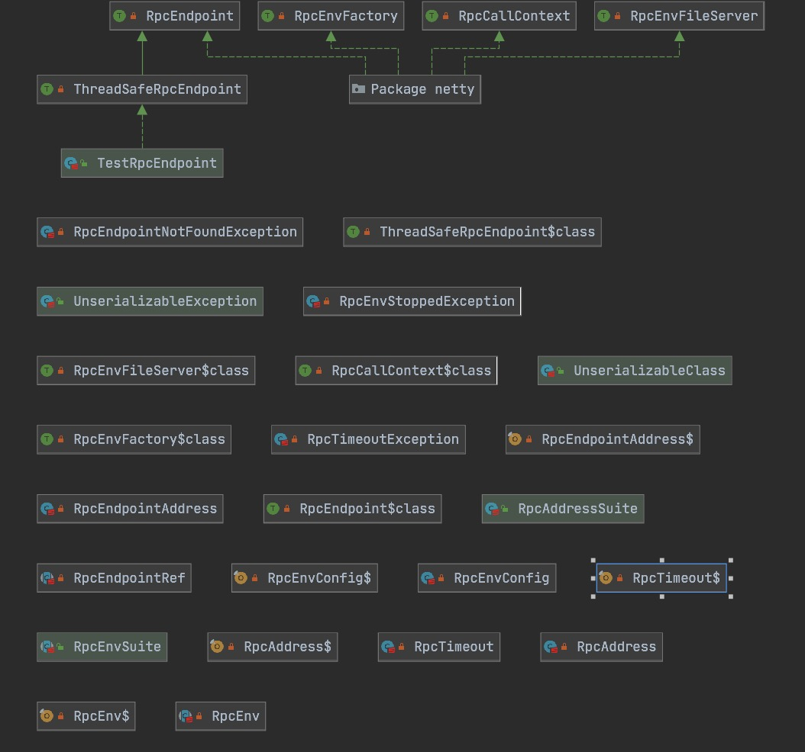
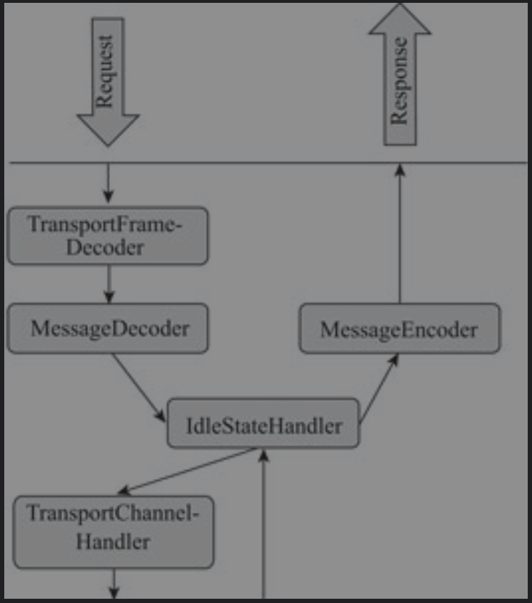
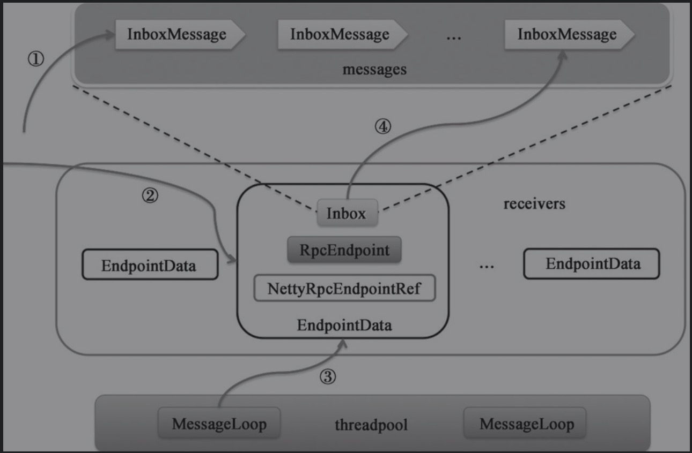
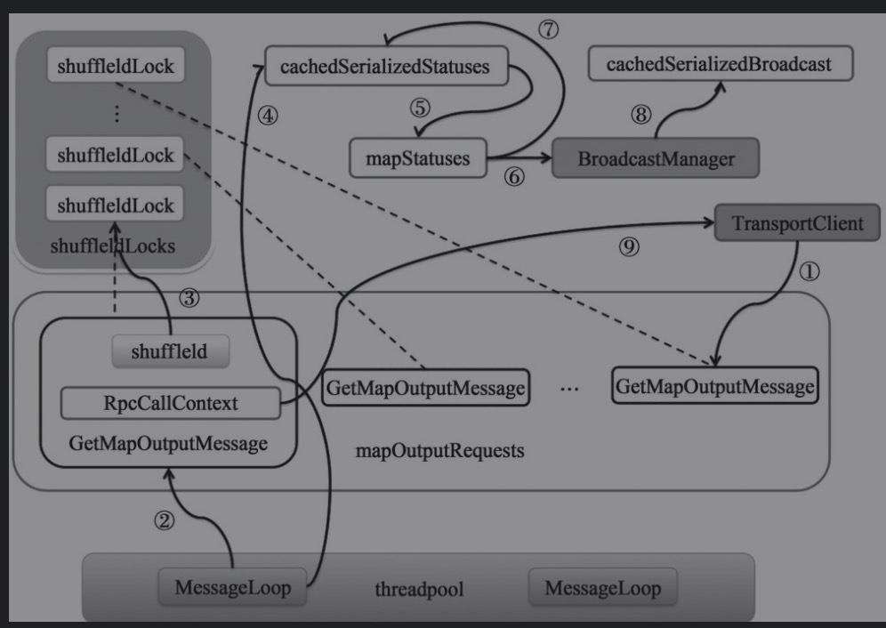

# 从Spark Shell剖析

## 修改spark shell日志

```properties
log4j.logger.org.apache.spark.repl.Main=INFO
```

## Spark shell核心对象

* 运行SparkShell查看打印日志
  * SecurityManager
  * SparkEnv
  * BlockManagerMasterEndpoint
  * DiskBlockManager
  * MemoryStore
  * SparkUI
  * Executor
  * NettyBlockTransferService
  * BlockManager
  * BlockManagerMaster
  * SingleEventLogFileWriter

## spark-shell的main方法

```shell
sfunction main() {
  if $cygwin; then
    stty -icanon min 1 -echo > /dev/null 2>&1
    export SPARK_SUBMIT_OPTS="$SPARK_SUBMIT_OPTS -Djline.terminal=unix"
    "${SPARK_HOME}"/bin/spark-submit --class org.apache.spark.repl.Main --name "Spark shell" "$@"
    stty icanon echo > /dev/null 2>&1
  else
    export SPARK_SUBMIT_OPTS
    "${SPARK_HOME}"/bin/spark-submit --class org.apache.spark.repl.Main --name "Spark shell" "$@"
  fi
}
```

* 从最终设置的SPARK_SUBMIT_OPTS变量，最终是通过spark-submit启动`org.apache.spark.repl.Main`类来运行Spark-shell，本质上spark-shell启动的就是一个sparkSubmit进程。

## spark-submit

```shell
if [ -z "${SPARK_HOME}" ]; then
  source "$(dirname "$0")"/find-spark-home
fi

# disable randomized hash for string in Python 3.3+
export PYTHONHASHSEED=0

exec "${SPARK_HOME}"/bin/spark-class org.apache.spark.deploy.SparkSubmit "$@"
```

* 从命令行看出，最终是通过spark-class调用`org.apache.spark.deploy.SparkSubmit`类

## spark-class脚本

```shell
#!/usr/bin/env bash

#
# Licensed to the Apache Software Foundation (ASF) under one or more
# contributor license agreements.  See the NOTICE file distributed with
# this work for additional information regarding copyright ownership.
# The ASF licenses this file to You under the Apache License, Version 2.0
# (the "License"); you may not use this file except in compliance with
# the License.  You may obtain a copy of the License at
#
#    http://www.apache.org/licenses/LICENSE-2.0
#
# Unless required by applicable law or agreed to in writing, software
# distributed under the License is distributed on an "AS IS" BASIS,
# WITHOUT WARRANTIES OR CONDITIONS OF ANY KIND, either express or implied.
# See the License for the specific language governing permissions and
# limitations under the License.
#

if [ -z "${SPARK_HOME}" ]; then
  source "$(dirname "$0")"/find-spark-home
fi

. "${SPARK_HOME}"/bin/load-spark-env.sh

# Find the java binary
if [ -n "${JAVA_HOME}" ]; then
  RUNNER="${JAVA_HOME}/bin/java"
else
  if [ "$(command -v java)" ]; then
    RUNNER="java"
  else
    echo "JAVA_HOME is not set" >&2
    exit 1
  fi
fi

# Find Spark jars.
if [ -d "${SPARK_HOME}/jars" ]; then
  SPARK_JARS_DIR="${SPARK_HOME}/jars"
else
  SPARK_JARS_DIR="${SPARK_HOME}/assembly/target/scala-$SPARK_SCALA_VERSION/jars"
fi

if [ ! -d "$SPARK_JARS_DIR" ] && [ -z "$SPARK_TESTING$SPARK_SQL_TESTING" ]; then
  echo "Failed to find Spark jars directory ($SPARK_JARS_DIR)." 1>&2
  echo "You need to build Spark with the target \"package\" before running this program." 1>&2
  exit 1
else
  LAUNCH_CLASSPATH="$SPARK_JARS_DIR/*"
fi

# Add the launcher build dir to the classpath if requested.
if [ -n "$SPARK_PREPEND_CLASSES" ]; then
  LAUNCH_CLASSPATH="${SPARK_HOME}/launcher/target/scala-$SPARK_SCALA_VERSION/classes:$LAUNCH_CLASSPATH"
fi

# For tests
if [[ -n "$SPARK_TESTING" ]]; then
  unset YARN_CONF_DIR
  unset HADOOP_CONF_DIR
fi

# The launcher library will print arguments separated by a NULL character, to allow arguments with
# characters that would be otherwise interpreted by the shell. Read that in a while loop, populating
# an array that will be used to exec the final command.
#
# The exit code of the launcher is appended to the output, so the parent shell removes it from the
# command array and checks the value to see if the launcher succeeded.
build_command() {
  "$RUNNER" -Xmx128m $SPARK_LAUNCHER_OPTS -cp "$LAUNCH_CLASSPATH" org.apache.spark.launcher.Main "$@"
  printf "%d\0" $?
}

# Turn off posix mode since it does not allow process substitution
set +o posix
CMD=()
DELIM=$'\n'
CMD_START_FLAG="false"
while IFS= read -d "$DELIM" -r ARG; do
  if [ "$CMD_START_FLAG" == "true" ]; then
    CMD+=("$ARG")
  else
    if [ "$ARG" == $'\0' ]; then
      # After NULL character is consumed, change the delimiter and consume command string.
      DELIM=''
      CMD_START_FLAG="true"
    elif [ "$ARG" != "" ]; then
      echo "$ARG"
    fi
  fi
done < <(build_command "$@")

COUNT=${#CMD[@]}
LAST=$((COUNT - 1))
LAUNCHER_EXIT_CODE=${CMD[$LAST]}

# Certain JVM failures result in errors being printed to stdout (instead of stderr), which causes
# the code that parses the output of the launcher to get confused. In those cases, check if the
# exit code is an integer, and if it's not, handle it as a special error case.
if ! [[ $LAUNCHER_EXIT_CODE =~ ^[0-9]+$ ]]; then
  echo "${CMD[@]}" | head -n-1 1>&2
  exit 1
fi

if [ $LAUNCHER_EXIT_CODE != 0 ]; then
  exit $LAUNCHER_EXIT_CODE
fi

CMD=("${CMD[@]:0:$LAST}")
exec "${CMD[@]}"
```

* 检查环境变量，最终通过` "$RUNNER" -Xmx128m $SPARK_LAUNCHER_OPTS -cp "$LAUNCH_CLASSPATH" org.apache.spark.launcher.Main "$@"  printf "%d\0" $?`运行org.apache.spark.launcher.Main类
* 核心运行机制查看spark源码`org.apache.spark.launcher.Main`类

## 源码执行流程

* SparkSubmit.Main-->repl.Main-->SparkILoop.initializeSpark

# Spark基础设施

## Spark RPC框架

* spark各个组件间的消息互通、用户文件与Jar包的上传、节点间的Shuffle过程、Block数据的复制与备份等。
* Spark2.x.x基于NettyStreamManager实现Shuffle过程和Block数据的复制与备份。


### Spark RPC类图



### 相关参数

```scala
# rpc的io线程数根据核数决定
spark.rpc.io.threads默认为numUsableCores
# rpc网络连接超时时间
spark.network.timeout
# rpc并发连接数
spark.rpc.io.numConnectionsPerPeer
# rpc服务端线程个数
spark.rpc.io.serverThreads
# rpc客户端线程个数
spark.rpc.io.clientThreads
# rpc的SO_RVCBUF的大小，默认设置是 网络的延迟 * 网络带宽，比如延迟是1ms，带宽是10Gbps最终求出来大约是1.25MB
spark.rpc.io.receiveBuffer
spark.rpc.io.sendBuffer
# rpc连接线程数
spark.rpc.connect.threads
# dispatcher线程数，会有线程池支持numThreads的MessageLoop，以while true的形式
spark.rpc.netty.dispatcher.numThreads
```

### RPC组件

* TransportContext:传输上下文，包含用于创建传输服务端(TransportServer)和传输客户端工厂(TransportClientFactory)的上下文信息，并支持使用Transport-ChannelHandler设置Netty提供SocketChannel的Pipeline的实现。
* TransportConf:传输上下文的配置
* RpcHandler:对调用传输客户端(TransportClient)的sendRPC方法发送的消息进行处理的程序。
* MessageEncoder:在讲消息放入管道前，先对消息内容进行编码，防止管道另一端读取时丢包和解析错误。
* MessageDecoder:对从管道中读取的ByteBuffer进行解析，防止丢包和解析错误。
* TransportFrameDecoder:对从管道读取的ByteBuffer按照数据帧进行解析。
* RpcResponseCallback:RpcHandler对请求的消息处理完毕进行回调的接口。
* ClientPool：在两个对等节点间维护的关于TransportClient的池子。ClientPool是TransportClientFactory的内部组件。
* TransportClient:RPC框架的客户端，用于获取预先协商好的流中的连续块。TransportClient旨在允许有效传输大量数据，这些数据将被拆分成几百KB到几MB的块。当TransportClient处理从流中获取的块时，实际的设置是在传输层之外完成的。sendRPC方法能够在客户端和服务端的同一水平线的通信进行这些设置。
* TransportClientBootstrap：当服务端响应客户端连接时在客户端执行一次的引导程序。
* TransportResponseHandler：用于处理服务端的响应，并且对发出请求的客户端进行响应的处理程序。
* TransportChannelHandler：代理由TransportRequestHandler处理的请求和由Transport-ResponseHandler处理的响应，并加入传输层的处理。
* TransportServer:RPC框架的服务端，提供高效的、低级别的流服务。
* NettyStreamManager:管理SparkContext添加的file、jar或dir等。

### TransportConf

```java
  /**
     * 配置提供起
     */
    private final ConfigProvider conf;

    /**
     * 模块
     */
    private final String module;

    public TransportConf(String module, ConfigProvider conf) {
        this.module = module;
        this.conf = conf;
        // 格式为spark.module.suffix
        SPARK_NETWORK_IO_MODE_KEY = getConfKey("io.mode");
        SPARK_NETWORK_IO_PREFERDIRECTBUFS_KEY = getConfKey("io.preferDirectBufs");
        SPARK_NETWORK_IO_CONNECTIONTIMEOUT_KEY = getConfKey("io.connectionTimeout");
        SPARK_NETWORK_IO_BACKLOG_KEY = getConfKey("io.backLog");
        SPARK_NETWORK_IO_NUMCONNECTIONSPERPEER_KEY = getConfKey("io.numConnectionsPerPeer");
        SPARK_NETWORK_IO_SERVERTHREADS_KEY = getConfKey("io.serverThreads");
        SPARK_NETWORK_IO_CLIENTTHREADS_KEY = getConfKey("io.clientThreads");
        SPARK_NETWORK_IO_RECEIVEBUFFER_KEY = getConfKey("io.receiveBuffer");
        SPARK_NETWORK_IO_SENDBUFFER_KEY = getConfKey("io.sendBuffer");
        SPARK_NETWORK_SASL_TIMEOUT_KEY = getConfKey("sasl.timeout");
        SPARK_NETWORK_IO_MAXRETRIES_KEY = getConfKey("io.maxRetries");
        SPARK_NETWORK_IO_RETRYWAIT_KEY = getConfKey("io.retryWait");
        SPARK_NETWORK_IO_LAZYFD_KEY = getConfKey("io.lazyFD");
        SPARK_NETWORK_VERBOSE_METRICS = getConfKey("io.enableVerboseMetrics");
    }
```

### TransportClientFactory

```java
// 客户端连接池，存储的是传输客户端数组和不同的所对象，保证不同的客户端有不同的锁。
private static class ClientPool {
        TransportClient[] clients;
        Object[] locks;

        ClientPool(int size) {
            clients = new TransportClient[size];
            locks = new Object[size];
            for (int i = 0; i < size; i++) {
                locks[i] = new Object();
            }
        }
    }

    private static final Logger logger = LoggerFactory.getLogger(TransportClientFactory.class);

    private final TransportContext context;
    private final TransportConf conf;
    private final List<TransportClientBootstrap> clientBootstraps;
    // 连接池，clientPool存在这里
    private final ConcurrentHashMap<SocketAddress, ClientPool> connectionPool;
```

* 创建客户端时会先去获取对应的ClientPool，然后在根据index获取对应的传输层客户端锁和传输层客户端，校验是否可用如果一系列校验没问题就返回给NettyRpcEnv中。

#### 创建TransportClient

```java
 private TransportClient createClient(InetSocketAddress address)
            throws IOException, InterruptedException {
        logger.debug("Creating new connection to {}", address);

        // 创建传输层引导程序Bootstrap，netty
        Bootstrap bootstrap = new Bootstrap();
        // 设置工作组，socket channel，其他参数
        bootstrap.group(workerGroup)
                .channel(socketChannelClass)
                // Disable Nagle's Algorithm since we don't want packets to wait
                .option(ChannelOption.TCP_NODELAY, true)
                .option(ChannelOption.SO_KEEPALIVE, true)
                .option(ChannelOption.CONNECT_TIMEOUT_MILLIS, conf.connectionTimeoutMs())
                .option(ChannelOption.ALLOCATOR, pooledAllocator);

        if (conf.receiveBuf() > 0) {
            bootstrap.option(ChannelOption.SO_RCVBUF, conf.receiveBuf());
        }

        if (conf.sendBuf() > 0) {
            bootstrap.option(ChannelOption.SO_SNDBUF, conf.sendBuf());
        }

        final AtomicReference<TransportClient> clientRef = new AtomicReference<>();
        final AtomicReference<Channel> channelRef = new AtomicReference<>();

        bootstrap.handler(new ChannelInitializer<SocketChannel>() {
            @Override
            public void initChannel(SocketChannel ch) {
                TransportChannelHandler clientHandler = context.initializePipeline(ch);
                clientRef.set(clientHandler.getClient());
                channelRef.set(ch);
            }
        });

        // Connect to the remote server 连接到远程服务器
        long preConnect = System.nanoTime();
        ChannelFuture cf = bootstrap.connect(address);
        // 超时判断
        if (!cf.await(conf.connectionTimeoutMs())) {
            throw new IOException(
                    String.format("Connecting to %s timed out (%s ms)", address, conf.connectionTimeoutMs()));
            // 连接异常判断
        } else if (cf.cause() != null) {
            throw new IOException(String.format("Failed to connect to %s", address), cf.cause());
        }

        // 获取传输层客户端
        TransportClient client = clientRef.get();
        Channel channel = channelRef.get();
        assert client != null : "Channel future completed successfully with null client";

        // Execute any client bootstraps synchronously before marking the Client as successful.
        long preBootstrap = System.nanoTime();
        logger.debug("Connection to {} successful, running bootstraps...", address);
        try {
            // 给传输层客户端设置客户端引导程序，权限、安全相关
            for (TransportClientBootstrap clientBootstrap : clientBootstraps) {
                clientBootstrap.doBootstrap(client, channel);
            }
        } catch (Exception e) { // catch non-RuntimeExceptions too as bootstrap may be written in Scala
            long bootstrapTimeMs = (System.nanoTime() - preBootstrap) / 1000000;
            logger.error("Exception while bootstrapping client after " + bootstrapTimeMs + " ms", e);
            client.close();
            throw Throwables.propagate(e);
        }
        long postBootstrap = System.nanoTime();

        logger.info("Successfully created connection to {} after {} ms ({} ms spent in bootstraps)",
                address, (postBootstrap - preConnect) / 1000000, (postBootstrap - preBootstrap) / 1000000);

        return client;
    }
```

* 构建根引导程序Bootstrap并且对其配置
* 为根引导程序设置管道初始化回调函数，此会调函数将调用TransportContext的initializePipeline方法初始化Channel的pipeline。
* 使用根引导程序连接远程服务器，当连接成功对管道初始化时会回调初始化回调函数，将TransportClient和Channel对象分别设置到原子引用clientRef与channelRef中。
* 给TransportClient设置客户端引导程序，即设置TransportClientFactory中的Transport-ClientBootstrap列表
* 返回TransportClient对象

#### TransportServer

```java
private void init(String hostToBind, int portToBind) {

    // 选择IO模型，默认为NIO
    IOMode ioMode = IOMode.valueOf(conf.ioMode());
    // 创建bossGroup
    EventLoopGroup bossGroup = NettyUtils.createEventLoop(ioMode, 1,
      conf.getModuleName() + "-boss");
    // 创建workerGroup
    EventLoopGroup workerGroup =  NettyUtils.createEventLoop(ioMode, conf.serverThreads(),
      conf.getModuleName() + "-server");

    // 穿线byte申请器
    PooledByteBufAllocator allocator = NettyUtils.createPooledByteBufAllocator(
      conf.preferDirectBufs(), true /* allowCache */, conf.serverThreads());

    // 创建netty serverbootstrap
    bootstrap = new ServerBootstrap()
      .group(bossGroup, workerGroup)
      .channel(NettyUtils.getServerChannelClass(ioMode))
      .option(ChannelOption.ALLOCATOR, allocator)
      .option(ChannelOption.SO_REUSEADDR, !SystemUtils.IS_OS_WINDOWS)
      .childOption(ChannelOption.ALLOCATOR, allocator);

    //创建netty内存指标
    this.metrics = new NettyMemoryMetrics(
      allocator, conf.getModuleName() + "-server", conf);

    // 设置netty所需网络参数
    if (conf.backLog() > 0) {
      bootstrap.option(ChannelOption.SO_BACKLOG, conf.backLog());
    }

    if (conf.receiveBuf() > 0) {
      bootstrap.childOption(ChannelOption.SO_RCVBUF, conf.receiveBuf());
    }

    if (conf.sendBuf() > 0) {
      bootstrap.childOption(ChannelOption.SO_SNDBUF, conf.sendBuf());
    }

    bootstrap.childHandler(new ChannelInitializer<SocketChannel>() {
      @Override
      protected void initChannel(SocketChannel ch) {
        RpcHandler rpcHandler = appRpcHandler;
        // 为SocketChannel、rpcHandler分配引导程序
        for (TransportServerBootstrap bootstrap : bootstraps) {
          rpcHandler = bootstrap.doBootstrap(ch, rpcHandler);
        }
        context.initializePipeline(ch, rpcHandler);
      }
    });

    InetSocketAddress address = hostToBind == null ?
        new InetSocketAddress(portToBind): new InetSocketAddress(hostToBind, portToBind);
    // 绑定客户端地址
    channelFuture = bootstrap.bind(address);
    channelFuture.syncUninterruptibly();

    port = ((InetSocketAddress) channelFuture.channel().localAddress()).getPort();
    logger.debug("Shuffle server started on port: {}", port);
  }
```

#### 管道初始化

* 在创建TransportClient和初始化TransportServer时都调用了initlizePipeline方法，此方法将会调用Netty的API对管道初始化。

```java
# 真正创建TransportClient的地方
TransportChannelHandler channelHandler = createChannelHandler(channel, channelRpcHandler);

# 设置channel管道的编解码器
  channel.pipeline()
        .addLast("encoder", ENCODER)
        .addLast(TransportFrameDecoder.HANDLER_NAME, NettyUtils.createFrameDecoder())
        .addLast("decoder", DECODER)
        .addLast("idleStateHandler", new IdleStateHandler(0, 0, conf.connectionTimeoutMs() / 1000))
        // NOTE: Chunks are currently guaranteed to be returned in the order of request, but this
        // would require more logic to guarantee if this were not part of the same event loop.
        .addLast("handler", channelHandler);
```



### Dispatcher

```scala
/*
 * Licensed to the Apache Software Foundation (ASF) under one or more
 * contributor license agreements.  See the NOTICE file distributed with
 * this work for additional information regarding copyright ownership.
 * The ASF licenses this file to You under the Apache License, Version 2.0
 * (the "License"); you may not use this file except in compliance with
 * the License.  You may obtain a copy of the License at
 *
 *    http://www.apache.org/licenses/LICENSE-2.0
 *
 * Unless required by applicable law or agreed to in writing, software
 * distributed under the License is distributed on an "AS IS" BASIS,
 * WITHOUT WARRANTIES OR CONDITIONS OF ANY KIND, either express or implied.
 * See the License for the specific language governing permissions and
 * limitations under the License.
 */

package org.apache.spark.rpc.netty

import java.util.concurrent._

import javax.annotation.concurrent.GuardedBy
import org.apache.spark.SparkException
import org.apache.spark.internal.Logging
import org.apache.spark.network.client.RpcResponseCallback
import org.apache.spark.rpc._
import org.apache.spark.util.ThreadUtils

import scala.collection.JavaConverters._
import scala.concurrent.Promise
import scala.util.control.NonFatal

/**
 * 相当于对生产者的包装，使用endpoint包装一个inbox用于发送相应的RPC消息，形成endpoint和inbox的绑定关系
 *
 * A message dispatcher, responsible for routing RPC messages to the appropriate endpoint(s).
 * 一个消息转发器，负责将RPC消息路由到适当的端点。
 *
 * @param numUsableCores Number of CPU cores allocated to the process, for sizing the thread pool.
 *                       If 0, will consider the available CPUs on the host.
 */
private[netty] class Dispatcher(nettyEnv: NettyRpcEnv, numUsableCores: Int) extends Logging {

  /**
   * 初始化inbox对象
   *
   * @param name     endpont名字
   * @param endpoint endpoint
   * @param ref      nettyEndpoint应用
   */
  private class EndpointData(
                              val name: String,
                              val endpoint: RpcEndpoint,
                              val ref: NettyRpcEndpointRef) {
    // 收件箱，接收数据的地方
    val inbox = new Inbox(ref, endpoint)
  }

  // 维护全部的endpoint
  private val endpoints: ConcurrentMap[String, EndpointData] = {
    new ConcurrentHashMap[String, EndpointData]
  }
  // 维护全部的endpoint引用
  private val endpointRefs: ConcurrentMap[RpcEndpoint, RpcEndpointRef] =
    new ConcurrentHashMap[RpcEndpoint, RpcEndpointRef]

  // Track the receivers whose inboxes may contain messages.
  private val receivers = new LinkedBlockingQueue[EndpointData]

  /**
   * True if the dispatcher has been stopped. Once stopped, all messages posted will be bounced
   * immediately.
   */
  @GuardedBy("this")
  private var stopped = false

  /**
   * 注册RpcEndpont
   *
   * @param name
   * @param endpoint
   * @return
   */
  def registerRpcEndpoint(name: String, endpoint: RpcEndpoint): NettyRpcEndpointRef = {
    // 创建RpcEndpoint地址
    val addr = RpcEndpointAddress(nettyEnv.address, name)
    // 创建一个服务端引用,根据地址创建一个endpointRef
    val endpointRef = new NettyRpcEndpointRef(nettyEnv.conf, addr, nettyEnv)
    synchronized {
      // 如果rpc已经被关闭直接抛出rpc关闭异常
      if (stopped) {
        throw new IllegalStateException("RpcEnv has been stopped")
      }
      // 如果本地缓存中已经存在一个相同名字的rpcEndpoint则抛出异常
      if (endpoints.putIfAbsent(name, new EndpointData(name, endpoint, endpointRef)) != null) {
        throw new IllegalArgumentException(s"There is already an RpcEndpoint called $name")
      }
      // 从缓存中拿到EndpointData数据(包含name,endpoint,endpointRef,inbox)
      val data = endpoints.get(name)
      // endpoint和ref放入endpointRefs
      endpointRefs.put(data.endpoint, data.ref)
      //将数据放入放入receivers中
      receivers.offer(data) // for the OnStart message
    }
    endpointRef
  }

  def getRpcEndpointRef(endpoint: RpcEndpoint): RpcEndpointRef = endpointRefs.get(endpoint)

  def removeRpcEndpointRef(endpoint: RpcEndpoint): Unit = endpointRefs.remove(endpoint)

  // Should be idempotent
  private def unregisterRpcEndpoint(name: String): Unit = {
    val data = endpoints.remove(name)
    if (data != null) {
      data.inbox.stop()
      // 数据放入receivers
      receivers.offer(data) // for the OnStop message
    }
    // Don't clean `endpointRefs` here because it's possible that some messages are being processed
    // now and they can use `getRpcEndpointRef`. So `endpointRefs` will be cleaned in Inbox via
    // `removeRpcEndpointRef`.
  }

  def stop(rpcEndpointRef: RpcEndpointRef): Unit = {
    synchronized {
      if (stopped) {
        // This endpoint will be stopped by Dispatcher.stop() method.
        return
      }
      unregisterRpcEndpoint(rpcEndpointRef.name)
    }
  }

  /**
   * Send a message to all registered [[RpcEndpoint]]s in this process.
   * 发送消息给全部已经注册的rpcEndpoint
   * This can be used to make network events known to all end points (e.g. "a new node connected").
   */
  def postToAll(message: InboxMessage): Unit = {
    // 拿到全部的endpoint
    val iter = endpoints.keySet().iterator()
    while (iter.hasNext) {
      val name = iter.next
      // 发送消息
      postMessage(name, message, (e) => {
        e match {
          case e: RpcEnvStoppedException => logDebug(s"Message $message dropped. ${e.getMessage}")
          case e: Throwable => logWarning(s"Message $message dropped. ${e.getMessage}")
        }
      }
      )
    }
  }

  /**
   * 发送远程消息
   */
  /** Posts a message sent by a remote endpoint. */
  def postRemoteMessage(message: RequestMessage, callback: RpcResponseCallback): Unit = {
    // 创建远程RPC回调上下文
    val rpcCallContext = {
      new RemoteNettyRpcCallContext(nettyEnv, callback, message.senderAddress)
    }
    // 创建RPC消息
    val rpcMessage = RpcMessage(message.senderAddress, message.content, rpcCallContext)
    // 发送消息
    postMessage(message.receiver.name, rpcMessage, (e) => callback.onFailure(e))
  }

  /** Posts a message sent by a local endpoint. */
  // 发送本地消息
  def postLocalMessage(message: RequestMessage, p: Promise[Any]): Unit = {
    val rpcCallContext =
      new LocalNettyRpcCallContext(message.senderAddress, p)
    val rpcMessage = RpcMessage(message.senderAddress, message.content, rpcCallContext)
    postMessage(message.receiver.name, rpcMessage, (e) => p.tryFailure(e))
  }

  /** Posts a one-way message. */
  def postOneWayMessage(message: RequestMessage): Unit = {
    postMessage(message.receiver.name, OneWayMessage(message.senderAddress, message.content),
      (e) => throw e)
  }

  /**
   * Posts a message to a specific endpoint.
   *
   * @param endpointName      name of the endpoint.
   * @param message           the message to post
   * @param callbackIfStopped callback function if the endpoint is stopped.
   */
  private def postMessage(
                           endpointName: String,
                           message: InboxMessage,
                           callbackIfStopped: (Exception) => Unit): Unit = {
    val error = synchronized {
      val data = endpoints.get(endpointName)
      if (stopped) {
        Some(new RpcEnvStoppedException())
      } else if (data == null) {
        Some(new SparkException(s"Could not find $endpointName."))
      } else {
        // 发送消息
        data.inbox.post(message)
        // 插入在recives
        receivers.offer(data)
        None
      }
    }
    // We don't need to call `onStop` in the `synchronized` block
    error.foreach(callbackIfStopped)
  }

  def stop(): Unit = {
    synchronized {
      if (stopped) {
        return
      }
      stopped = true
    }
    // Stop all endpoints. This will queue all endpoints for processing by the message loops.
    endpoints.keySet().asScala.foreach(unregisterRpcEndpoint)
    // Enqueue a message that tells the message loops to stop.
    // 发送一个毒药消息，作为stop标示
    receivers.offer(PoisonPill)
    threadpool.shutdown()
  }

  def awaitTermination(): Unit = {
    threadpool.awaitTermination(Long.MaxValue, TimeUnit.MILLISECONDS)
  }

  /**
   * Return if the endpoint exists
   */
  def verify(name: String): Boolean = {
    endpoints.containsKey(name)
  }

  /** Thread pool used for dispatching messages. */
  private val threadpool: ThreadPoolExecutor = {
    val availableCores =
      if (numUsableCores > 0) numUsableCores else Runtime.getRuntime.availableProcessors()
    val numThreads = nettyEnv.conf.getInt("spark.rpc.netty.dispatcher.numThreads",
      math.max(2, availableCores))
    val pool = ThreadUtils.newDaemonFixedThreadPool(numThreads, "dispatcher-event-loop")
    // 多线程执行，开启dispather线程
    for (i <- 0 until numThreads) {
      pool.execute(new MessageLoop)
    }
    pool
  }

  /** Message loop used for dispatching messages. */
  private class MessageLoop extends Runnable {
    override def run(): Unit = {
      try {
        while (true) {
          try {
            val data = receivers.take()
            // 如果消息为毒药消息，跳过并将该消息放入其他messageLoop中
            if (data == PoisonPill) {
              // Put PoisonPill back so that other MessageLoops can see it.
              receivers.offer(PoisonPill)
              return
            }
            // 处理存储的消息，传递Dispatcher主要是为了移除Endpoint的引用
            data.inbox.process(Dispatcher.this)
          } catch {
            case NonFatal(e) => logError(e.getMessage, e)
          }
        }
      } catch {
        case _: InterruptedException => // exit
        case t: Throwable =>
          try {
            // Re-submit a MessageLoop so that Dispatcher will still work if
            // UncaughtExceptionHandler decides to not kill JVM.
            threadpool.execute(new MessageLoop)
          } finally {
            throw t
          }
      }
    }
  }

  /** A poison endpoint that indicates MessageLoop should exit its message loop. */
  private val PoisonPill = new EndpointData(null, null, null)
}
```

## 事件总线

* Spark定义了一个特质ListenerBus，可以接受事件并且将事件提交到对应事件的监听器。

### ListenerBus的继承体系


* SparkListenerBus:用于将SparkListenerEvent类型的事件投递到SparkListener-Interface类型的监听器。
  * AsyncEventQueue：采用异步线程将SparkListenerEvent类型的事件投递到SparkListener类型的监听器。
  * ReplayListenerBus：用于从序列化的事件数据中重播事件。
* StreamingQueryListenerBus：用于将StreamingQueryListener.Event类型的事件投递到StreamingQueryListener类型的监听器，此外还会将StreamingQueryListener. Event类型的事件交给SparkListenerBus。
* StreamingListenerBus：用于将StreamingListenerEvent类型的事件投递到Streaming Listener类型的监听器，此外还会将StreamingListenerEvent类型的事件交给Spark ListenerBus。
* ExternalCatalogWithListener:外部catalog监听器。

### SparkListenerBus

* 支持`SparkListenerEvent`的各个子类事件。

* 实现ListenerBus的onPostEvent方法，模式匹配了event做了对应的处理，主要包含了task、statge、job相关。

### AsyncEventQueue

* eventQueue:是SparkListenerEvent事件的阻塞队列，队列大小可以通过Spark属性spark.scheduler.listenerbus.eventqueue.size进行配置，默认为10000（Spark早期版本中属于静态属性，固定为10000）。
* started：标记LiveListenerBus的启动状态的AtomicBoolean类型的变量。
* stopped：标记LiveListenerBus的停止状态的AtomicBoolean类型的变量。
* droppedEventsCounter：使用AtomicLong类型对删除的事件进行计数，每当日志打印了droppedEventsCounter后，会将droppedEventsCounter重置为0。
* lastReportTimestamp：用于记录最后一次日志打印droppedEventsCounter的时间戳。
* logDroppedEvent:AtomicBoolean类型的变量，用于标记是否由于eventQueue已满，导致新的事件被删除。

```java
private class AsyncEventQueue(
    val name: String,
    conf: SparkConf,
    metrics: LiveListenerBusMetrics,
    bus: LiveListenerBus)
  extends SparkListenerBus
  with Logging {

  import AsyncEventQueue._

  // Cap the capacity of the queue so we get an explicit error (rather than an OOM exception) if
  // it's perpetually being added to more quickly than it's being drained.
  //
  private val eventQueue = new LinkedBlockingQueue[SparkListenerEvent](
    conf.get(LISTENER_BUS_EVENT_QUEUE_CAPACITY))

  // Keep the event count separately, so that waitUntilEmpty() can be implemented properly;
  // this allows that method to return only when the events in the queue have been fully
  // processed (instead of just dequeued).
  private val eventCount = new AtomicLong()

  /** A counter for dropped events. It will be reset every time we log it. */
  private val droppedEventsCounter = new AtomicLong(0L)

  /** When `droppedEventsCounter` was logged last time in milliseconds. */
  @volatile private var lastReportTimestamp = 0L

  private val logDroppedEvent = new AtomicBoolean(false)

  private var sc: SparkContext = null

  private val started = new AtomicBoolean(false)
  private val stopped = new AtomicBoolean(false)

  private val droppedEvents = metrics.metricRegistry.counter(s"queue.$name.numDroppedEvents")
  private val processingTime = metrics.metricRegistry.timer(s"queue.$name.listenerProcessingTime")

  // Remove the queue size gauge first, in case it was created by a previous incarnation of
  // this queue that was removed from the listener bus.
  metrics.metricRegistry.remove(s"queue.$name.size")
  metrics.metricRegistry.register(s"queue.$name.size", new Gauge[Int] {
    override def getValue: Int = eventQueue.size()
  })

    // 后台线程，转发器
  private val dispatchThread = new Thread(s"spark-listener-group-$name") {
    setDaemon(true)
    override def run(): Unit = Utils.tryOrStopSparkContext(sc) {
      // 发送消息
      dispatch()
    }
  }
 // 转发转系
  private def dispatch(): Unit = LiveListenerBus.withinListenerThread.withValue(true) {
    var next: SparkListenerEvent = eventQueue.take()
    // 不是毒药消息则一致调用postToAll
    while (next != POISON_PILL) {
      val ctx = processingTime.time()
      try {
        // 遍历消息调用doPostEvent
        super.postToAll(next)
      } finally {
        ctx.stop()
      }
      eventCount.decrementAndGet()
      next = eventQueue.take()
    }
    eventCount.decrementAndGet()
  }

  override protected def getTimer(listener: SparkListenerInterface): Option[Timer] = {
    metrics.getTimerForListenerClass(listener.getClass.asSubclass(classOf[SparkListenerInterface]))
  }

  /**
   * Start an asynchronous thread to dispatch events to the underlying listeners.
   *
   * @param sc Used to stop the SparkContext in case the async dispatcher fails.
   */
  private[scheduler] def start(sc: SparkContext): Unit = {
    if (started.compareAndSet(false, true)) {
      this.sc = sc
      // 开始dispatchThread线程，发送监听器事件
      dispatchThread.start()
    } else {
      throw new IllegalStateException(s"$name already started!")
    }
  }

  /**
   * Stop the listener bus. It will wait until the queued events have been processed, but new
   * events will be dropped.
   */
  private[scheduler] def stop(): Unit = {
    if (!started.get()) {
      throw new IllegalStateException(s"Attempted to stop $name that has not yet started!")
    }
    if (stopped.compareAndSet(false, true)) {
      eventCount.incrementAndGet()
      // 发送毒药消息
      eventQueue.put(POISON_PILL)
    }
    // this thread might be trying to stop itself as part of error handling -- we can't join
    // in that case.
    if (Thread.currentThread() != dispatchThread) {
      // 当先线程不是dispatchThread，就会尝试让dispatchThread die
      dispatchThread.join()
    }
  }

  def post(event: SparkListenerEvent): Unit = {
    if (stopped.get()) {
      return
    }

    eventCount.incrementAndGet()
    if (eventQueue.offer(event)) {
      return
    }

    eventCount.decrementAndGet()
    droppedEvents.inc()
    droppedEventsCounter.incrementAndGet()
    if (logDroppedEvent.compareAndSet(false, true)) {
      // Only log the following message once to avoid duplicated annoying logs.
      logError(s"Dropping event from queue $name. " +
        "This likely means one of the listeners is too slow and cannot keep up with " +
        "the rate at which tasks are being started by the scheduler.")
    }
    logTrace(s"Dropping event $event")

    val droppedCount = droppedEventsCounter.get
    if (droppedCount > 0) {
      // Don't log too frequently
      if (System.currentTimeMillis() - lastReportTimestamp >= 60 * 1000) {
        // There may be multiple threads trying to decrease droppedEventsCounter.
        // Use "compareAndSet" to make sure only one thread can win.
        // And if another thread is increasing droppedEventsCounter, "compareAndSet" will fail and
        // then that thread will update it.
        if (droppedEventsCounter.compareAndSet(droppedCount, 0)) {
          val prevLastReportTimestamp = lastReportTimestamp
          lastReportTimestamp = System.currentTimeMillis()
          val previous = new java.util.Date(prevLastReportTimestamp)
          logWarning(s"Dropped $droppedCount events from $name since $previous.")
        }
      }
    }
  }

  /**
   * For testing only. Wait until there are no more events in the queue.
   *
   * @return true if the queue is empty.
   */
  def waitUntilEmpty(deadline: Long): Boolean = {
    while (eventCount.get() != 0) {
      if (System.currentTimeMillis > deadline) {
        return false
      }
      Thread.sleep(10)
    }
    true
  }

  /**
   * LiveListenerBus的委托类，移除监听器
   * @param listener
   */
  override def removeListenerOnError(listener: SparkListenerInterface): Unit = {
    // the listener failed in an unrecoverably way, we want to remove it from the entire
    // LiveListenerBus (potentially stopping a queue if it is empty)
    bus.removeListener(listener)
  }

}

private object AsyncEventQueue {

  val POISON_PILL = new SparkListenerEvent() { }

}
```

# SparkContext

## SparkContext概述

### SparkContext的组成

* SparkEnv:Spark运行时环境。Executor是处理任务的执行器依赖于SparkEnv提供的运行环境，Driver中也包含SparkEnv，这是为了保证Local模式下任务的运行。其中包含serilizerManager、RpcEnv、BlockManager、mapOutputTracker等。
* SparkUI:Spark的用户界面，SparkUI简介以来于计算引擎、调度系统、存储体系、Job、Stage、存储、Executor、Driver组件的监控数据都会以SparkListenerEvent的形式投递到LiveListenerBus中，SparkUI从各个SparkListener中读取数据显示到WEB UI。
* LiveListenerBus:SparkContext中的事件总线，可以接受各个使用方的事件，通过异步方式对事件进行匹配后调用SparkListener的不同方法。
* SparkStatusTracker:提供对作业、Stage（阶段）等的监控信息。SparkStatusTracker是一个低级的API，这意味着只能提供非常脆弱的一致性机制。
* ConsoleProgressbar:利用SparkStatusTracker的API，在控制台展示Stage的进度。由于SparkStatusTracker存在的一致性问题，所以ConsoleProgressBar在控制台的显示往往有一定的时延。
* JobProgressListener:作业进度监听器。
* TaskScheduler:任务调度器，是调度系统中的重要组件之一。TaskScheduler按照调度算法对集群管理器已经分配给应用程序的资源进行二次调度后分配给任务。TaskScheduler调度的Task是由DAGScheduler创建的，所以DAGScheduler是TaskScheduler的前置调度。
* DAGScheduler:DAG调度器，是调度系统中的重要组件之一，负责创建Job，将DAG中的RDD划分到不同的Stage、提交Stage等。SparkUI中有关Job和Stage的监控数据都来自DAGScheduler。
* EventLoggingListener
* HeatbeatReceiver:心跳接收器。所有Executor都会向HeartbeatReceiver发送心跳信息，HeartbeatReceiver接收到Executor的心跳信息后，首先更新Executor的最后可见时间，然后将此信息交给TaskScheduler作进一步处理。
* ContextCleaner:上下文清理器。ContextCleaner实际用异步方式清理那些超出应用作用域范围的RDD、ShuffleDependency和Broadcast等信息。
* ExecutorAllocationManager:Executor动态分配管理器。顾名思义，可以根据工作负载动态调整Executor的数量。在配置`spark.dynamicAllocation.enabled`属性为true的前提下，在非local模式下或者当`spark.dynamicAllocation.testing`属性为true时启用。
* ShutdowHookManager:用于设置关闭钩子的管理器。可以给应用设置关闭钩子，这样就可以在JVM进程退出时，执行一些清理工作。

## 创建心跳接收器

### 作用

* 为了Driver能够感知到Executor的变化，当Executor出现问题时，Driver可以做相应的处理。

### SparkContext中创建HeartbeatReceiver代码

* 向RpcEnv的Dispatcher注册HeartbeatReceiver，并返回HeartbeatReceiver的NettyRpcEndpointRef引用。

```scala
    _heartbeatReceiver = env.rpcEnv.setupEndpoint(
      HeartbeatReceiver.ENDPOINT_NAME, new HeartbeatReceiver(this))
```

## 创建调度系统

* 创建DAGScheduler和TaskScheduler和SchedulerBackend，并且发送心跳消息TaskSchedulerIsSet。

```scala
  val (sched, ts) = SparkContext.createTaskScheduler(this, master, deployMode)
    _schedulerBackend = sched
    _taskScheduler = ts
    _dagScheduler = new DAGScheduler(this)
    _heartbeatReceiver.ask[Boolean](TaskSchedulerIsSet)
```

* SparkContext.createTaskScheduler根据master的配置创建相应的方式的taskSchedulerBackend和TaskSchduler。

## 初始化BlockManager

* BlockManager时SparkEnv中的组件之一，主要作用于存储体系的所有组件和功能，是存储体系中最重要的组件。SparkContext初始化过程中会对BlockManager进行初始化。

```scala
# 初始化blockManager
_env.blockManager.initialize(_applicationId)
```

## 创建和启动ExecutorAllocationManager

* ExecutorAllocationManager内部会定时根据工作负载计算所需的Executor数量，如果对Executor需求数量大于之前向集群管理器申请的Executor数量，那么向集群管理器申请添加Executor；如果对Executor需求数量小于之前向集群管理器申请的Executor数量，那么向集群管理器申请取消部分Executor。此外，ExecutorAllocationManager内部还会定时向集群管理器申请移除（“杀死”）过期的Executor。


```scala
val dynamicAllocationEnabled = Utils.isDynamicAllocationEnabled(_conf)
    _executorAllocationManager =
      if (dynamicAllocationEnabled) {
        schedulerBackend match {
          case b: ExecutorAllocationClient =>
            Some(new ExecutorAllocationManager(
              schedulerBackend.asInstanceOf[ExecutorAllocationClient], listenerBus, _conf,
              _env.blockManager.master))
          case _ =>
            None
        }
      } else {
        None
      }
    _executorAllocationManager.foreach(_.start())

# start逻辑
def start(): Unit = {
    // 启动一个定时线程回去定时调度，当添加executor和移除executor时
    listenerBus.addToManagementQueue(listener)

    val scheduleTask = new Runnable() {
      override def run(): Unit = {
        try {
          schedule()
        } catch {
          case ct: ControlThrowable =>
            throw ct
          case t: Throwable =>
            logWarning(s"Uncaught exception in thread ${Thread.currentThread().getName}", t)
        }
      }
    }
    executor.scheduleWithFixedDelay(scheduleTask, 0, intervalMillis, TimeUnit.MILLISECONDS)

    client.requestTotalExecutors(numExecutorsTarget, localityAwareTasks, hostToLocalTaskCount)
  }
```

* `spark.dynamicAllocation.enabled`集群模式开启动态管理executor，`spark.dynamicAllocation.testing`local模式开启管理executor，默认都是关闭的。

```scala
 def isDynamicAllocationEnabled(conf: SparkConf): Boolean = {
    val dynamicAllocationEnabled = conf.getBoolean("spark.dynamicAllocation.enabled", false)
    dynamicAllocationEnabled &&
      (!isLocalMaster(conf) || conf.getBoolean("spark.dynamicAllocation.testing", false))
  }
```


## ContextCleaner

* 主要用于清理和超出应用范围的RDD、Shuffle对应的map任务状态、Shuffle元数据、Broadcast对象及RDD的checkpoint数据。
* `spark.cleaner.referenceTracking`决定是否创建ContextCleaner，默认为true。

### contextCleaner属性

* referenceQueue：缓存顶级的AnyRef引用。
* referenceBuffer：缓存AnyRef的虚引用。
* listeners：缓存清理工作的监听器数组。
* cleaningThread：用于具体清理工作的线程。此线程为守护线程，名称为Spark Context Cleaner。
* periodicGCService：类型为ScheduledExecutorService，用于执行GC（Garbage Collection，垃圾收集）的调度线程池，此线程池只包含一个线程，启动的线程名称以context-cleaner-periodic-gc开头。
* periodicGCInterval：执行GC的时间间隔。可通过spark.cleaner.periodicGC.interval属性进行配置，默认是30分钟。
* blockOnCleanupTasks：清理非Shuffle的其他数据是否是阻塞式的。可通过spark. cleaner.referenceTracking.blocking属性进行配置，默认是true。
* blockOnShuffleCleanupTasks：清理Shuffle数据是否是阻塞式的。可通过spark. cleaner.referenceTracking.blocking.shuffle属性进行配置，默认是false。清理Shuffle数据包括清理MapOutputTracker中指定ShuffleId对应的map任务状态和ShuffleManager中注册的ShuffleId对应的Shuffle元数据。
* stopped:ContextCleaner是否停止的状态标记。

## SparkContex提供的常用方法

### broadcast

```scala
def broadcast[T: ClassTag](value: T): Broadcast[T] = {
    assertNotStopped()
    require(!classOf[RDD[_]].isAssignableFrom(classTag[T].runtimeClass),
      "Can not directly broadcast RDDs; instead, call collect() and broadcast the result.")
    // 创建新的BroadCast
    val bc: Broadcast[T] = env.broadcastManager.newBroadcast[T](value, isLocal)
    val callSite = getCallSite
    logInfo("Created broadcast " + bc.id + " from " + callSite.shortForm)
    cleaner.foreach(_.registerBroadcastForCleanup(bc))
    bc
  }
```

### addSparkListener

* 向LiveListenerBus中添加特质的SparkListenerInterface的监听器。

# SparkEnv


## SparkEnv概述

### SparkEnv组件

* RpcEnv
* Serializer
* SerializerMananger
* MapOutputTracker
* ShuffleManager
* BroadcastManager
* BlockManager
* SecurityManager
* MemoryManager
* OutputCommitCoordinator

## SecurityManager

* 对账号、权限及身份认证进行设置和管理。如果Spark的部署模式为YARN，则需要生成secret key（密钥）并存入Hadoop UGI。而在其他模式下，则需要设置环境变量_SPARK_AUTH_SECRET（优先级更高）或spark.authenticate.secret属性指定secret key（密钥）。SecurityManager还会给当前系统设置默认的口令认证实例。

```scala
# 创建安全管理器
val securityManager = new SecurityManager(conf, ioEncryptionKey)
```

* SecurityManager代码

```scala
// allow all users/groups to have view/modify permissions
  private val WILDCARD_ACL = "*"

  // 是否开启认证。可以通过spark.authenticate属性配置，默认为false。
  private val authOn = sparkConf.get(NETWORK_AUTH_ENABLED)
  // keep spark.ui.acls.enable for backwards compatibility with 1.0
  // 是否对账号进行授权。
  private var aclsOn =
    sparkConf.getBoolean("spark.acls.enable", sparkConf.getBoolean("spark.ui.acls.enable", false))

  // admin acls should be set before view or modify acls
  // 管理员账号集合，通过spark.admin.acls配置，默认为空
  private var adminAcls: Set[String] =
    stringToSet(sparkConf.get("spark.admin.acls", ""))

  // admin group acls should be set before view or modify group acls
  private var adminAclsGroups : Set[String] =
    stringToSet(sparkConf.get("spark.admin.acls.groups", ""))

  // 有查看权限的账号的集合通过spark.ui.view.acls属性配置
  private var viewAcls: Set[String] = _

  // 拥有查看权限的账号所在的组的集合 spark.ui.view.acls.groups配置
  private var viewAclsGroups: Set[String] = _

  // list of users who have permission to modify the application. This should
  // apply to both UI and CLI for things like killing the application.
  //有修改权限的账号的集合。包括adminAcls、defaultAclUsers及spark. modify.acls属性配置的用户。
  private var modifyAcls: Set[String] = _

  //拥有修改权限的账号所在组的集合。包括adminAclsGroups和spark.modify.acls.groups属性配置的用户。
  private var modifyAclsGroups: Set[String] = _

  // always add the current user and SPARK_USER to the viewAcls
  //默认用户。包括系统属性user.name指定的用户或系统登录用户或者通过系统环境变量SPARK_USER进行设置的用户。
  private val defaultAclUsers = Set[String](System.getProperty("user.name", ""),
    Utils.getCurrentUserName())

  setViewAcls(defaultAclUsers, sparkConf.get("spark.ui.view.acls", ""))
  setModifyAcls(defaultAclUsers, sparkConf.get("spark.modify.acls", ""))

  setViewAclsGroups(sparkConf.get("spark.ui.view.acls.groups", ""));
  setModifyAclsGroups(sparkConf.get("spark.modify.acls.groups", ""));

  //密钥。在YARN模式下，首先使用sparkCookie从HadoopUGI中获取密钥。如果Hadoop UGI没有保存密钥，则生成新的密钥（密钥长度可以通过spark.
  // authenticate.secretBitLength属性指定）并存入Hadoop UGI。其他模式下，则需要设置环境变量_SPARK_AUTH_SECRET（优先级更高）或spark.authenticate.secret属性指定。
  private var secretKey: String = _
  logInfo("SecurityManager: authentication " + (if (authOn) "enabled" else "disabled") +
    "; ui acls " + (if (aclsOn) "enabled" else "disabled") +
    "; users  with view permissions: " + viewAcls.toString() +
    "; groups with view permissions: " + viewAclsGroups.toString() +
    "; users  with modify permissions: " + modifyAcls.toString() +
    "; groups with modify permissions: " + modifyAclsGroups.toString())

  // Set our own authenticator to properly negotiate user/password for HTTP connections.
  // This is needed by the HTTP client fetching from the HttpServer. Put here so its
  // only set once.
  // 如果权限开启
  if (authOn) {
    // 使用内部匿名类是指权限认证器
    Authenticator.setDefault(
      new Authenticator() {
        override def getPasswordAuthentication(): PasswordAuthentication = {
          var passAuth: PasswordAuthentication = null
          // 获取用户信息
          val userInfo = getRequestingURL().getUserInfo()
          if (userInfo != null) {
            val  parts = userInfo.split(":", 2)
            // 解密password
            passAuth = new PasswordAuthentication(parts(0), parts(1).toCharArray())
          }
          return passAuth
        }
      }
    )
  }
```

## RpcEnv

```scala
 val systemName = if (isDriver) driverSystemName else executorSystemName
    val rpcEnv = RpcEnv.create(systemName, bindAddress, advertiseAddress, port.getOrElse(-1), conf,
      securityManager, numUsableCores, !isDriver)


/**
   * 创建rpcEnv核心逻辑
   * @param name 系统名称、driver或executor
   * @param bindAddress 绑定地址
   * @param advertiseAddress
   * @param port 端口
   * @param conf spark配置
   * @param securityManager 安全管理器
   * @param numUsableCores 使用核数
   * @param clientMode 客户端模式
   * @return
   */
  def create(
      name: String,
      bindAddress: String,
      advertiseAddress: String,
      port: Int,
      conf: SparkConf,
      securityManager: SecurityManager,
      numUsableCores: Int,
      clientMode: Boolean): RpcEnv = {
    val config = RpcEnvConfig(conf, name, bindAddress, advertiseAddress, port, securityManager,
      numUsableCores, clientMode)
    // 使用NettyRpcEnvFactory创建RpcEnv，实际上是继承rpcEnv的nettyEnv
    new NettyRpcEnvFactory().create(config)
  }
```

### RpcEndpointRef

* RpcEndpoint是Akka中Actor的替代产物，RpcEndpointRef是Actor-Ref的替代。

#### 相关配置

```yaml
#  最大rpc调用重试次数，默认3次
spark.rpc.numRetries
# 重试间隔等待时间，默认3秒
spark.rpc.retry.wait
# ack超时时间，默认120s
"spark.rpc.askTimeout", "spark.network.timeout"
```

### Inbox和Outbox

* OutboxMessage在客户端使用，是对外发送消息的封装。InboxMessage在服务端使用，是对所接收消息的封装。

#### Inbox

* dispathcer处理inbox消息



1. 调用inbox的post方法将消息放入messages列表
2. 将有消息的inbox相关联的endpointdata放入receivers
3. messageloop每次循环首先取receivers获取endpointdata
4. 执行endpointdata中inbox的process方法对消息进行具体处理

#### Outbox

* OutboxMessage消息继承体系
  * OneWayOutboxMessage
  * RpcOutboxMessage

#### Rpc客户端发送请求


序号①：表示通过调用NettyRpcEndpointRef的send和ask方法向本地节点的Rpc-Endpoint发送消息。由于是在同一节点，所以直接调用Dispatcher的postLocalMessage或postOneWayMessage方法将消息放入EndpointData内部Inbox的messages列表中。Message-Loop线程最后处理消息，并将消息发给对应的RpcEndpoint处理。

序号②：表示通过调用NettyRpcEndpointRef的send和ask方法向远端节点的Rpc-Endpoint发送消息。这种情况下，消息将首先被封装为OutboxMessage，然后放入到远端RpcEndpoint的地址所对应的Outbox的messages列表中。

序号③：表示每个Outbox的drainOutbox方法通过循环，不断从messages列表中取得OutboxMessage。

序号④：表示每个Outbox的drainOutbox方法使用Outbox内部的TransportClient向远端的NettyRpcEnv发送序号③中取得的OutboxMessage。

序号⑤：表示序号④发出的请求在与远端NettyRpcEnv的TransportServer建立了连接后，请求消息首先经过Netty管道的处理，然后经由NettyRpcHandler处理，最后NettyRpcHandler的receive方法会调用Dispatcher的postRemoteMessage或postOneWay-Message方法，将消息放入EndpointData内部Inbox的messages列表中。MessageLoop线程最后处理消息，并将消息发给对应的RpcEndpoint处理。

## 序列化管理器SerializerManager

* Spark中存在俩个序列化组件，SerializerManager和closureSerializer。

```scala
# 初始化
val serializer = instantiateClassFromConf[Serializer](
      "spark.serializer", "org.apache.spark.serializer.JavaSerializer")
    logDebug(s"Using serializer: ${serializer.getClass}")

    val serializerManager = new SerializerManager(serializer, conf, ioEncryptionKey)

val closureSerializer = new JavaSerializer(conf)
```

* serializerManager默认为JavaSerializer，可以通过`spark.serializer`制定，closureSerializer为JavaSerializer不能指定。

### SerializerManager属性

* defaultSerializer：默认的序列化器。此defaultSerializer即为上面代码中实例化的serializer，也就是说defaultSerializer的类型是JavaSerializer。
* conf：即SparkConf。
* encryptionKey：加密使用的密钥。
* kryoSerializer:Spark提供的另一种序列化器。kryoSerializer的实际类型是Kryo Serializer，其采用Google提供的Kryo序列化库实现。
* stringClassTag：字符串类型标记，即ClassTag[String]。
* primitiveAndPrimitiveArrayClassTags：原生类型及原生类型数组的类型标记的集合，包括：Boolean、Array[boolean]、Int、Array[int]、Long、Array[long]、Byte、Array[byte]、Null、Array[scala.runtime.Null$]、Char、Array[char]、Double、Array [double]、Float、Array[float]、Short、Array[short]等。
* compressBroadcast：是否对广播对象进行压缩，可以通过spark.broadcast.compress属性配置，默认为true。
* compressRdds：是否对RDD压缩，可以通过spark.rdd.compress属性配置，默认为false。
* compressShuffle：是否对Shuffle输出数据压缩，可以通过spark.shuffle.compress属性配置，默认为true。
* compressShuffleSpill：是否对溢出到磁盘的Shuffle数据压缩，可以通过spark.shuffle.spill.compress属性配置，默认为true。
* compressionCodec:SerializerManager使用的压缩编解码器。compressionCodec的类型是CompressionCodec。在Spark 1.x.x版本中，compressionCodec是BlockManager的成员之一，现在把compressionCodec和序列化、加密等功能都集中到SerializerManager中，也许是因为实现此功能的工程师觉得加密、压缩都是属于序列化的一部分吧。

## 广播管理器BroadcastManager

* BroadcastManager用于将配置信息和序列化后的RDD、Job及ShuffleDependency等信息在本地存储，如果为了容灾，也会复制到其他节点上。

```scala
# 创建broadcastManager
val broadcastManager = new BroadcastManager(isDriver, conf, securityManager)
```

### 广播变量配置

```yaml
# 广播变量block大小 默认4m
spark.broadcast.blockSize
# 是否开启校验和 默认开启
spark.broadcast.checksum
# 是否开启广播变量压缩 默认开启
spark.broadcast.compress
```

### BroadcastManager

```scala
private[spark] class BroadcastManager(
    val isDriver: Boolean,
    conf: SparkConf,
    securityManager: SecurityManager)
  extends Logging {

  // 是否初始化完成
  private var initialized = false
  // 广播工厂实例
  private var broadcastFactory: BroadcastFactory = null

  // 默认初始化，创建广播工厂
  initialize()

  // Called by SparkContext or Executor before using Broadcast
  private def initialize() {
    synchronized {
      if (!initialized) {
        broadcastFactory = new TorrentBroadcastFactory
        broadcastFactory.initialize(isDriver, conf, securityManager)
        initialized = true
      }
    }
  }

  // 停止工厂
  def stop() {
    broadcastFactory.stop()
  }

  // 下一个广播对象的广播ID
  private val nextBroadcastId = new AtomicLong(0)

  // 换成的value
  private[broadcast] val cachedValues = {
    new ReferenceMap(AbstractReferenceMap.HARD, AbstractReferenceMap.WEAK)
  }

  // 创建broadcast对象，传入value和是否local模式
  def newBroadcast[T: ClassTag](value_ : T, isLocal: Boolean): Broadcast[T] = {
    broadcastFactory.newBroadcast[T](value_, isLocal, nextBroadcastId.getAndIncrement())
  }

  // 移除broadcast，是否从driver中移除
  def unbroadcast(id: Long, removeFromDriver: Boolean, blocking: Boolean) {
    broadcastFactory.unbroadcast(id, removeFromDriver, blocking)
  }
}
```

### TorrentBroadcast

#### writeBlocks

```scala
private def writeBlocks(value: T): Int = {
    import StorageLevel._
    // Store a copy of the broadcast variable in the driver so that tasks run on the driver
    // do not create a duplicate copy of the broadcast variable's value.
  // 获取当前SparkEnv的blockmanager组件
    val blockManager = SparkEnv.get.blockManager
    // 将广播变量写成一个单独对象的block
    if (!blockManager.putSingle(broadcastId, value, MEMORY_AND_DISK, tellMaster = false)) {
      throw new SparkException(s"Failed to store $broadcastId in BlockManager")
    }
    val blocks = {
      // 将对象块化
      TorrentBroadcast.blockifyObject(value, blockSize, SparkEnv.get.serializer, compressionCodec)
    }
    if (checksumEnabled) {
      // 初始化校验和数组的长度
      checksums = new Array[Int](blocks.length)
    }
    blocks.zipWithIndex.foreach { case (block, i) =>
      if (checksumEnabled) {
        // 根据单独块计算校验和，存入数组中
        checksums(i) = calcChecksum(block)
      }
      // 创建对应块的片id
      val pieceId = BroadcastBlockId(id, "piece" + i)
      val bytes = new ChunkedByteBuffer(block.duplicate())
      // 将block的分片写入driver或executor的本地存储
      if (!blockManager.putBytes(pieceId, bytes, MEMORY_AND_DISK_SER, tellMaster = true)) {
        throw new SparkException(s"Failed to store $pieceId of $broadcastId in local BlockManager")
      }
    }
    blocks.length
  }
```

#### readBroadcastBlock

```scala
private def readBroadcastBlock(): T = Utils.tryOrIOException {
    TorrentBroadcast.synchronized {

      val broadcastCache: ReferenceMap = SparkEnv.get.broadcastManager.cachedValues

      Option(broadcastCache.get(broadcastId)).map(_.asInstanceOf[T]).getOrElse {
        setConf(SparkEnv.get.conf)
        // 获取当前blockManager
        val blockManager = SparkEnv.get.blockManager
        // 首先从本地获取广播对象，即通过BlockManager putSingle写入存储体系的广播多谢。
        blockManager.getLocalValues(broadcastId) match {
          case Some(blockResult) =>
            if (blockResult.data.hasNext) {
              val x = blockResult.data.next().asInstanceOf[T]
              // 释放block的锁
              releaseLock(broadcastId)

              // 将block放入ubroadcastCache中
              if (x != null) {
                broadcastCache.put(broadcastId, x)
              }

              x
            } else {
              throw new SparkException(s"Failed to get locally stored broadcast data: $broadcastId")
            }
            // 广播变量不是通过putSingle写入BlockManager中的，则通过readBlocks读取存储在driver或executor的广播快
          case None =>
            logInfo("Started reading broadcast variable " + id)
            val startTimeMs = System.currentTimeMillis()
            val blocks = readBlocks()
            logInfo("Reading broadcast variable " + id + " took" + Utils.getUsedTimeMs(startTimeMs))

            try {
              val obj = TorrentBroadcast.unBlockifyObject[T](
                blocks.map(_.toInputStream()), SparkEnv.get.serializer, compressionCodec)
              // Store the merged copy in BlockManager so other tasks on this executor don't
              // need to re-fetch it.
              val storageLevel = StorageLevel.MEMORY_AND_DISK
              if (!blockManager.putSingle(broadcastId, obj, storageLevel, tellMaster = false)) {
                throw new SparkException(s"Failed to store $broadcastId in BlockManager")
              }

              if (obj != null) {
                broadcastCache.put(broadcastId, obj)
              }

              obj
            } finally {
              blocks.foreach(_.dispose())
            }
        }
      }
```

#### readBlocks

```scala
  private def readBlocks(): Array[BlockData] = {
    // Fetch chunks of data. Note that all these chunks are stored in the BlockManager and reported
    // to the driver, so other executors can pull these chunks from this executor as well.
    // blocks个数
    val blocks = new Array[BlockData](numBlocks)
    // blockManager
    val bm = SparkEnv.get.blockManager
    
    // 随机获取分片block
    for (pid <- Random.shuffle(Seq.range(0, numBlocks))) {
      val pieceId = BroadcastBlockId(id, "piece" + pid)
      logDebug(s"Reading piece $pieceId of $broadcastId")
      // First try getLocalBytes because there is a chance that previous attempts to fetch the
      // broadcast blocks have already fetched some of the blocks. In that case, some blocks
      // would be available locally (on this executor).
      // 本地获取，找不到去远程拉去block
      bm.getLocalBytes(pieceId) match {
        case Some(block) =>
          blocks(pid) = block
          releaseLock(pieceId)
        case None =>
          bm.getRemoteBytes(pieceId) match {
            case Some(b) =>
              if (checksumEnabled) {
                val sum = calcChecksum(b.chunks(0))
                if (sum != checksums(pid)) {
                  throw new SparkException(s"corrupt remote block $pieceId of $broadcastId:" +
                    s" $sum != ${checksums(pid)}")
                }
              }
              // We found the block from remote executors/driver's BlockManager, so put the block
              // in this executor's BlockManager.
              if (!bm.putBytes(pieceId, b, StorageLevel.MEMORY_AND_DISK_SER, tellMaster = true)) {
                throw new SparkException(
                  s"Failed to store $pieceId of $broadcastId in local BlockManager")
              }
              blocks(pid) = new ByteBufferBlockData(b, true)
            case None =>
              throw new SparkException(s"Failed to get $pieceId of $broadcastId")
          }
      }
    }
    blocks
  }
```

### 广播对象的读取


## mapOutputTracker

* mapOutputTracker用于跟踪map任务的输出状态，此状态便于reduce任务定位map输出结果所在的节点地址，进而获取中间输出结果。每个map任务或者reduce任务都会有其唯一标识，分别为mapId和reduceId。每个reduce任务的输入可能是多个map任务的输出，reduce会到各个map任务所在的节点上拉取Block，这一过程叫做Shuffle。每次Shuffle都有唯一的标识shuffleId。

```scala
val mapOutputTracker = if (isDriver) {
      new MapOutputTrackerMaster(conf, broadcastManager, isLocal)
    } else {
      new MapOutputTrackerWorker(conf)
    }
```

### MapOutputTracker

* MapOutputTracker是一个模版方法，为Master和Worker对应的MapOutTracker提供基础实现。

### MapOutputTrackerMaster

#### 参数配置

```
# 用于广播的最小大小,默认为512KB。minSizeForBroadcast必须小于maxRpcMessageSize。
spark.shuffle.mapOutput.minSizeForBroadcast
# 是否为reduce任务计算本地性的偏好，默认为true
spark.shuffle.reduceLocality.enabled
# shuffle mapOupt输出文件线程池线程数，默认为8
spark.shuffle.mapOutput.dispatcher.numThreads
# 最大的rpc消息大小，默认128MB，minSizeForBroadcast必须小于maxRpcMessageSize
spark.rpc.message.maxSize
```

#### 运行原理



序号①：表示某个Executor调用MapOutputTrackerWorker的getStatuses方法获取某个shuffle的map任务状态信息，当发现本地的mapStatuses没有相应的缓存，则调用askTracker方法发送GetMapOutputStatuses消息。根据代码清单5-56的内容我们知道，askTracker实际是通过MapOutputTrackerMasterEndpoint的NettyRpcEndpointRef向远端发送GetMapOutputStatuses消息。发送实际依托于NettyRpcEndpointRef持有的Transport-Client。MapOutputTrackerMasterEndpoint在接收到GetMapOutputStatuses消息后，将GetMapOutputMessage消息放入mapOutput Requests队尾。

序号②：表示MessageLoop线程从mapOutputRequests队头取出GetMapOutputMessage。

序号③：表示从shuffleIdLocks数组中取出与当前GetMapOutputMessage携带的shuffleId相对应的锁。

序号④：表示首先从cachedSerializedStatuses缓存中获取shuffleId对应的序列化任务状态信息。

序号⑤：表示当cachedSerializedStatuses中没有shuffleId对应的序列化任务状态信息，则获取mapStatuses中缓存的shuffleId对应的任务状态数组。

序号⑥：表示将任务状态数组进行序列化，然后使用BroadcastManager对序列化的任务状态进行广播。

序号⑦：表示将序列化的任务状态放入cachedSerializedStatuses缓存中。

序号⑧：表示将广播对象放入cachedSerializedBroadcast缓存中。

序号⑨：表示将获得的序列化任务状态信息，通过回调GetMapOutputMessage消息携带的RpcCallContext的reply方法回复客户端。

##  OutputCommitCoordinator

* 当需要将任务输出保存到HDFS时就需要用到`OutputCommitCoordinator`，它将决定任务是否可以提交输出到HDFS。
* 无论是Driver还是Executor，在SparkEnv中都包含了子组件OutputCommitCoordinator。在Driver上注册了OutputCommitCoordinatorEndpoint，所有Executor的OutputCommitCoordinator都是通过OutputCommitCoordinatorEndpoint的RpcEndpointRef来访问Driver的OutputCommitCoordinator，是否能够输出提交到HDFS。

```scala
  //创建outputCommitCoordinator
    val outputCommitCoordinator = mockOutputCommitCoordinator.getOrElse {
      new OutputCommitCoordinator(conf, isDriver)
    }
    // 创建outputCommitCoordinatorRef，
    val outputCommitCoordinatorRef = registerOrLookupEndpoint("OutputCommitCoordinator",
      new OutputCommitCoordinatorEndpoint(rpcEnv, outputCommitCoordinator))
    outputCommitCoordinator.coordinatorRef = Some(outputCommitCoordinatorRef)

# 创建Ref
def registerOrLookupEndpoint(
        name: String, endpointCreator: => RpcEndpoint):
      RpcEndpointRef = {
      // 如果是driver，将endpointCreator放入endpoint
      if (isDriver) {
        logInfo("Registering " + name)
        rpcEnv.setupEndpoint(name, endpointCreator)
        // 设置driver的ref，driver的rpc地址和spark conf
      } else {
        RpcUtils.makeDriverRef(name, conf, rpcEnv)
      }
    }
```

### OutputCommitCoordinatorEndpoint

```scala
private[spark] class OutputCommitCoordinatorEndpoint(
      override val rpcEnv: RpcEnv, outputCommitCoordinator: OutputCommitCoordinator)
    extends RpcEndpoint with Logging {

    logDebug("init") // force eager creation of logger

    // 处理Stop消息
    override def receive: PartialFunction[Any, Unit] = {
      case StopCoordinator =>
        logInfo("OutputCommitCoordinator stopped!")
        stop()
    }

    // 处理AskPermissionToCommitOutput
    //此消息将通过OutputCommitCoordinator的handle-AskPermissionToCommit方法处理，
    // 进而确认客户端是否有权限将输出提交到HDFS。
    override def receiveAndReply(context: RpcCallContext): PartialFunction[Any, Unit] = {
      case AskPermissionToCommitOutput(stage, stageAttempt, partition, attemptNumber) =>
        context.reply(
          outputCommitCoordinator.handleAskPermissionToCommit(stage, stageAttempt, partition,
            attemptNumber))
    }
  }
```

###  OutputCommitCoordinator

* 用于判断给定Stage的分区任务是否有权限将输出提交到HDFS，并对同一分区的多次任务重试进行协调。

```scala
private[spark] class OutputCommitCoordinator(conf: SparkConf, isDriver: Boolean) extends Logging {

  // Initialized by SparkEnv rpc引用相当于actorRef
  var coordinatorRef: Option[RpcEndpointRef] = None

  // Class used to identify a committer. The task ID for a committer is implicitly defined by
  // the partition being processed, but the coordinator needs to keep track of both the stage
  // attempt and the task attempt, because in some situations the same task may be running
  // concurrently in two different attempts of the same stage.
  private case class TaskIdentifier(stageAttempt: Int, taskAttempt: Int)

  private case class StageState(numPartitions: Int) {
    val authorizedCommitters: Array[TaskIdentifier] = Array.fill[TaskIdentifier](numPartitions)(null)
    val failures = mutable.Map[Int, mutable.Set[TaskIdentifier]]()
  }

  /**
   * stage的存储，key为stage id
   * Map from active stages's id => authorized task attempts for each partition id, which hold an
   * exclusive lock on committing task output for that partition, as well as any known failed
   * attempts in the stage.
   *
   * Entries are added to the top-level map when stages start and are removed they finish
   * (either successfully or unsuccessfully).
   *
   * Access to this map should be guarded by synchronizing on the OutputCommitCoordinator instance.
   */
  private val stageStates = mutable.Map[Int, StageState]()

  /**
   * Returns whether the OutputCommitCoordinator's internal data structures are all empty.
   */
  def isEmpty: Boolean = {
    stageStates.isEmpty
  }

  /**
   * 能否将output写入hdfs
   * Called by tasks to ask whether they can commit their output to HDFS.
   *
   * If a task attempt has been authorized to commit, then all other attempts to commit the same
   * task will be denied.  If the authorized task attempt fails (e.g. due to its executor being
   * lost), then a subsequent task attempt may be authorized to commit its output.
   *
   * @param stage         the stage number
   * @param partition     the partition number
   * @param attemptNumber how many times this task has been attempted
   *                      (see [[TaskContext.attemptNumber()]])
   * @return true if this task is authorized to commit, false otherwise
   */
  def canCommit(
                 stage: Int,
                 stageAttempt: Int,
                 partition: Int,
                 attemptNumber: Int): Boolean = {
    // 封装AskPermissionToCommitOutput消息通过OutpuitCommitCoordinatorEndpointRef发送到Endpoint
    val msg = AskPermissionToCommitOutput(stage, stageAttempt, partition, attemptNumber)
    coordinatorRef match {
      case Some(endpointRef: RpcEndpointRef) =>
        // 等到回应是否又写入权限
        ThreadUtils.awaitResult(endpointRef.ask[Boolean](msg),
          RpcUtils.askRpcTimeout(conf).duration)
      case None =>
        logError(
          "canCommit called after coordinator was stopped (is SparkEnv shutdown in progress)?")
        false
    }
  }

  /**
   * Called by the DAGScheduler when a stage starts. Initializes the stage's state if it hasn't
   * yet been initialized.
   *
   * @param stage          the stage id.
   * @param maxPartitionId the maximum partition id that could appear in this stage's tasks (i.e.
   *                       the maximum possible value of `context.partitionId`).
   */
  private[scheduler] def stageStart(stage: Int, maxPartitionId: Int): Unit = synchronized {
    // 获取stage状态
    stageStates.get(stage) match {
      case Some(state) =>
        require(state.authorizedCommitters.length == maxPartitionId + 1)
        logInfo(s"Reusing state from previous attempt of stage $stage.")

      case _ =>
        stageStates(stage) = new StageState(maxPartitionId + 1)
    }
  }

  // Called by DAGScheduler
  private[scheduler] def stageEnd(stage: Int): Unit = synchronized {
    stageStates.remove(stage)
  }

  // Called by DAGScheduler
  private[scheduler] def taskCompleted(
                                        stage: Int,
                                        stageAttempt: Int,
                                        partition: Int,
                                        attemptNumber: Int,
                                        reason: TaskEndReason): Unit = synchronized {
    val stageState = stageStates.getOrElse(stage, {
      logDebug(s"Ignoring task completion for completed stage")
      return
    })
    reason match {
      // 执行成功
      case Success =>
      // The task output has been committed successfully
      // 任务提交被拒绝
      case _: TaskCommitDenied =>
        logInfo(s"Task was denied committing, stage: $stage.$stageAttempt, " +
          s"partition: $partition, attempt: $attemptNumber")
      // 其他原因
      case _ =>
        // Mark the attempt as failed to blacklist from future commit protocol
        val taskId = TaskIdentifier(stageAttempt, attemptNumber)
        stageState.failures.getOrElseUpdate(partition, mutable.Set()) += taskId
        if (stageState.authorizedCommitters(partition) == taskId) {
          logDebug(s"Authorized committer (attemptNumber=$attemptNumber, stage=$stage, " +
            s"partition=$partition) failed; clearing lock")
          stageState.authorizedCommitters(partition) = null
        }
    }
  }

  def stop(): Unit = synchronized {
    // driver通过ref发送stop指令
    if (isDriver) {
      coordinatorRef.foreach(_ send StopCoordinator)
      coordinatorRef = None
      stageStates.clear()
    }
  }

  // Marked private[scheduler] instead of private so this can be mocked in tests
  private[scheduler] def handleAskPermissionToCommit(
                                                      stage: Int,
                                                      stageAttempt: Int,
                                                      partition: Int,
                                                      attemptNumber: Int): Boolean = synchronized {
    stageStates.get(stage) match {
      case Some(state) if attemptFailed(state, stageAttempt, partition, attemptNumber) =>
        logInfo(s"Commit denied for stage=$stage.$stageAttempt, partition=$partition: " +
          s"task attempt $attemptNumber already marked as failed.")
        false
      case Some(state) =>
        val existing = state.authorizedCommitters(partition)
        if (existing == null) {
          logDebug(s"Commit allowed for stage=$stage.$stageAttempt, partition=$partition, " +
            s"task attempt $attemptNumber")
          state.authorizedCommitters(partition) = TaskIdentifier(stageAttempt, attemptNumber)
          true
        } else {
          logDebug(s"Commit denied for stage=$stage.$stageAttempt, partition=$partition: " +
            s"already committed by $existing")
          false
        }
      case None =>
        logDebug(s"Commit denied for stage=$stage.$stageAttempt, partition=$partition: " +
          "stage already marked as completed.")
        false
    }
  }

  private def attemptFailed(
                             stageState: StageState,
                             stageAttempt: Int,
                             partition: Int,
                             attempt: Int): Boolean = synchronized {
    val failInfo = TaskIdentifier(stageAttempt, attempt)
    stageState.failures.get(partition).exists(_.contains(failInfo))
  }
}
```

* 工作原理

