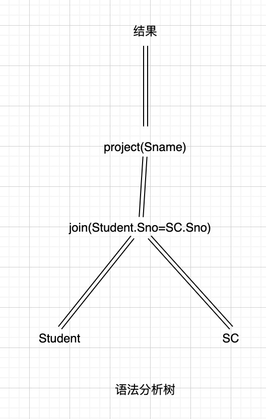
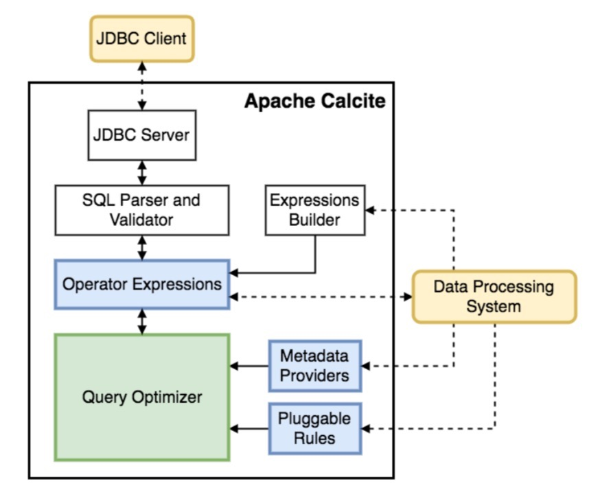

# 快速入门

## 下载构建源码

* 运行内置example

```shell
git clone https://github.com/apache/calcite.git
cd example/csv
./sqlline
!connect jdbc:calcite:model=src/test/resources/model.json admin admin
```

## 概念

### 与关系代数的联系

| 名称     | 英文              | 符号 | 说明                                   |
| -------- | ----------------- | ---- | -------------------------------------- |
| 选择     | select            | σ    | 类似于 SQL 中的 where                  |
| 投影     | project           | Π    | 类似于 SQL 中的 select                 |
| 并       | union             | ∪    | 类似于 SQL 中的 union                  |
| 集合差   | set-difference    | -    | SQL中没有对应的操作符                  |
| 笛卡儿积 | Cartesian-product | ×    | 类似于 SQL 中不带 on 条件的 inner join |
| 重命名   | rename            | ρ    | 类似于 SQL 中的 as                     |
| 集合交   | intersection      | ∩    | SQL中没有对应的操作符                  |
| 自然连接 | natural join      | ⋈    | 类似于 SQL 中的 inner join             |
| 赋值     | assignment        | ←    |                                        |

### 代数与物理优化基础

#### 查询分析

* 对查询语句进行扫描, 词法分析(识别出保留字, 变量, 运算符, 发现拼写错误)和语法分析(判断是否符合SQL的语法规则, 出现错误就报告SQL语法错误)

#### 查询检查

* 有效性检查: 对符合语法规则的查询语句进行语义检查, 也就是根据数据字典中有关的模式定义去检查语句中的数据库对象, 比如表名, 属性名是否都在存在和有效.
* 视图转换: 把对视图的操作求解, 转换成对基本表的操作
* 安全性: 还要检查用户权限
* 完整性检查: 根据数据字典中存储的完整性约束进行检查(主键约束, 外键约束, 用户自定义约束非空, 取值范围等).



#### 查询优化

* 是数据库技术的关键. 划分为代数优化(逻辑优化), 物理优化(存取路径, 底层算法).
* 优化的依据: 基于规则, 基于代价, 基于语义
* 优化器得出一个执行策略, 并生成相应的查询计划.

##### project操作算法

* naive table scan: 全表扫描, 按照物理次序读取Student表的M个block到内存, 检查是否满足条件, 满足则输出.
* index scan: 如果选择条件中的属性上有索引(比如学号, 姓名, age可能有B+), 那么可以用索引扫描方法, 通过索引先找到满足条件的元组的指针, 然后通过指针在基本表中找到元组.

##### join操作算法

* naive nested loop join: O(N^2), 嵌套循环
* sort-merge join排序合并算法: 假设sno做连接, 那么两个表都按照sno排序, 排好序了以后按照Student, 对SC进行扫描, 注意由于排好序了, 因此两张表都只要扫描一遍即可, 总的时间复杂度是O(NlgN + 2N) = O(NlgN)
* index join: 假设SC表上已经建立了属性sno的索引, 那么对于Student中的每一个元组, 在SC中找到对应的元组的时间就不是全表扫描O(N), 而是O(lgN).
* hash join: 对记录行数较少的那张表, 假设是Student表, 建立一个hashtable, 然后对大表SC, 用同样的hash函数, 对每个元组上的sno进行hash, 如果在hashtable中有对应的Student元组, 就连接.
   整个时间开销是O(N), 当然了, 相比其他算法, 额外的空间开销是O(N).

##### 代价模型

DBMS会根据其特有的代价模型来计算各种查询执行策略的代价, 然后选取代价最小的方案.

* 对集中式数据库: 主要开销是IO
* 对分布式数据库: 主要开销是IO + 网络通信代价

#### 查询执行

* 根据code generator负责生成执行能够“查询计划”的实际代码，然后加以执行返回查询结果。

https://www.jb51.net/article/33535.htm


### calcite概念


| 类型          | 描述                                                         | 特点                                                         |
| ------------- | ------------------------------------------------------------ | ------------------------------------------------------------ |
| RelOptRule    | transforms an expression into another。对 expression 做等价转换 | 根据传递给它的 RelOptRuleOperand 来对目标 RelNode 树进行规则匹配，匹配成功后，会再次调用 `matches()` 方法（默认返回真）进行进一步检查。如果 `mathes()` 结果为真，则调用 `onMatch()` 进行转换。 |
| ConverterRule | Abstract base class for a rule which converts from one calling convention to another without changing semantics. | 它是 RelOptRule 的子类，专门用来做数据源之间的转换（Calling convention），**ConverterRule 一般会调用对应的 Converter 来完成工作**，比如说：JdbcToSparkConverterRule 调用 JdbcToSparkConverter 来完成对 JDBC Table 到 Spark RDD 的转换。 |
| RelNode       | relational expression，RelNode 会标识其 input RelNode 信息，这样就构成了一棵 RelNode 树 | 代表了**对数据的一个处理操作**，常见的操作有 Sort、Join、Project、Filter、Scan 等。它蕴含的是对整个 Relation 的操作，而不是对具体数据的处理逻辑。 |
| Converter     | A relational expression implements the interface `Converter` to indicate that it converts a physical attribute, or RelTrait of a relational expression from one value to another. | **用来把一种 RelTrait 转换为另一种 RelTrait 的 RelNode**。如 JdbcToSparkConverter 可以把 JDBC 里的 table 转换为 Spark RDD。如果需要在一个 RelNode 中处理来源于异构系统的逻辑表，Calcite 要求先用 Converter 把异构系统的逻辑表转换为同一种 Convention。 |
| RexNode       | Row-level expression                                         | 行表达式（标量表达式），蕴含的是对一行数据的处理逻辑。每个行表达式都有数据的类型。这是因为在 Valdiation 的过程中，编译器会推导出表达式的结果类型。常见的行表达式包括字面量 RexLiteral， 变量 RexVariable， 函数或操作符调用 RexCall 等。 RexNode 通过 RexBuilder 进行构建。 |
| RelTrait      | RelTrait represents the manifestation of a relational expression trait within a trait definition. | 用来定义逻辑表的物理相关属性（physical property），三种主要的 trait 类型是：Convention、RelCollation、RelDistribution； |
| Convention    | Calling convention used to repressent a single data source, inputs must be in the same convention | 继承自 RelTrait，类型很少，代表一个单一的数据源，一个 relational expression 必须在同一个 convention 中； |
| RelTraitDef   |                                                              | 主要有三种：ConventionTraitDef：用来代表数据源 RelCollationTraitDef：用来定义参与排序的字段；RelDistributionTraitDef：用来定义数据在物理存储上的分布方式（比如：single、hash、range、random 等）； |
| RelOptCluster | An environment for related relational expressions during the optimization of a query. | palnner 运行时的环境，保存上下文信息；                       |
| RelOptPlanner | A RelOptPlanner is a query optimizer: it transforms a relational expression into a semantically equivalent relational expression, according to a given set of rules and a cost model. | 也就是**优化器**，Calcite 支持RBO（Rule-Based Optimizer） 和 CBO（Cost-Based Optimizer）。Calcite 的 RBO （HepPlanner）称为启发式优化器（heuristic implementation ），它简单地按 AST 树结构匹配所有已知规则，直到没有规则能够匹配为止；Calcite 的 CBO 称为火山式优化器（VolcanoPlanner）成本优化器也会匹配并应用规则，当整棵树的成本降低趋于稳定后，优化完成，成本优化器依赖于比较准确的成本估算。RelOptCost 和 Statistic 与成本估算相关； |
| RelOptCost    | defines an interface for optimizer cost in terms of number of rows processed, CPU cost, and I/O cost. | 优化器成本模型会依赖；                                       |

### calcite架构



* 在 Calcite 架构中，最核心地方就是 Optimizer，也就是优化器，一个 Optimization Engine 包含三个组成部分：
  * rules：也就是匹配规则，Calcite 内置上百种 Rules 来优化 relational expression，当然也支持自定义 rules；
  * metadata providers：主要是向优化器提供信息，这些信息会有助于指导优化器向着目标（减少整体 cost）进行优化，信息可以包括行数、table 哪一列是唯一列等，也包括计算 RelNode 树中执行 subexpression cost 的函数；
  * planner engines：它的主要目标是进行触发 rules 来达到指定目标，比如像 cost-based optimizer（CBO）的目标是减少cost（Cost 包括处理的数据行数、CPU cost、IO cost 等）。

### calcite处理流程


* 解析 SQL， 把 SQL 转换成为 AST （抽象语法树），在 Calcite 中用 SqlNode 来表示；
* 语法检查，根据数据库的元数据信息进行语法验证，验证之后还是用 SqlNode 表示 AST 语法树；
* 语义分析，根据 SqlNode 及元信息构建 RelNode 树，也就是最初版本的逻辑计划（Logical Plan）；
* 逻辑计划优化，优化器的核心，根据前面生成的逻辑计划按照相应的规则（Rule）进行优化；
* 物理执行，生成物理计划，物理执行计划执行。
