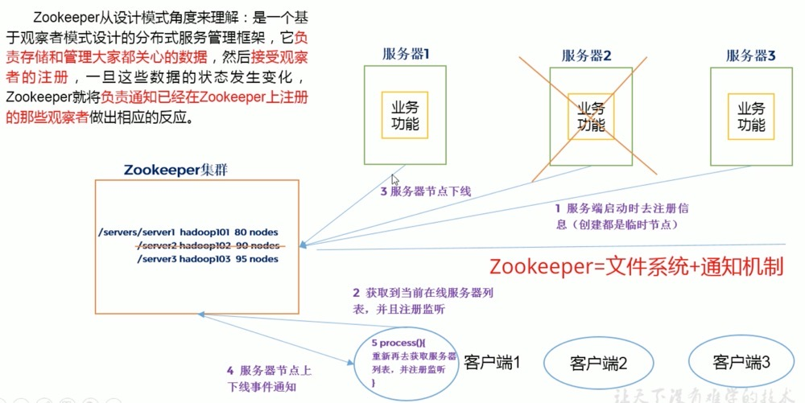

# Zookeeper入门

## Zookeeper工作机制

## Zookeeper特点

* 一致性：数据一致性，数据按照顺序分批入库。
* 原子性： 事务要么成功要么失败，不会局部化（不会有部分状态不一致）。
* 单一视图： 客户端连接集群中的任意zk节点，数据都是一致的。
* 可靠性：每次对zk的操作状态都会保存在服务端。
* 实时性：客户端可以读取到zk服务端的最新数据。
* Zookeeper:一个Leader多个Follower以及ObServer。
* 集群中只要有半数以上节点存活Zookeeper集群就可以正常服务，多副本概念。
* 全局数据一致，基于ZAB原子广播协议，每个Server保存一份相同的数据副本，Client连接到那个Server，数据一致。
* 更新请求顺序执行，来自同一个client的更新请求按其发送顺序依次执行。

### 数据结构

* 按照树形结构存储数据，与Unix文件系统类似，每个节点称为一个Znode，每个Znode默认能够存储1MB的数据，每个ZNode都可以`通过其路径唯一标识`，也可以有子节点。
* 每个节点分为临时节点和永久节点，临时节点在客户端断开后消失
* 每一个zk节点都有各自的版本号，可以通过命令行来显示节点信息每当节点数据发生变化，那么该节点的版本号会累加（乐观锁）
* 删除/修改过时节点，版本号不匹配则会报错
* 每个zk节点存储的数据不宜过大，几k即可
* 节点可以设置权限acl，可以通过权限来限制用户的访问

### Znode数据结构

#### Stat结构体

 **状态信息、版本、权限相关**

| 状态属性       | 说明                                                         |
| -------------- | :----------------------------------------------------------- |
| czxit          | 节点创建时的 zxid                                            |
| mzxid          | 节点最新一次更新发生时的 zxid                                |
| ctime          | 节点创建时的时间戳.                                          |
| mtime          | 节点最新一次更新发生时的时间戳.                              |
| dataVersion    | 节点数据的更新次数.                                          |
| cversion       | 其子节点的更新次数                                           |
| aclVersion     | 节点 ACL(授权信息)的更新次数.                                |
| ephemeralOwner | 如果该节点为 ephemeral 节点, ephemeralOwner 值表示与该节点绑定的 session id. 如果该节点不是ephemeral节点, ephemeralOwner 值为 0. 至于什么是 ephemeral节点 |
| **dataLength** | 节点数据的字节数. |
| **numChildren** | 子节点个数 |

## Zookeeper参数解读

### tickTime

* 默认为200，通信心跳数，ZK服务器与客户端心跳时间，单位毫秒。ZK使用的基本时间，`服务器之间或客户端与服务器之间维持心跳的时间间隔`,每个tickTime时间就会发送一个心跳。
* 用于心跳机制，并设置最小的session超时时间为两倍心跳时间。(session的最小超时时间是2 * tickTime)

### initLimit

* 默认为10，LF初始通信时间，集群中的follower跟随者与Leader领导者服务器之间`初始化连接时`能容忍的最多心跳数(tickTime数量)，用它来限定集群中的Zookeeper服务器连接到Leader的时限，默认为(initLimit*tickTime=10 * 2s=20s)

### syncLimit

* 默认为5，LF同步通信时间，`集群中Leader与Follower之间的最大响应时间单位`,假如响应超过了syncLimit * tickTime，Leader认为Follower死掉，从服务器列表中删除Follower。

### dataDir

* 主要用于保存Zookeeper中的数据。

### clientPort

* 监听客户端连接的端口。

# Zookeeper内部原理

## 选举机制

* `半数机制:集群中半数以上集群存货，集群可用。所有Zookeeper适合安装奇数台服务器`。
* Zookeeper虽然在配置文件中没有指定`Master和Slave`。但是Zookeeper工作时是有一个节点为Leader，其他则为Follower，Leader是通过内部的选举机制临时产生的。

* 服务器1启动，此时只有它一台服务器启动了，它发出去的报文没有任何响应，所以它的选举状态一直是LOOKING状态。
* 服务器2启动，它与最开始启动的服务器1进行通信，互相交换自己的选举结果，由于两者都没有历史数据，所以id值较大的服务器2胜出，`但是由于没有达到超过半数以上的因此还需要等待其他服务器`。
* 服务器3启动后，服务器1、2都将票投给myid最大的服务器索引服务器3成为Leader，后续来的服务器都是Follower节点。

## 节点类型

* 临时节点(Ephemeral):客户端和服务端断开连接后，创建的节点自己删除。
  * 临时顺序编号节点，ZNode也是按顺序增加，只不过断开连接后节点会被删除。
* 持久节点(Persistent):客户端和服务器端断开连接后，创建的节点不删除。
  * 持久化顺序节点，创建的ZNode会有一个顺序标识，znode名称会附加一个值，是一个单调递增的计数器，由父节点维护。

## 监听器原理

### 原理详解

* 首先由一个main线程
* main线程中创建Zookeeper客户端，这时会创建两个线程，一个负责网络连接通信(connect)一个负责监听(listener)
* 通过connect线程将主持的监听事件发送给Zookeeper
* 在Zookeeper的注册监听器列表中将注册的监听事件添加到列表中
* Zookeeper监听到有数据或路径变化，就会将这个消息发送给listener线程
* listener线程内部调用process方法

## 写数据流程

# 面试题

* Zookeeper选举机制
* Zookeeper监听原理