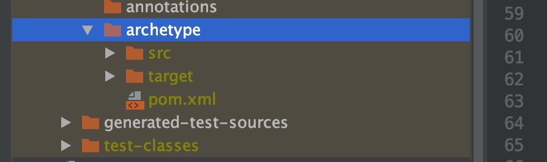

# 制作maven骨架

## 引入插件

```java
<!--骨架插件-->
<plugin>
    <groupId>org.apache.maven.plugins</groupId>
    <artifactId>maven-archetype-plugin</artifactId>
    <version>3.1.2</version>
</plugin>
```

## 生成骨架

`mvn archetype:create-from-project`



## 进入generated-sources/archetype

```
mvn install --settings=/Users/babywang/Documents/reserch/dev/maven3.6.1/conf/forchange-settings.xml
这样就把自定义的archetype安装到本地仓库了
```

## 发布到私服

```xml
进入generated-sources/archetype，在pom文件中添加如下配置
<!--  配置deploy jar路径 id对应maven setting中的server配置 -->
<distributionManagement>
    <!--        默认上传，一般为release-->
    <repository>
        <id>releases</id>
        <url>https://nexus.forchange.cn/repository/maven-releases/</url>
    </repository>
    <!--        快照仓库-->
    <snapshotRepository>
        <id>snapshots</id>
        <url>https://nexus.forchange.cn/repository/maven-snapshots/</url>
    </snapshotRepository>
</distributionManagement>
```
