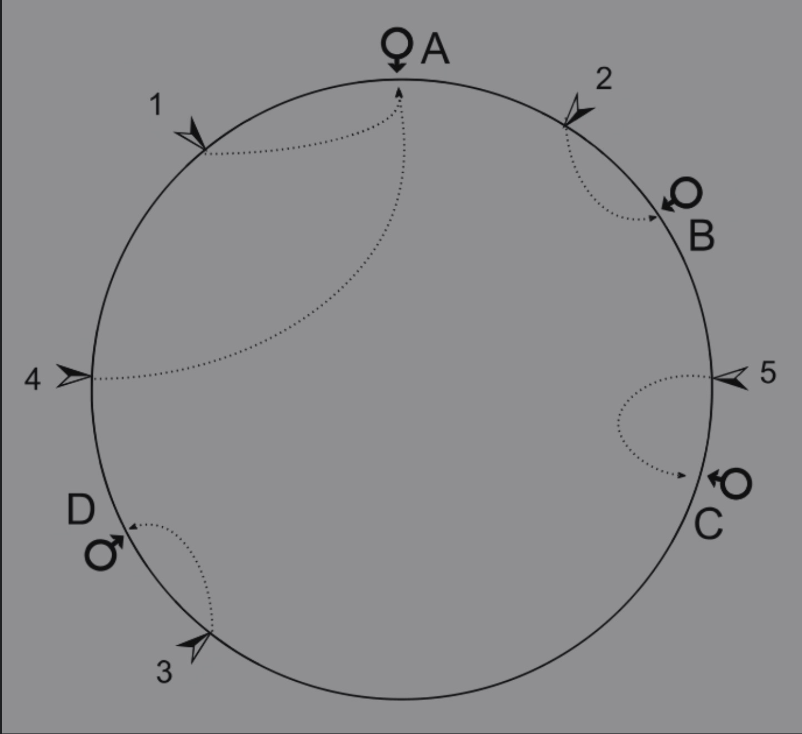
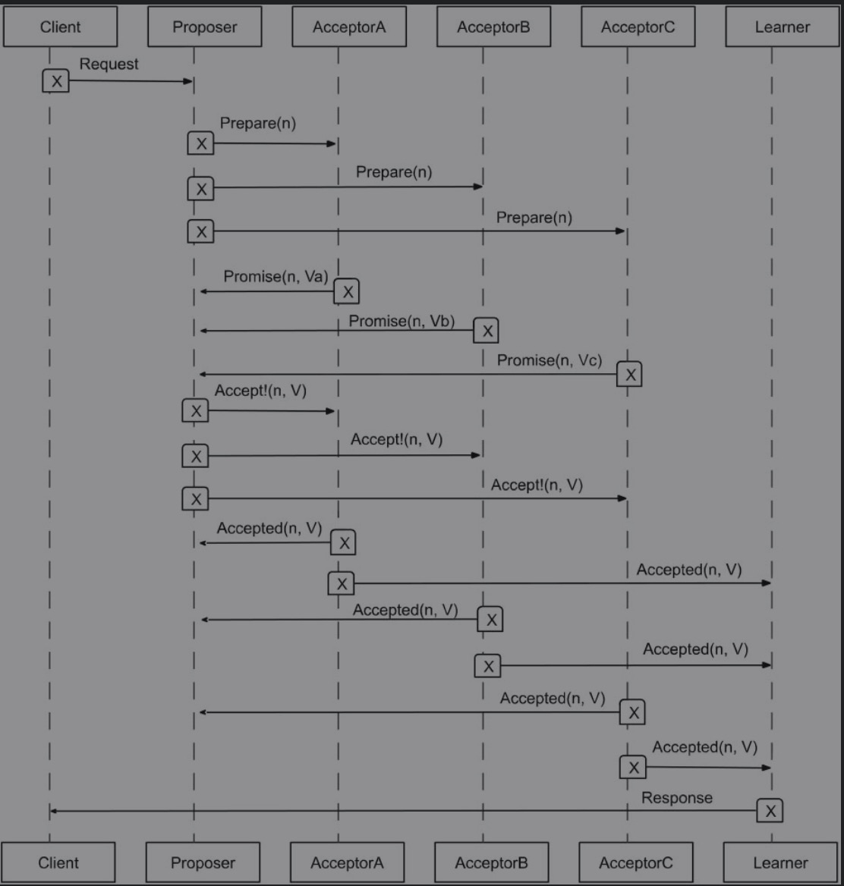
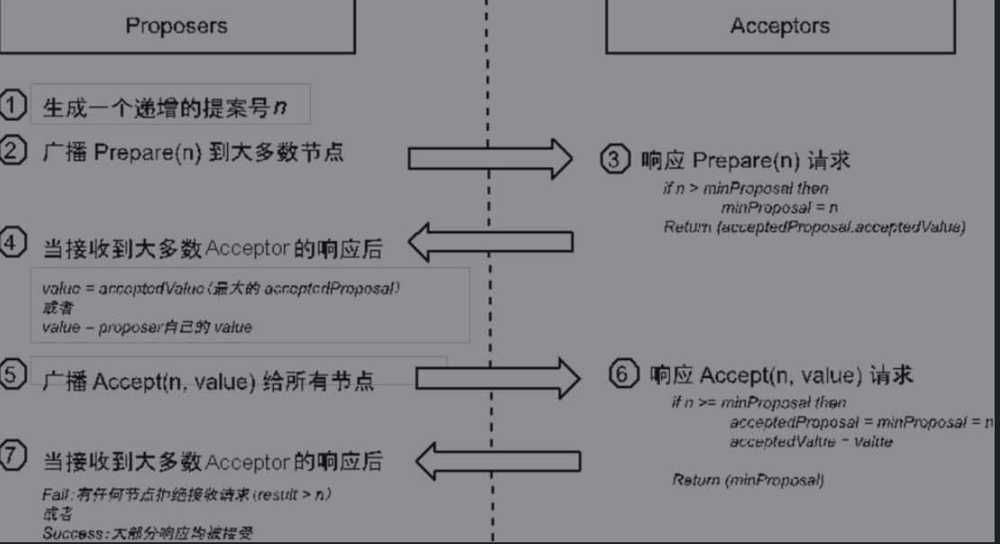
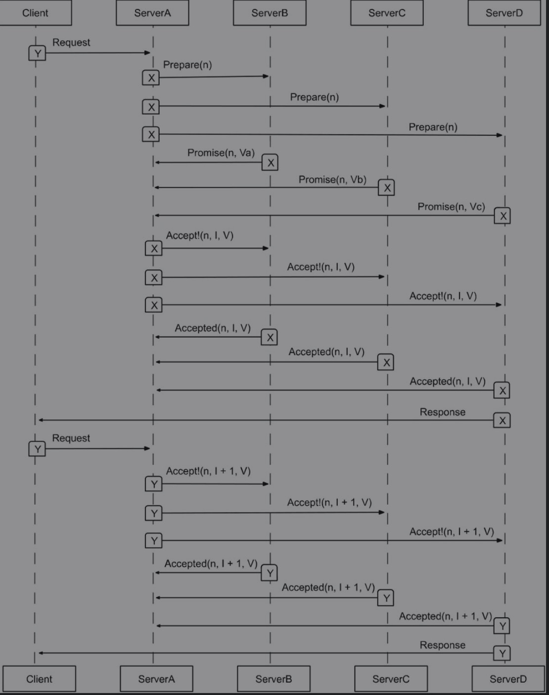
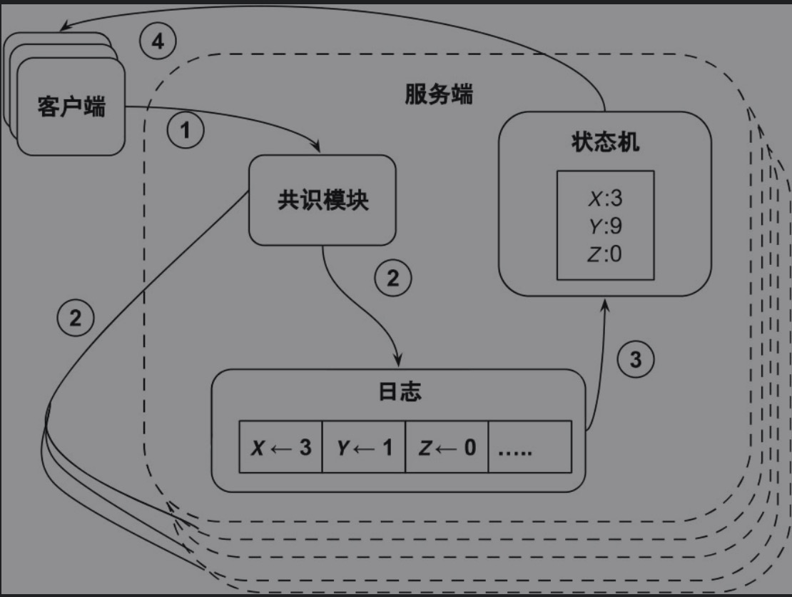
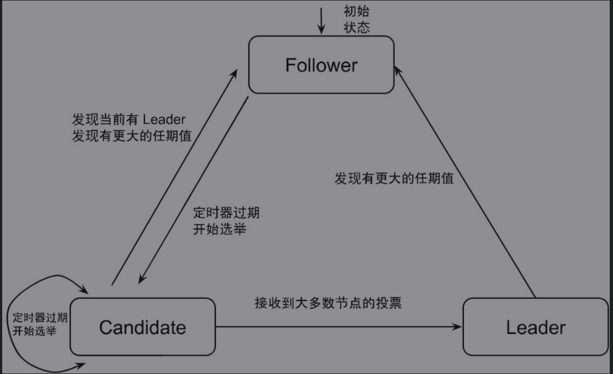
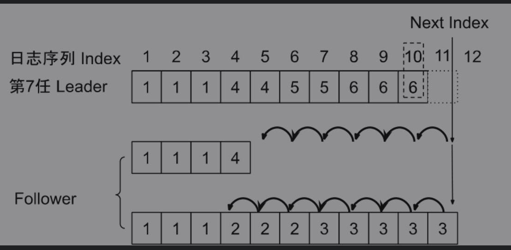

# 数据中台读书笔记

## 基础设施

### 微服务

* 分布式服务调用，使用服务注册发现方式进行RPC/GRPC服务调用

### 服务治理

* 对多个微服务进行治理，统一管理各个微服务。

### 监控报警系统

* Prometheus配合Grafana使用，通过Pushgateway、Prometheus即 AlertManager配置监控报警系统。


## 分布式数据库

### 概述

* OLTP 分布式数据库划分为 SQL 数据库（关系型）、NoSQL数据库（Not Only SQL，不仅仅是关系型）、NewSQL 数据库三类。

### 分布式数据库技术

#### ACID理论

* 原子性：其强调事务的整体性和不可分割性，系统不会处于一个不可预测的中间状态。对于事务中包含的多个操作，系统在执行过程中要么完成全部操作并进行提交，要么全部操作都失败后，系统回滚到上一个一致性状态。
* 一致性：在事务的发起、运行和结束的全流程中，数据库的完整性约束没有被破坏，因为数据库状态更迭的基本单位是事务。
* 隔离性：其主要用于数据库事务的并发控制，系统需要保证多个并发执行的事务不会相互影响，从而防止数据不一致现象的发生。从具体实践来看，事务隔离又可以分为未提交读（Read-Uncommitted）、提交读（Read-Committed）、可重复读（Repeatable-Read）和串行化（Serializable）这四个级别，每个级别所蕴含的物理意义各不相同。
* 持久性：事务的成功提交意味着当前事务生命周期的结束，事务所做的任何修改都会被持久化地存储在数据库当中，即使系统遭遇故障，这些数据更新也不应丢失。

#### 数据分片策略

**需要考虑一下一些因素来决定数据分片的策略**

* 数据分布的均匀程度。
* 元数据管理的复杂程度（有无状态）。
* 路由规则的复杂程度（计算开销）。
* 弹性伸缩的灵活度（当数据规模和访问负载变更时）。
* 数据的迁移成本（当物理节点的可用性和数量变更时）。

**哈希取模分片策略**

* 哈希取模分片是通过对数据的某个特征进行哈希值计算来建立与节点的映射关系的，根据节点数量和哈希算法做出节点数和哈希的映射。

**一致性哈希分片策略**

* 比较完美地解决了哈希取模分片策略中由于节点变更所导致的数据大量迁移的问题，一致性哈希通过对物理节点和数据按照同样的方式进行散列，从而把它们较为均匀地分布到同一个哈希环上。经过散列之后，环上的数据可以被离它最近的下游物理节点所管理，任何物理节点的变更都只影响相邻的数据分片，而其他数据分片和物理节点的映射关系可以保持不变。
* 举例来说，如果图5-3中的节点 C 发生故障，那么 5号数据分片将被节点 D 所管理，其他数据分片均保持不变。值得说明的是，对于有状态的系统，该映射关系的变更需要配合物理数据的迁移来同步进行。此外，系统需要有多个数据副本来提升自身的可用性。



* 一致性哈希分片虽然较好地解决了大规模数据迁移的问题，但是它在负载均衡上并不完美，因为只有相邻的物理节点才能分担数据存储和访问流量的压力。在实际工程实践中，系统可以通过引入虚拟节点的方式来解决负载均衡的问题。

**连续区域分片策略（range分片）**

* 在键顺序上具有相邻关系的数据会被分配到同一个物理节点上。当有数据增删操作发生时，该策略会进行分片分裂和分片合并等操作，从而使系统恢复到负载均衡的状态。当系统再次达到负载均衡的状态后，新的映射关系等元数据也会被持久化地存储作为请求路由的依据。该策略虽然在应对数据负载变更时显得比较复杂，但是在应对物理节点变更时却有着较大的优势，因为系统只需要重新迁移一小部分的数据分片。

#### 数据复制策略

**异步复制**

* 在数据异步复制策略下，写请求落盘到主节点后会立即返回，随后的数据复制操作通常借助日志回放机制来异步更新到其他数据副本上

**同步复制**

* 数据同步复制指的是写请求需要等待所有的节点完成数据落盘后才会被应答，而无论数据复制操作是由客户端发起的还是由主节点发起的。同步复制可以有效地避免数据不一致的问题，但是它也会增大请求的响应延迟，特别是在副本数目较多且副本间的物理距离较远的情况下，延迟现象是比较明显的。

#### Gossip协议

* Gossip 协议也叫流言协议，它基于去中心化的点对点消息传递机制，通常用于故障探测、成员组网和数据复制等场合。
* 该协议的运转流程从某些种子节点开始，它们随机选择一些周围节点进行消息的散播，接收到消息的节点会继续重复该过程直至消息全网扩散。可见，该协议具有和主从类型的协议完全不同的特性。由于Gossip 协议的整个运行过程需要一段时间才能收敛，而且它至多只能保证消息的最终一致性，因此系统设计人员需要充分考虑该协议的适用场合

**特点**

**好处**

* 简单：该协议在理论和工程实践上都较为简单，易于理解和运维。
* 可扩展性：集群可以支持几乎任意形式的扩缩容操作。
* 去中心化：在该协议里，所有节点都是对等的，因此系统具有天然的去中心化特性。
* 健壮性：任意数量的节点故障都不会影响消息的传播。

**缺陷**

* 消息延迟：消息的全网扩散需要经历多个轮次，这样的传播方式会带来不可避免的消息延迟现象，因此它不适合对实时性有较高要求的场景。
* 消息冗余：在消息传播路径上不相邻的节点之间无法进行直接通信，因此系统不可避免地存在消息重复发送的情况。
* 弱一致性：最终一致性是该协议能够达到的最好结果，但是在极端情况下这一点也是不能保证的。

#### 分布式一致性协议

**Paxos**

* Paxos：Paxos 算法由图灵奖获得者 Leslie Lamport 提出，它的正确性得到了严格的理论证明，该算法成为各类分布式一致性协议的理论基础。作为最早的和最基本的分布式一致性算法，它从理论上优雅地解决了就某一提案达成一致性决议的难题。但是在 Paxos 算法中，所有节点都是对等的，因此在最极端的情况下，这些节点可以发起相互冲突的提案请求并造成活锁的局面。此外，每个提案都需经过 Prepare 和 Accept 两个阶段才能完成，因此在整个流程中系统需要进行多次的节点交互和数据持久化。这种方式导致了较低的吞吐性能，因此它难以满足大规模的工业化应用。



**Proposer 与 Acceptor**



**Multi-Paxos**

* Multi-Paxos：它是在 Paxos 基础上的一个改进方案。简单来讲，它的主要改进是通过选主操作将绝大部分的两阶段交互行为简化为一阶段交互行为。Multi-Paxos 大幅度地提升了系统运行性能，并完美地解决了就一系列提案达成一致性决议的难题。该协议被广泛地应用于各大分布式系统中，特别是在分布式协调服务、集群管理系统和分布式数据库里，Multi-Paxos 发挥了不可替代的作用。

```
通过选主操作维护了一个稳定的 Proposer，它也被称为 Leader,系统可以省略第一个阶段中的 Prepare 和 Promise 请求，只有当Leader 发生变更时这些请求才不可避免。
```



**Raft**

* Raft：它在功能的完备性上和Multi-Paxos十分接近，但是Raft具有更好的可理解性和工程可实践性。简单来说，Raft协议通过增加有序提交和选主条件这两个约束对Multi-Paxos协议进行了大幅度简化（在极端环境下，这样的方式会损失一定的健壮性和吞吐性能）。

**运行流程**

（1）客户端发送请求给 Leader 节点。

（2）Leader 会将请求追加到磁盘上的 WAL 日志尾部，同时它向所有的Follower 发起日志复制操作。

（3）Leader 在接收到来自大多数 Follower 的响应后，将变更应用到本地状态机中。

（4）Leader 节点最后将请求应答返回给客户端。



**角色模块**

* Leader 选举模块：Raft 协议中有 Leader 、Candidate 和 Follower 三种角色，集群需要一个唯一的 Leader 节点来负责接收客户端请求，并负责指导Follower 节点完成数据的同步复制。Follower 角色的节点在发起选举投票操作后就会转变为 Candidate 角色。此外，只有拥有最全日志的 Candidate 角色才能胜出成为 Leader，该节点具有最大任期值（Term）和日志编号（Index）。这三种角色之间的状态转变流程。所有的 Raft 节点起初都是 Follower 角色，它们在完成初始化后会启动一个随机定时器，然后它们会在超时期限内监听来自 Leader 节点的心跳消息或者其他 Candidate角色的请求投票消息。若在超时期限内没有接收到这些消息，那么该节点的角色就会由 Follower 变为 Candidate ，然后它会向其他节点发起投票请求。如果投票请求在超时期限内得到了大多数节点的响应，那么该节点就会变为Leader 角色，它会周期性广播心跳请求来维持自己的 Leader 地位。如果在超时期限内接收到了来自 Leader 的心跳请求，那么它就会自动退化为Follower 角色；否则，它会在超时期限后重新发起新一轮的投票请求。



**日志复制模块**

* 日志复制模块：Raft 的日志格式是由 TermId、LogIndex 和 LogValue 组成的，其中 TermId 代表 Leader 节点的任期值； LogIndex 代表日志记录在日志文件中的位置；LogValue则代表日志记录中的具体消息数据。Leader 节点在接收到客户端的请求后会将日志广播给其他节点，当它接收到大多数节点的响应后会把该日志记录提交到本地的状态机中，并且更新对应的LogIndex。值得注意的是，当日志记录被状态机执行后，我们就认为该条消息处于已提交状态。此外，LogIndex 也会被添加在 Leader 发送给 Follower 的心跳消息中，这样做的目的是为了让 Follower 知晓最新的已提交日志记录，从而在本地的状态机中进行提交操作。一般而言，如果客户端需要得到Read-After-Write 的一致性保障，它可以选择只与 Leader 交互，或者在与Follewer 进行交互的过程中携带上相应的 TermId 和 LogIndex。由于机器故障或者网络问题，集群中可能会出现新的 Leader 选举，那么不同节点间就可能会出现日志记录不一致的情况。正如上面提到的，新的 Leader 拥有目前最新最全的日志记录，所以它可以指导 Follower 进行日志修复操作。修复过程如图 5-16 所示。当 Leader 向某个日志记录不一致的 Follower 发送复制日志请求时，Follower 会发现本地数据和请求存在不一致的记录，所以它会拒绝该请求。进而Leader 节点会持续地回退到完全匹配的消息记录上，并从这个地方开始指导 Follower 进行日志的修复工作，直到大多数节点都拥有了完全一致的消息记录为止。



**成员变更模块**

* 成员变更模块：成员变更是一项非常微妙且易出错的环节，它直接关系着协议的正确性。如图 5-17 所示，如果贸然在一个具有 3 个节点的集群中突然新增 2 个节点，那么集群配置在从 OldConfig 变成 NewConfig 的过程中，不同节点间可能会出现新旧配置叠加的情况。详细地讲，按照图中箭头的时间方向，节点1和节点 2 在旧配置下可以选举出节点 1 为 Leader，而在同一时刻，节点 3、节点4 和节点5则可以选举出节点5 为另外一个Leader。这就意味着在该时刻，集群同时拥有了两个 Leader 角色的节点，因此 Raft 协议的正确性在该情况下会受到破坏。为了避免这种混乱情况的发生，Raft 协议运用了单节点变更算法，系统在每次操作中只会对一个节点进行成员变更操作。在同一个例子里，集群首先需要从节点3变更成节点4，然后再变更成节点5，因此单节点变更算法可以有效地避免集群在成员变更的过程中出现脑裂的情况。
