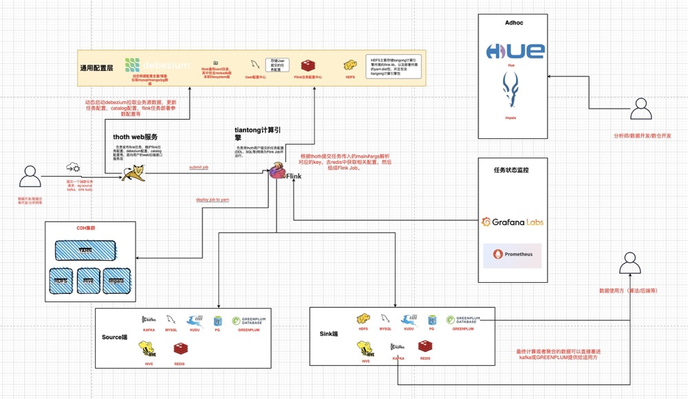

# 数据平台设计

## desc
* 文档描述本人参与设计从0到1搭建的离线数仓以及基于Flink的数据平台的搭建文档，主要是对架构的设计与思考。

## 离线数仓


* 基于Spark+Scala开发，分为merge、ods、dim、dw、dm、etl、adhoc层，各类如传统数仓类似，每层代码结构按照service、repo、controller分层
* controller负责提供Spark driver类入口，service层负责按照不同主题处理业务逻辑，repo层负责操作各种数据。
* merge层为合并小文件层，ods层为对binlog数据进行合并，将update、delete、insert数据合并清洗为与源端数据库对齐的数据。

## 实时数据平台

1. 提供简单傻瓜式抽数系统，全量+增量方式将数据传输到各种目的端，底层基于Flink开发，配合debezium实现全量的binlog和pg wal日志采集，然后利用flink将数据传输到下游。
2. 提供SQL开发平台，主要用于实时数仓作业，通过选择已经采集的流表或者静态表完成传统的数据建模和业务处理。

### 架构图



### 模块区分

* deploy: 自研Flink任务部署平台，支持个性化任务配置(checkpoint/资源/日志配置/安全配置等等)，并且提供任务管理，任务状态上报，以及debezium配置管理等功能。
* tiangong: 底层通用Flink引擎，主要用于读取用户提供的配置，加载配置生成不同的Flink Job，主要包含抽数任务/实时数仓任务等。
* other: 这是一个大模块，其中包含log/monitor等子模块，主要负责日志收集，错误监控等，保证任务稳定性。
* 外部监控: 主要是对debezium和全部flink任务的监控，主要通过prometheus和grafana来监控。

### 抽数平台设计

* 提供多数据源管理，提供多种方式抽数管道。
* 提供一键获取元数据能力，提供字段自定义映射功能，提供Flink With参数配置功能。
* 提供任务提交版本记录，任务监控等等。

# 一站式任务部署平台设计

## 部署集群设计

### Hadoop Yarn部署集群设计

#### 概述

* 支持Hadoop Yarn集群配置管理化，提供将指定资源上传至对应Hadoop集群，支持Yarn集群任务监控。
* 支持HDFS文件树查看，支持简易版本的HDFS文件管理。
* 支持计算集群所需的Yarn部署参数，将对应计算集群的任务部署至Yarn中

#### DDL

```sql
create table hadoop_cluster_config
(
    id                 int auto_increment
        primary key,
    created_at         timestamp(3) default CURRENT_TIMESTAMP(3) not null,
    enable_kerberos    bit                                       not null,
    hadoop_conf_dir    varchar(255)                              not null,
    hadoop_host_config varchar(255)                              null,
    hadoop_username    varchar(64)                               not null,
    kerberos_config    varchar(255)                              not null,
    name               varchar(64)                               not null,
    status             int                                       not null,
    updated_at         timestamp(3) default CURRENT_TIMESTAMP(3) not null on update CURRENT_TIMESTAMP(3),
    yarn_web_url       varchar(255)                              not null,
    constraint hadoop_cluster_config_name_unique
        unique (name)
);
```

### K8s部署集群设计

#### 概述

- 提供将Flink/Spark任务部署至K8s中

## 计算集群设计

### Flink计算集群

#### 概述

- 提供flink资源管理，包括任务jar、配置、依赖jar,相关配置存储在`hadoop_cluster_id`绑定的hadoop集群
- 提供Flink任务声明周期管理，提供yarn/k8s方式任务部署策略

#### DDL

```sql
-- auto-generated definition
create table flink_cluster_config
(
    id                  int auto_increment
        primary key,
    created_at          timestamp(3) default CURRENT_TIMESTAMP(3) not null,
    flink_conf_dir      varchar(1024)                             not null,
    flink_dist_jars     varchar(1024)                             not null,
    flink_log_file_path varchar(1024)                             not null,
    flink_provided_jars varchar(1024)                             not null,
    hadoop_cluster_id   bigint                                    not null,
    name                varchar(255)                              not null,
    status              int                                       not null,
    updated_at          timestamp(3) default CURRENT_TIMESTAMP(3) not null on update CURRENT_TIMESTAMP(3),
    constraint flink_cluster_config_name_unique
        unique (name)
);
```

#### 原理

* flink-yarn任务底层原理:通过flink官方提供的`flink-yarn`中的`YarnClusterDescriptor`进行封装改造，并且配置`flink rest api`对任务进行管理。
* 资源管理通过`hadoop-client`原生api对资源进行管理。

### Spark计算集群

#### 概述

- 提供Spark作业配置管理，支持动态部署spark作业

#### DDL

* `todo`

## 任务管理

### 任务JAR包管理

#### 概述

- 负责task jar包管理,负责管理对应计算集群支持的`task jar`
- 支持统一的`task jar`任务管理

#### DDL

```sql
-- auto-generated definition
create table task_driver_jars
(
    id                  int auto_increment
        primary key,
    compute_cluster_id  bigint                                    not null,
    compute_engine_type int                                       not null,
    created_at          timestamp(3) default CURRENT_TIMESTAMP(3) not null,
    jar_desc            varchar(255)                              not null,
    jar_path            varchar(255)                              not null,
    name                varchar(64)                               not null,
    owner               varchar(255)                              null,
    updated_at          timestamp(3) default CURRENT_TIMESTAMP(3) not null on update CURRENT_TIMESTAMP(3),
    constraint task_driver_jars_name_unique
        unique (name)
);
```

### 统一任务管理设计

#### 概述

- 提供最细粒度的任务配置管理,提供任务配置参数管理。
- 支持动态任务运行状态监控,管理任务对应部署集群、计算集群，以及任务相关配置管理等。
- todo

#### DDL

```sql
-- auto-generated definition
create table task_config
(
    id                   int auto_increment
        primary key,
    compute_cluster_id   bigint                                         not null,
    compute_engine_type  int                                            not null,
    created_at           timestamp(3) default CURRENT_TIMESTAMP(3)      not null,
    deploy_cluster_id    bigint                                         not null,
    deploy_engine_type   int                                            not null,
    operator             varchar(255)                                   not null,
    start_time           timestamp(3) default '0000-00-00 00:00:00.000' not null,
    stop_time            timestamp(3) default '0000-00-00 00:00:00.000' not null,
    task_deploy_config   varchar(1024)                                  not null,
    task_name            varchar(256)                                   not null,
    task_run_config      varchar(1024)                                  null,
    task_status          int                                            not null,
    task_type            int                                            not null,
    updated_at           timestamp(3) default CURRENT_TIMESTAMP(3)      not null on update CURRENT_TIMESTAMP(3),
    user_driver_jar_path varchar(255)                                   not null,
    constraint task_config_task_name_unique
        unique (task_name)
);
```

