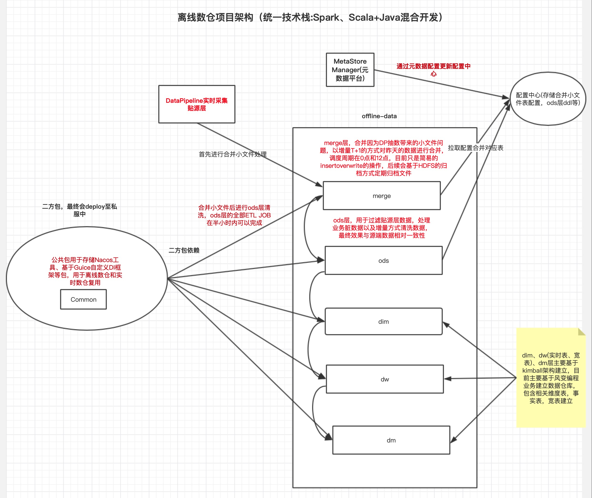

# 数据平台设计

## desc
* 文档描述本人参与设计从0到1搭建的离线数仓以及基于Flink的数据平台的搭建文档，主要是对架构的设计与思考。

## 离线数仓

* 基于Spark+Scala开发，分为merge、ods、dim、dw、dm、etl、adhoc层，各类如传统数仓类似，每层代码结构按照service、repo、controller分层
* controller负责提供Spark driver类入口，service层负责按照不同主题处理业务逻辑，repo层负责操作各种数据。
* merge层为合并小文件层，ods层为对binlog数据进行合并，将update、delete、insert数据合并清洗为与源端数据库对齐的数据。

## 实时数据平台

1. 提供简单傻瓜式抽数系统，全量+增量方式将数据传输到各种目的端，底层基于Flink开发，配合debezium实现全量的binlog和pg wal日志采集，然后利用flink将数据传输到下游。
2. 提供SQL开发平台，主要用于实时数仓作业，通过选择已经采集的流表或者静态表完成传统的数据建模和业务处理。

### 架构图

### 模块区分

* deploy: 自研Flink任务部署平台，支持个性化任务配置(checkpoint/资源/日志配置/安全配置等等)，并且提供任务管理，任务状态上报，以及debezium配置管理等功能。
* tiangong: 底层通用Flink引擎，主要用于读取用户提供的配置，加载配置生成不同的Flink Job，主要包含抽数任务/实时数仓任务等。
* other: 这是一个大模块，其中包含log/monitor等子模块，主要负责日志收集，错误监控等，保证任务稳定性。
* 外部监控: 主要是对debezium和全部flink任务的监控，主要通过prometheus和grafana来监控。

### 抽数平台设计

* 提供多数据源管理，提供多种方式抽数管道。
* 提供一键获取元数据能力，提供字段自定义映射功能，提供Flink With参数配置功能。
* 提供任务提交版本记录，任务监控等等。

