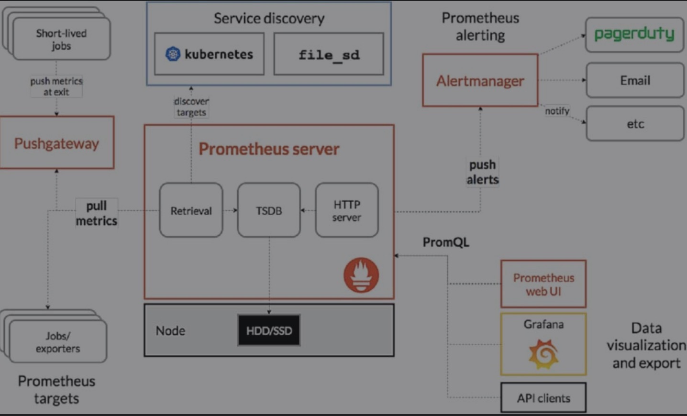

# 基础设施

## 微服务

* 分布式服务调用，使用服务注册发现方式进行RPC/GRPC服务调用

## 服务治理

* 对多个微服务进行治理，统一管理各个微服务。

## 监控报警系统

* Prometheus配合Grafana使用，通过Pushgateway、Prometheus即 AlertManager配置监控报警系统。

# 分布式数据库

## 概述

* OLTP 分布式数据库划分为 SQL 数据库（关系型）、NoSQL数据库（非关系型）、NewSQL 数据库三类。

