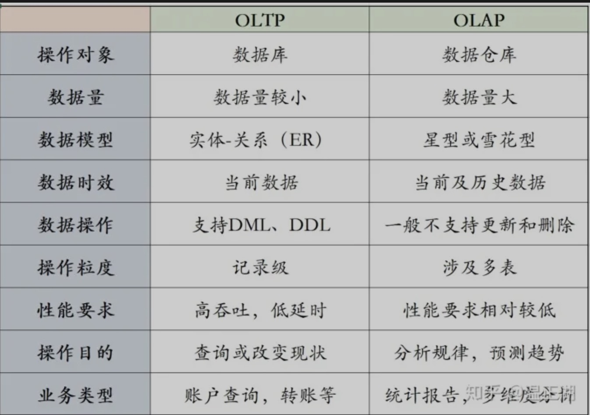
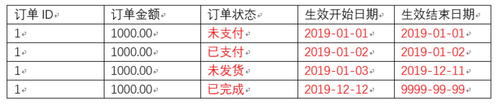
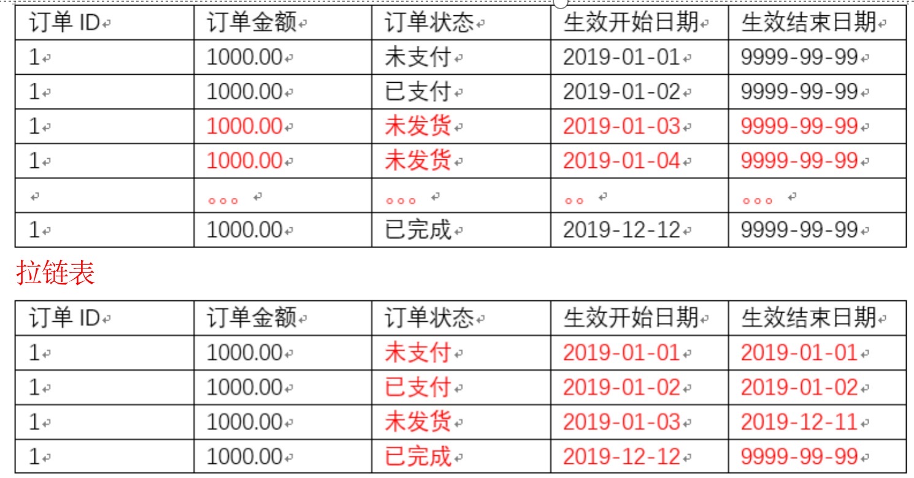
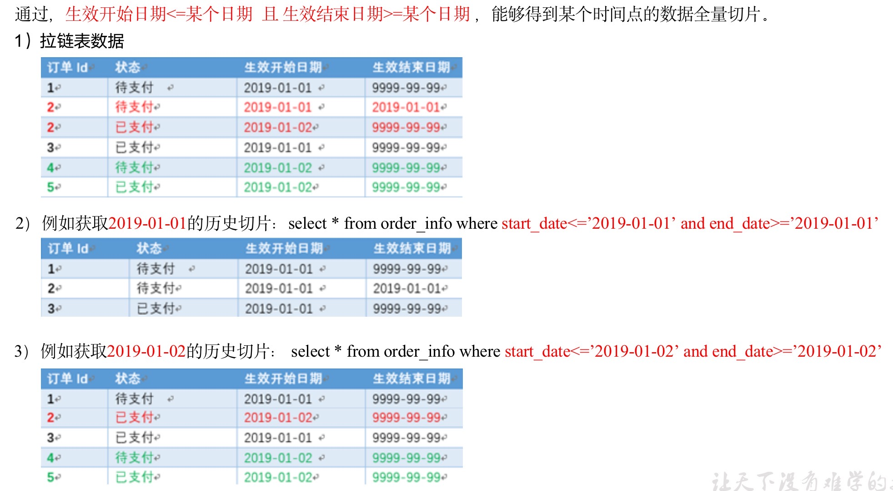
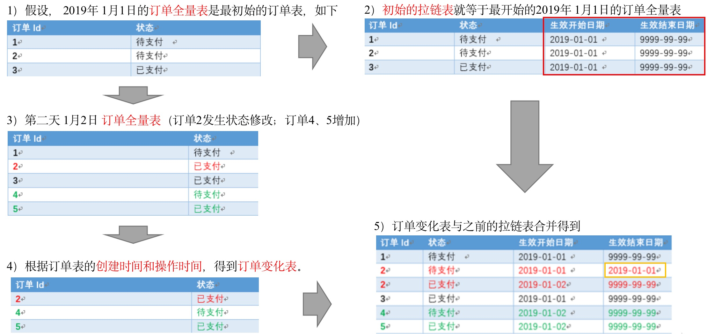
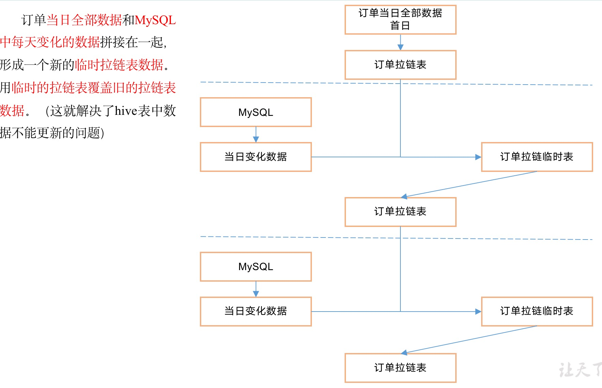

# 数据仓库概念

* 数据仓库是为企业所有决策制定过程，提供所有系统数据支持的数据集合。通过对数据仓库中数据的分析帮组企业改进业务流程、控制成本、提高产品质量等。数据仓库的数据来源于爬虫系统、日志采集系统、业务系统数据库等，通过ETL将数采集进数据仓库。

## 数仓分层

### 数据仓库分层

* ODS(Operation Data Store):原始数据层，`存放原始数据`，直接加载原始日志、数据、数据保持原貌不做处理。
* DWD(data warehouse detail):明细数据层，`结构和粒度与原始表保持一致，对ODS层数据进行清洗(去除空值，脏数据，超过极限范围的数据)`。
* DWS(data warehouse service):服务数据层，以DWD为基础，进行轻度汇总。
  * 以DWD为基础，进行轻度汇总，一般聚集到以用户当日，设备当日，商家当日，商品当日等等的力度。
  * 在这层通常会有以某一个维度为线索，组成跨主题的宽表，比如，一个用户的当日的签到数、收藏数、评论数、抽奖数、订阅数、点赞数等组成的多列表。
* ADS(Application Data Store):数据应用层,为各种统计报表提供数据。通常也命名为DM、APP层。

### 分层的好处

* 复杂问题简单化，讲一个复杂的任务分解成多个步骤来完成，每一层只处理单一的步骤，比较简单，并且方便定位问题。
* 减少重复:规范数据分层，通过的`中间层数据`，能够减少极大的重复计算，`增加`一次计算结果的复用性。
* 隔离原始数据:不论是数据的异常还是数据的敏感性，使真实数据与统计数据解耦开。

## 数据集市与数据仓库的概念

* 数据集市(Data Market),是一种微型的数据仓库，通常有更小的数据，更少的主题区域，以及更少的历史数据，因此是部门级的，一般只为某个局部范围内的管理人员服务。
* 数据仓库是企业级的，为整个企业各个部门的运行提供决策支持手段。

## OLTP和OLAP对比



# 数据仓库技术选型

## 数据采集传输

* FLume、Kafka、Sqoop(异构离线数据采集)、DataX(异构离线数据采集)

##数据存储

* Mysql(business data)、HDFS(source)、Hbase(ads)、Redis(ads)、Jindofs(ods、dwd)、MongoDb(爬虫)

## 数据计算

* Hive(默认MR)、Tez、Spark、Flink

## 数据查询

* Presto、Druid、Kylin、Impala

# 数据采集模块

## 埋点数据基本格式

```json
{
"ap":"xxxxx",//项目数据来源 app pc
"cm": {  //公共字段
		"mid": "",  // (String) 设备唯一标识
        "uid": "",  // (String) 用户标识
        "vc": "1",  // (String) versionCode，程序版本号
        "vn": "1.0",  // (String) versionName，程序版本名
        "l": "zh",  // (String) 系统语言
        "sr": "",  // (String) 渠道号，应用从哪个渠道来的。
        "os": "7.1.1",  // (String) Android系统版本
        "ar": "CN",  // (String) 区域
        "md": "BBB100-1",  // (String) 手机型号
        "ba": "blackberry",  // (String) 手机品牌
        "sv": "V2.2.1",  // (String) sdkVersion
        "g": "",  // (String) gmail
        "hw": "1620x1080",  // (String) heightXwidth，屏幕宽高
        "t": "1506047606608",  // (String) 客户端日志产生时的时间
        "nw": "WIFI",  // (String) 网络模式
        "ln": 0,  // (double) lng经度
        "la": 0  // (double) lat 纬度
    },
"et":  [  //事件
            {
                "ett": "1506047605364",  //客户端事件产生时间
                "en": "display",  //事件名称
                "kv": {  //事件结果，以key-value形式自行定义
                    "goodsid": "236",
                    "action": "1",
                    "extend1": "1",
"place": "2",
"category": "75"
                }
            }
        ]
}
```

## 项目组件安装

* 根据df -h查看磁盘剩余大小，配置hdfs datanode存储多文件，重复利用磁盘空间。

## 支持LZO压缩配置

* 下载lzo jar包

```curl
https://github.com/twitter/hadoop-lzo/archive/master.zip
```

* maven clean package
* 将jar包放入/share/hadoop/common/
* 修改core-site.xml配置

```xml
<?xml version="1.0" encoding="UTF-8"?>
<?xml-stylesheet type="text/xsl" href="configuration.xsl"?>

<configuration>

<property>
<name>io.compression.codecs</name>
<value>
org.apache.hadoop.io.compress.GzipCodec,
org.apache.hadoop.io.compress.DefaultCodec,
org.apache.hadoop.io.compress.BZip2Codec,
org.apache.hadoop.io.compress.SnappyCodec,
com.hadoop.compression.lzo.LzoCodec,
com.hadoop.compression.lzo.LzopCodec
</value>
</property>

<property>
    <name>io.compression.codec.lzo.class</name>
    <value>com.hadoop.compression.lzo.LzoCodec</value>
</property>
</configuration>
```

* 格式化hdfs

## 配置Hadoop支持snappy压缩

* 将snappy编译lib放入hadoop/lib/native下
* 配置core-site.xml

```xml
<?xml version="1.0" encoding="UTF-8"?>
<?xml-stylesheet type="text/xsl" href="configuration.xsl"?>

<configuration>

<property>
<name>io.compression.codecs</name>
<value>
org.apache.hadoop.io.compress.GzipCodec,
org.apache.hadoop.io.compress.DefaultCodec,
org.apache.hadoop.io.compress.BZip2Codec,
org.apache.hadoop.io.compress.SnappyCodec,
com.hadoop.compression.lzo.LzoCodec,
com.hadoop.compression.lzo.LzopCodec
</value>
</property>

<property>
    <name>io.compression.codec.lzo.class</name>
    <value>com.hadoop.compression.lzo.LzoCodec</value>
</property>
</configuration>
```

* 重启hadoop，检查是否支持snappy

```shell
hadoop checknative
```

## 测试Hadoop集群

### 测试HDFS写性能

* 向HDFS集群写10个128M的文件

```shell
hadoop jar $HADOOP_HOME/share/hadoop/mapreduce/hadoop-mapreduce-client-jobclient-2.8.5-tests.jar TestDFSIO -write -nrFiles 10 -fileSize 128MB

# 写入性能
20/08/16 11:44:16 INFO fs.TestDFSIO:             Date & time: Sun Aug 16 11:44:16 CST 2020
20/08/16 11:44:16 INFO fs.TestDFSIO:         Number of files: 10
20/08/16 11:44:16 INFO fs.TestDFSIO:  Total MBytes processed: 1280
20/08/16 11:44:16 INFO fs.TestDFSIO:       Throughput mb/sec: 351.26
20/08/16 11:44:16 INFO fs.TestDFSIO:  Average IO rate mb/sec: 377.42
20/08/16 11:44:16 INFO fs.TestDFSIO:   IO rate std deviation: 109.61
20/08/16 11:44:16 INFO fs.TestDFSIO:      Test exec time sec: 22.3
```

### 测试HDFS读性能

```shell
hadoop jar $HADOOP_HOME/share/hadoop/mapreduce/hadoop-mapreduce-client-jobclient-2.8.5-tests.jar TestDFSIO -read -nrFiles 10 -fileSize 128MB

# 读取性能
20/08/16 11:47:15 INFO fs.TestDFSIO:             Date & time: Sun Aug 16 11:47:15 CST 2020
20/08/16 11:47:15 INFO fs.TestDFSIO:         Number of files: 10
20/08/16 11:47:15 INFO fs.TestDFSIO:  Total MBytes processed: 1280
20/08/16 11:47:15 INFO fs.TestDFSIO:       Throughput mb/sec: 549.36
20/08/16 11:47:15 INFO fs.TestDFSIO:  Average IO rate mb/sec: 602.9
20/08/16 11:47:15 INFO fs.TestDFSIO:   IO rate std deviation: 187.91
20/08/16 11:47:15 INFO fs.TestDFSIO:      Test exec time sec: 18.97
20/08/16 11:47:15 INFO fs.TestDFSIO:
```

### 删除HDFS测试文件

```shell
hadoop jar $HADOOP_HOME/share/hadoop/mapreduce/hadoop-mapreduce-client-jobclient-2.8.5-tests.jar TestDFSIO -clean
```

### 测试Sort程序测试MR

* 使用RandomWriter来产生随机数，每个节点运行10个Map任务，每个Map产生大约1G大小的二进制随机数

```shell
hadoop jar $HADOOP_HOME/share/hadoop/mapreduce/hadoop-mapreduce-examples-2.8.5.jar randomwriter random-data
```

* 执行Sort程序

```shell
hadoop jar $HADOOP_HOME/share/hadoop/mapreduce/hadoop-mapreduce-examples-2.8.5.jar sort random-data sorted-data
```

* 验证数据是否真正排好序

```shell
hadoop jar $HADOOP_HOME/share/hadoop/mapreduce/hadoop-mapreduce-examples-2.8.5.jar testmapredsort -sortInput random-data -sortOutput sorted-data
```

## HDFS参数优化

### hdfs-site.xml

```shell
dfs.namenode.handler.count=20 * log2(Cluster Size)，比如集群规模为8台时，此参数设置为60

The number of Namenode RPC server threads that listen to requests from clients. If dfs.namenode.servicerpc-address is not configured then Namenode RPC server threads listen to requests from all nodes.
NameNode有一个工作线程池，用来处理不同DataNode的并发心跳以及客户端并发的元数据操作。对于大集群或者有大量客户端的集群来说，通常需要增大参数dfs.namenode.handler.count的默认值10。设置该值的一般原则是将其设置为集群大小的自然对数乘以20，即20logN，N为集群大小。
```

* edits日志存储路径`dfs.namenode.edits.dir`设置与镜像文件存储路了`dfs.namenode.name.dir`尽量分开，达到最低写入延迟。

# 数据理论

## 表的分类

### 实体表

* 一般是指一个现实存在的业务对象，比如用户，商家，商品等等

### 维度表

* **维度表**，一般是指对应一些业务状态，编码的解析表。也可以称为码表。
* 比如地区表，订单状态，支付方式，审批状态，商品分类等等。

### 事务型事实表

* **事务型事实表**，一般指随着业务发生不断产生的数据。特点是`一旦发生不会再变化`。

  一般比如，`交易流水，操作日志，出库入库记录`等等。

**交易流水表：**

| 编号 | 对外业务编号 | 订单编号 | 用户编号 | 支付宝交易流水编号 | 支付金额 | 交易内容    | 支付类型  | 支付时间            |
| ---- | ------------ | -------- | -------- | ------------------ | -------- | ----------- | --------- | ------------------- |
| 1    | 7577697945   | 1        | 111      | QEyF-63000323      | 223.00   | 海狗人参丸1 | alipay    | 2019-02-10 00:50:02 |
| 2    | 0170099522   | 2        | 222      | qdwV-25111279      | 589.00   | 海狗人参丸2 | wechatpay | 2019-02-10 00:50:02 |
| 3    | 1840931679   | 3        | 666      | hSUS-65716585      | 485.00   | 海狗人参丸3 | unionpay  | 2019-02-10 00:50:02 |

### 周期型事实表

* **周期型事实表**，一般指随着`业务发生不断产生的数据。`与事务型不同的是，数据会随着业务周期性的推进而变化。
* 比如`订单，其中订单状态会周期性变化`。再比如，请假、贷款申请，随着批复状态在周期性变化。

**订单表：**

| 订单编号 | 订单金额 | 订单状态 | 用户id | 支付方式  | 支付流水号    | 创建时间            | 操作时间            |
| -------- | -------- | -------- | ------ | --------- | ------------- | ------------------- | ------------------- |
| 1        | 223.00   | 2        | 111    | alipay    | QEyF-63000323 | 2019-02-10 00:01:29 | 2019-02-10 00:01:29 |
| 2        | 589.00   | 2        | 222    | wechatpay | qdwV-25111279 | 2019-02-10 00:05:02 | 2019-02-10 00:05:02 |
| 3        | 485.00   | 1        | 666    | unionpay  | hSUS-65716585 | 2019-02-10 00:50:02 | 2019-02-10 00:50:02 |
|          |          |          |        |           |               |                     |                     |

## 同步策略

**数据同步策略的类型包括：全量表、增量表、新增及变化表、拉链表**

* 全量表：存储完整的数据。
* 增量表：存储新增加的数据。
* 新增及变化表：存储新增加的数据和变化的数据
* 拉链表：对新增及变化表做定期合并。

### 实体表同步策略

* 实体表:如用户(1100w)，商品，商家，销售员等
* 实体表数据量比较小:通常可以做每日全量，就是每天存一份完整数据，即`每日全量`

### 维度表同步策略

* 维度表：比如订单状态，审批状态，商品分类
* 维度表数据量比较小：通常可以做每日全量，就是每天存一份完整数据。即`每日全量`。

### 事务型事实表同步策略

* 事务型事实表：比如，交易流水，操作日志，出库入库记录等。
* 因为数据不会变化，而且数据量巨大，所以每天只同步新增数据即可，`所以可以做成每日增量表，即每日创建一个分区存储。`

### 周期型事实表同步策略

* 周期型事实表：比如，订单、请假、贷款申请等

* 这类表从数据量的角度，`存每日全量的话，数据量太大，冗余也太大。如果用每日增量的话无法反应数据变化`。

* 每日新增及变化量，包括了当日的新增和修改。一般来说这个表，足够计算大部分当日数据的。但是这种依然无法解决能够得到某一个历史时间点（时间切片）的切片数据。 

* `所以要用利用每日新增和变化表，制作一张拉链表`，以方便的取到某个时间切片的快照数据。所以我们需要得到每日新增及变化量。

  **拉链表：**

  | name姓名 | start新名字创建时间 | end名字更改时间 |
  | -------- | ------------------- | --------------- |
  | 张三     | 1990/1/1            | 2018/12/31      |
  | 张小三   | 2019/1/1            | 2019/4/30       |
  | 张大三   | 2019/5/1            | 9999-99-99      |
  | 。。。   | 。。。              | 。。。          |

  ```sql
  select * from user where start =<’2019-1-2’ and end>=’2019-1-2’
  ```
## 范式理论
### 范式概念

  * 关系型数据库设计时，遵照一定的规范要求，目的在于降低数据的冗余性，目前业界范式有：第一范式(1NF)、第二范式(2NF)、第三范式(3NF)、巴斯-科德范式(BCNF)、第四范式(4NF)、第五范式(5NF)。

  * 范式可以理解为一张数据表的表结构，符合的设计标准的级别。

  * 使用范式的根本目的是：

     1）减少数据冗余，尽量让每个数据只出现一次。

     2）保证数据一致性

  * 缺点是获取数据时，需要通过Join拼接出最后的数据。

#### 1NF

* 核心原则就是:属性不可切割。
* 例如：5个电脑，可以切分为数量和商品名称。那么这个属性就不符合1NF
* 1NF是所有关系型数据库的最基本要求，你在关系型数据库管理系统（RDBMS），例如SQL Server，Oracle，MySQL中创建数据表的时候，如果数据表的`设计不符合这个最基本的要求，那么操作一定是不能成功的。`也就是说，只要在RDBMS中已经存在的数据表，一定是符合1NF的。

####  2NF

* 不能存在"部分函数依赖"
* 例如:学号,课程能推出分数，但是学号单独也能推出分数，那么它就是不符合2NF的。

#### 3NF

* 不存在传递函数依赖
* 例如:根据学号和系名能够获得系主任，根据学号或者系名都可以单独获得系主任，这就不符合3NF。

### 函数依赖

#### 完全函数依赖

* 比如可以通过(学号,课程)推出分数，但是不能单独使用学号或者课程来推出分数，那么分区完全依赖于(学号，课程)。即，通过AB能得出C，但是AB单独不能得到C，因此C完全依赖于AB。

#### 部分函数依赖

* 比如通过，(学号，课程) 推出姓名，因为其实直接可以通过，学号推出姓名，所以：姓名  部分依赖于 (学号，课程)
* 即：通过AB能得出C，通过A也能得出C，或者通过B也能得出C，那么说C部分依赖于AB。

#### 传递函数依赖

* 比如：学号 推出 系名 ， 系名 推出 系主任， 但是，系主任推不出学号，系主任主要依赖于系名。这种情况可以说：系主任传递依赖于学号
* 通过A得到B，通过B得到C，但是C得不到A，那么说C传递依赖于A。

## 关系建模与维度建模

### 关系建模

* 关系模型主要应用与OLTP系统中，为了保证数据的一致性以及避免冗余，所以大部分业务系统的表都是遵循第三范式的。

### 维度建模

* 维度模型主要应用于OLAP系统中，因为关系模型虽然冗余少，但是在大规模数据，跨表分析统计查询过程中，会造成多表关联，这会大大降低执行效率。
* 所以把相关各种表整理成两种：事实表和维度表两种。所有维度表围绕着事实表进行解释。

## 雪花模型与星型模型

* 在维度建模的基础上又分为三种模型：星型模型、雪花模型、星座模型。

## 拉链表

### 拉链表概述

* 拉链表，`记录每条信息的生命周期`，一旦一条记录的生命周期结果，就重新开始一条新的记录，并把当前日期放入生效开始日期。
* 如果当前信息至今有效，在生效结束日期中填入一个极大值(如9999-99-99)



###拉链表优点

* 拉链表适合于:`数据会发生变化，但是大部分是不变的。`
* 比如:订单信息从未支付、已支付、未发货、已完成等状态经历了一周，大部分时间是不变化的。如果数据量有一定规模，无法按照每日全量的方式保存。比如:1亿用户*365天，每天一份用户信息。就可以使用拉链表来解决该问题如下图所示：



### 拉链表的使用



### 拉链表制作过程



