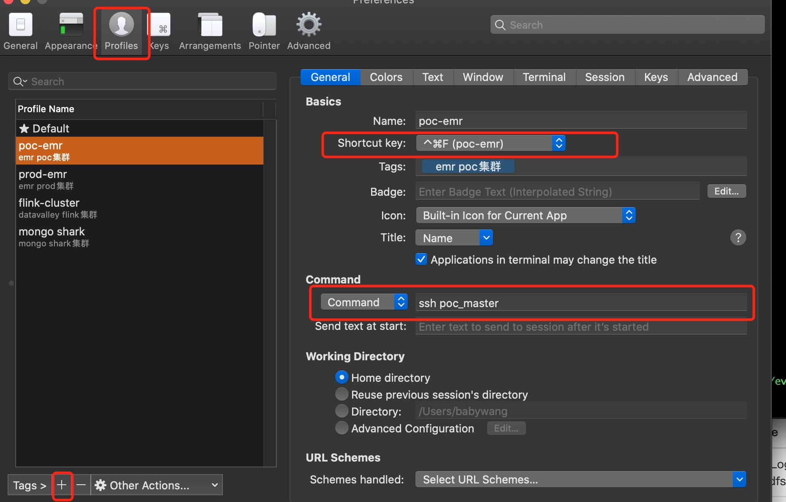

# 多tab操作

## 开屏

* 水平多tab:`command+d`
* 垂直多tab:`command+shift+d`
* 操控多tab:`command+shift+i`

## 控制连接到远程server终端

**选择“Preferences->Profiles”，新增一个profile，并设置启动的快捷键和command命令，如图：**

## 切换profile

`command+shift+o`